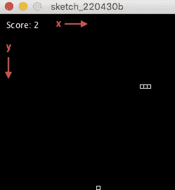

# 用处理库和 Java 创建经典的贪吃蛇游戏

> 原文：<https://betterprogramming.pub/create-the-classic-snake-game-with-processing-and-java-18f9db48fac4>

## 用 Java 重新创建游戏

展示文章中贪吃蛇游戏的 GIF。

您是否了解 Java 或处理的基础知识，并希望开始开发自己的游戏，或者只是重现经典游戏之一？本文描述了使用 Processing 构建经典贪吃蛇游戏的过程。

# 1 什么是加工？

维基百科(2022)将处理描述为图形库和集成开发环境(IDE)。该库建立在 Java 之上，提供了额外的类和简化(维基百科，2022)。要下载并安装处理程序，请转到[processing.org/download](https://processing.org/download)并下载与首选平台匹配的可安装程序。

## 1.1 应用流程

处理提供了许多方法来控制应用程序的流程，例如，控制关键事件、初始化或连续行为。开始处理的两个重要方法是方法`setup()`和`draw()`。另一种内置方法，文章后面介绍的是`keyPressed()`。这三种方法的行为是:

*   `setup()`在应用程序启动时被调用一次(处理，2022a)。
*   `draw()`永远执行，调用次数与帧率匹配(处理，2022b)。
*   `keyPressed()`在按键被按下时执行，并且该按键被存储在名为`key`的变量中(处理，2022c)。

## 1.2 图形界面

处理还提供了一个图形界面，其中点(x，y) = (0，0)位于左上角(见图 1)。在 Processing 中绘制形状非常简单，因为该库提供了 2D 原语方法，如`rect(x, y, w, h)`、`circle(x, y, r)`或`line(x1, y1, x2, y2)`。在 processing.org/reference 找到更多 2D 原始方法。

**图 1:** 显示加工图形界面中水平轴(x)和垂直轴(y)的方向。

# 2 构建游戏

和每个项目一样，建立几个需求来设定方向和概述必要的特性是一个好主意。因此，第 2.1 节描述了游戏的要求，随后是描述代码的部分。

## 2.1 要求

游戏的要求是:

1.  使用矩形绘制蛇和目标。
2.  蛇的第一个矩形表示蛇的头部，只有头部可以触发与目标和尾巴的碰撞事件。
3.  当蛇到达屏幕的边界时，它被传送到对面的位置。
4.  当目标与蛇头碰撞时，它会获得一个新的随机位置。
5.  如果蛇头和蛇尾相撞，游戏结束。
6.  每当蛇与目标发生碰撞时，分数就会增加。

## 2.2 游戏编码

为了保持文章简单，下面的部分被分成编码游戏的不同步骤。

**2.2.1** **添加属性**

第一步是添加可以存储大小、位置等信息的全局属性。要添加的前两个属性是`gameover`和`s`(参见图 2)。布尔变量`gameover`用于检查玩家是否输掉了游戏，浮动变量`s`是一个通用大小，指定了代表目标和蛇的矩形的大小。

**图 2:** 显示游戏的前两个属性。

现在，当常规属性都准备好了，是时候为蛇添加属性了。蛇将需要一个属性来指定代表蛇的尾巴和头部的每个矩形的位置。它还需要一个属性来指定蛇的方向。为了存储蛇的矩形的位置，添加一个类型为`ArrayList<PVector>`的属性`snakePositions`，为了存储关于蛇的方向的信息，添加一个类型为`PVector`的属性`snakeDirection`(参见图 3)。

**图 3:** 显示了蛇的属性。

游戏要求的最后一个属性是一个指定目标位置的变量。添加一个类型为`PVector`的属性`objPosition`(参见图 4)。

**图 4:** 显示物镜的属性。

**2.2.2 属性数据类型**

第 2.2.1 节，添加属性，介绍了一些初学者可能不熟悉的数据类型。`boolean`和`float`是原始数据类型，`boolean`指的是可以是*真*或*假*的值，`float`指的是与整数不同的可以指定整数和小数部分的数字。`ArrayList<T>`和`PVector`是复合数据类型，`ArrayList<T>`是指可以动态调整大小的其他数据类型的列表，`PVector`是指二维或三维向量。

**2.2.3 添加自定义帮助器方法**

下一节将介绍几个辅助方法，用于帮助简化游戏的解释。第一种方法用于检查两点的位置是否重叠(见图 5)。

**该方法的程序可定义如下:**

1.  期望两个向量指定一个矩形的左上角。
2.  使用矩形的大小(`s`)找到矩形的中心位置。
3.  如果中心位置之间的距离小于大小，则返回 true。

**图 5:** 显示了一个方法的实现，如果两个点重叠，则返回 true。

下一个方法是给一个向量一个随机的位置(见图 6)。

**该方法的步骤如下:**

1.  将水平属性(`x`)设置为`a`和`b`内的随机浮点数。
2.  将垂直属性(`y`)设置为`a`和`b`内的随机浮点数。

**图 6:** 展示了一种在给定边界内给一个向量一个随机位置的方法。

最后两个辅助方法是`reset()`和`endgame()`。`reset()`用于将游戏属性设置为与应用程序启动时相同的状态，而`endgame()`用于启动结束游戏功能。

**`**endgame()**`**的程序是:****

1.  **将`gameover`属性设置为`true`，表示游戏结束。**
2.  **用黑色背景覆盖当前内容。**
3.  **重置填充颜色，将文本颜色设置为白色。**
4.  **显示一段文字“Gameover”。**

****`**reset()**`**的程序为:******

1.  ****将`gameover`属性设置为`true`,表示游戏*没有*结束。****
2.  ****从`snakePositions`属性中删除所有保存的位置。****
3.  ****用屏幕中心的位置定义一个向量。****
4.  ****将矢量添加到`snakePositions`属性来定义蛇的头部。****
5.  ****将物镜的位置设置为屏幕边框内的随机位置。****

******图 7:** 显示了一个用于结束游戏的方法和另一个用于重置游戏属性的方法的实现。****

******2.2.4 添加内置方法:设置******

****游戏要求的下一个方法是内置的 setup 方法，在应用程序启动时调用一次。****

******方法的程序如下:******

1.  ****将屏幕尺寸设置为 250x250 像素。****
2.  ****将帧速率设置为每秒 25 帧。第二。****
3.  ****使用辅助方法重置游戏的属性:重置****

******图 8:** 显示了内置方法:setup 的实现。****

******2.2.5 添加内置方法:绘制******

****内置方法`draw()`一直被调用，直到应用程序停止。`draw()`方法中的代码比本文中介绍的其他方法稍微复杂一点，因此在下面的部分中代码被分成几个部分。****

******图 9 所示代码的过程可描述如下:******

1.  ****将屏幕背景设置为黑色。****
2.  ****如果属性`gameover`为真，表示游戏结束，等待 5 秒，重置游戏。****
3.  ****将填充颜色设置为白色。****
4.  ****在(x，y) = (10，20)处显示文本“分数:{x}”。****
5.  ****将填充颜色设置为黑色，将描边颜色设置为白色。****
6.  ****画出目标。****
7.  ****以相反的顺序循环`snakePositions`属性。****
8.  ****获取当前位置。****
9.  ****检查当前索引是否等于头部的索引，以定义蛇头的行为，并添加一个用于定义蛇尾行为的 else 语句。****
10.  ****在当前位置画一个代表蛇的尾巴或头部的矩形。****

******图 9:** 显示内置方法的实现:draw。****

****为什么把`snakePositions`从结尾循环到开头？原因和蛇的运动有关。每当蛇头向某个方向移动一次，蛇尾的每个矩形也必须移动一次。****

******因此，代码设计如下:******

1.  ****首先选择最后一个元素，并将其位置设置为倒数第二个元素的位置。****
2.  ****选择倒数第二个元素，并将其位置设置为倒数第三个元素的位置。****
3.  ****继续选择一个元素，并将其位置设置为它前面的元素的位置，直到到达第一个元素。****
4.  ****当到达第一个元素时，将该元素的位置向属性`snakeDirection`中指定的方向移动一次。****

******图 10:** 显示蛇的运动的实现。****

****`draw()`方法当前移动蛇的位置，检查游戏是否结束，绘制蛇和目标。但它仍然需要一些功能来处理当蛇到达屏幕边界时应该发生的事情，以及一些其他功能来处理当蛇的头部与目标或它自己的尾巴重叠时。****

******蛇到达屏幕边界的程序(图 11，L 14–18):******

1.  ****如果蛇的水平属性(`x`)小于零，则将该属性设置为屏幕的宽度。****
2.  ****如果蛇的水平属性(`x`)大于屏幕的宽度，则将该属性设置为零。****
3.  ****如果蛇的垂直属性(`y`)小于零，则将该属性设置为屏幕的高度。****
4.  ****如果蛇的垂直属性(`y`)大于屏幕的高度，则将该属性设置为零。****

******蛇头与物镜重叠时的程序(L 22–29，图 11):******

1.  ****如果蛇头的位置与目标的位置重叠。****
2.  ****将物镜的位置设置为新的随机位置。****
3.  ****获取蛇的最后一个尾部元素的位置。****
4.  ****在最后一个尾部元素后面定义一个位置。****
5.  ****添加该位置作为新的最后一个尾部元素。****

******当蛇头与它的一个尾部元素重叠时的程序(图 11，L 34–39):******

1.  ****如果尾部元素没有直接连接到头部并且与头部重叠。****
2.  ****结束游戏。****
3.  ****停止循环。****
4.  ****如果尾部元素没有重叠，设置尾部元素的位置。****

******图 11:** 显示每当蛇到达屏幕边界时功能处理的实现，以及蛇的头和尾之间的处理重叠。****

******2.2.6 增加内置方法:按键******

****游戏需要的最后一个功能是处理关键事件。****

****蛇可以移动的方向可以定义如下:****

*   ****`Left` — *(x，y) = (-1，0)*****
*   ****`Right` — *(x，y) = (1，0)*****
*   ****`Up` — *(x，y) = (0，-1)*****
*   ****`Down` — *(x，y) = (0，1)*****

****`keyPressed()`法的程序是:****

1.  ****如果按下“a”键，并且蛇没有移动`right`，则将方向设置为`left`。****
2.  ****如果按下“d”键，并且蛇没有移动`left`，则将方向设置为`right`。****
3.  ****如果按下“s”键，并且蛇没有移动`up`，则将方向设置为`down`。****
4.  ****如果按下“w”键，并且蛇没有移动`down`，则将方向设置为`up`。****

******图 12:** 显示处理按键方法的实现。****

# ****最终代码****

****Github Gist 的完整游戏代码示例可以在[这个链接](https://gist.github.com/niiicolai/f10e829329ca6f94e6992448c1ed540d)找到。****

# ****摘要****

****Processing 是一个图形库和一个开发环境(IDE)。它提供了一个图形界面，可以用来绘制不同的形状和文本。`setup()`、`draw()`和`keyPressed()`是用于处理初始化、连续行为和按键事件的内置处理方法。`ArrayList<T>`可以用来创建一个动态大小的列表，而`PVector`指定了一个向量，并提供了计算向量之间距离的方法。蛇的移动是通过以相反的顺序循环`snakePositions`并在到达蛇头之前将每个元素的位置分配给该元素的位置而产生的，蛇头向`snakeDirection`中指定的方向移动。****

# ****文献学****

****En.wikipedia.org 2022 年。*处理(编程语言)—维基百科*。[在线]见:<[https://en . Wikipedia . org/wiki/Processing _(programming _ language)](https://en.wikipedia.org/wiki/Processing_(programming_language))>【2022 年 4 月 30 日访问】。****

****Processing.org 2022 年。[在线]可在:<[https://processing.org/reference/setup_.html](https://processing.org/reference/setup_.html)>【2022 年 4 月 30 日访问】。****

****Processing.org。2022b。[在线]可在:<[https://processing.org/reference/draw_.html](https://processing.org/reference/draw_.html)T4【2022 年 4 月 30 日访问】。****

****Processing.org 2022 c。[在线]可在:【https://processing.org/reference/keyPressed_.html】>【2022 年 4 月 30 日进入】。****