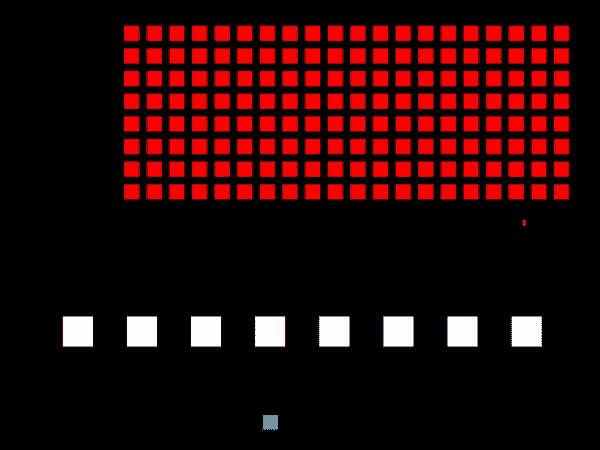
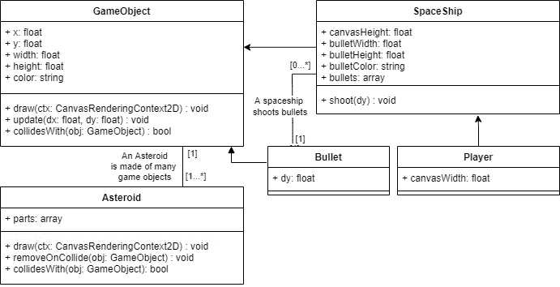
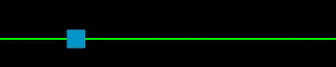
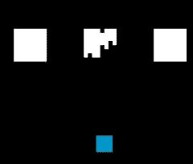

# 用 JavaScript 和 HTML 创建经典的太空入侵者游戏

> 原文：<https://betterprogramming.pub/create-the-classic-space-invaders-game-af087786d63b>

## 用 HTML 和 JavaScript 重现太空入侵者的教程

展示文章中创建的游戏的 GIF。

你想在你的网站上添加一个简单的 2D 游戏吗？或者你想学习制作 2D 游戏的基础知识吗？这篇文章解释了如何只用 HTML 和 JavaScript 为大多数现代浏览器重新创建经典的太空入侵者游戏。

# 游戏规格

在开始开发之前指定一个游戏的基本特性是一个很好的主意，这样可以对需要完成的工作有一个大致的了解。

## 游戏的规格可以定义如下:

*   这个游戏需要一个可以移动的物体，可以被绘制到画布表面，并提供碰撞检查。
*   敌人和玩家对象应该能够互相发射子弹。
*   子弹对象应该只能向一个方向移动。
*   玩家对象应该只能在画布边界内的 x 轴上左右移动。
*   小行星应该由几个可摧毁的部分组成。
*   如果所有的敌人都被消灭，或者如果其中一个敌人到达 y 轴上玩家的位置，游戏应该重新开始。

## 游戏的对象

图 1 中的类图显示了游戏的不同类及其关系的概述。例如，可以看到所有的可视对象都是由基类 GameObject 创建的，或者玩家类继承了飞船和 GameObject 类的属性和行为。

图 1:显示了游戏的 UML 类图。

# 游戏区

第一步是设置带有 canvas 元素的 HTML 文档(参见图 2)。HTML 画布提供了绘制各种 2D 图形的能力。

例如，可以在画布中绘制简单的形状或图像(Mozilla，2022b)。图 2 中第 9 行的 canvas 元素是用`id`、`width`和`height`属性定义的。

`id`属性用于引用 JavaScript 中的 canvas 元素，`width`和`height`属性只是指定画布的尺寸。

图 2:显示了一个带有 canvas 元素的普通 HTML 文档。

下一步是建立一个 JavaScript 对象，可以用来保存不同的属性和行为(Mozilla，2022d)。图 3 第 12 行显示了 Javascript 对象的实现，称为`game`。

在本教程中使用 JavaScript 对象来保存属性和行为的想法是为了避免游戏的逻辑作为大量的全局变量和函数。

## 常规属性

在图 3 的第 15–19 行，三个属性被添加到`game`对象中。`canvas`属性指的是 HTML canvas 元素，`ctx`指的是可用于在画布表面绘图的界面(Mozilla，2022e)，而`backgroundColor`指的是画布的背景颜色。

## 一般行为

五个方法被添加到第 22–43 行的`game`对象中，如图 3 所示。`update()`定义了游戏的连续行为，比如画图元素，移动元素等。`update()`方法中的前两行(第 24–25 行，图 3)将画布的背景设置为`backgroundColor`属性的值。

每次调用`update()`时重绘背景确保移动的对象将在新位置绘制，而不是在新旧位置绘制。`keydown()`定义如果键盘上的某个键被按下会发生什么。`init()`定义开始游戏循环的游戏初始化。`stop()`定义如何停止游戏循环，`restart()`定义如何重启游戏。

图 3:显示了用于处理游戏初始化和运行时行为的 JavaScript 对象的实现。

# 游戏对象

添加了一个名为 GameObject 的类来定义游戏中使用的对象的一般行为。一般的游戏对象包含五个属性。`x`和`y`定义了游戏对象的位置。`width`和`height`定义游戏对象矩形的大小，`color`定义矩形的颜色。

GameObject 类也包含三个方法。`draw()`用于在画布内绘制游戏对象。`update(dx, dy)`向任意给定方向移动游戏对象，如果给定游戏对象与游戏对象重叠，`collidesWith(obj)`返回 true。

图 4:显示了一个通用游戏对象类的实现，它可以绘制一个矩形，更新其位置，并检测与其他游戏对象的冲突。

# 子弹

添加 GameObject 类后，可以添加一个简单的 Bullet 类，它继承了 GameObject 类的属性和行为。

Bullet 类包含一个名为`dy`的附加属性，用于定义项目符号在 y 轴上的移动方向。从 GameObject 类继承的`update(dx, dy)`方法在 bullet 类中被覆盖(参见第 22–25 行，图 5 ),以定义它总是应该向给定的开始方向移动。

图 5:显示了 Bullet 类的实现。

# 宇宙飞船

添加了一个名为 SpaceShip 的类来定义玩家和敌人对象的一般属性和行为。飞船类也是 GameObject 类的子类。

飞船类有五个额外的属性。`canvasHeight`用于指定宇宙飞船发射的子弹的界限。`bulletWidth`和`bulletHeight`定义了子弹的尺寸。`bulletColor`定义了子弹的颜色，`bullets`是一个数组，用来指定飞船产生的子弹。

SpaceShip 类被设计为覆盖从 GameObject 类继承的`draw(ctx)`方法，以实现移除屏幕外的项目符号的检查，并实现循环绘制和移动项目符号。

SpaceShip 类还包括一个叫做`shoot(dy)`的额外方法，用于生成在 y 轴上向给定方向移动的子弹。

图 6:显示了 SpaceShip 类的实现。

# 运动员

添加一个 player 类作为 SpaceShip 类的子类，以实现特定于 Player 对象的属性和行为。

Player 类有一个名为`canvasWidth`的附加属性，用于定义游戏画布的宽度。

图 7:绿线代表玩家可以移动的路径。

属性用于检查玩家是否在 x 轴上的屏幕之外。通过重写从父类继承的`update(dy, dx)`方法，并添加一些额外的代码行，将 x 轴上的播放器位置移动到零或画布宽度减去播放器宽度，来实现检查。

图 8:显示了 Player 类的实现。

# 小行星

最后需要的类是小行星类。这个类不是 game object 类的子类，但是，该类与 game object 类紧密相连，因为它包含一个名为`parts`的属性，该属性是游戏对象的数组。

这种设计允许游戏中的一颗小行星被一部分一部分地摧毁(见图 9)。

图 9:显示了一个玩家射击小行星的例子。

小行星类也包含三种方法。`draw(ctx)`用于绘制小行星的游戏对象。如果小行星的一个游戏对象与给定的游戏对象冲突，则`collidesWith(obj)`返回 true，如果小行星的一个游戏对象与给定的游戏对象冲突，则`removeOnCollide(obj)`移除小行星的一个游戏对象。

图 10:显示了 Asteroid 类的实现。

# 为小行星和敌人添加参数

图 11，第 24–45 行显示了小行星和敌人所需的额外游戏属性的实现。

## 其他小行星属性

`asteroidsParts`定义小行星组成的游戏对象数量，`noOfAsteroids`用于定义游戏应该包含的小行星数量，`asteroidsSpace`定义每个小行星之间的间距。

## 额外的敌人属性

定义每条线上应该繁殖的敌人数量。`enemyLines`定义敌人的行数。`enemySpace`定义每个敌人之间的空间。`enemyFireRate`定义了敌人应该多长时间发射一次子弹，而`enemyFireTimer`是一个变量，用于记录自上次发射以来的时间。`enemyDirection`定义敌人应该向左还是向右移动(left = -1，right = 1)，而`enemyStep`定义敌人到达画布左侧或右侧时应该在 y 轴上移动多少。

图 11:显示了小行星和敌人的附加游戏属性。

# 初始化对象

现在可以完成`game`对象的`init()`方法了(参见第 27–62 行，图 12)。该方法应该包括一些额外的代码行，定义如何在开始位置创建玩家、敌人和小行星。

这个设计允许使用`game`对象的`restart()`方法，将游戏重置到初始状态。

图 12:显示了游戏初始化行为的实现。

# 检测键盘事件

每当用户按下键盘上的一个键时，就会调用`game`对象的`keydown()`方法(参见第 23–36 行，图 13)。通过读取参数`e`的属性`keyCode`，可以从参数`e`中读取特定按键的数字。

比如数字`37`定义左箭头键，数字`39`定义右箭头键。`keydown()`方法被设计用来检查用户是否按下了一个箭头键，或者 A 键和 D 键，从而使玩家向左或向右移动。它还包括一个额外的检查，以检测用户何时按下空格键，从而在玩家的位置产生一颗子弹。

图 13:显示了游戏键盘检测行为的实现。

# 更新游戏

游戏中需要修改的最后一个方法是`game`对象的`update()`方法(见图 14 第 23-154 行)。

## 绘制玩家、小行星和敌人

图 14 的第 29–38 行，简单地调用不同对象的`draw(ctx)`方法来确保它们被绘制在画布中。图 14 中的第 39 行，在绘制敌人的同一个循环中，将敌人向`enemyDirection`属性中指定的方向移动。

## 敌人数量检查

图 14 第 43–46 行检查`game`对象的`enemies`数组是否为空，如果检查结果为真，则重新开始游戏。这个检查可能包括一些额外的代码，减少玩家的`life`属性，直到它达到零，然后重新开始游戏。

## 敌人运动

第 49–91 行，图 14，检查`enemyDirection`属性是 1 还是-1。如果该属性为 1，则该方法找到最靠近屏幕右侧的敌人，如果该敌人到达右侧，则该方法将`enemyDirection`设置为-1，并将所有敌人下移`enemyStep`的值。如果`enemyDirection`的值为-1，则会发生相反的情况。

## 敌人随机射击

图 14 第 94-99 行增加了`enemyTimer`属性，直到随机选择一个敌人向玩家开枪。

## 子弹碰撞检查

图 14 中的第 102–154 行显示了四个行为几乎相同的循环。例如，第一个循环，第 101–110 行，图 14，遍历所有玩家的子弹并检查它们是否与 astroids 的游戏对象之一发生碰撞。第三个循环，第 125-134 行，图 14，遍历所有玩家的子弹并检查是否有一颗子弹与一个敌人相撞。

图 14:显示了游戏连续行为的实现。

完整的代码可以在[这个链接中找到。](https://gist.github.com/niiicolai/325c1f4f113569a3857f2ece01f5ba65)

# 文献学

Mozilla。2022a。画布 API。
[https://developer.mozilla.org/en-US/docs/Web/API/Canvas_API](https://developer.mozilla.org/en-US/docs/Web/API/Canvas_API)。访问日期:2022 年 6 月 28 日

Mozilla。2022b。使用图像。
[https://developer . Mozilla . org/en-US/docs/Web/API/Canvas _ API/Tutorial/Using _ images](https://developer.mozilla.org/en-US/docs/Web/API/Canvas_API/Tutorial/Using_images)。访问日期:2022 年 6 月 28 日

Mozilla。2022c。用画布画形状。
[https://developer . Mozilla . org/en-US/docs/Web/API/Canvas _ API/Tutorial/Drawing _ shapes](https://developer.mozilla.org/en-US/docs/Web/API/Canvas_API/Tutorial/Drawing_shapes)。访问日期:2022 年 6 月 28 日

Mozilla。2022d。使用对象。
https://developer . Mozilla . org/en-US/docs/Web/JavaScript/Guide/Working _ with _ Objects。访问日期:2022 年 6 月 28 日

Mozilla。2022e。CanvasRenderingContext2D。
https://developer . Mozilla . org/en-US/docs/Web/API/canvasrenderingcontext 2d。访问日期:2022 年 6 月 28 日