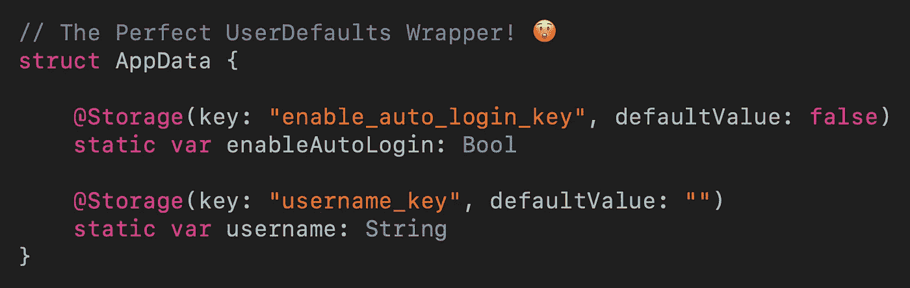

# 使用属性包装创建完美的 UserDefaults 包装

> 原文：<https://betterprogramming.pub/create-the-perfect-userdefaults-wrapper-using-property-wrapper-42ca76005ac8>

## 不再有样板代码，提高了可重用性



不再有样板代码

假设你有一个应用程序，你想实现自动登录功能。因此，您创建了一个`UserDefaults`包装器来封装`UserDefaults`读写逻辑。

您将使用`UserDefaults`包装器来跟踪自动登录的开/关状态，以及用户的用户名。这是您的`UserDefaults`包装器通常的样子:

通过 Swift 5.1 中引入的属性包装器，您可以将您的`UserDefaults`包装器简化为:

很棒吧？想了解更多？请继续阅读…

# 什么是属性包装？

在我们进入细节之前，让我们快速介绍一下什么是属性包装器。

基本上，属性包装是一种通用的数据结构，它可以截获属性的读/写访问，从而允许在属性的读/写操作期间添加自定义行为。

要定义一个属性包装器，可以使用关键字`@propertyWrapper`。假设您想要一个 string 类型的属性，每次读取或写入它时，都会打印一个控制台日志。

您可以创建一个名为`Printable`的属性包装器，如下所示:

从上面的代码可以看出，property wrapper 就像 Swift 中的任何其他`struct`一样。然而，在定义属性包装器时，`wrappedValue`是必需的。

`wrappedValue` `get`和`set`块是您可以截取并执行所需操作的地方。在本例中，添加了一条打印语句来打印出值为`get`或`set`。

下面是如何使用`Printable`属性包装器:

注意，我们使用`@`符号来声明被属性包装器包装的`name`变量。如果您在 Xcode 游戏中尝试上述代码，您将看到如下所示的控制台输出:

```
Set value: Adidas
Get value: Adidas
```

# 用户默认值包装

理解了属性包装器的工作原理后，我们现在准备开始实现我们的`UserDefaults`包装器。概括地说，我们的属性包装器需要跟踪自动登录的开/关状态，以及用户的用户名。

通过使用我们上面讨论的概念，您可以很容易地将`Printable`属性包装器转换成在属性读/写操作期间写入或读取`UserDefaults`的属性包装器。

这里，我们将我们的属性包装器命名为`Storage`。它有两个属性:T3 和 T4。

`key`将是读写`UserDefaults`时使用的键，`defaultValue`是`UserDefaults`中没有值时返回的值。

有了`Storage`属性包装器，我们就可以开始实现`UserDefaults`包装器了。这非常简单，我们只需要创建一个由`Storage`属性包装器包装的用户名变量。

请注意如何用`key`和`defaultValue`初始化`Storage`属性包装器。

至此，`UserDefaults`包装器终于可以使用了。让我们来看看它的实际应用:

此时，让我们尝试将`enableAutoLogin`变量添加到我们的`UserDefaults`包装器中。

但是，您会注意到发生了以下两个错误:

```
Cannot convert value of type ‘Bool’ to expected argument type ‘String’Property type ‘Bool’ does not match that of the ‘wrappedValue’ property of its wrapper type ‘Storage’
```

这是因为我们的属性包装器目前只支持`String`数据类型。要修复这两个错误，我们必须使我们的属性包装器通用。

# 使属性包装成为泛型

为了使属性包装器通用，我们必须将属性包装器的`wrappedValue`数据类型从`String`更改为通用类型`T`。

此外，我们将不得不更新`wrappedValue` `get`块，以使用通用方式从`UserDefaults`中读取。下面是更新后的属性包装:

有了通用属性包装器，我们的`UserDefaults`包装器现在可以毫无问题地存储一个布尔值。

# 存储自定义对象

此时，我们的`UserDefaults`包装器能够存储任何基本数据类型，如`String`、`Bool`、`Int`、`Float`、`Array`等。

但是如果我们需要存储一个自定义对象呢？目前，如果我们试图存储一个自定义对象，我们将会遇到一个错误。在这一节中，让我们通过使我们的`UserDefaults`包装器支持定制对象来使它更棒。

这里的概念很简单，我们将自定义对象作为数据存储在`UserDefaults`中。为了实现这一点，我们必须更新`Storage`属性包装泛型类型`T`，以符合`Codable`协议。

之后，在`wrappedValue` `set`块中，我们将使用`JSONEncoder`将自定义对象转换为数据并写入`UserDefaults`。

同时，在`wrappedValue` `get`块中，我们将使用`JSONDecoder`将从`UserDefaults`中检索到的数据转换回所需的数据类型。

下面是更新后的`Storage`属性包装器:

为了了解如何使用更新后的`Storage`属性包装器，让我们看看下面的例子。

假设您需要存储用户成功登录后服务器端返回的用户信息。

首先，您需要一个结构来保存服务器返回的用户信息。该结构必须符合`Codable`协议，以便将其转换为数据并存储到`UserDefaults`中。

下一步是在`UserDefaults`包装器中声明一个`User`对象:

就是这样！`UserDefaults`包装器现在能够存储定制对象了。

# 存储加密字符串

通过使我们的`UserDefaults`包装器通用化，并且基本上能够存储我们想要的任何东西，我们已经走了很长的路。

但是等等，如果您需要使用`UserDefaults`包装器存储用户密码或任何敏感数据，该怎么办？

目前，存储在我们的`UserDefaults`包装器中的所有字符串都是纯文本，我们都知道将密码存储为纯文本是一种非常糟糕的做法！

为此，我们可以使用我们刚刚讨论过的概念，创建另一个属性包装器，在将它的值设置到`UserDefaults`之前对其进行加密。我们将把这个属性包装器称为`EncryptedStringStorage`。

出于演示的目的，我们在这里做的加密只是反转整个字符串的简单操作。使用`EncryptedStringStorage`属性包装器的方法相当简单:

# 包扎

通过使用 Swift 5.1 中引入的属性包装器，我们减少了`UserDefaults`包装器中的大量样板代码。

此外，`Storage`属性包装器和`EncryptedStringStorage`属性包装器也可以在其他项目中重用。

下次当你需要创建一个`UserDefaults`包装器时，试试属性包装器方法，我相信你会喜欢的。

你可以在这里找到完整的源代码。

希望这篇文章对你有用。如果您对`UserDefaults`包装有任何问题或想法，请随时发表评论。

感谢阅读和快乐编码！