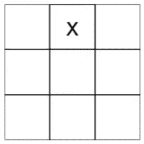
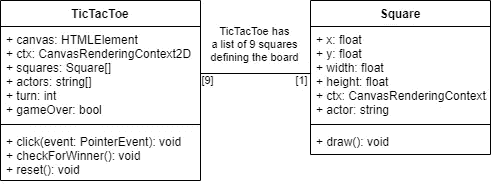
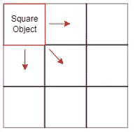
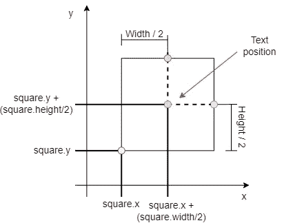
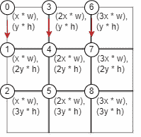
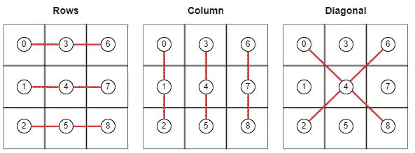

# 用 HTML 和 JavaScript 创建井字游戏

> 原文：<https://betterprogramming.pub/create-tic-tac-toe-with-html-and-javascript-ea1c245a9f1f>

## 学习在你的网站上实现游戏

图片由 pix abay:[https://www . pexels . com/da-dk/foto/farve-form-HJ erte-kamp-220057/](https://www.pexels.com/da-dk/foto/farve-form-hjerte-kamp-220057/)

井字游戏、零号游戏和十字游戏，或者我们在丹麦语中称之为“kryds og bolle”。这可能看起来是最简单的游戏之一，但它包含了一些对初学者很有价值的问题。本文解释了如何使用 HTML Canvas 元素和 JavaScript 创建游戏。

展示文章中创建的游戏的 GIF。

# 1.设置游戏

第一步是创建一个具有通用 HTML 结构的 HTML 文件，一个`canvas`元素和一个`script`标签(参见图 1)。您可以很容易地在一个单独的文件中实现 JavaScript，但是为了本教程，我决定将所有内容保存在一个文件中。

`canvas`元素将被用作游戏的场景，但是你也可以在其他元素中实现游戏，比如一个`div`标签，然而，这需要在本教程中对代码进行一些修改。

图 1:显示了一个简单的 HTML 结构的实现，带有一个画布和一个脚本标签。

# 2.游戏的类别

在介绍定义游戏的 JavaScript 代码之前，我想介绍一下设计背后的一些想法。我决定使用两个不同的类来编写游戏，`TicTacToe`和`Square`(见图 2)。

类`TicTacToe`用于通过将画布元素的 id 传递给类的构造函数来实例化游戏。这确保了该类可以与同一个 HTML 页面上的几个 canvas 元素一起使用，只需为每个 canvas id 创建该类的多个实例。

第二个类`Square`用来表示棋盘上的一个方块。这个类跟踪每个方块的位置、大小以及是否有玩家点击了它。它还包含绘制正方形和玩家符号的行为。

图 2:显示游戏中使用的类的 UML 类图。

# 3.方形类

`Square`类用于为 3x3 网格的每个正方形实例化一个正方形对象(参见图 3)。

图 3:由 Square 类实例化的 Square 对象的图示。

该类将需要五个属性:`x`；`y`；`width`；`height`；`ctx`；`actor`；

`x`和`y`定义方块的位置，`width`和`height`定义方块的尺寸，`ctx`是对画布渲染接口的引用，`actor`指定用‘x’或‘o’填充方块的玩家。

除了`actor`之外的所有属性都应该在实例化时传递给构造函数(参见图 4)。但是，应该在构造函数中将`actor`属性设置为`null`，以确保该属性存在于`Square`对象上。

图 4:显示了 Square 类构造函数的实现。

这个类还需要一个名为 draw()的方法，它负责绘制一个正方形和点击它的玩家的符号。

该方法调用另一个名为`[strokeRect(x, y, width, height)](https://developer.mozilla.org/en-US/docs/Web/API/CanvasRenderingContext2D/strokeRect)`的`ctx`属性方法来绘制正方形(参见图 5，第 20 行)。`ctx`属性还包含另一个名为`strokeStyle`的属性，可以用来设置边框的颜色(参见图 5，第 19 行)。

图 5:显示了 Square 类 draw()方法的实现。

draw 方法使用来自`ctx`属性的另一个名为`[fillText(text, x, y)](https://developer.mozilla.org/en-US/docs/Web/API/CanvasRenderingContext2D/fillText)`的方法来写点击方块的玩家的符号(参见图 5，第 27 行)。文本位于正方形的中心。将正方形的`x`和`y`位置加到其`width`和`height`的一半即可找到中心位置(见图 6)。`ctx`属性包含另一个名为`textAlign`的属性，该属性可以设置为`center`以确保文本向中心对齐(参见图 5，第 26 行)。

图 6:如何找到正方形中心位置的图示。

# 4.TicTacToe 类

下一步是创建`TicTacToe`类。该类将需要一个构造函数和三个方法:`click(event)`；`checkForWinner()`；`reset()`；

图 6:显示了 TicTacToe 类的实现。

## 4.1 施工方

`TicTacToe`类的构造函数被设计成需要一个带有要实例化的画布元素 id 的字符串。

该 id 用于使用 JavaScript 函数`getElementById(id)`获取具有指定 id 的 HTML canvas 元素，并且该元素被设置为名为`canvas`的属性(参见图 7，第 15 行)。

配置完`canvas`属性后，该属性用于获取其`[CanvasRenderingContext2D](https://developer.mozilla.org/en-US/docs/Web/API/CanvasRenderingContext2D)`的实例，该实例被设置为名为`ctx`的属性(参见图 7，第 16 行)。属性提供了在画布中进行绘制的接口。

图 7:显示了 TicTacToe 类构造函数的实现。

下一步是实例化`Square`对象。这是通过循环 3x3 并为每次迭代实例化一个`Square`对象来完成的，该对象被添加到一个名为`squares`的属性中(参见图 7，第 19–28 行)。

循环从在位置(x=0，y=0)创建一个正方形开始，然后从上到下循环，直到创建 9 个正方形(见图 8)。

图 8:寻找每个方块位置的 3x3 循环的图示。

该类将需要另外三个属性，称为`actors`、`turn`和`gameOver`(参见图 7，第 31–37 行)。`actors`是一个由两个字符串组成的数组，定义了玩家的数量和他们的符号(‘x’&‘o’)。`turn`定义一个介于 0-1 之间的数字，该数字指定`actors`数组中的`actor`应该轮到谁。`gameOver`是一个布尔值，如果游戏结束，它将返回`true`。

构造函数的最后一部分是调用 square objects draw()方法，并向类的 click()方法添加一个 click 事件侦听器(参见图 7，第 40–43 行)。

## 4.2 点击法

click 方法被设计为每当用户在画布上单击时就被执行，此时光标的位置可以从参数`event`中读取。

click 方法的第一部分包括一个 guard 子句，如果`gameOver`属性被设置为`true`，该子句将重置游戏。这使用户能够通过点击画布来开始一个新游戏(参见图 9，第 21–24 行)。

图 9:显示了 TicTacToe 类 click 方法的实现。

该方法的下一部分循环所有的`Square`对象，并检查鼠标位置是否在其中一个方块内。如果检查结果为`true`，当前演员将被添加到`Square`对象的`actor`属性中，以表示玩家已经选择了方块，并且`turn`属性将被设置为`0`或`1`以允许下一个玩家选择方块(参见图 9，第 27–43 行)。

最后，该方法调用`checkForWinner()`方法来查看是否能找到获胜者(参见图 9，第 46 行)。

## 4.3 赢家检查法

`checkForWinner()`方法用于检查玩家之一是否选择了水平线、垂直线或对角线上的三个方块(见图 10)。

图 10:显示了井字游戏中不同的获胜组合。这些数字表示正方形在正方形数组中的索引。

该方法的开头定义了一个指定不同 win 组合的数组(参见图 11，第 26–33 行)。

数组的数组用于循环所有赢的组合，并检查三个方块是否匹配其中一个组合(参见图 11，第 36–66 行)。如果检查评估为`true`，属性`gameOver`被设置为`true`以表示画布上的下一次点击应该重置游戏。

该方法还绘制了一条显示获胜者组合的线，并编写了一个显示获胜者的文本(参见图 11，第 54–63 行)。

图 11:显示了 TicTacToe 类 checkForWinner()方法的实现。

该方法的最后一部分检查是否所有的方块都有一个不是`null`的`actor`，以查看游戏是否应该以平局结束。重要的是，在检查游戏是否有赢家之后添加检查，以避免在通过选择最后一个空方块找到赢家的情况下游戏评估为平局(参见图 11，第 69–75 行)。

## 4.4 复位方法

reset 方法旨在将`TicTacToe`类实例的属性设置为玩家可以玩新游戏的状态。

该方法首先使用`ctx`属性的`[clearRect(x, y, width, height)](https://developer.mozilla.org/en-US/docs/Web/API/CanvasRenderingContext2D/clearRect)`方法清除画布的像素(参见图 12，第 31 行)。

在清除画布的像素后，正方形的`actor`属性被设置为`null`，正方形再次被绘制在画布中。

最后，该方法将`turn`设置为`0`以重置玩家的回合，并将`gameOver`设置为`false`，以表示`click()`方法可以再次将玩家添加到方格中，并寻找新的赢家，或者平局。

图 12:显示了 TicTacToe 类 reset()方法的实现。

## 4.5 开始游戏

游戏现在可以开始了。在类定义下面添加一个新行，这将创建该类的一个新实例(参见图 13，第 13 行)。

图 13:展示了如何开始井字游戏。

你可以在[这个链接找到 Github 的要点和完整的代码。](https://gist.github.com/niiicolai/e763fc1bb3481ee908f575a815f95201)