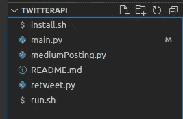

# 用 Python 为你的中型文章创建 Twitter 机器人

> 原文：<https://betterprogramming.pub/create-twitter-bots-for-your-medium-articles-with-python-bf6fdd635e50>

## 让我们通过创建 Twitter 机器人来探索 Twitter 丰富的 Tweepy API


照片由 [Souvik Banerjee](https://unsplash.com/@rswebsols?utm_source=medium&utm_medium=referral) 在 [Unsplash](https://unsplash.com?utm_source=medium&utm_medium=referral) 上拍摄

作为一名应届毕业生和新员工，我一直在深入思考我的职业道路及其目前的轨迹。

在向我公司的许多上级寻求建议和指导之后——我一直得到一条建议——作为一名顾问来发展我的品牌！就在那时，我决定开设一个 Twitter 和 Medium 账户，开始制作内容。

创建自动化系统来帮助在线开发我的品牌的想法非常有趣，促使我创建了一个 Twitter 机器人。

在本文中，我将一步一步地展示如何重新创建我用来自动分享我最近的媒体文章的 Twitter bot。它还具有基于标签或用户名自动转发的能力。

# 先决条件

为了跟进，有几件事是必要的:

1.  Python 3
2.  任何 IDE
3.  Twitter 上的开发者账户
4.  Linux 操作系统(可选)
5.  对 Bash 的基本理解(可选)

注:点击[此处](https://developer.twitter.com/en/support/twitter-api/developer-account#:~:text=Log%2Din%20to%20Twitter%20and,and%20Project%20with%20Essential%20access)获取开发者账号的说明。确保保存您的 API 密钥。你以后会需要它们的。

# 项目结构



我将这个项目分成 3 个独立的 python 文件。

获取最新的媒体文章并发布到 Twitter。基于标签或用户名转发。

`Main`将两个脚本放在一起，并连接到一个特定的 Twitter 帐户。`install.sh`文件会安装依赖项，但不是必需的。

`Run.sh`将在 CronTab 部分解释。

在你开始编码之前，确保安装两个依赖项`tweepy`，请求如下:

```
pip install tweepypip install requests
```

确保在您编码的目录中这样做。Tweepy 是我们将使用的 Twitter API，而 requests 用于构造 HTTP 请求。实际上，上面两行是 install.sh 文件的内容。

# 获取中等职位

这里我们将处理`mediumPosting.py`文件。

它需要两个功能。一个获取最近的文章，另一个用相应的链接构建 Twitter 帖子。

为了开始，我们需要三个导入来解析一个 URL 并执行 HTTP 请求。它们如下:

```
from urllib.request import urlretrievefrom urllib.parse import urlparseimport requests
```

下面是如何获取最新的 Medium 文章并提取其内容的完整源代码:

在上面的代码中:

`fetch_article`函数接受一个中等配置文件 URL，并使用 HTTP 请求检索一个帖子列表(返回一堆 HTTP 文章)。

通过在中等 RSS 源的`{@username}`字段中包含您的用户名来创建 URL，如下所示:

```
"https://api.rss2json.com/v1/api.json?rss_url=https://medium.com/feed/{@username}"
```

HTTP 响应中的第一条记录是最新的文章。构造一个包含这篇文章的`title`、`link`和`thumbnail`的字典并返回。

要获取文章，在 URL 上做一个基本的 get 请求，并创建一个字典，如上所述。完成之后，我们创建了一个函数`Title_Link_Post`，它使用基本的字符串格式来创建 Twitter 帖子的内容。

这就是`mediumPosting.py`文件所需的全部内容。

# 基于 Hashtag 的转发

在本节中，我们将完成文件 retweet.py，以根据标签自动转发预设数量的帖子。

这里我们使用一个函数，它接受用户通过 OAuth 验证的三个输入变量——名为 Auth(我们将在 main.py 中创建)、字符串形式的 hashtag 和转发的 tweet 数量。

为了做到这一点，我们将通过使用如下所示的`Cursor`函数来充分利用`tweepy` API:

```
tweepy.Cursor(auth.search, hashtag).items(num)
```

`Auth.search`指定正在搜索的认证帐户，hashtag 只是一个要搜索的字符串。

扩展`.items(num)`抓取，其中`num`是代表第一个商品计数的`int`。

找到推文后，我们将使用`.retweet`功能来分享它们。

以下是转发用户最近几条推文的功能，其工作方式几乎相同。为了便于记录，已经包含了打印语句。

# 连接到您的帐户

认证只是将正确的 API 密钥传递给`tweepy`的`OAuthHandler`函数。

一旦完成，我们就可以从`retweet.py`中获得`auth`变量。它代表 API 和我们登录的相应帐户(下面称为`auth_acc`)。这通过以下方式实现:

```
API_KEY = "API KEY"
API_SECRET_KEY = "SECRET KEY"
API_ACCESS_TOKEN = "ACCESS TOKEN"
API_ACCESS_SECRET = "ACCESS SECRET"# Authentication
auth = tweepy.OAuthHandler(API_KEY,API_SECRET_KEY)
auth.set_access_token(API_ACCESS_TOKEN, API_ACCESS_SECRET)
auth_acc = tweepy.API(auth)
```

简单地说，用创建开发人员帐户时保存的 API 密钥替换引号中的值。

一旦完成，你可以简单地将`mediumPosting`和`retweet`文件导入到`main`文件中，并在你的主方法中使用相应的函数调用。

见下文:

auth_acc.update_status 发布我们在 mediumPosting.py 中创建的 Title_Link 字符串

# CronTab

`run.sh`的内容相当简单。

该文件包含一行代码，它使用 crontab(一个用于调度作业的 Linux 实用程序)在特定的时间间隔自动运行 bot。毕竟，机器人应该是自动的(至少在原则上)。

只需将条目添加到 crontab，如下所示，让文件以特定的时间间隔运行:

```
MM HH DD MM YYY python3 PATH/TO/Main.py
```

我下面的条目设置为每 10 分钟运行一次。我知道这有点多，但这个例子是可行的:

```
*/10 * * * * python3 ./main.py
```

我希望你能在本教程中找到一些有用的东西。

你可以在这里找到完整的代码。