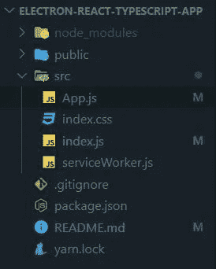
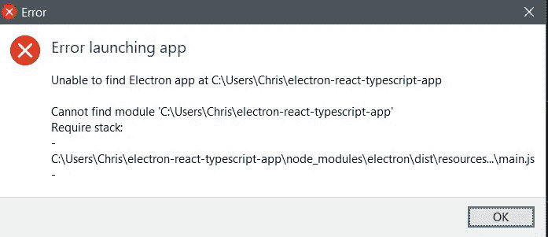
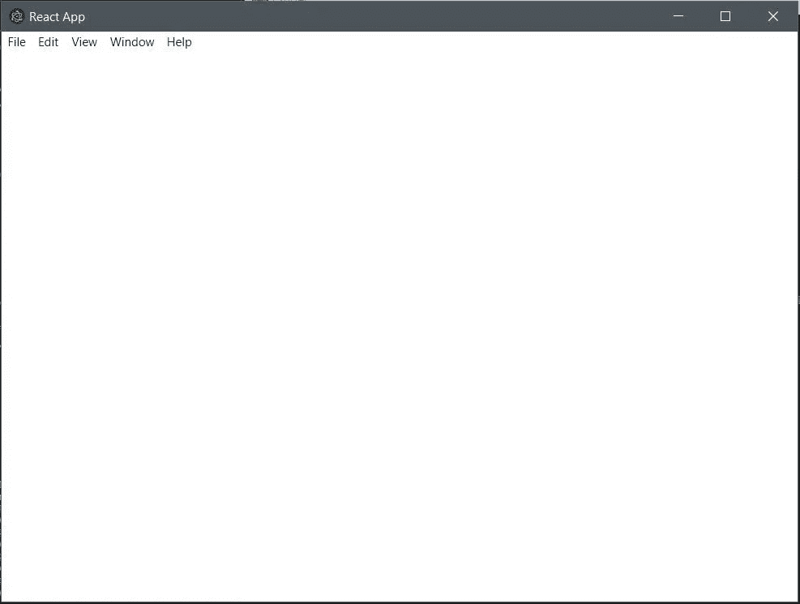
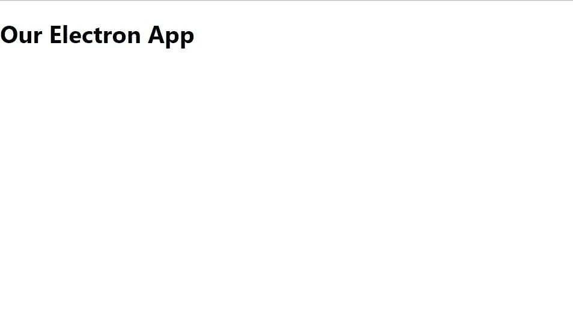
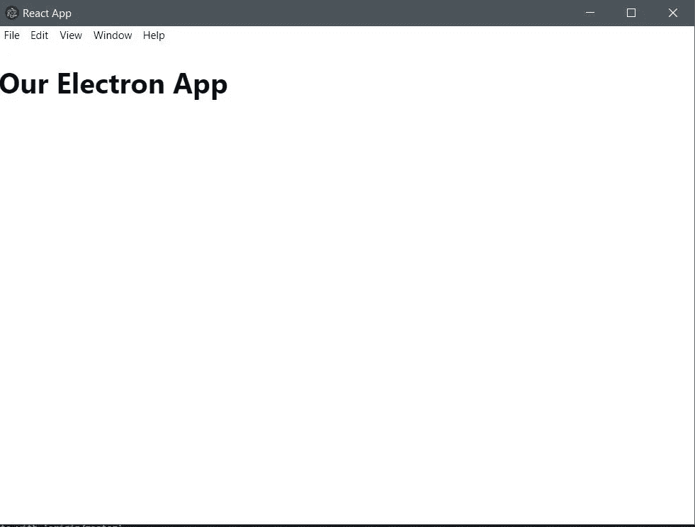

# 创建您的第一个带有热重装功能的 React 桌面应用程序

> 原文：<https://betterprogramming.pub/create-your-first-react-desktop-application-in-electron-with-hot-reload-be96bb455890>

## 基础变得简单，这样你就可以打造下一件大事


*照片由*[*Radek Grzybowski*](https://unsplash.com/@rgrzybowski)*[*Unsplash*](https://unsplash.com/)*

*如果你是一名 JavaScript 开发人员，你构建 web 应用程序的大部分(或全部)经验可能都来自 JavaScript 社区——尤其是在过去几年中发布的这些热门的新技术。这可能会对你多年来决定开发的东西产生影响。*

*当我们被 JavaScript 生态系统中不断变化的环境所包围时，这些环境主要涉及 web 应用程序，我们甚至可能会质疑桌面应用程序是否值得进入。2019 年的一项[堆栈溢出调查](https://insights.stackoverflow.com/survey/2019#developer-roles)显示，仍然有很高比例的桌面开发者，在全球 9 万名调查参与者中，约有 21%是开发者。*

*换句话说，在桌面开发应用仍然是一个受欢迎的选择。因此，如果你想知道如何开始使用 JavaScript 创建你的第一个现代桌面应用程序，那么我希望这篇文章能帮助你！*

# *构建我们的应用*

*我们将使用电子作为我们的主要工具。我们还将安装 [React](https://reactjs.org/) ，因为我们将用它来开始构建我们的用户界面。*

*我们要做的第一件事是使用 [create-react-app](https://github.com/facebook/create-react-app) 创建我们的项目，这将用于提供 react 和其他一些有用的工具，如 [Jest](https://jestjs.io/docs/en/getting-started) 来运行测试。对于本教程，我将我们的项目称为`electron-react-typescript-app`:*

*如果你想拿到你的回购协议，请访问[此链接](https://github.com/jsmanifest/electron-react-typescript-app.git)。*

```
*npx create-react-app electron-react-typescript-app`*
```

*运行它将创建**电子反应类型脚本应用**文件夹，并安装`package.json`中列出的必要依赖项。*

*现在，让我们继续清理我们不需要的文件。这是我的目录最终的样子:*

**

*这是我们的`App.js`组件:*

```
*import React from 'react'function App() {
  return <h1>Our Electron App</h1>
}export default App*
```

*现在，我们将继续安装`electron`作为依赖项:*

```
*npm i electron*
```

*然后，我们将安装[电子生成器](https://github.com/electron-userland/electron-builder)。这是一个完整的解决方案，可以打包并构建一个现成的电子应用程序，支持自动更新。*

*将其作为*开发依赖项*安装:*

```
*npm i -D electron-builder*
```

***注:** `-D`只是`--save-dev`的别名。*

*继续在 *package.json* 中创建一个`"build"`属性，因为`electron-builder`将会使用它:*

*您可以在此阅读所有可用选项[。](https://www.electron.build/configuration/configuration)*

***注意:**对于使用 *create-react-app* 创建的项目，您*必须*将`"homepage"`属性的值放到`"./"`中，以便路径在整个应用程序中正确解析，因为 CRA [会自动生成我们的文件，假设我们的应用程序托管在服务器根](https://create-react-app.dev/docs/deployment#step-1-add-homepage-to-packagejson)中。这是为了确保生成的`index.html`文件在构建后正确地加载资产。如果你不确定这是什么意思，请相信我，试试看！*

*当你运行`npm run electron`时，它会给出这样一个错误:*

**

*那是因为电子找不到可以读取的文件。我们可以在根目录下创建一个`electron.js`文件，也可以在`src`目录下创建一个启动脚本，这样更直观。让我们在 *src* 目录下创建一个`start.js`文件，并编写一些代码来初始化一个具有固定维度的浏览器窗口:*

*完成这些后，我们必须向`package.json`添加一个指向该文件的新属性，这样运行`npm run electron`将引导程序加载`start.js`:*

```
*{
  "name": "electron-react-typescript-app",
  "version": "0.1.0",
  "private": true,
  "main": "src/start.js",
  "build": {
    "appId": "some.id.ofyours",
    "directories": {
      "buildResources": "assets"
    },*
```

*运行`npm run electron`将会打开一个加载`loading.html`文件的窗口:*

**

*太好了，现在情况开始好转了！*

*现在让我们继续运行`npm start`。该脚本现在将成功加载 React 代码的网页！*

**

*但是等一下…这是*而不是*我们要找的。我们应该在电子窗口中看到我们的 React 代码*，那么为什么我们却在浏览器中看到它呢？**

*这是因为我们本质上有两个不同的过程在做不同的事情。他们不知道另一个进程的存在！*

*所以我们要做的是让电子指向网络服务器，因为它有一个可以通过 URL 加载网页的 API。这意味着我们将不再使用浏览器，因为我们正在构建一个桌面应用程序，并且 Electron 可以通过给每个窗口提供 URL 来加载内容。所以我们可以使用电子窗口(可以访问 node.js 模块和本地文件系统)。*

*为了能够做到这一点，我们将安装一个有用的包来检测应用程序是在*开发*还是*生产*模式下运行。如果应用程序在开发模式下运行，那么我们将使用 web 服务器。如果应用程序不是，那么这意味着我们已经使用`electron-builder`构建了文件，我们通过一些可执行文件加载应用程序内容。这就是电子生成器的用途。*

*继续安装`electron-is-dev`:*

```
*npm i electron-is-dev*
```

*现在，我们将继续在我们的电子脚本中要求这样做，并像这样使用它:*

*需要注意的重要行是:*

```
*mainWindow.loadURL(
  isDev
    ? 'http://localhost:3000'
    : `file://${path.join(__dirname, '../build/index.html')}`,
)*
```

*现在，我们没有直接加载`index.html`文件，而是应用了一个条件，在开发模式下使用 CRA 的 web 服务器，或者继续加载`index.html`文件(当环境是*而不是*开发时)。*

*您可能还注意到，我们不再使用路径`../public/indx.html`，而是将其改为`../build/index.html`。这是因为 CRA 内部不*而*处理`public`文件夹内的文件。相反，它[将它们移动到*未接触过的*到](https://create-react-app.dev/docs/using-the-public-folder#adding-assets-outside-of-the-module-system) `[build](https://create-react-app.dev/docs/using-the-public-folder#adding-assets-outside-of-the-module-system)` [文件夹](https://create-react-app.dev/docs/using-the-public-folder#adding-assets-outside-of-the-module-system)。由于`build`文件夹最终会包含所有生成的文件，我们不得不指向它。*

*现在继续运行`npm start`，然后运行`npm run electron`。您现在应该会看到:*

**

*万岁！*

*我们从 CRA 获得热重新加载到电子窗口的好处，以及 node.js 模块和本地文件系统环境进入“ *web* ”页面的好处。这有多棒？*

*哦，是的，如果你看到一个浏览器标签被打开，试着像这样设置`BROWSER=none`到你的`package.json`脚本:*

```
*"start": "cross-env BROWSER=none npm run react-start",*
```

*现在让我们在对`start.js`进行更改时重启主要的电子流程，因为目前我们只为网页 UI 启用了热重装。*

*为此，安装`electron-reload`和`nodemon`:*

```
*npm i -D electron-reload nodemon*
```

*将您的`npm run electron`脚本更改为:*

```
*"electron": "cross-env NODE_ENV=dev nodemon --exec \"\"electron .\"\"",*
```

*并且只需要`start.js`中的`electron-reload`包:*

*现在，当您对`start.js`进行更改时，电子窗口应该会自动重启。*

# *结论*

*恭喜您，您现在知道如何使用 Electron 用 JavaScript 创建一个 react 桌面应用程序了！我希望你发现这是有价值的，并期待在未来更多！*