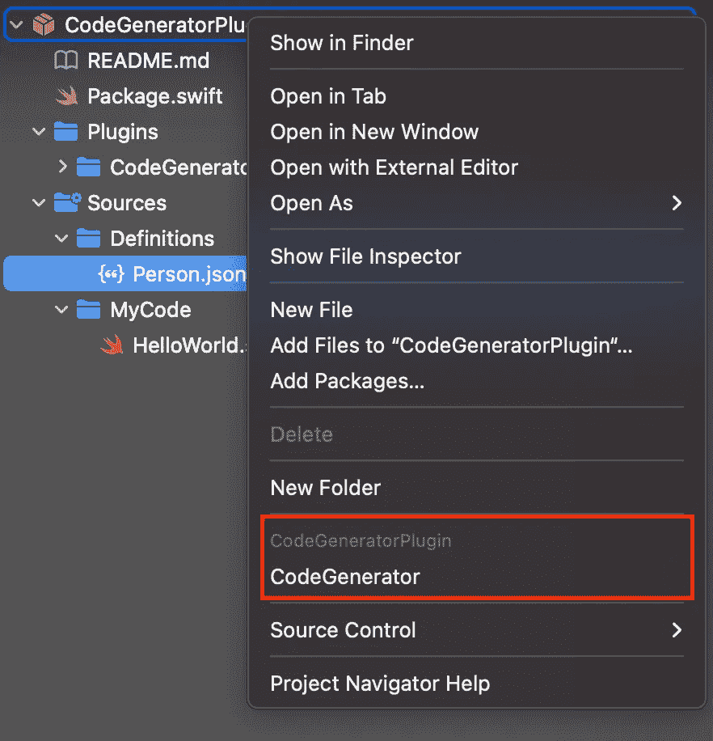
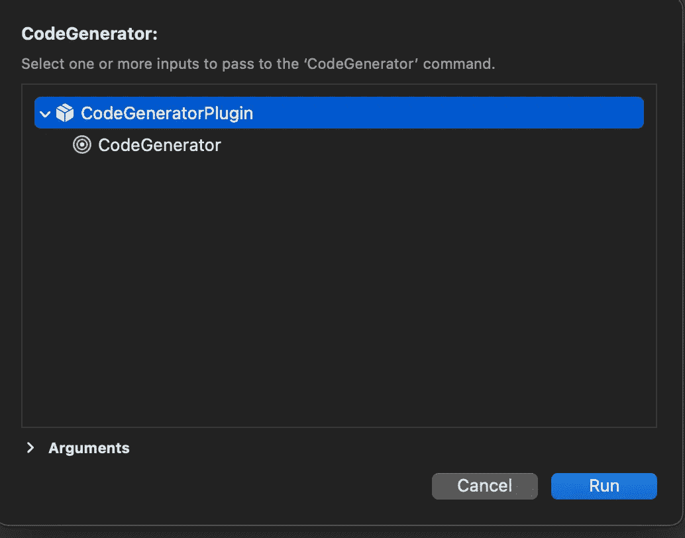
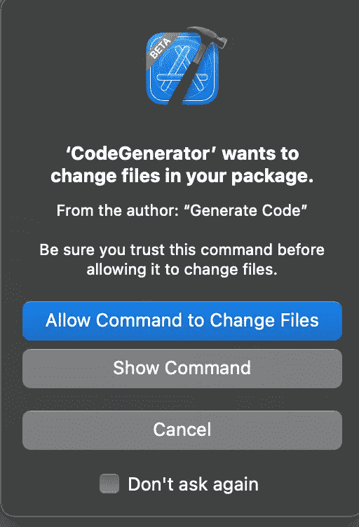

# 创建您的首个 Swift 包命令插件

> 原文：<https://betterprogramming.pub/create-your-first-swift-package-command-plugin-3f918e2e8b8e>

## 如何编写和调试 Swift 包命令插件


杰斯·贝利在 [Unsplash](https://unsplash.com?utm_source=medium&utm_medium=referral) 上拍摄的照片

今年，苹果发布了 Swift Package Manager 的新功能:Swift Package Plugins。我们现在可以编写两种自动与 Xcode 集成的插件:

*   构建(和预构建)插件。
*   命令插件。

我已经在两篇文章中谈到了构建插件:“[实现您的第一个 Swift 包构建插件](/implement-your-first-swift-package-build-plugin-9835a7aded0b)”和“[如何在您的 iOS 应用](/how-to-use-xcode-plugins-in-your-ios-app-13574261f210)中使用 Xcode 插件”。

今天，我想和你分享创建一个命令插件需要哪些步骤。这些插件的开发者体验并不好，所以我想分享一个调试它们的技巧。

> 你可以在这些 WWDC22 视频中找到更多关于 Swift 包插件的信息:[认识 Swift 包插件](https://developer.apple.com/videos/play/wwdc2022/110359/)，[创建 Swift 包插件](https://developer.apple.com/videos/play/wwdc2022/110401/)

# 插件

在本文中，您将创建一个命令插件，从 JSON 规范中生成一些 Swift 代码。

要创建一个命令插件，您需要各种组件:

*   一个`Package.swift`文件来定义插件的结构。
*   适当的文件夹结构。
*   符合`CommandPlugin`协议的 Swift `struct`。
*   实现插件的业务逻辑。
*   可选地，一个额外的包来测试插件。

## 包裹，斯威夫特

Swift 包插件被定义为 Swift 包。你需要为你的插件创建一个新的包。

命令插件的典型包结构如下:

需要注意的重要细节是:

*   1 号线的`swift-tool-version`必须至少为`5.7`。
*   `target`是具有`.command`能力的`.plugin`类型。

为了完整地定义一个命令插件，我们需要添加几个属性:一个`intent`和一组`permissions`。

`intent`是插件存在的原因。它由一个`verb`和一个描述构成。

*   命令插件也可以通过`swift package` 命令行工具调用。`verb`属性是我们可以在命令行中用来调用这个命令插件的参数。语法如下:

```
swift package plugin <verb> [args...]
```

*   `description`属性是插件的可读描述。

这组`permissions`来自于在包 API 中定义的[枚举。enum 没有显式的 cases，但是它提供了一个静态函数:`writeToPackageDirectory`。这告诉 Xcode 你的插件需要写权限，IDE 会在命令被调用时提示用户一条消息。提示符将显示`reason`字符串:一个人类可读的描述，向您的用户解释插件将用这个权限做什么。](https://developer.apple.com/documentation/packagedescription/pluginpermission)

## 文件夹结构

像所有的 Swift 包一样，插件需要遵循一个合适的文件夹结构来正确构建。您可以使用`path`属性定制`Package.swift`中的结构，但是默认的文件夹结构是这样的:

```
CodeGeneratorPlugin
├── Package.swift
└── Plugins
    └── CodeGenerator
        └── CodeGenerator.swift
```

`CodeGeneratorPlugin`是包含当前包的文件夹。`Plugins`文件夹是`Package.swift`中定义的所有插件的主目录。每个插件的代码必须位于与插件同名的文件夹中，在本例中为`CodeGenerator`。

`CodeGenerator.swift`文件是插件的入口点，它将包含其业务逻辑。与其他文件夹不同，没有必要将其命名为`CodeGenerator`:Swift 文件可以有任何名称。

## 代码生成器. swift

这个`struct`是插件的入口点。基本结构是这样的:

重要的片段是:

1.  `import PackagePlugin`语句。它为插件导入了带有所有新 API 的框架。
2.  `@main`标注。它定义了插件的入口点。
3.  符合`CommandPlugin`。它将该结构标记为正确的命令插件，并强制实现其方法。
4.  `performCommand`方法。它包含插件的逻辑。

`performCommand`有两个参数:T1 和 T2。`context`可以用来从包中读取信息，比如它的路径。`arguments`是一个参数列表，可以从 Xcode 或命令行传递给命令。

## 生成代码的逻辑

这是创建插件的最后一步。您需要从 JSON 规范开始编写生成 Swift 代码的代码。为了实现这一点，您可能需要一些助手类和一些函数。

**JSON 规范**

第一步是定义表示 JSON 实体的数据。在这个例子中，您想要生成一些 Swift 结构。这些数据结构非常简单:它们只有`let`属性。

您想要解析的 JSON 具有以下结构:

```
{
  "fields": [{
    "label": "<variable name>",
    "type": "<variable type>",
    ["subtype": "<variable type>"]
  }]
}
```

这是一个表示单个结构的 JSON 对象。它有一个`fields`属性，该属性包含另一个完全定义 Swift 属性的对象。`label`是结构中属性的名称；`type`是属性的主要类型。在泛型的情况下，需要一个`subtype`来指定泛型的类型。

结构的名称将是文件的名称。因此，有效的 JSON 应该是下面的`Person.json`文件:

```
{
  "fields": [
    {
      "label": "name",
      "type": "String",
    },
    {
      "label": "surname",
      "type": "String",
    },
    {
      "label": "age",
      "type": "Int",
    },
    {
      "label": "family",
      "type": "Array",
      "subtype": "Person"
    }
  ]
}
```

这个`Person`类型有名字，有姓氏，有年龄，有家庭，是其他`Person`类型的列表。在执行插件之后，您期望获得以下 swift 结构:

```
struct Person {
  let name: String,
  let surname: String,
  let age: Int
  let family: [Person]
} 
```

**数据模型**

为了在插件逻辑中正确地处理这个 JSON，您需要正确地对它建模，以便能够对它进行解码。

为此，您需要这两个结构:

第一个`struct`是包含字段列表的包装器。它代表顶级 JSON 对象。

`Field`结构是定义内部对象的数据模型。它有一个用于`label`的属性，一个用于`type`的属性，以及一个用于`subtype`的可选属性，以防您必须处理泛型。

**逻辑**

最后，我们可以实现逻辑。你可以在插件中把它分成不同的功能来简化它。

第一个函数是`performCommand`，插件的入口点:

你可以把它看作是插件的[组合根](https://blog.ploeh.dk/2011/07/28/CompositionRoot/):你可以从上下文中获取所有相关数据，实例化依赖关系，并把它们传递给代码的其余部分。

`performCommand`调用`executeCommand`:

这个方法通过使用`drillDown`方法提取所有需要生成的结构。如果没有结构，它将返回。

然后，它将结构写到一个名为`Struct.swift`的文件中:为了简单起见，所有的结构都包含在一个文件中。

`drillDown`方法负责爬行包的文件夹结构，以递归的方式寻找 JSON 规范:

这个例子假设所有的`JSON`规格都位于一个名为`Definitions`的文件夹中。

`drillDown`方法从获取`directory`属性的内容开始，默认情况下，该属性是包的主文件夹。然后，如果`directory`的最后一个路径组件是`Definitions`，它检索文件夹中包含的每个项目的完整路径，并为每个项目调用`createSwiftStruct`函数。

否则，它继续在树上爬行:对于当前文件夹中的每个项目，它检查它是否是一个文件夹。如果它是一个文件夹，它会尝试`drillDown`进入其中，并将结果累积到一个变量中，该变量将在递归结束时返回。

最后一种方法是`createSwiftStructure`:

该方法读取作为参数传递的文件内容。然后，它尝试使用上面定义的数据模型对其进行解码。

然后，它从文件名中提取出`struct`名，并创建字段列表。

最后，它返回一个有效 Swift `struct`的`String`。

## **如何使用**

现在，是时候在另一个包中尝试你的命令插件了。

首先，在`Package.swift`中创建一个新包。为此，您只需在`Package.swift`文件中添加一个`.target`:

该包还需要适当文件夹结构。应该是这样的:

```
CodeGeneratorPlugin
├── Package.swift
└── Plugins
│   └── CodeGenerator
│       └── CodeGenerator.swift
└── Sources
    └── MyCode
        └── HelloWorld.swift
```

`HelloWorld.swift`只是一个空的 Swift 文件:每个 Swift 包的文件夹中必须至少有一个 Swift 文件。

此时，如果您右键单击`CodeGeneratorPlugin`项目，您已经可以看到 Xcode 在上下文菜单中显示了您的`CodeGenerator`自定义插件！



下一步是添加一个包含我们上面描述的`Person.json`文件的`Definitions`文件夹。

完成后，点击上下文菜单中的`CodeGenerator`菜单项，Xcode 会显示一个对话框让你:

1.  选择插件应该在哪个目标上运行。
2.  如果需要，传递附加参数。



在这种情况下，我们不需要任何额外的参数，我们可以安全地单击`Run`。

现在，Xcode 会询问是否允许运行该命令。



该对话框中以`From the author`开头的行显示了在本文第一步中您在`Package.swift`中为您的插件设置的`reason`。

通过点击`Allow Command to Change Files`，Xcode 将执行该命令。几秒钟后，您应该会看到一个`Structs.swift`文件出现在`HelloWorld.swift`下面。

新文件应该包含以下内容:

恭喜你！您创建了第一个命令插件，并使用 Xcode 将它应用到另一个目标上。

# 调试插件

不幸的是，没有人能够不经过一点尝试和错误就写出完美的代码。在开发这个插件时，我经常运行它，看看它是否工作正常，但是开发人员的体验非常令人沮丧:

1.  开始时，插件没有产生任何输出，因为它失败了。
2.  Xcode 没有发出任何我可以处理的错误。
3.  不可能连接调试器来查看发生了什么。
4.  Swift `print`函数没有在任何地方写任何东西。

我调试这个插件的解决方案是将每一步都写入一个日志文件。为此，我遵循了以下步骤:

1.  我创建了一个全局`var log: [String]`变量。每次运行该命令时都会重新创建它，因此不存在进程间共享内存的问题。
2.  我创建了一个`log(_ message: String)`函数来将消息追加到`log`变量中。
3.  我创建了一个`printLog()`函数来`join`所有的日志，并把它们写到一个`logs`文件中，我可以在执行后检查它。
4.  最后，我用对`log(_:)`函数的调用来测试我的代码，看看发生了什么。

> **注意:**这是一种快速实现，但效率不高。它每次都重新创建文件，重写整个内容。更好的解决方案是将新日志附加到现有文件中。

有了这个技巧，我能够记录我遇到的各种错误，并成功地实现这个插件。

# 结论

在今天的文章中，您学习了如何为 Swift 5.7 配置命令插件。

您学习了如何构建包以及实现它的基本概念。您还学习了如何在 Xcode 中运行它。由于开发人员经验不足，您学习了如何创建一个基本的 logger 解决方案来查看各种执行步骤。

命令插件非常有用，但是当从命令行使用时，它们会更加有用:例如，我们将能够在我们的持续集成环境中集成定制命令。

我很期待看到社区会用这些新的强大工具创造出什么！