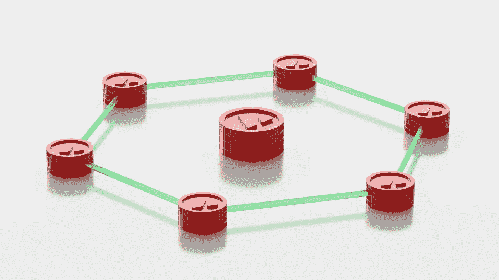

# 如何在以太坊创建您的初始硬币发售(ICO)合同

> 原文：<https://betterprogramming.pub/create-your-initial-coin-offering-ico-contract-in-ethereum-5a94ec3e2337>

## 让你的众筹更进一步



图片来自 Unsplash

初始硬币发行(ICO)是一种使用加密货币和区块链技术的众筹方法。在 ICO 中，初创公司向投资者提供代币，以换取法定货币或其他加密货币，如比特币或以太坊。这使得初创公司可以在没有风险资本家、银行或证券交易所等中介机构的情况下获得项目资金。

# **准备就绪**

你需要一个可以处理 solidity 编程的开发环境和一个以太网来部署和测试你的代码。

```
mkdir ico && cd icogit clone [https://github.com/ac12644/ICO-Token.git](https://github.com/ac12644/ICO-Token.git)npm install
```

1.  您需要创建一份`CrowdSale`合同，用于最初的硬币/代币提供流程。确保为算术运算导入 SafeMath，如下所示:

2.如果您正在向投资者分发代币，那么导入代币契约并创建一个状态变量来跟踪可分发代币契约的地址。代码如下:

3.每次购买售出的代币数量按比率计算；创建一个状态变量来将其存储在契约中。rate 参数存储购买者为一个 Wei 获得的代币数量。

```
uint256 public rate;
```

4.募集的资金要转到项目或公司地址。请在之后保存钱包地址。

```
address public wallet;
```

5.要跟踪筹集的资金数量，请使用以下代码创建一个状态变量:

```
uint256 public weiRaised;
```

6.应该首先初始化 rate、wallet 和 token 的值。使用构造函数将确保在协定创建期间进行初始化。确保为每个输入值包含足够的验证。代码如下:

7.创建一个函数来计算每个输入金额的令牌数，可以允许其他合同使用该功能。这可能是有益的，因为它可以简化其他实体的流程并使其更加高效。下面是实现这一点的代码:

8.创建一个允许投资者购买代币的功能:

```
function buyTokens(address _investor) public payable {
            // ..
}
```

9.包含足够的验证以确保函数的正确输入是很重要的。可以使用`require()`验证输入的金额和投资者地址:

10.确认成功后，请将该金额添加到所筹集的魏总额中。

```
function buyTokens(address _investor) public payable {
    _preValidatePurchase(_investor, weiAmount);
    weiRaised = weiRaised.add(msg.value);
}
```

11.您可以计算可以购买的代币数量，然后通过代币的`transfer`功能将代币转让给用户，如下图所示:

12.创建一个事件来记录令牌销售流程。

13.完成代币购买后，请将代币转移到您的钱包中妥善保管。

```
function _forwardFunds() internal {
    wallet.transfer(msg.value);
}
```

14.添加一个`payable`回调函数将提高令牌购买过程的可用性，因为它允许在不需要调用特定函数的情况下接受以太网。代码如下:

```
function () external payable {
    buyTokens(msg.sender);
}
```

15.包含所有这些属性将导致以下结果:

Crowdsale.sol

# 向合同中添加额外功能

众卖合同可以有额外的功能，如销售期限或限制出售的代币数量，这有助于众卖过程的自动化。拥有这些功能有助于确保令牌的有效分发。

现在，我们将了解如何限制出售的代币以及出售的时间。通过扩展以前的`CrowdSale`合同，您将能够添加这些功能。

1.合约可以有一个上限来限制通过众筹筹集的金额。通过创建一个变量来存储上限限制，可以帮助确保众筹成功。方法如下:

```
uint256 public cap;
```

2.该值通过构造函数指定。除了 rate、wallet 和 token 之外，还包括对构造函数的初始化，如下所示:

```
constructor(uint256 _cap, ....)     
    public {    
    // Other validations and assignment     

    require(_cap > 0);     
    cap = _cap;
}
```

3.在令牌购买操作期间，应该添加一个附加条件来验证上限。

```
function buyTokens(address _investor) public payable {
    require(weiRaised.add(_weiAmount) <= cap);
    //..
}
```

4.创建一个只读函数，用于检查是否达到上限，并返回布尔值 true 或 false。

```
function capReached() public view     
    returns (bool) {     
    return weiRaised >= cap; 
}
```

5.类似的程序可以将销售限制在特定的时期。通过创建状态变量来保存开始和结束时间，可以确保使用 UNIX 时间戳来计算固化时间，如下所示:

```
uint256 public openingTime;
uint256 public closingTime;
```

6.使用构造函数初始化持续时间。

```
constructor(uint256 _openingTime, uint256 _closingTime) public
        {
           require(_openingTime >= block.timestamp);
           require(_closingTime >= _openingTime); openingTime = _openingTime;
           closingTime = _closingTime;
        }
```

7.请创建一个修改量来验证持续时间。使用此修饰符的功能在一段时间后不能执行。代码如下:

```
modifier onlyWhileOpen {
     require(block.timestamp >= openingTime
        && block.timestamp <= closingTime);
     _;
}
```

8.您可以在购买代币功能中使用此修饰符，以防止有人在销售期结束或尚未开始时购买代币。

```
function buyTokens(address _investor) public payable
     onlyWhileOpen {
     //…
}
```

9.包括只读功能，供任何希望确认销售状态的人使用。

```
function hasClosed() public view returns (bool) {
    return block.timestamp > closingTime;}
```

10.该合同将类似于以下内容:

# 添加更多限制

也可以为每个账户设置一个上限，这给了所有者更多的控制权。为此，您必须创建一个将地址映射到 cap 的映射。您还必须为贡献创建映射。方法如下:

```
mapping(address => uint256) public contributions;
mapping(address => uint256) public caps;
```

检查每个代币购买的个人限额，以防止人们购买太多。

```
require(contributions[_beneficiary].add(_weiAmount) <=
caps[_beneficiary]);
```

为个人用户的贡献和上限创建只读方法是必不可少的。

为用户限制创建 setter 函数将更容易为多个地址分配上限:

# 将用户列入众卖的白名单

当需要私下销售或增加奖金时，创建白名单合同来跟踪某一组用户。通过限制用户之间的操作，这允许更个性化的方法。

在这一部分中，我们将看到如何创建一个白名单函数，它可以与众卖合同一起使用。

1.  应该创建一个映射变量，将地址存储为键，将白名单状态存储为值。通过将映射标记为公共变量，将创建一个 getter 函数，可用于验证白名单状态，如下所示:

```
mapping(address => bool) public whitelist;
```

2.应该使用以下函数将用户添加到白名单合同中，并且应该仅限于所有者或管理员。方法如下:

```
function addToWhitelist(address _investor) external
    onlyOwner {
      whitelist[_investor] = true;
}
```

3.为了便于加入白名单，您可以使用另一个函数来接受地址数组，如下所示:

```
function addMultipleToWhitelist(address[] _investors)
            external onlyOwner { 
            for (uint256 i = 0; i < _investors.length; i++) {
               whitelist[_investors[i]] = true;
}}
```

4.如果地址添加错误或者用户不再被邀请使用该功能，创建一个从白名单中删除用户的功能会很有用。

```
function removeFromWhitelist(address _beneficiary) external
     onlyOwner {
     whitelist[_beneficiary] = false;
}
```

5.创建一个修饰符来阻止非白名单用户访问这些功能。代码如下:

```
modifier isWhitelisted(address _investor) {
    require(whitelist[_investor]);
    _;
}
```

6.将修饰符应用于代币购买函数，以便只有白名单中的用户可以通过这个众卖购买代币。最终合同应类似于以下示例:

白名单. sol

*感谢阅读！*

*退房还:*

[](https://medium.com/geekculture/5-key-features-of-a-security-token-you-need-to-know-f7975472f439) [## 您需要了解的安全令牌的 5 个关键特性

### 什么是安全令牌？它们的必要组成部分是什么？

medium.com](https://medium.com/geekculture/5-key-features-of-a-security-token-you-need-to-know-f7975472f439)