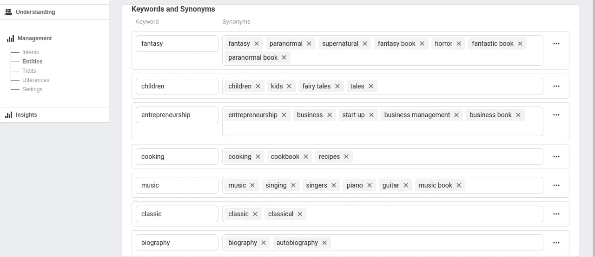
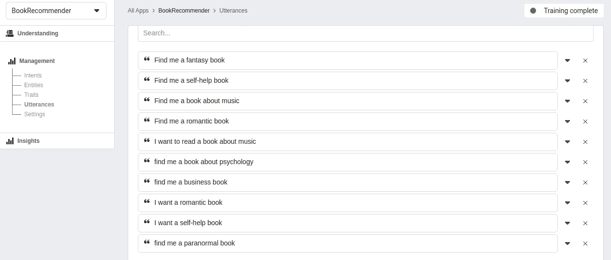
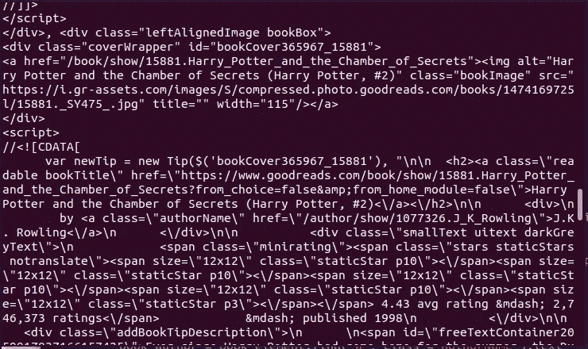
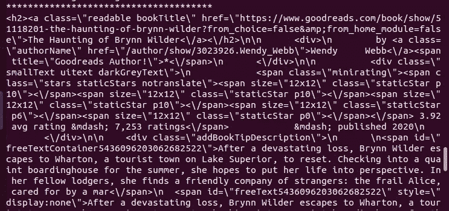
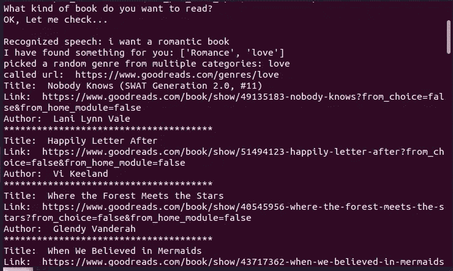

# 使用 Wit.ai 和 Beautiful Soup 创建您自己的图书推荐应用程序

> 原文：<https://betterprogramming.pub/create-your-own-book-recommendation-application-using-wit-ai-and-beautiful-soup-8d0343288d28>

## 网页抓取加上一个 NLP 应用程序


在 [Unsplash](https://unsplash.com?utm_source=medium&utm_medium=referral) 上由 [Jaredd Craig](https://unsplash.com/@jaredd_craig?utm_source=medium&utm_medium=referral) 拍照

在本教程中，我们将构建一个图书推荐应用程序。我们将涵盖一些基本的人工智能( [AI](https://en.wikipedia.org/wiki/Artificial_intelligence) )和自然语言处理( [NLP](https://en.wikipedia.org/wiki/Natural_language_processing) )概念，以及[网络抓取](https://en.wikipedia.org/wiki/Web_scraping)技术。

听众:你不必是一个有经验的数据科学家，也能遵循本文中的步骤。对编程语言和 NLP 有基本的了解就够了。本教程结束时，您将能够创建自己的酷应用程序。

# 技术堆栈概述

[Wit.ai](https://wit.ai/docs/quickstart) 是一个 NLP 接口，用于将人类语音或文本转换成结构化数据。它最常见的用途之一是创建聊天机器人或任何其他与人互动的对话程序。

它已经有现成的 NLP 算法来训练你的应用。这样可以节省您大量的时间，因为您不必编写自己的训练模型。除此之外，它对私人和商业用途都是免费的。

[Beautiful Soup](https://www.crummy.com/software/BeautifulSoup/bs4/doc/) 是一个强大的 Python 库，用于从 HTML 和 XML 文档中提取数据。它允许我们在文档树中导航、搜索和修改数据。例如，如果您想从一个网站收集所有的 URL，只需几行代码就可以完成。这是一个从网站获取数据的流行工具。

让我们开始吧！

# 准备好你的 Wit.ai 应用

## 基本概念

在我们训练我们的应用程序之前，让我们看看一些基本的 Wit.ai 概念和术语。

*   **话语**用于教 Wit.ai 如何理解你的语音或短信。它从您提供的示例输入数据中学习。产生的数据越多，识别就越准确。例如，话语可以是“现在是什么时间？”
*   意图，顾名思义，就是你心中的目标。例如，您可能想知道当前时间。你将意图分配给所提供的话语，以表明你想要达到的目的。
*   **实体**是指同一主题的单词或一系列单词。它们承载着我们想要从话语中捕捉的有意义的信息。您可以创建自定义实体或使用一些内置实体。Wit 提供了大量的实体集合，比如一个人的年龄，一个名人等等。例如，如果您键入“谁是麦当娜？”这个程序可以识别出你指的是一个名人，在这个例子中，是麦当娜。

## 创建 Wit 应用程序

1.  首先，你需要[用你的脸书账户注册](https://wit.ai/)你的应用程序。您可以使用您的 GitHub 帐户；但是，这种身份验证很快就会被弃用。
2.  点击“新建应用程序”按钮创建一个新的应用程序。我给我的取名`BookRecommender`。

3.点击“选择或添加意向”以创建新的意向。键入`book_get`，并点击“+创建意图”

4.现在，我们需要创建实体来解析来自输入话语的关键字。要添加您自己的实体，请转到“管理”菜单下的“实体”，然后单击“+实体”创建一个自定义实体，并将其命名为`book_keywords`。

5.点击“添加新关键字”添加新关键字。选择查找策略“关键字”我决定将与流派相关的关键词按类别分组。

下面是我的关键词的一个例子:



显示图书关键词的我的电脑截图

6.导航至左侧的“理解”部分以添加话语。由于这是一个书籍推荐应用程序，所以让我们添加类似“给我找一本超自然的书”这样的句子

你会看到程序会突出显示单词`supernatural` ，因为它识别出它属于我们的`book_keywords`列表。

将意向设置为`book_get`。“解析值”应该是`fantasy`。

这里有一个截图可以让你有个概念:


来自我的电脑的屏幕截图，显示已解析的话语

正如我已经提到的，如果你提供更多的例子，Wit 会更准确地理解你的意图。

下面是我的一个例子:



我的电脑上显示话语的屏幕截图

8.完成设置后，点击“培训和验证”安排培训。应该需要大约一分钟左右。当训练完成后，应用程序将能够识别新的话语，并将其分配给我们的意图。

如果有的话，重复其余的例子。

9.现在，让我们查询我们的应用程序。转到“管理”菜单下的“设置”。在“HTTP API”框中键入话语。例如，“我想要一本精彩的书。”

它会生成一个 HTTP 请求。在终端窗口中复制并执行生成的 curl 命令。结果应该是这样的:

```
{"text":"I want a fantastic book","intents":[{"id":"843319269761006","name":"book_get","confidence":1}],"entities":{"book_keywords:book_keywords":[{"id":"371862974083122","name":"book_keywords","role":"book_keywords","start":9,"end":23,"body":"fantastic book","confidence":0.9655,"entities":[],"value":"fantasy","type":"value"}]},"traits":{}}
```

注意,`value`已经被正确解析—— `fantastic`属于`fantasy`关键字。

我们已经完成了我们的 Wit 应用程序的设置！

# 准备 Python 代码

我们将用 Python(版本 3)编写程序，并利用一些库。

注意，错误处理超出了本教程的范围。

安装`pyaudio`启用语音记录:

```
pip3 install pyaudio
```

安装美汤可以提取数据。对于 Debian/Ubuntu 发行版:

```
sudo apt-get install python3-bs4
```

然后运行:

```
pip3 install beautifulsoup4
```

安装 [html5lib](https://pypi.org/project/html5lib/) 作为解析器库:

```
apt-get insall python-html5lib
pip3 install html5lib
```

成功安装后，我们就可以开始编码了。

1.  创建一个名为`audiorecorder.py`的文件，并粘贴以下代码:

不要太担心这个文件，它会处理录音。当我们执行`record_audio`函数时，我们将传递`duration`和一个`filename`作为参数。持续时间以秒为单位。该程序将创建一个包含我们演讲的`wav`格式的文件。

`read_audio`功能将打开语音文件并播放。

2.创建一个名为`book_recommender.py`的文件。这是我们放置应用程序逻辑的地方。

3.连同我们的`audiorecorder`一起导入必要的库:

```
import re
import json
import random
import requests
from bs4 import BeautifulSoup
from  audiorecorder import record_audio, read_audio
```

4.为了能够从 Python 调用我们的 Wit 应用程序，我们需要一个访问令牌。要获取它，请返回 Wit.ai 并导航至“设置”。复制“服务器访问令牌”

5.定义 API 端点和 Wit 令牌:

```
WIT_API_ENDPOINT = 'https://api.wit.ai/speech'
WIT_ACCESS_TOKEN = 'IXOH5HPPECPC2KIHJ6Q7MQAOKXFIFRRD'
BOOK_API_ENDPOINT = 'https://www.goodreads.com/genres/'
```

Goodreads 是我最喜欢查看书籍推荐的地方之一。我们将使用他们的网站来接收推荐列表。稍后，我们将把所需的流派作为 URL 参数传递。

6.启动一个`CATEGORIES`对象来保存我们的书籍类型和它们的类别:

```
CATEGORIES = json.loads('[{"genre":"Art","category":"hobby"},{"genre":"Biography", "category":"biography"},{"genre":"Business","category":"entrepreneurship"},{"genre":"Children-s","category":"children"},{"genre":"Classics","category":"classic"},{"genre":"Cookbooks","category":"cooking"},{"genre":"Crime","category":"suspense"},{"genre":"Fantasy","category":"fantasy"},{"genre":"Fiction","category":"fantasy"},{"genre":"History","category":"history"},{"genre":"Horror","category":"fantasy"},{"genre":"Music","category":"music"},{"genre":"Mystery","category":"fantasy"},{"genre":"Paranormal","category":"fantasy"},{"genre":"Philosophy","category":"psychology"},{"genre":"Romance","category":"romance"},{"genre":"love","category":"romance"},{"genre":"Science","category":"hobby"},{"genre":"ScienceFiction","category":"fantasy"},{"genre":"Self-Help","category":"psychology"},{"genre":"Suspense","category":"suspense"},{"genre":"Spirituality","category":"psychology"},{"genre":"Sports","category":"hobby"},{"genre":"Thriller","category":"suspense"},{"genre":"Travel","category":"hobby"},{"genre":"Young Adult","category":"teen"}]')
```

请注意，类别必须与我们在 Wit 应用程序的`book_keywords`中创建的类别相匹配。

您看到的类型与 Goodreads 中的类型相匹配。

7.创建`recognize_speech`功能:

```
def recognize_speech(filename, audio_length):

    # record an audio file for a given duration in seconds
    record_audio(audio_length, filename)

    audio = read_audio(filename)

    headers = {'authorization': 'Bearer ' + WIT_ACCESS_TOKEN,
               'Content-Type': 'audio/wav'}

    resp = requests.post(WIT_API_ENDPOINT, headers = headers,
                         data = audio)

    data = json.loads(resp.content)
    return data
```

这个函数将从我们的`audiorecorder.py`模块中调用`record_audio`函数。它会向 Wit 发送一个包含录音的请求。基本上，这和我们用 curl 命令查询我们的应用程序是一样的。响应将是一个简单的 JSON 对象，我们稍后将对其进行解析。

8.定义一个`analyze_speech`函数来处理用户输入:

```
def analyze_speech(recorded_speech):
    book_types = ""
    searched_book_type = ""
    result_genres = []

    if 'book_keywords:book_keywords' in recorded_speech['entities']:
        book_types = recorded_speech['entities']['book_keywords:book_keywords']

    if book_types:
       for key in book_types:
           searched_book_type = key['value']

    for category in CATEGORIES:
        if searched_book_type == category['category']:
           result_genres.append(category['genre'])

    return result_genres
```

该功能将检查我们的话语是否包含任何`book_keywords`。然后它会从录制的语音中提取图书关键词。

我们需要遍历提供的图书关键字来识别搜索到的图书类型。

我们检查`searched_book_type`是否与`book_types`中的值匹配。例如，如果你说`fantasy`，它会寻找一个匹配的值。

如果我们为搜索的图书类型找到多个类别，我们将它们添加到一个`result_genres`列表中。例如，幻想类别可以被列入超自然、神秘或科幻类型。

你可以根据自己的喜好随意修改类型。

9.创建另一个函数`get_book_recommendations`，来检索图书推荐:

```
def get_book_recommendations(genre):
    book_site_response = requests.get(BOOK_API_ENDPOINT + genre)
    soup = BeautifulSoup(book_site_response.text, "html.parser")
    book_entries = soup.find_all("div", class_="bookBox")

    for book in book_entries:
        book_id = book.find("div", class_="coverWrapper")['id']
        soup_string = str(book)
        matcher = re.search(book_id + '\'\),\s(.*)(<h2>.*div>)', soup_string)
        innerBookHtml = matcher.group(2)
        book_element = BeautifulSoup(innerBookHtml.replace(r"\"", '"').replace(r"\/", "/"), "html.parser")
        book_title = book_element.find("a", class_="bookTitle").text
        print("Title: ", book_title)
        book_link = book_element.find("a", class_="bookTitle")['href']
        print("Link: ", book_link)
        book_author = book_element.find("a", class_="authorName").text
        print("Author: ", book_author)
        print("**************************************")
```

我不得不提到，有几种方法可以从网站中提取数据。更简单的方法是使用 API。如果网站提供了一个 API，你只需要传递必要的参数就可以得到想要的响应。然而，问题是并不是所有的 API 都能满足定制需求。因此，你可能想使用一个 web scraper 来提取你需要的信息。这就是美丽的汤库发挥作用的时候了。

在这篇文章中，我们将采用强硬的方式——我们将使用网络抓取。

在我们的例子中，我们希望提取书名、作者和链接。

Beautiful Soup 会将来自网站的`book_site_response`解析为 HTML。

让我们看一下回复摘录，看看文档是什么样子的。这样，您将更好地理解我们代码中即将出现的动作。



来自我的电脑的屏幕截图，显示了部分响应 HTML

您可能已经注意到了，这不是一个标准的 HTML 文件。它包含一个带有字符数据(CDATA)的脚本。我们需要的信息，比如`authorName`，驻留在 CDATA 部分中。

首先，我们希望通过找到所有包含一个`bookBox`类的`div`标签来提取图书条目。这样，更容易处理文档中更有意义的部分。我们将过滤后的文本存储在`book_entries`变量中。

在 Beautiful Soup 的帮助下，我们循环通过`book_entries`来收集图书 id。

既然我们能够通过 ID 识别一本书，下一步就是收集每本书所需的信息。为了实现这一点，我们将使用正则表达式(regex)模式。

收到的`innerBookHtml`看起来是这样的:



我的电脑截图，显示了包含图书数据的内部 HTML

这已经足够好了。然而，有一个问题 HTML 文本被转义了。所以，还不能用美人汤。首先，我们必须使用另一个正则表达式来隐藏 HTML 代码。最终的 HTML 存储在`book_element`变量中。

一旦我们有了有效的 HTML 代码，就很容易使用 Beautiful Soup 提取所需的信息。

为了在程序结束时看到结果，我们使用`print`函数将它们显示给用户。

10.最后，让我们创建运行程序的主要方法:

```
if __name__ == "__main__":
    speech =  recognize_speech('speech.wav', 4)
    print("\nRecognized speech: {}".format(speech['text']))

    possible_genres = analyze_speech(speech)
    if possible_genres:
       print("I have found something for you:", possible_genres)
       if len(possible_genres) > 1:
           genre_param = random.choice(possible_genres)
           print("picked a random genre from multiple categories:", genre_param)
       else:
           genre_param = possible_genres[0]
       get_book_recommendations(genre_param)
    else:
     print("Sorry, I didn't find anything")
```

请注意，我已经将录音长度设置为 4 秒——如果您需要更多时间，可以随意更改。

如果我们收到一个单一类型的结果，我们将显示属于该类型的图书数据。然而，正如我们已经看到的，结果是有可能接收多个流派。在这种情况下，逻辑是从`possible_genres`列表中随机选择一个流派。

选择的流派作为参数传递给`get_book_recommendations`函数，该函数返回请求的图书结果。

如果用户正在寻找一个在我们的`book_keywords` 列表中不存在的流派，或者录音不清晰，程序会显示一条消息通知用户没有找到。

# 测试整个应用程序

在终端中使用这个 Python 命令运行 `book_recommender.py`:

```
python3 book_recommender.py
```

说个`i want a romantic book`之类的。结果应该是这样的:



´

如果你回到 Wit.ai 界面，点击“理解”，你会看到你在调用 API 时提供的新例子。您可以检查是否正确解析了意图和实体。

# 结论

我们已经到了本教程的结尾。现在，你应该能够使用 Wit.ai 创建和训练自己的应用程序。你还学会了如何使用 Beautiful Soup 进行网页抓取，从网站中提取信息。

这个项目的 Python 代码，以及我的 Wit 应用程序的 ZIP 文件，可以在下面链接的我的 GitHub 存储库中找到。

我希望你喜欢这个教程。感谢您的阅读，祝您编码愉快！

# 参考

*   [GitHub](https://github.com/kirshiyin89/witai_bs_demo) 仓库
*   [“打造你的第一款 Wit 应用”](https://wit.ai/docs/quickstart)通过 Wit docs
*   [美汤医生](https://www.crummy.com/software/BeautifulSoup/bs4/doc/#)