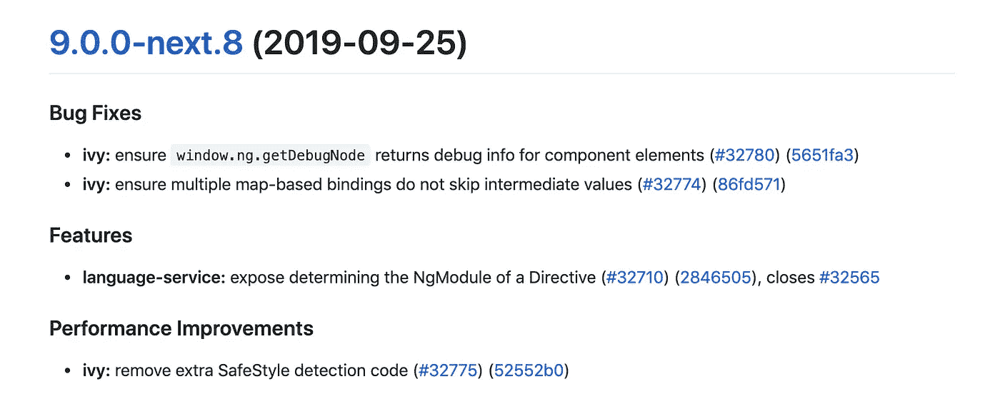
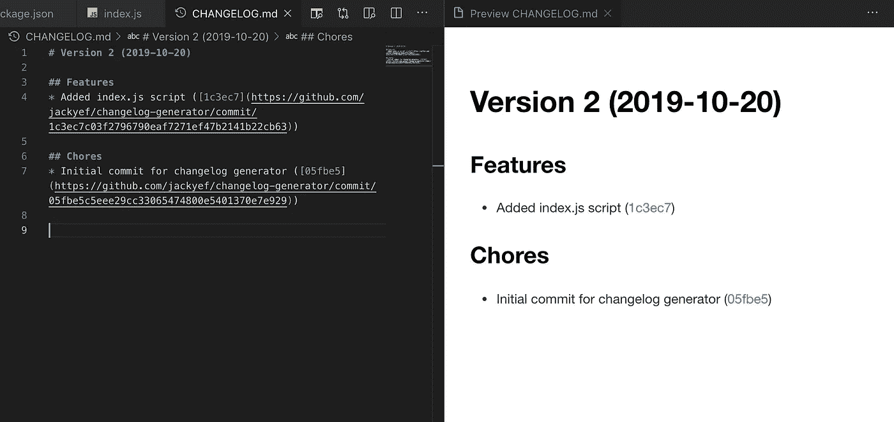
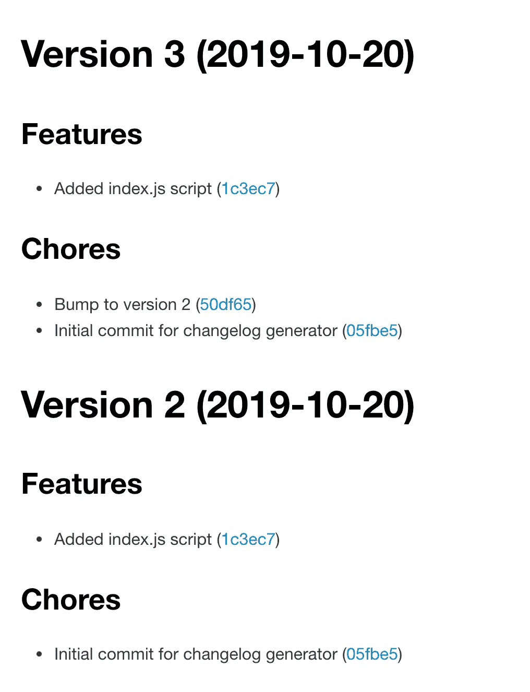
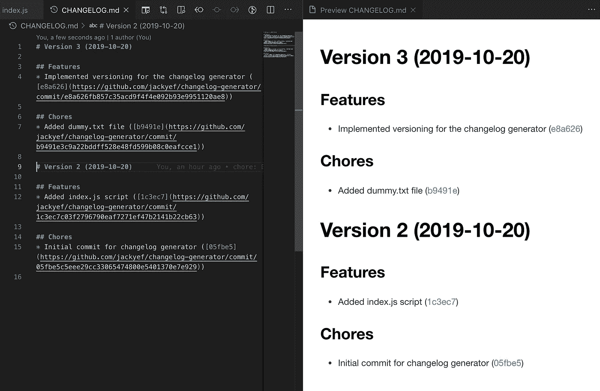
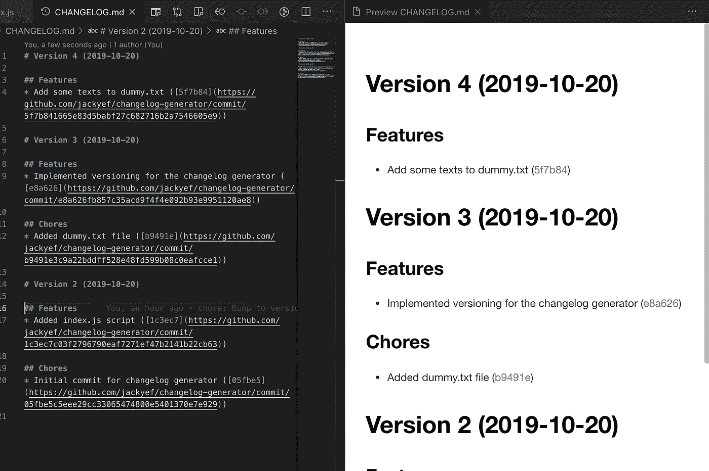

# 用 Git 编写自己的 Changelog 生成器

> 原文：<https://betterprogramming.pub/create-your-own-changelog-generator-with-git-aefda291ea93>

## 将您的提交消息转化为面向用户的发布说明


[扬西·敏](https://unsplash.com/@yancymin?utm_source=medium&utm_medium=referral)在 [Unsplash](https://unsplash.com?utm_source=medium&utm_medium=referral) 上的照片

变更日志很棒。它们给了我们一个记录，记录了我们的项目在某个特定的时间做了哪些变更。如果你正在编写一个库，它也能让你的用户意识到发生了什么变化，并且给人一种你的库维护良好并且值得信赖的印象。像[conventi on-changelog](https://github.com/conventional-changelog/conventional-changelog)这样的工具允许我们轻松地生成一个非常简洁的 changelog，只要我们遵守他们关于如何编写提交消息的约定。其中最流行的是[常规提交](https://www.conventionalcommits.org/en/v1.0.0/)。



在 [Angular 的报告](https://github.com/angular/angular/blob/master/CHANGELOG.md)中生成的变更日志示例

在幕后，这些工具使用 Git 来完成这项工作。在本文中，我们将通过一些步骤来编写我们自己的全功能的 changelog 生成器！

# Git 是什么？

Git 是真正强大的软件。这是一个协作软件开发的工具。世界上几乎每个开发人员都在使用它！尽管我也一直在使用 Git，但我会第一个承认我对 Git 了解不多。我能做基本的事情，理解一些概念，这足以让我富有成效。但是对于使用 Git 可以做的更高级的事情呢？我还有很长很长的路要走。看到这样的推文让我感觉更好，因为这意味着其他开发者也在发现关于 Git 的新东西。

# 建立我们的知识库

让我们创建一个目录，并将其初始化为 Git 存储库。

```
mkdir changelog-generator
cd changelog-generator
git init
```

在其中，我们将创建一个简单的 package.json 文件，它只包含`version`字段。可以把它想象成一个非常简单的 JavaScript 项目存储库。简单点说，我们就把`"1"`设为版本吧。

```
{
  "version": "1"
}
```

之后，让我们创建一个`CHANGELOG.md`文件。暂时空着吧。


这应该是我们项目的样子；我们暂时提交这个。在常规提交中，每个提交消息都需要加上可用前缀中的一个前缀，如`feat` *、*、`fix`、`perf`、`refactor`、`chore`、*、*等。对于我们的存储库，假设我们必须使用两个前缀，`chore`和`feature`。对于我们的初始提交，让我们使用以下命令:

```
git add .
git commit -m "chore: Initial commit for changelog generator"
```

现在，为了让我们的 repo 中有两个提交，让我们创建一个名为`index.js`的文件。留空；稍后我们将在那里编写代码。进行另一次提交，对于这一次，将`feature: Added index.js script`设置为提交消息。

# 编写变更日志生成器

现在我们要进入主要部分了！如果我们在终端中键入`git log`，我们将看到`git`为我们提供了一个到目前为止我们在回购中所做的提交的列表。

```
commit 1c3ec7c03f2796790eaf7271ef47b2141b22cb63 (HEAD -> master)
Author: Jacky Efendi <[not-a-real@email.com](mailto:not-a-real@email.com)>
Date:   Sun Oct 20 14:39:42 2019 +0700feature: Added index.js scriptcommit 05fbe5c5eee29cc33065474800e5401370e7e929
Author: Jacky Efendi <[not-a-real@email.com](mailto:not-a-real@email.com)>
Date:   Sun Oct 20 14:39:37 2019 +0700chore: Initial commit for changelog generator
```

哇，好多东西啊！请记住，我们想要创建一个类似于 [Angular](https://angular.io/) 存储库中的 CHANGELOG.md 的 changelog。这意味着对于每次提交，我们只需要提交消息和提交`SHA1`散列。幸运的是，`[git log](https://git-scm.com/docs/git-log#Documentation/git-log.txt---formatltformatgt)`可以配置不同的格式。如果我们键入`git log --format=%B%H`，Git 将只给我们原始的提交主体和散列。

```
feature: Added index.js script
1c3ec7c03f2796790eaf7271ef47b2141b22cb63
chore: Initial commit for changelog generator
05fbe5c5eee29cc33065474800e5401370e7e929
```

现在，我们可以创建一个脚本来运行这个命令，获取字符串输出，然后将它转换成一个数组。让我们在`index.js`中写一些代码:

基本上，我们只是在运行`git log`的同时添加一个`—--—DELIMITER—--—`字符串来帮助我们分割字符串。我们还过滤掉了没有阿沙散列的提交。如果我们运行该脚本，我们将看到以下输出。

```
➜ node index.js
{ commitsArray:
   [ { sha: '1c3ec7c03f2796790eaf7271ef47b2141b22cb63',
       message: 'feature: Added index.js script' },
     { sha: '05fbe5c5eee29cc33065474800e5401370e7e929',
       message: 'chore: Initial commit for changelog generator' } ] }
```

很好，现在我们有了一个提交数组，它只是带有`sha`和`message`的对象。我们可以使用这个数组将东西写入我们的`CHANGELOG.md`。让我们现在做那件事。很多代码只是从文件中读取，操作字符串，然后将新字符串写入文件，所以我不会用细节来烦你。这是可以为我们生成变更日志的新代码。

如果我们运行我们的新代码，我们会看到一个不错的变更日志:



有用！让我们手动将`package.json`文件中的`version`移到`"2"`，并提交所有内容。

```
git commit -m "chore: Bump to version 2"
```

但是，我们有一个问题。如果我们再次运行脚本，我们会看到列表中有重复的项目:



版本 2 列表中的项目不应再次出现在版本 3 列表中…

这是因为我们只运行了`git log`，它将返回所有的提交。我们想要的是只获取特定提交的日志，直到当前状态。我们需要某种版本控制。

# 版本控制

使用 Git 实现版本控制最简单的方法是使用 Git 标签。基本上，Git 标记的目的是标记特定的提交(duh)。让我们试着创建一个。再次在你的终端中运行`git log`:

```
commit 50df6552c5e709b38dfd915aad3fa8e07e2b86e1 (HEAD -> master)
Author: Jacky Efendi <[not-a-real@email.com](mailto:not-a-real@email.com)>
Date:   Sun Oct 20 15:27:36 2019 +0700chore: Bump to version 2commit 1c3ec7c03f2796790eaf7271ef47b2141b22cb63
Author: Jacky Efendi <[not-a-real@email.com](mailto:not-a-real@email.com)>
Date:   Sun Oct 20 14:39:42 2019 +0700feature: Added index.js scriptcommit 05fbe5c5eee29cc33065474800e5401370e7e929
Author: Jacky Efendi <[not-a-real@email.com](mailto:not-a-real@email.com)>
Date:   Sun Oct 20 14:39:37 2019 +0700chore: Initial commit for changelog generator
```

我们看到我们的 repo 中的最新提交是带有 hash `50df6552c5e709b38dfd915aad3fa8e07e2b86e1.`的提交，您的会有所不同，所以在您的机器上检查一下。让我们将这个最近的提交标记为`version2`。方法是使用以下命令:

```
git tag -a -m "Tag for version 2" version2
```

该命令将创建一个带注释的标记，用“Tag for version 2”作为注释，用`version2`作为标记名。现在，让我们再次尝试运行`git log`:

```
commit 50df6552c5e709b38dfd915aad3fa8e07e2b86e1 (HEAD -> master, tag: version2)
Author: Jacky Efendi <[not-a-real@email.com](mailto:not-a-real@email.com)>
Date:   Sun Oct 20 15:27:36 2019 +0700chore: Bump to version 2
(...)
```

您可以看到，我们的提交现在旁边写有`tag: version2`。这意味着标签`version2`现在引用了这个特定的提交，就像我们当前的`HEAD`一样。现在，我们可以运行`git describe --long`，Git 将告诉我们在我们的 Git 存储库中的最新标签。

```
➜ git describe --long
version2-0-g50df655
```

输出可能看起来有点神秘，但实际上非常简单。该字符串由三部分组成，都由字符`—`分隔。以下是对每个部分的解释:

1.  `version2`:在这个 Git 提交历史中找到的最新标签
2.  `0`:最新标签和当前标签之间的参照数`HEAD`
3.  `g50df655`:当前`HEAD`的缩写提交`SHA`，前缀为`g`。

这里我们关心的是最新标签的名称。我们可以把这个信息传递给`git log`。`git log`命令可以接受两个 Git 引用，并且只返回这两个引用之间的日志。比如，我们可以做`git log version2..HEAD`。Git 将不返回任何东西，因为`version2`和`HEAD`当前引用同一个 Git 提交。让我们尝试添加一个`dummy.txt`文件并提交它。

```
touch dummy.txt
git add .
git commit -m "chore: Added dummy.txt file"
```

现在，如果我们再次运行`git log version2..HEAD`，我们将只看到一次提交。

```
commit b9491e3c9a22bddff528e48fd599b08c0eafcce1 (HEAD -> master)
Author: Jacky Efendi <[not-a-real@email.com](mailto:not-a-real@email.com)>
Date:   Sun Oct 20 15:45:19 2019 +0700chore: Added dummy.txt file
```

我希望现在您已经知道我们要用这些命令做什么了；让我们回到编码上来！

# 编写变更日志生成器(续)

在代码的第一部分，我们现在想运行`git describe --long`来获取最新的标签，并且只从那个标签运行`git log`直到我们当前的`HEAD`。

在代码的最后一部分，我们现在想自动更新`package.json`文件中的版本号，创建一个提交，并将该提交标记为新版本:

现在，让我们提交新的变更日志生成器:

```
git commit -m "feature: Implemented versioning for the changelog generator"
```

让我们再次运行脚本来生成另一个 changelog:



有用！

现在，我们有了一个全功能的变更日志生成器，并且支持版本控制。

为了看看这是否真的有效，让我们将一些文本放入`dummy.txt`文件并提交它。然后，我们将再次运行脚本。



是的，一切都还正常！

现在，您可以将所有标签推送到您的远程存储库，这样它们也会出现在那里。只需运行`git push --tags`即可。在 GitHub web 中，你可以在[标签页](https://github.com/jackyef/changelog-generator/tags)看到标签列表。

# 摘要

我们基本上只需要`git log`、`git describe`和`git tag`结合一些脚本就可以完成这项工作。这实际上非常类似于像`conventional-changelog`这样的工具所做的，给你一个简单的生成的变更日志。当然，我们的生成器*非常*简单，肯定不会像`conventional-changelog`那样处理那么多情况，但是核心思想是相似的。通过强制执行特定的提交消息格式，我们可以自动生成变更日志。

然而，在处理 monorepo 时，事情变得更加困难。管理 monorepo 的工具`lerna`有自己的脚本，结合`conventional-changelog`处理 monorepo 用例。如果您很好奇并想了解更多，请尝试改进这个生成器，使其也能处理 monorepo。我相信在这个过程中你会学到更多！

# 资源

*   [Git 标签](https://git-scm.com/book/en/v2/Git-Basics-Tagging)
*   [Git 日志文档](https://git-scm.com/docs/git-log#Documentation/git-log.txt---formatltformatgt)
*   [Git 描述文档](https://git-scm.com/docs/git-describe)
*   [常规提交](https://www.conventionalcommits.org/en/v1.0.0/)
*   [传统变更日志存储库](https://github.com/conventional-changelog/conventional-changelog)