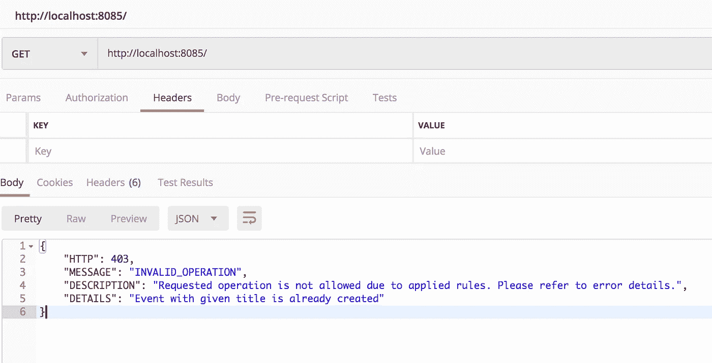
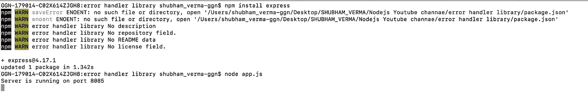
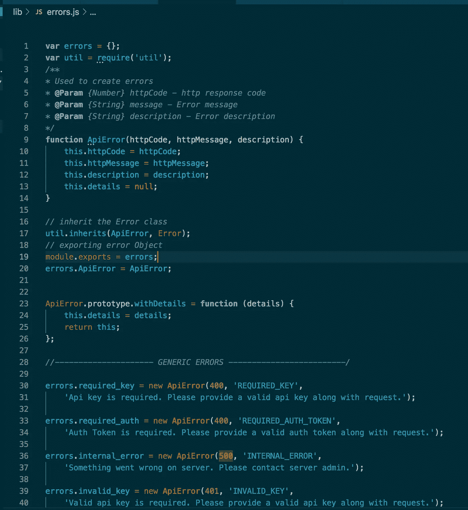
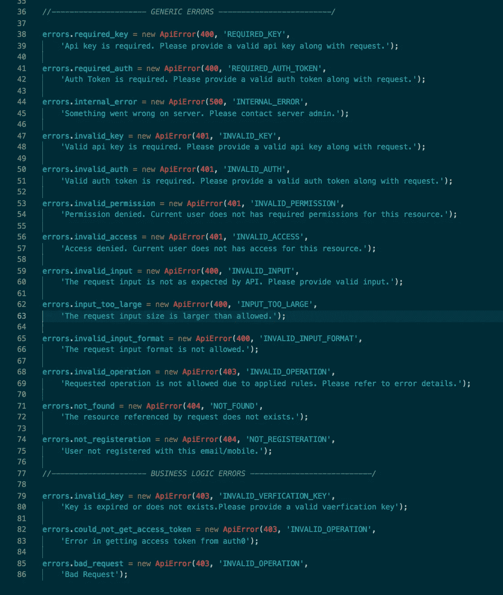
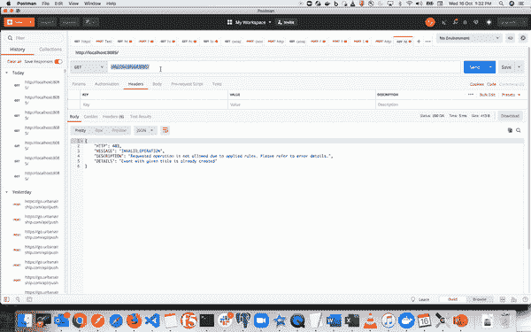

# 在 Node.js 中创建自己的错误处理库和响应模型

> 原文：<https://betterprogramming.pub/create-your-own-error-handler-library-and-its-response-model-for-your-node-app-5422db5658e1>

## 更好的错误，更快乐的用户



邮递员中的错误响应

在 [Node.js](https://nodejs.org/en/) 中创建自己的错误处理库非常容易。在本文中，我们将创建自己的错误处理库及其响应模型，这些将在我们的节点应用程序中使用。

您自己的错误处理库为您提供了一种更好的方法来处理应用程序中的错误，并且您的响应模型在整个应用程序中都是相同的，这是一种非常好的方法。

为此，首先我们将创建一个小而简单的 express 应用程序。在这里，我们将集成我们的错误处理库来处理错误。我们还将看到如何将这个库与固定错误响应模型一起使用。最后，我们看看[邮差](https://www.getpostman.com/)里是什么样子。

那我们开始吧。

# 第一步。设置一个小节点应用程序

创建一个名为`error-handler-demo`的目录，并在这个目录中添加一个名为`app.js`的文件。将下面的代码粘贴到`app.js`中:

```
**const** app = require('express')();
app.get('/', (req, res, next) **=>** {
    *res.send({"hellow":"World"});* res.send(error);
});app.listen(8085, () **=>** console.log("Server is running on port 8085"));
```

现在我们已经创建了一个简单的节点应用程序，让我们运行这个服务器。打开`terminal`，进入 app 位置，逐一运行以下命令:

```
npm install expressnode app.js
```

如果您在下面的快照中看到该消息，这意味着您已经创建了一个服务器，并且它正在运行:



执行命令: `npm install express`和`node app.js`

# **第二步。开始创建我们的错误库**

在这一步中，我们将在根目录中创建一个名为`lib`的目录，并创建一个名为`errors.j`的文件。在这个文件中，我们将为错误库编写代码。复制下面的代码并粘贴到`lib`目录下的文件`errors.js`中。

```
**var** errors = {};
**var** util = require('util');*/**
* Used to create errors
** **@Param** *{Number} httpCode - http response code
** **@Param** *{String} message - Error message
** **@Param** *{String}* description *- Error* description
**/***function** ApiError(httpCode, httpMessage, description) {
  this.httpCode = httpCode;
  this.httpMessage = httpMessage;
  this.description = description;
  this.details = null;
}*// Inherit the Error class* util.inherits(ApiError, Error);*// Exporting error Object* module.exports = errors;errors.ApiError = ApiError;ApiError.prototype.withDetails = **function** (details) {
  this.details = details;
  return this;
};*//--------------------- GENERIC ERRORS -------------------------/*errors.required_key = new ApiError(400, 'REQUIRED_KEY','Api key is required. Please provide a valid api key along with request.');errors.required_auth = new ApiError(400, 'REQUIRED_AUTH_TOKEN','Auth Token is required. Please provide a valid auth token along with request.');errors.internal_error = new ApiError(500, 'INTERNAL_ERROR','Something went wrong on server. Please contact server admin.');errors.invalid_key = new ApiError(401, 'INVALID_KEY','Valid api key is required. Please provide a valid api key along with request.');errors.invalid_auth = new ApiError(401, 'INVALID_AUTH','Valid auth token is required. Please provide a valid auth token along with request.');errors.invalid_permission = new ApiError(401, 'INVALID_PERMISSION','Permission denied. Current user does not has required permissions for this resource.');errors.invalid_access = new ApiError(401, 'INVALID_ACCESS','Access denied. Current user does not has access for this resource.');errors.invalid_input = new ApiError(400, 'INVALID_INPUT','The request input is not as expected by API. Please provide valid input.');errors.input_too_large = new ApiError(400, 'INPUT_TOO_LARGE','The request input size is larger than allowed.');errors.invalid_input_format = new ApiError(400, 'INVALID_INPUT_FORMAT','The request input format is not allowed.');errors.invalid_operation = new ApiError(403, 'INVALID_OPERATION','Requested operation is not allowed due to applied rules. Please refer to error details.');errors.not_found = new ApiError(404, 'NOT_FOUND','The resource referenced by request does not exists.');errors.not_registeration = new ApiError(404, 'NOT_REGISTERATION','User not registered with this email/mobile.');*//--------------- SOME OTHERS LOGIC ERRORS -------------------/*errors.invalid_key = new ApiError(403, 'INVALID_VERFICATION_KEY','Key is expired or does not exists.Please provide a valid vaerfication key');errors.could_not_get_access_token = new ApiError(403, 'INVALID_OPERATION','Error in getting access token from auth0');errors.bad_request = new ApiError(403, 'INVALID_OPERATION','Bad Request');
```

这是它在 VS 代码中的样子:



errors.js:在 vscode 视图中



errors.js:一般错误

我们来理解一下上面看到的代码(`errors.js`)。

我们已经创建了一个对象:

```
*var errors = {};*
```

我们将使用这个对象来附加我们的错误。我们将简单地向其中添加属性，如下所示:

```
**errors**.**required_key** = *new ApiError(400, 'REQUIRED_KEY','Api key is required. Please provide a valid api key along with request.');*
```

我们创建了一个构造函数，用它来创建错误对象:

```
**function** ApiError(httpCode, httpMessage, description) {
  this.httpCode = httpCode;
  this.httpMessage = httpMessage;
  this.description = description;
  this.details = null;
}
```

在上面的代码中，我们的错误对象将具有以下属性:`httpCode`、`httpMessage`、`description`、`details`。

在下面的代码中，我们还继承了我们的`ApiError`类中的`Error`类，并将其分配给 errors 对象:

```
util.inherits(ApiError, Error);
errors.ApiError = ApiError;
```

在下面的代码中，我们导出了全局错误对象，它包含了关于这个库的所有内容。

```
module.exports = errors;
```

在下面的代码中，我们有两个方法，`send()`和`withDetails()`，我们稍后在使用这个库时会用到它们。(我们将在本文中进一步实现它。)

```
ApiError.prototype.withDetails = **function** (details) {
  this.details = details;
  return this;
};
```

下面是我们在代码中使用这个库时会出现的一般性错误。

```
**errors.required_key** = new ApiError(400, 'REQUIRED_KEY','Api key is required. Please provide a valid api key along with request.');**errors.required_auth** = new ApiError(400, 'REQUIRED_AUTH_TOKEN','Auth Token is required. Please provide a valid auth token along with request.');**errors.internal_error** = new ApiError(500, 'INTERNAL_ERROR','Something went wrong on server. Please contact server admin.');**errors.invalid_key** = new ApiError(401, 'INVALID_KEY','Valid api key is required. Please provide a valid api key along with request.');// There are many more and you can add your errors too, by following above rule.
```

# **第三步。创建我们的错误响应**

在目录`lib`中创建一个名为`errorResponse.js`的文件。将以下代码粘贴到文件中:

```
module.exports = {
  'errorResponse': **function** (errorObj) {
  this.HTTP=errorObj.httpCode;
  this.MESSAGE = errorObj.httpMessage;
  this.DESCRIPTION = errorObj.description;
  this.DETAILS = errorObj.details ? errorObj.details:null;
 },
};
```

在上面的代码中，我们只是调整来自即将到来的错误对象的响应 JSON。

我们已经创建了错误响应库。现在是时候使用它了。

# 第四步。使用我们服务器中的错误库(app.js)

现在我们将修改我们的`app.js`文件。我只需要我们的应用程序中的`error.js`和`errorResponse.js`文件，并在我们的默认 API 中使用它，这是一个简单的“/”。

```
**const errors = require('./lib/errors');
const errorModel = require('./lib/errorResponse');**
**const isError = true;**
const app = require('express')();app.get('/', (req, res, next) **=>** {
  if (!isError) {
    res.send({ "hellow": "World" });
  } **let error = new errorModel.errorResponse(errors.invalid_operation.withDetails('Event with given title is already created'));** res.send(error);
});app.listen(8085, () **=>** console.log("Server is running on port 8085"));
```

当您在浏览器中点击端点 http://localhost:8085/时，您将得到您的响应(带有创建的错误及其响应模型)，如下所示:

```
{
    "HTTP": 403,
    "MESSAGE": "INVALID_OPERATION",
    "DESCRIPTION": "Requested operation is not allowed due to applied rules. Please refer to error details.",
    "DETAILS": "Event with given title is already created"
}
```


使用邮递员



点击网址 [http://localhost:8085/](http://localhost:8085/)

在上面的代码(`app.js`)中，我们可以相应地使用我们的错误库。我们可以通过从`errors.js`重新查询来查看任何错误。

假设我们需要修复 HTTP 代码为 500 的错误INTERNAL_ERROR。我们需要替换代码:

```
let error = new errorModel.errorResponse(errors.**invalid_operation**.withDetails('Event with given title is already created'));
```

随着

```
let error = new errorModel.errorResponse(errors.**internal_error**.withDetails('Our experts are looking into it.'));
```

那么您的错误响应将如下所示:

```
{
    "HTTP": 500,
    "MESSAGE": "INTERNAL_ERROR",
    "DESCRIPTION": "Something went wrong on server. Please contact server admin.",
    "DETAILS": "Our experts are looking into it."
}
```

# **缩放库**

如果您想要的错误不在您的库中(`errors.js`)，您只需通过将以下代码添加到文件`errors.js`中来添加它们:

```
errors.YOUR_NEW_ERROR_NAME = new ApiError(YOUR_HTTP_CODE, 'YOUR_ERROR_MESSAGE','YOUR_ERROR_DESCRIPTION');
```

添加此代码后，您可以在代码中的任何地方使用新的错误。

# **就这样**

现在，您已经用您的响应模型创建了您自己的错误处理库，并且您可以在整个应用程序的任何地方使用它。

如果您是 Node.js 开发人员，那么您可能也会对“[创建 V8 堆的转储并为您的 Node 应用程序检查它](https://medium.com/better-programming/make-a-dump-of-the-v8-heap-and-inspect-for-your-node-app-b69f7b68c162)”这一部分感兴趣

感谢阅读。