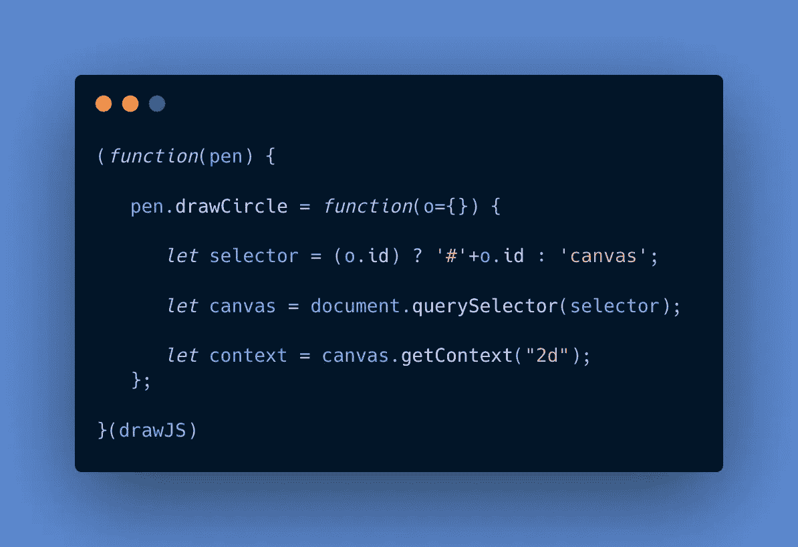
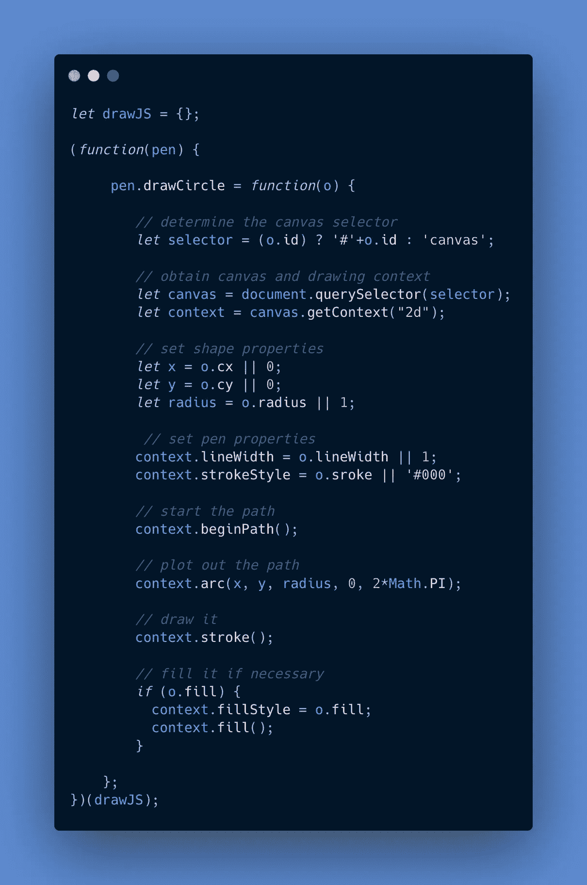
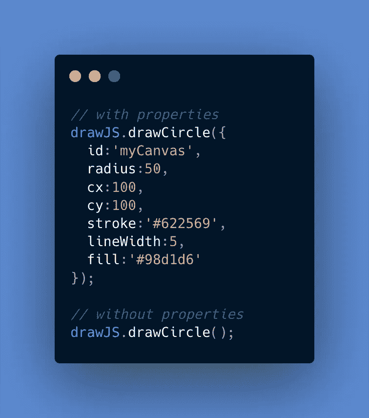
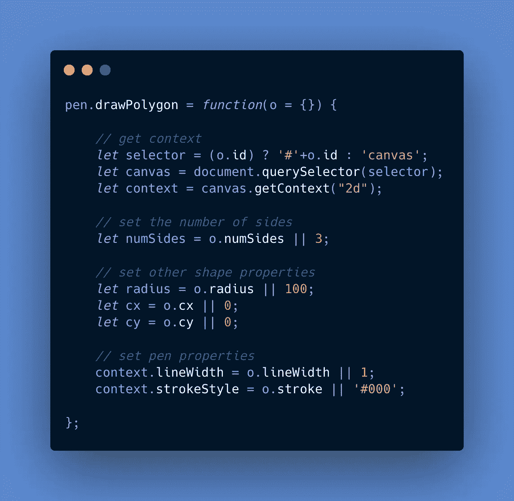
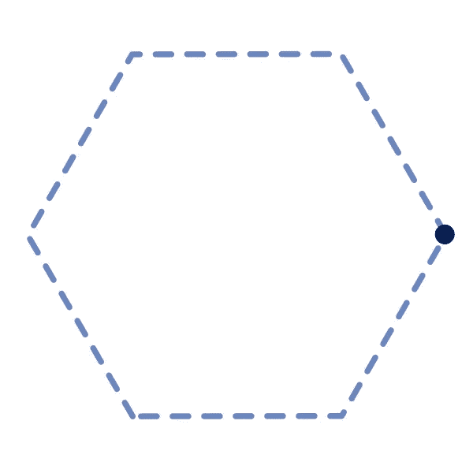
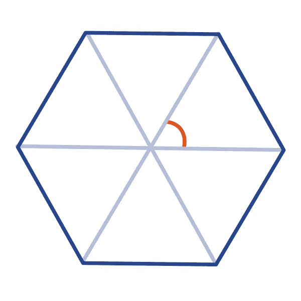
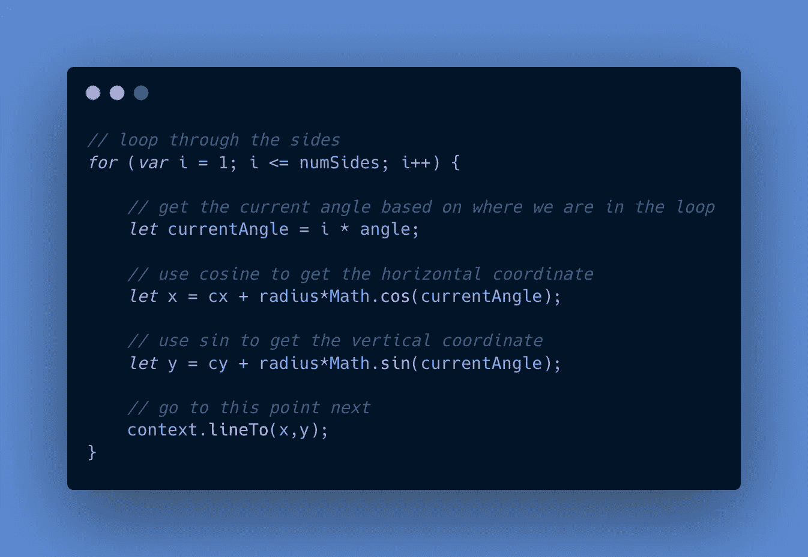
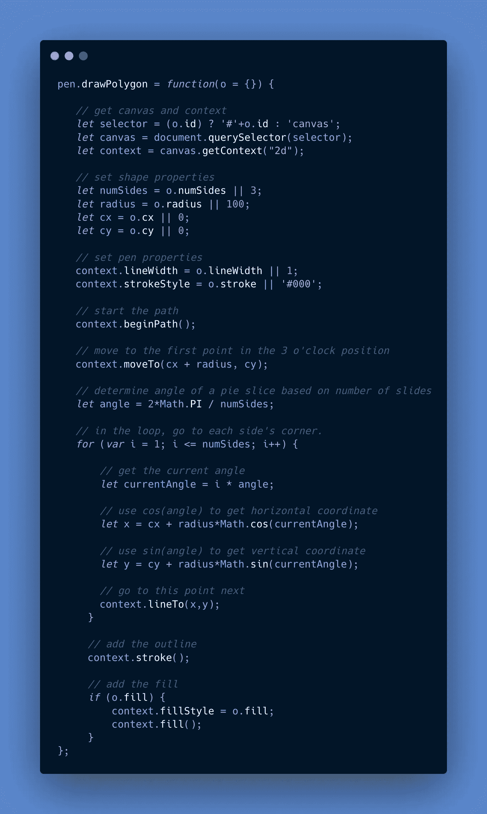
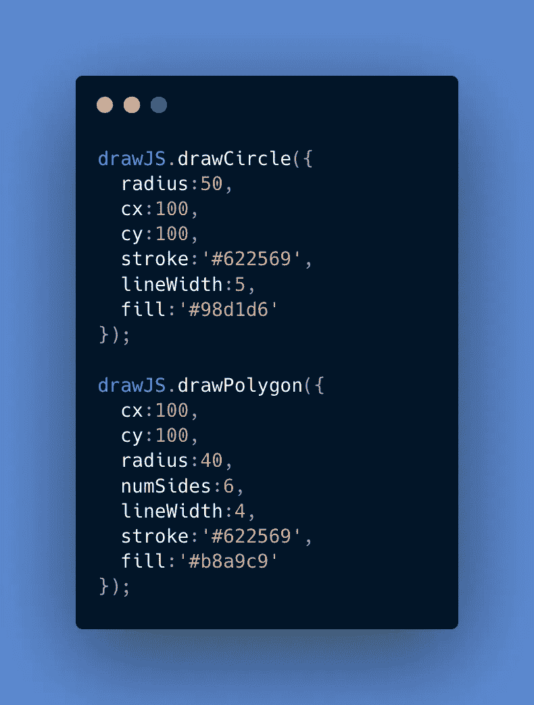
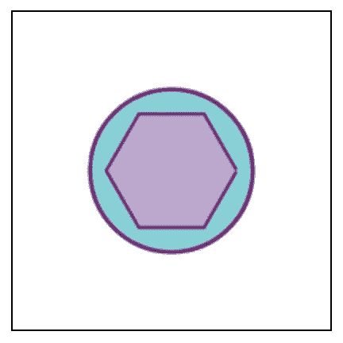

# 用普通的 JavaScript 创建你自己的 HTML5 画布工具包

> 原文：<https://betterprogramming.pub/create-your-own-html5-canvas-toolkit-with-vanilla-javascript-1d2ad1047219>

## 帮助创作者画出令人惊叹的形状的工具包


图片来自 [Pixabay](https://pixabay.com/?utm_source=link-attribution&utm_medium=referral&utm_campaign=image&utm_content=1683134) 的[尤拉杰·沃尔高](https://pixabay.com/users/coyot-2009089/?utm_source=link-attribution&utm_medium=referral&utm_campaign=image&utm_content=1683134)

艺术和技术是一个硬币的两面。在 web 开发中，HTML5 `<canvas>`元素体现了这种双重性——这是一个强大的工具，为高性能 web 交互、游戏、复杂动画和数据可视化打开了大门。也就是说，使用 canvas 的入门感觉很陡，因为即使创建简单的形状也需要很多行代码。

虽然 HTML5 canvas 库和框架可以使使用 canvas 更加简单，但如果您发现自己希望使用 canvas 而不必依赖第三方工具，也可以为自己的项目创建自定义工具包。

本教程将向你展示如何创建一个在 HTML5 画布上绘制形状的工具包。我们将创建两个方法——一个用于画圆，一个用于画正多边形——并将它们封装在一个函数包装器中，该包装器可以在整个应用程序中引用。

# 设置工作区

对于 HTML，让我们有一个包含一个`canvas`元素的`div`。

```
<div id="root">
  <canvas id="myCanvas" width="200" height="200">
  </canvas>
</div>
```

让我们添加一些 CSS 来突出这个元素的中心和轮廓。

```
body {
  text-align: center;
}
canvas {
  border: 1px solid #000;
}
```

# 介绍绘图环境

首先，让我们看看在没有现成方法的情况下，如何使用 canvas 绘制一个圆。

```
var canvas = document.getElementById("myCanvas");
var ctx = canvas.getContext("2d");
ctx.beginPath();
ctx.arc(100, 100, 50, 0, 2 * Math.PI);
ctx.stroke();
```

我们来分析一下。

*   我们首先使用其 ID 获得对`<canvas>`元素的引用。
*   调用`getContext("2d")`为这个`<canvas>`元素提供了一个渲染上下文，所有的绘图命令都通过它传递。
*   调用`beginPath()`开始一个新的绘图路径。
*   `arc`功能用于绘制一个在起点结束的圆弧，形成一个圆。
*   调用`stroke`绘制圆形路径。

这里对`arc`函数的调用有五个参数。

*   前两个是 *x* 和 *y* 坐标，都是`100`。
*   第三个是半径，也就是`50`。
*   然后我们就有了`0`的起始角度。
*   最终角度为`Math.PI*2`弧度，转换为 360 度。

这需要很多行代码，可能很难读懂，所以让我们创建一个方法，使绘制这个圆更加有效和直观。

# 我们的工具包应该如何工作

让我们看看应该如何使用我们将要编写的实用方法。为了尽量减少全局名称空间中的东西，让我们将这些方法附加到一个名为`drawJS`的对象上。

这就是`drawCircle`方法的工作方式。我们将调用该方法，传入一个具有以下属性的对象文字，并让它在`<canvas>`元素上画一个圆。

```
drawJS.drawCircle({
  id:'myCanvas',
  radius:50,
  cx:100,
  cy:100,
  stroke:'#622569',
  strokeWidth:5,
  fill:'#98d1d6'
});
```

一旦我们编写了方法，上面对`drawCircle`的调用应该会在画布上绘制这个图像。


用我们的画布方法画的圆。

我也希望不传递任何参数，仍然让它工作。在这种情况下，它会在 DOM 中找到第一个 canvas 元素并绘制到它。

```
drawJS.drawCircle();
```

# 创建主对象

我们将从一个空的`drawJS`对象开始。

```
let drawJS = {};
```

## 包装纸

现在让我们创建一个立即调用的函数表达式(IIFE ),作为我们逻辑的包装器。IIFE 包装器会将`drawJS`作为一个参数，在内部将其称为`pen`，并为其注入方法。在包装器中，这个参数被称为`pen`。

```
(function(pen) {// methods will go here}(drawJS)
```

## 随便你怎么称呼它

请注意，除了`drawJS`之外，您可以使用任何其他名称，只要您在整个代码中保持一致。包装器中不使用对象的特定名称，这使得它很灵活。

里面的函数会自动执行，而不需要被调用。

# 画一个圆

在这个包装器中，让我们给我们的`pen`对象一个`drawCircle`方法。

```
(function(pen) { pen.drawCircle = function(o={}) { // logic goes here. };}(drawJS)
```

这个方法有一个名为`o`的参数。`o`的属性将作为画圆的指令。因为我想让它在没有对象传入的情况下工作，所以我默认将`o`参数设置为等于`{}`。

```
pen.drawCircle = function(**o={}**) {
```

## 获取绘图上下文

现在让我们编写获得画布及其绘图上下文的代码。

```
(function(pen) {
    pen.drawCircle = function(o={}) { let selector = '#'+o.id;
       let canvas = document.querySelector(selector);
       let context = canvas.getContext("2d");
    }});
```

让我们分解每一个新行。

*   `selector`命名我们想要的元素。
*   `canvas`成为对该元素的引用。
*   `context`是接受绘图命令的渲染上下文。

## 设置默认画布

为了让它在没有 ID 的情况下工作，让我们使用一个三元运算符来检查`o.id`是否存在。如果没有，我们将选择器设置为`canvas`，这将最终得到 DOM 中的第一个`<canvas>`元素。

```
let selector = (o.id) ? '#'+o.id : 'canvas';
```

这里是目前为止使用默认画布逻辑的`drawCircle`方法。



我们画圈法的开始。

## 使用默认值设置形状属性

接下来，让我们定义形状的中心坐标和半径，如果没有定义值，使用 OR ( `||`)选择器指定默认值。这种方法允许我们选择想要定制的属性。

```
let x = o.cx || 0;
let y = o.cy || 0;
let radius = o.radius || 100;
```

这里，如果`cx`不是一个属性，那么我们默认为`0`的一个*x*-坐标。

## 设置笔触样式、线条宽度和填充

接下来，让我们定义线条宽度和钢笔的笔画颜色。

```
context.lineWidth = o.lineWidth || 1;   

context.strokeStyle = o.stroke || '#000';
```

现在让我们画圆。为了做到这一点，我们开始路径，规划路径，并绘制路径。

```
context.beginPath();context.arc(x, y, radius, 0, 2*Math.PI);

context.stroke();
```

我们还可以添加填充圆的功能。

```
if (o.fill) {
     context.fillStyle = o.fill;
     context.fill();
}
```

以下是迄今为止的方法。

## 整个画圆方法

这是画圆的完整方法。



画圆的方法。

现在我们应该发现，无论有没有对象参数，这都应该可以工作。



使用和不使用属性调用 drawCircle 方法。

在下面的示例中，左上角的圆是在没有 object 参数的情况下创建的，而带有紫色边框的浅绿色圆是使用传入的对象创建的。

# 画一个多边形

您可以使用这种方法为其他形状创建其他方法。让我们为一个正多边形再创建一个，它可以接受我们用于圆形的属性，以及一个用于边数的新属性。

当我们完成时，下面的方法调用应该会画出一个六边形。

```
drawJS.drawPolygon({
  cx:100,
  cy:100,
  radius:40,
 **numSides:6,**
  lineWidth:4,
  stroke:'#622569',
  fill:'#b8a9c9'
});
```

## 获取画布、上下文和属性

我们可以从同样的一般方法开始。注意包含了`numSides`。



我们 drawPolygon 方法的开始。

## 放置笔

像上次一样，让我们开始路径，并使用半径将笔移动到形状的 3 点钟位置。

```
context.beginPath();context.moveTo(cx + radius, cy);
```

您会注意到以下内容:

*   *x* 最终得到*x*-中心点加上半径的值。
*   *y* 最终得到中心点的 *y* 值。

因此，我们从下面这一点开始。



我们的起点。

## 求多边形的圆心角

为了让我们的笔到达六边形的角，我们需要知道它的*中心角，*它是由从中心到任意两个相邻角的线形成的。其中一个圆心角在下面用橙色显示。



圆心角位于每对直线的中心。

在任何多边形中，圆心角的数量等于边的数量，圆心角的总和必须等于 360 度，即 2π弧度。

所以我们的代码可以通过将 2π弧度除以边数来找到圆心角。

```
let angle = 2*Math.PI / numSides;
```

## 穿过侧面

现在我们有了中心角和边数，让我们使用一个`for`-循环来让我们的笔到达多边形的每个角。基本想法是这样的:

*   对于每一面，我们都找到一个新的角度。
*   然后我们使用那个角度的`cos`和`sin`分别得到新的角的`x`和`y`坐标。
*   然后，我们使用`lineTo`将笔移动到这些坐标。

你可以在下面看到它是如何工作的。



我们用来画多边形的循环。

## 整个 drawPolygon 方法

下面是整个`drawPolygon`方法。在我们刚刚编写的循环下面，我们还有在 circle 方法中使用的笔画和填充逻辑。



现在，我们可以使用下面的方法，用我们的新兴工具包画一个圆和一个多边形。



运行上面的代码应该会产生以下形状。



下面是一支笔，你可以用它来检查你的工作。

drawCircle 和 drawPolygon 方法

# 最后的想法

虽然使用 Canvas API 涉及很多细节，但是将代码封装在可重用的方法中可以使您编写的代码更加高效和直观。除了绘制形状，我们还可以添加放置图像、绘制复杂图案、使用多个画布元素以及创建可以响应用户输入的动画的方法。

感谢阅读！