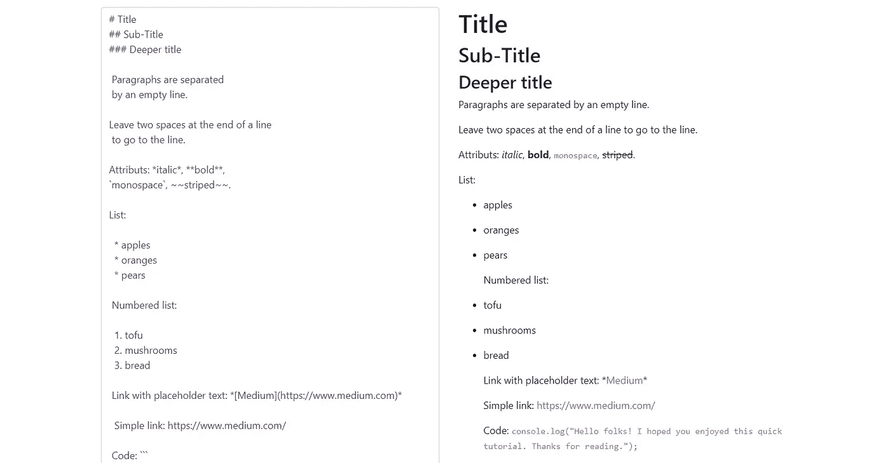
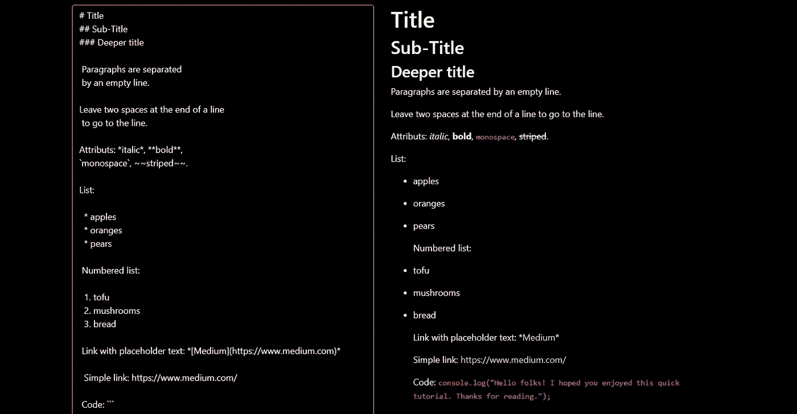

# 使用 React 创建您自己的降价编辑器

> 原文：<https://betterprogramming.pub/create-your-own-markdown-editor-with-react-6906ea2b6c2>

## 一个很酷的初学者项目，帮助我更好地反应


本·罗宾斯在 [Unsplash](https://unsplash.com/s/photos/arrow?utm_source=unsplash&utm_medium=referral&utm_content=creditCopyText) 拍摄的照片。

当我开始学习 React(一个用于 web 应用程序的 JavaScript 框架)时，创建一个 Markdown 编辑器是我做的第一批项目之一。它帮助我处理和理解 React 的一些功能，比如 DOM 处理、DOM 和我们的组件之间的通信、使用状态等。

这是一个有趣且容易制作的项目。我喜欢它，因为你可以把它变成你自己的——而且它也很有用。我并不特别喜欢目前可用的任何降价编辑器。Webstorm 有一个不错的，但是这个编辑器不是免费的，除非你是学生。

本文中讨论的编辑器将在本地运行，并在您键入时实时更新。如果编辑器中没有任何内容，占位符文本将返回。

如果您想知道，这是我们编辑器的最终输出:



作者截图。该应用程序正在本地运行。

让我们深入研究一下。

# 创建应用程序的基础

对于这个项目，您需要安装 [Node.js](https://nodejs.org/en/) 。然后，您只需运行以下命令。他们会让你的应用程序运行。目前，它看起来只是一个基本的 React 应用程序:

```
npx create-react-app my-markdown-editor
cd my-markdown-editor
npm start
```

然后你会想安装 [Bootstrap](https://getbootstrap.com) 来让你的应用更好看，更容易设计。此外，我们将使用一个将 Markdown 转换成 HTML 的库([标记为](https://getbootstrap.com))，这对我们非常有用:

```
npm install marked bootstrap
```

在您的`App.js`文件中，不要忘记在所有现有导入之后的页面顶部添加以下内容:

```
import marked from ‘marked’
```

# 设定基础:分解我们拥有的和我们需要做的

## 渲染和 CSS

所以现在我们的节点模块包含了一些很好的引导 CSS，这将帮助我们很好地渲染我们的应用程序。我们可以删除生成的所有 React CSS，因为 Bootstrap 提供了我们需要的所有内容。Bootstrap 自动创建一个包含 12 列的网格。

## **引导类**

基本的有`container`、`row`和`column`，它们分别把一个`div`变成一个容器、行或列。然后，您可以选择容器中列的大小。例如，`col-sm-6`使屏幕适合只有六列的小屏幕(平板电脑)。以下是一些例子:

```
className=’container’
className=’row’
className=’form-control’
```

表单控件将允许我们从容器中获取数据并在以后使用。

目前，我们不想要任何花哨的东西。只有两列——一列用于输入文本，另一列用于显示降价:

现在，我们想做的就是将容器向下移动一点，使它更适合屏幕，并且在视觉上更令人愉悦:

# 我们的第一次降价翻译

为了查看我们的 MD 编辑器是否工作，我们需要一些文本来预先试用。

我决定将示例文本移动到一个单独的`.js`文件中，这样它就不会过载我们的主页:

正如你所看到的，这是一个用 MD 编写的简单文本行。当这个文本被转换成 HTML 时，魔法就会降临。现在，我们只想在我们的`App.js`文件中获取这个字符串。我们只需要字符串，而不是整个文件。这就是为什么我们对析构导入使用括号:

```
import { sampleText } from ‘./sampleText’
```

最后，我们在`App.js`文件中有了所有的导入:

# 控制要呈现的文本

越来越有趣了。当然，我们希望显示“翻译的”样本文本，但也希望显示我们在专用区域中编写的任何类型的文本。我们通过将我们在文本区域中写的内容与应用程序的*状态*相链接来做到这一点。当我们改变文本时，我们同时改变了状态，那就是将被翻译成 MD 的状态。

# 最后，把你的文本翻译成 Markdown

我们通过使用标记为的*来实现这一点。它是我们在节点模块中提供的降价翻译工具。因此，我们需要一个函数来接收我们的输入文本，并将其呈现为“markdown HTML” *marked* 把要翻译的文本和一个带有我们想要的选项的对象作为参数。*

这里，我们不希望用户直接在编辑器中键入 HTML:

```
*<h1>Hello World!</h1>*
```

它将被完全相同地呈现:

```
<h1>Hello World!</h1>
```

我们编辑的工作是将我们的文本转换成 MD HTML——这就是`{ sanitize: true }`的目的。

我们在类中添加的另一个函数。

`renderText`函数给出了我们所写的 MD 文本对应的 HTML。现在是时候把它放到我们的 HTML 模板中了。

为此，我们使用了`dangerouslySetInnerHTML` DOM 属性。它是 React 特有的，就像`innerHTML`一样工作，但是它也让 React 知道 DOM 节点已经被修改。

*注:如果你想了解更多关于* `*dangerouslySetInner*` *HTML 的内容，可以查看* [*这篇文章*](https://medium.com/better-programming/what-is-dangerouslysetinnerhtml-6d6a98cbc187) *。*

现在我们的渲染模板看起来像这样:

# 用心使用 React 生命周期

我们希望保存我们所写的内容，以备刷新页面时使用。因此，我们将在本地存储中保存包含原始文本的状态。为此，我们将利用 React 组件的生命周期。组件被安装、更新和卸载。

# ComponentDidUpdate

就在组件更新之前，我们可以对它进行操作。我们可以用`componentDidUpdate()`，其中就是为此而生的。这里，当我们的文本改变时，除了更新我们的状态之外，我们还想改变本地存储。即使我们刷新页面，存储空间也会保留。

这发生在我们的州宣言之后。

# 组件安装

这与安装(创建)组件时的情况相同。这意味着我们可以更好地控制如何装载以及装载哪些数据。我们使用有状态组件上的`componentDidMount()`函数来获取本地存储中的文本。

从技术上讲，它就在 componentDidUpdate()函数之前。

这就是它工作的原因:当我们刷新页面时，我们的组件重新加载，但是它首先检查存储以寻找任何现有的文本。如果没有文本(我们已经写了)，组件将显示示例文本。

# 我们走吧！

所以我们都准备好了。如果您缺少一些代码或信息，请使用应用程序代码查看[我的 GitHub repo](https://github.com/anaisberg/markdown-editor/tree/master/) 。

最后，看起来是这样的:


作者截图。这是该应用程序的示例文本外观。

# 奖励:黑暗模式

你以为我们结束了吗？不完全是！如果你想增加一些乐趣，玩一点 CSS，你可以在编辑器中添加一个*黑暗模式*。

简单的方法是创建一个专用于黑暗模式的新样式表，并在我们的`App.js`文件的开头更改导入:

```
import ‘./DarkApp.css’
```

基本上，我们要做的是自己改变文本和背景的颜色。你喜欢什么颜色就用什么颜色。我喜欢用柔和的调色板:

随意修改更多的类/指针！

现在我们完成了！下面是它的样子(我就是这样一个粉丝):



作者截图。这是启用黑暗模式时应用程序的外观。

# 你自己试试！

轮到你去尝试实现它了。

谢谢你坚持到最后。我希望你喜欢这个初学者教程。如果你试过或者有任何问题，请告诉我。