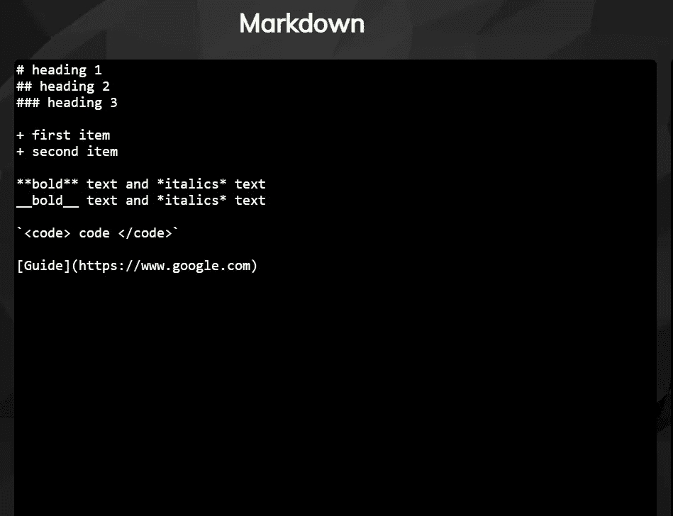
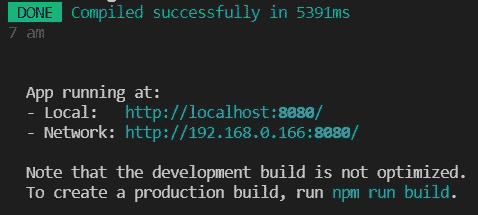

# 创建自己的 Markdown 解析器

> 原文：<https://betterprogramming.pub/create-your-own-markdown-parser-bffb392a06db>

## *你有没有想过把你的项目想法在现实中实现会是什么样子？这是我的样子！*


照片由[凯特琳·贝克](https://unsplash.com/@kaitlynbaker?utm_source=medium&utm_medium=referral)在 [Unsplash](https://unsplash.com?utm_source=medium&utm_medium=referral) 上拍摄

我在 GitHub 上记录我的项目时学会了 Markdown，我意识到它是一种令人惊叹的标记语言。我对如何构建自己的 markdown 解析器感到好奇，于是我开始了这个项目！
[这里的](https://www.markdownguide.org/basic-syntax/)是 markdown 语言的基本语法。

## **什么是解析器？**

解析器是一个编译器或解释器组件，它将数据分解成更小的元素，以便于翻译成另一种语言。

首先，我为什么使用 Vue.js 来构建这个项目？Vue.js 是一个非凡的模板引擎。

## **现在，什么是模板引擎？**

借助模板引擎，您可以在应用程序中使用静态模板文件。模板引擎在运行时用实际值替换模板文件中的变量。它使用双花括号{{ }}将数据绑定到您的模板，并将其转换为提供给客户端的 HTML 文件。

## **申请预览**



# **基本文件结构**

你可以根据这个[文档](https://docs.microsoft.com/en-us/visualstudio/javascript/quickstart-vuejs-with-nodejs?view=vs-2019)轻松设置一个基本项目！

```
markdown
├── src                  
|    └── assets
|        └── style.css
|    └── components
|    |  └── HelloWorld.vue
|    └── directives
|    |  └── markdown.js
|    └── App.vue
|    └── main.js
├── node_modules
├── public
├── .gitignore
├── package.json
├── package-lock.json
├── babel.config.js
└── README.md
```

# 这个项目包含哪些基本的降价规则？

```
|-------------------------------------|---------------------------|
| ** Markdown    **                       |**HTML **                      |
|-------------------------------------|---------------------------|
|# Heading level 1                    |<h1>Heading level 1</h1>   |
|## Heading level 2                   |<h2>Heading level 2</h2>   |
|### Heading level 3                  |<h3>Heading level 3</h3>   |
|#### Heading level 4                 |<h4>Heading level 4</h4>   |
|##### Heading level 5                |<h5>Heading level 5</h5>   |
|###### Heading level 6               |<h6>Heading level 6</h6>   |
|__bold text__                        |<strong>bold text</strong> |
|**bold text**                        |<strong>bold text</strong> |
|*_italic text_*                        |<em>italic text</em>       |
|**italic text**                        |<em>italic text</em>       |
|`word`                               |<code>word</code>          |
|Unorderered list with "+", "*"       |                           |
| + First item                        | • First item              |
| + Second item                       | • Second item             |                    
|Link [Guide](https://www.google.com) | [Guide](https://www.google.com))                     |
|-----------------------------------------------------------------|
```

# **项目设置**

我们的第一步是在`App.Vue`中创建一个模板。
`Vue v-model`是一个指令，提供输入和表单数据之间或者两个组件之间的双向数据绑定。

因此，在这里，v-model 绑定我们的输入数据，在 directives.js.的帮助下解析它。在这里，它使用我们的密钥将数据`{{markdown}}`从输入组件绑定到输出组件。你可以将你的 CSS 添加到`<style scoped>`或者一个单独的 CSS 文件中！

这是一个非常基本和最小的`style.css`文件。以下是你如何变得有创意，让你的项目看起来有吸引力！

是时候做出指示了！我强烈推荐使用 [regex101](https://regex101.com/) 用测试字符串测试你的正则表达式。你可以在这里 阅读关于 regex over [*。*](https://www.geeksforgeeks.org/write-regular-expressions/)

最后，我们需要将刚刚用 regex 制定的规则应用于传递的模板。规则解析模板，`innerHTML` 设置网页上元素的 HTML 内容。

最后，不要忘记导入`main.js`中的`directives`和`style.css`，这是应用程序的主要渲染文件。

下面是你的`main.js` 应该是什么样子！

现在，假设您在`MarkdownParser`目录下运行以下命令，或者简单地按照这个[文档](https://github.com/vidhik2002/MarkdownParser/blob/master/README.md)进行操作:

```
> cd markdown
> npm run serve
```

该应用程序将在您的本地主机上运行，您可以按住 Ctrl 键并单击链接，在您的浏览器上打开该应用程序。



维奥拉。您刚刚创建了自己的 Markdown 解析器！

# 未来范围

我计划将来在规则方面做更多的工作，并增加指令的功能。

在构建这个项目的过程中，我学到了很多关于 regex、javascript 和 Vue 的知识。我希望这个博客对你也有帮助！
请按照这些[指南](https://github.com/vidhik2002/MarkdownParser/blob/master/README.md)为这个项目做贡献！！

```
**Want to Connect?**Here’s my [LinkedIn handle](https://www.linkedin.com/in/vidhi-khaitan-393440205/).
```