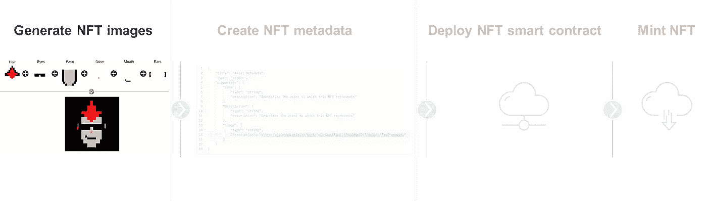
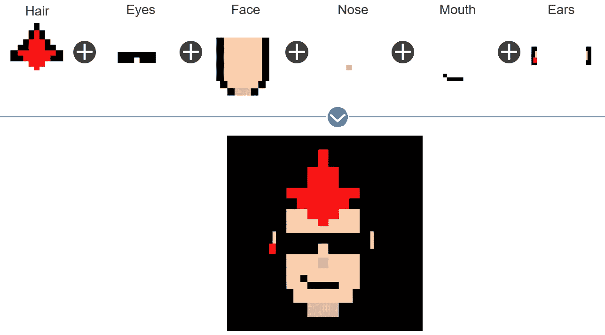
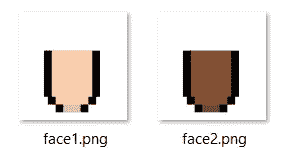
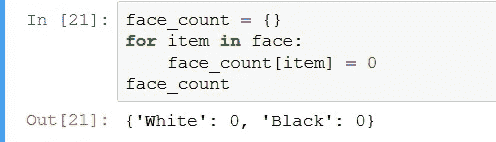
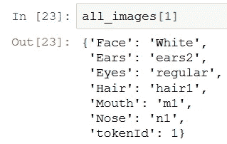
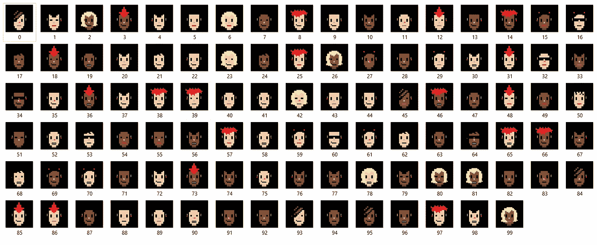
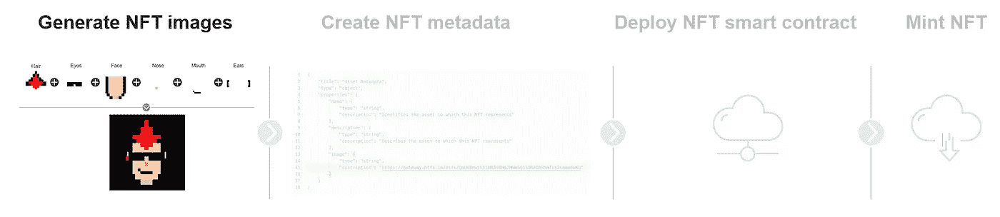
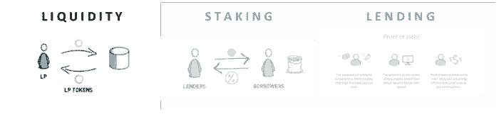

# 使用 Python 创建您自己的 NFT 收藏

> 原文：<https://betterprogramming.pub/create-your-own-nft-collection-with-python-82af40abf99f>

## 成为一名 NFT 程序员

从这个脚本生成的 Substrapunk # 69

> **“Visa 以 15 万美元买下 NFT 的数码头像莫霍克发型”**

随着时间的推移，NFT 空间变得越来越有名。当[彭博的](https://www.bloomberg.com/news/articles/2021-08-23/cryptopunk-nft-prices-visa-buys-digital-avatar-7610-for-150-000-in-eth)报道一个密码朋克以 15 万美元的价格卖给 Visa 时，主流世界被引入 NFT。对大多数人来说，对于一个只存在于数字世界的简单图像来说，这似乎是一笔巨大的金钱。

这是 NFT 创造者系列四部曲的第一部:

1.  [**用 Python**](/create-your-own-nft-collection-with-python-82af40abf99f) 创建自己的 NFT 收藏
2.  [*创建 NFT 元数据*](/generate-your-nft-metadata-11a878c082b9)
3.  [*部署 NFT 智能合约*](/how-to-deploy-nft-smart-contracts-9271ce5e91c0)
4.  [*NFT 明廷*](/mint-your-own-nfts-with-web3-js-f32f7b1cd8cc)

NFT 创造者系列概述

# 方法学

脚本背后的方法非常简单:通过将不同的特征结合在一起，创建一个独特的虚拟形象。

# 获取您的数据

您将使用来自 usetech-llc 的“Substrapunks”库的数据。

通过下面的[链接](https://github.com/usetech-llc/substrapunks/archive/refs/heads/master.zip)下载他们的存储库，并将 zip 文件解压到你的本地电脑上。

# 导入必要的包

您将在这个项目中使用以下包。如果您想了解更多关于所用软件包的信息，请单击链接。

*   [PIL](https://pypi.org/project/Pillow/)
*   [IPython](https://ipython.readthedocs.io/en/stable/)
*   [随机](https://docs.python.org/3/library/random.html)
*   [Json](https://docs.python.org/3/library/json.html)
*   [操作系统](https://docs.python.org/3/library/os.html)

# 分配特征稀有度

每一个独特的化身都有五个特征:

*   脸
*   耳朵
*   头发
*   口
*   鼻子

稀有很重要，因为它创造了稀缺性，而稀缺性反过来又创造了价值。
你将通过为一个特征中的不同类型分配权重来实现特征的稀有性。权重的总和应该总是 100。

有两种类型的脸(黑色&白色)。你给程序指定一个图像有 60%的机会得到一张白色的脸，40%的机会得到一张黑色的脸。

# 将你的特质分类

字典用于将特征名重定向到它们的文件名。您可以在以下位置找到特征文件名:…\ sub punks-master \ scripts \ face _ parts \。

*特征名“白”指向面 1，而“黑”指向面 2。*

# 定义图像特征

你将创建的每一个头像都是由六张图片叠加而成的:脸、鼻子、嘴、耳朵和眼睛。

因此，您编写了一个 for 循环，将这些特征组合成一张指定图片总数的图片。

一个函数为每张图片创建一个字典，指定它拥有哪些特征。

这些特征是基于 [random.choices()](https://docs.python.org/3/library/random.html) 函数给出的。

*该函数遍历面部特征列表(白色、黑色)并返回白色(60%几率)或黑色(40%几率)。*

# 验证唯一性

对于 NFT 化身项目来说，每个化身都是独一无二的，这一点很重要。因此，您需要检查是否所有图像都是唯一的。编写了一个简单的函数，循环遍历所有图像，将它们存储到一个列表中，并返回重复的图像。

接下来，向每个图像添加一个唯一的标识符。

# 性状计数

您根据预定义的权重和随机函数分配特征。这意味着，即使您将白色面孔的权重定义为 60，也不太可能正好有 60 张白色面孔。为了准确地知道每种特征出现的次数，你必须你想要记录下现在你收集的图像中有多少特征。

为此，您需要编写以下代码:

*   为每个特征定义一个具有各自分类的字典，并从 0 开始

*   循环浏览你创建的图片，如果你发现了特征，把它们添加到你各自的特征字典中。

# 生成图像

这是奇迹发生的部分:创建图像！

对于每张图片，脚本将执行以下操作:

*   打开我们定义特征的图像特征文件

*   使用 [PIL](https://pillow.readthedocs.io/en/stable/reference/Image.html) 包在你的目录中选择各自的特征图像。
*   将所有的特征组合成一个图像
*   转换成 RGB，这是最传统的颜色模式
*   将其保存到您的电脑中

生成的头像

编程快乐！

# 路标

1.  [**用 Python 创建自己的 NFT 收藏**](/create-your-own-nft-collection-with-python-82af40abf99f)
2.  [*创建 NFT 元数据*](/generate-your-nft-metadata-11a878c082b9)
3.  [*部署 NFT 智能合约*](/how-to-deploy-nft-smart-contracts-9271ce5e91c0)
4.  [T5【NFT】明廷 ](/mint-your-own-nfts-with-web3-js-f32f7b1cd8cc)

NFT 创造者系列概述

此外，看看我的其他密码系列“用密码赚取被动收入”:

*   [*提供流动性*](https://pythonprogramming.medium.com/how-to-get-56-interest-on-your-crypto-by-providing-liquidity-in-defi-2f62357be406)
*   [*打桩加密*](https://pythonprogramming.medium.com/how-much-i-earned-from-staking-crypto-and-how-you-can-do-it-too-dd6e14f3e21c)
*   *借出你的密码*

# 资源

 [## GitHub-unique network/sub punks:基于底层的加密朋克游戏翻拍

### 这是一个基于加密朋克游戏，启发了 ERC-721 以太坊标准的经典游戏的基板翻拍。10,000…

github.com](https://github.com/UniqueNetwork/substrapunks)  [## GitHub-benyaminahmed/NFT-图像生成器

### 在 GitHub 上创建一个帐户，为 benyaminahmed/NFT-image-generator 的开发做出贡献。

github.com](https://github.com/benyaminahmed/nft-image-generator)