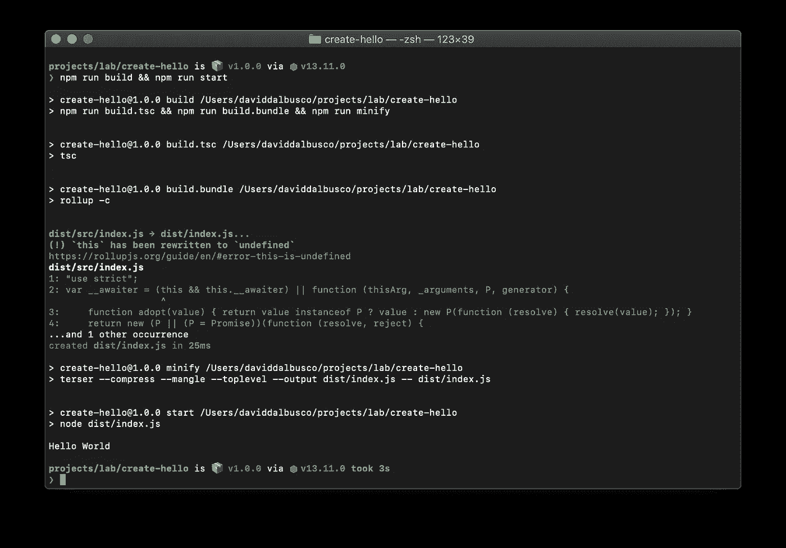
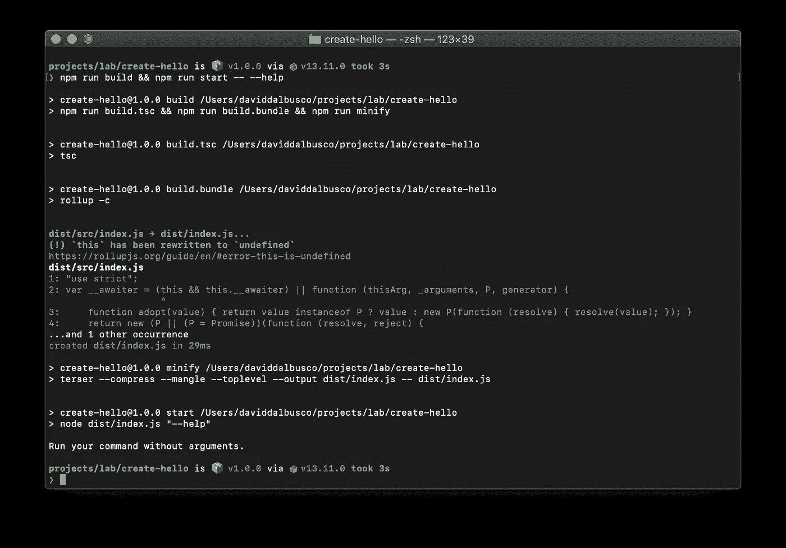
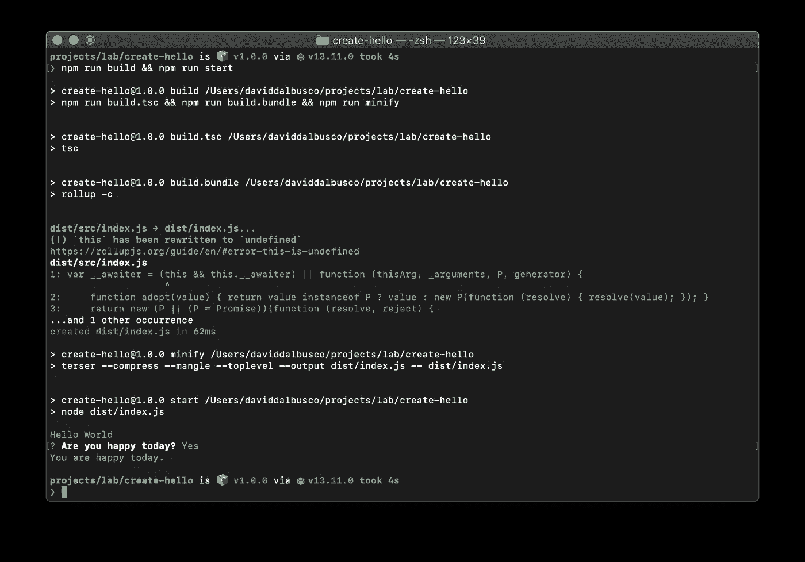

# 如何创建自己的 NPM CLI 界面

> 原文：<https://betterprogramming.pub/create-your-own-npm-cli-fbe9e3d4fce>

## 为你的项目创建你自己的`npm init`命令


米歇尔·费奥拉在 [Unsplash](https://unsplash.com/?utm_source=unsplash&utm_medium=referral&utm_content=creditCopyText) 上拍摄的照片

我每天分享[一招](https://medium.com/@david.dalbusco/one-trick-a-day-d-34-469a0336a07e)直到原定的瑞士新冠肺炎隔离期结束的日期，2020 年 4 月 19 日。离第一个里程碑还有 14 天。希望更好的日子就在前面。

在本文中，我将向您展示如何为您的项目从头开始创建一个 [npm](https://www.npmjs.com) CLI 命令。

注意:这篇文章和我们的命令行界面的灵感来自于神奇的[模板的命令行界面](https://github.com/ionic-team/create-stencil)。

# NPM 初始化

许多 web 项目都提供了 Cli 来简化新项目的创建。使用这些，除了节点和 npm 之外，不需要任何其他预先安装，我们可以在我们的终端中运行命令来开始一个全新的新项目。例如，`npm init stencil`用[模板](https://stenciljs.com)创建一个组件或应用，或者`npm init react-app`启动一个新的 [React](https://reactjs.org) 应用。

这要感谢 npm 和他们的 [Cli 命令](https://docs.npmjs.com/cli/init.html)支持。

为了创建这样一个工具，我们必须创建并发布一个项目 Cli 本身——它包含一个`index.js`并在被调用时执行一个主函数。

但是真正关键的是项目的命名。事实上，它必须以`create-`为前缀，以便稍后通过命令行解决。

例如，我们的项目名称是`DeckDeckGo`，因此相关的 Cli 项目名称是`create-deckdeckgo`。这样，每当有人在他/她的终端中运行`npm init deckdeckgo`时，npm 就会执行一次相关`create-`项目的查找。如果找到了，它就在本地下载并运行主函数。

# 创建新的 Cli 项目

让我们试着创建我们自己的名为“Hello”的 Cli

如上所述，项目的 Cli 名称必须加上前缀`create-`——这就是我们创建新文件夹`create-hello`的原因:

```
mkdir create-hello && cd create-hello
```

然后我们定义一个`package.json`，它除了定义`bin`的入口点`index.js`之外，还设置脚本和依赖项，以便能够使用 [Rollup](https://rollupjs.org) 和 [TypeScript](https://www.typescriptlang.org) 开发和构建我们的项目:

```
{
  "name": "create-hello",
  "version": "1.0.0",
  "main": "dist/index.js",
  "scripts": {
    "start": "node dist/index.js",
    "build.tsc": "tsc",
    "build.bundle": "rollup -c",
    "minify": "terser --compress --mangle --toplevel --output dist/index.js -- dist/index.js",
    "build": "npm run build.tsc && npm run build.bundle && npm run minify",
    "build.dev": "npm run build.tsc && npm run build.bundle",
    "dev": "npm run build.dev && npm start",
    "version": "npm build"
  },
  "files": [
    "dist/index.js"
  ],
  "bin": {
    "create-hello": "dist/index.js"
  },
  "devDependencies": {
    "rollup": "^2.3.3",
    "rollup-plugin-commonjs": "^10.1.0",
    "rollup-plugin-json": "^4.0.0",
    "rollup-plugin-node-resolve": "^5.2.0",
    "terser": "^4.6.10",
    "tslint": "^6.1.1",
    "tslint-ionic-rules": "0.0.21",
    "typescript": "^3.8.3"
  },
  "dependencies": {}
}
```

使用 TypeScript 意味着定义一个`tsconfig.json`:

```
{
  "compilerOptions": {
    "moduleResolution": "node",
    "target": "es2015",
    "allowJs": true,
    "module": "es2015",
    "lib": ["es2015"],
    "strict": true,
    "noEmitOnError": false,
    "sourceMap": false,
    "declaration": false,
    "allowSyntheticDefaultImports": true,
    "experimentalDecorators": true,
    "emitDecoratorMetadata": true,
    "outDir": "dist/src",
    "strictNullChecks": false
  },
  "files": [
    "src/index.ts"
  ]
}
```

和一些棉绒规则:

```
{
  "extends": "tslint-ionic-rules",
  "rules": {
    "no-conditional-assignment": false,
    "no-non-null-assertion": false,
    "no-unnecessary-type-assertion": false,
    "prefer-for-of": false,
    "no-import-side-effect": false,
    "ordered-imports": [true, {
      "named-imports-order": "lowercase-last"
    }]
  }
}
```

最后，我们还需要设置我们的汇总构建，特别是为了能够运行与文件系统交互的命令。这不是本文的目标，但如果我们想要创建一个真正的 Cli 来创建新的本地项目，这可能会很有用:

```
import resolve from 'rollup-plugin-node-resolve';
import commonjs from 'rollup-plugin-commonjs';
import json from 'rollup-plugin-json';

export default {
    input: 'dist/src/index.js',
    output: {
        file: 'dist/index.js',
        format: 'cjs',
        strict: false,
        banner: '#! /usr/bin/env node\n',
    },
    plugins: [resolve(), json(),
              commonjs({include: 'node_modules/**'})],
    external: [
        'child_process',
        'fs',
        'path',
        'os',
        'https',
        'readline',
        'zlib',
        'events',
        'stream',
        'util',
        'buffer'
    ]
};
```

# 编写您的 Cli 代码

开发我们 Cli 的一切都已就绪。如上所述，无非是一个主函数的`index`入口。因此，让我们创建一个新文件`src/index.ts`，它只不过打印出“Hello World”:

```
async function run() {
    console.log('Hello World');
}

run();
```

一旦安装了依赖项(`npm install`)，我们应该能够构建并运行项目:

```
npm run build && npm run start
```

如果一切都如预期的那样工作，您应该注意到在您的终端上打印出了“Hello World”。



# 发布您的 Cli

即使它还没有做很多事情，我们实际上已经能够将我们的 Cli 发布到 npm ( `npm publish`)。如果我们这样做了，一旦成功发布，任何地方运行`npm init hello`的任何人都会在他们的终端上打印出“Hello World ”!

# 更进一步

如果您打算真正开发自己的 Cli，这里有几件事情您可能会感兴趣。

## 争论

我们可能想听一些论点。通常，如果用户传递参数`--help`，我们可能希望打印出一些信息。

```
function run() {
    const args = process.argv.slice(2);

    const help = args.indexOf('--help') >= 0 || 
                 args.indexOf('-h') >= 0;

    if (help) {
        console.log('Run your command without arguments.');
        return;
    }

    console.log('Hello World');
}

run();
```

我们可以通过运行命令行`npm run build && npm run start -- --help`来测试以上内容。注意，double `--`是唯一需要的，因为我们正在本地测试我们的包。



# 颜色；色彩；色调

没有色彩的生活是悲伤的。让我们用 [Colorette](https://github.com/jorgebucaran/colorette) ( `npm install colorette --save`)来点亮我们的“你好世界”吧:

```
import {magenta} from 'colorette';

function run() {
    console.log(magenta('Hello World'));
}

run();
```

看看这个漂亮的洋红色，不是更人性化吗？


# 交互式命令行

除了参数，我们可能还想在执行 Cli 时问用户一些问题或给他们一些选项。为此，我喜欢使用[询问者](https://github.com/SBoudrias/Inquirer.js/) ( `npm install inquirer --save`和`npm install @types/inquirer --save-dev`):

```
import {cyan, magenta} from 'colorette';

function run() {
    console.log(magenta('Hello World'));

    const inquirerHappy= require('inquirer');

    const questionHappy = [
        {
            type: 'confirm',
            name: 'happy',
            message: 'Are you happy today?',
            default: true
        }
    ];

    const answer = await inquirerHappy.prompt(questionHappy);

    console.log(cyan(
           `You are${answer.happy ? '' : ' not'} happy today.`));
}

run();
```

显然，如果我运行上面的代码，我会回答“是”！



# 有效地创建项目

如果您希望创建自己的 Cli，那么您的目标很可能是在本地创建新项目。让我告诉你我对这个问题的看法。Cli 可以通过以下步骤解决这一问题:

```
function createProject() {
    downloadFromGitHub();

    installDependencies();

    updateLocalValues();
}
```

首先，它从 GitHub 或另一个 repo 获取一个项目。它可以是`git clone`或`cURL`或任何其他命令。我们的想法是从回购协议中获取源代码，并在本地创建一个副本。

然后，如果项目是 npm 项目，我们可能想要安装依赖项。注意，在这种情况下，跟踪命令并确保在过程结束时执行`cleanUp`是很重要的。

最后，当我们复制或克隆一个项目时，我们可能想要更新一些我们以前问过的变量。通常，在我们的 Cli 中，我们会问“您的演示文稿的名称是什么？”，或者“你叫什么名字？”该信息会被自动替换。

要处理所有这些步骤，请检查或复制我们的 [repo](https://github.com/deckgo/deckdeckgo/tree/master/cli) 。

# 摘要

我发现能够创建一个 Cli 真的很酷，即使你的项目是一个像我们这样的宠物项目。

希望这篇文章能帮助你创建你自己的。如果你必须准备一些幻灯片，尝试 [DeckDeckgo](https://deckdeckgo.com) : `npm init deckdeckgo`。

呆在家里，注意安全！