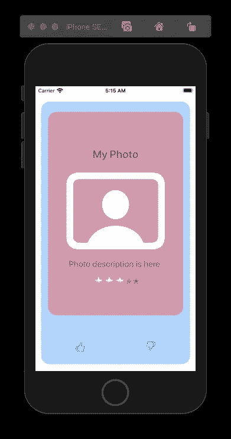
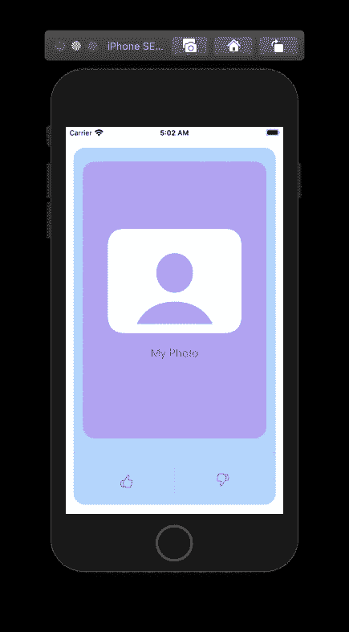

# 在 SwiftUI 中使用@ViewBuilder 创建自己的视图容器

> 原文：<https://betterprogramming.pub/create-your-own-view-container-using-viewbuilder-in-swiftui-316a5aca5fd3>

## 通过构建可重用的容器视图来减少代码

# 视图生成器

`@ViewBuilder`是一个从闭包构建视图的函数构建器。它使您能够将多个视图传递给一个特定的视图。使用`@ViewBuilder`，你可以在整个应用程序中设置你的常量元素和修饰符，然后只添加非常量内容。

在下面的例子中，我们正在创建一个类型为`View`的容器，它接受一些类型为`View`的内容。在 body 变量中，您可以看到我们向 content 变量添加了修饰符。修饰符将应用于您将传递到这个容器视图的所有内容。

在`ContentView`里面，我们可以添加我们的容器。您可以在这个容器中添加您需要的 UI 元素。

现在，您可以将自己制作的容器用于所有具有相似修饰符的内容。

# 例子

在下面的例子中，我创建了一个使用圆角矩形作为内容背景的容器。在内容下面我有两个按钮。看看将要应用于内容变量的修饰符。该内容有一个字体修饰符，大小为 20，前景色为蓝色，四周有填充。

要覆盖修饰符，您需要将修饰符添加到闭包内的内容中，并使用您希望它们具有的值。查看下面的代码片段，它向您展示了如何在我们的`ContentView`中使用`Container`视图。

示例 1:如何使用容器视图

示例 2:如何使用容器视图