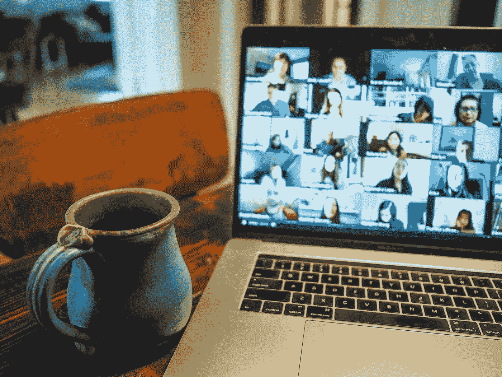
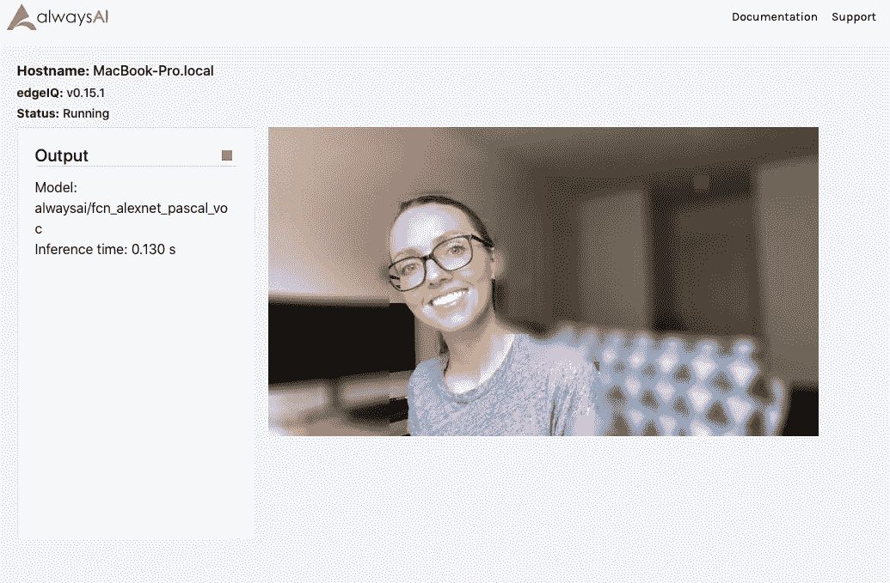
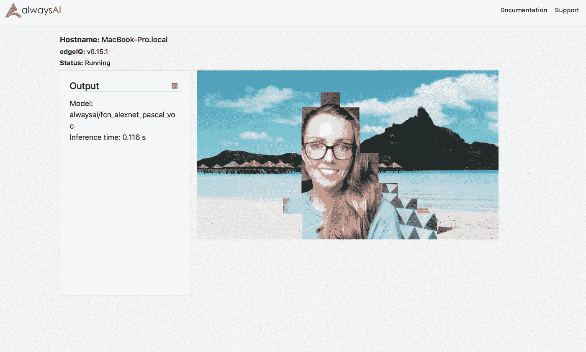

# 创建自己的虚拟绿屏

> 原文：<https://betterprogramming.pub/create-your-own-virtual-green-screen-ced00b66373f>

## 检测屏幕上的人和他们周围的区域，给他们自己的自定义背景



克里斯·蒙哥马利在 [Unsplash](https://unsplash.com/s/photos/zoom-meeting?utm_source=unsplash&utm_medium=referral&utm_content=creditCopyText) 上拍摄的照片。

您是否注意到在每次 Zoom 会议中，您的同事似乎都在不同的位置？很有可能，他们用的是虚拟背景。越来越多的人现在在家工作，在家学习，并使用视频聊天功能与朋友联系，而不是亲自见面。向视频流应用程序添加绿屏功能可以为用户提供更多隐私或有趣的选项，同时仍然可以在在线会议、聚会或游戏之夜直观地呈现。

您可以使用计算机视觉构建自己的虚拟绿屏应用程序！

在本教程中，我们将使用语义分割从背景中分离出一个人，然后模糊背景或用不同的图像替换它。如果你不熟悉语义分割，你可以看看这篇描述这个概念以及其他类型的计算机视觉模型的[概述](https://towardsdatascience.com/introduction-to-computer-vision-model-training-c8d22a9af22b)文章。

本教程使用了两篇其他文章中的代码:第一篇演示了如何使用配置文件[分离代码的配置信息](https://medium.com/@jalakoo_83320/using-a-computer-vision-classifier-to-sort-images-333d5090c0b4)，第二篇演示了如何使用语义分段[从图像中删除不需要的项目](https://learn.alwaysai.co/how-to-detect-pedestrians-and-bicyclists-in-a-cityscape-video?&utm_campaign=Open%20Beta&utm_source=medium&utm_content=green-screen)。

本教程的所有代码以及设置说明都可以在 [GitHub](https://github.com/alwaysai/virtual-green-screen.git) 上找到。按照教程，你可以先创建一个 [alwaysAI 账户](https://alwaysai.co/auth?register=true?&utm_campaign=Open%20Beta&utm_source=medium&utm_content=green-screen)(这是免费的！)并在您的机器上设置 alwaysAI [(也是免费的)。此应用程序是通过修改一个初学者应用程序创建的。您可以通过在命令行上运行“aai get-starter-apps”来获得入门应用程序，方法是在您想要存储示例应用程序的文件夹中。然后 cd 到‘semantic _ segmentation _ VOC’文件夹修改 app 创建虚拟绿屏(或将内容复制到所需区域)。然而，创建虚拟背景的代码可以应用于任何 Python 计算机视觉应用程序！](https://alwaysai.co/docs/getting_started/development_computer_setup.html?&utm_campaign=Open%20Beta&utm_source=medium&utm_content=green-screen)

# **我们开始吧！**

本教程将包含两个部分:

1.  设置配置文件。
2.  使用语义分割处理视频流。

# **设置配置文件**

将您的设置放在一个单独的文件中使您能够轻松地更改它们，而不用担心无意中更改了您现有的代码。教程的这一部分摘自最初的[博文](https://medium.com/@jalakoo_83320/using-a-computer-vision-classifier-to-sort-images-333d5090c0b4)。

*   使用文件浏览器或通过终端创建配置文件。如果您使用的是 Mac，请输入:

```
touch config.json
```

对于 Windows，请输入:

```
type nul > config.json
```

*   然后，将以下内容复制粘贴到您的`config.json`文件中:

```
{
    “model_id” : “alwaysai/fcn_alexnet_pascal_voc”,
    “target_labels” : [“person”],
    “background_images” : “images/”,
    “image” : “beach_pic.jpg”,
    “blur” : true,
    “blur_level” : 35,
    “use_background_image” : false
}
```

在这里，我们指定要使用的分割模型的类型(`alwaysai/fcn_alexnet_pascal_voc`)、我们对分割出的标签感兴趣(该应用程序将只是人)、存储备选背景图像的文件夹、要使用的图像，或者我们是否希望只是模糊背景以及背景模糊的程度。

*注意:* `*blur_level*` *越高，人物周围出现的分割边缘就越清晰。你可以尝试不同的层次，决定是掩饰背景更重要还是避免画面中的硬边更重要。*

*   将下面的`import`语句添加到您的`app.py`文件的顶部:

```
import os
import json
import numpy as np
import cv2 as cv
```

*   在`import`语句下添加以下静态变量:

*   创建一个方法来打开配置文件并将 JSON 数据返回给 main。将以下内容复制到静态变量声明下:

这段代码检查是否有配置文件，如果有，就将 JSON 数据转换成 Python 数据，并将其返回给调用方法。

*   现在，使用我们之前声明的静态变量作为输入，从 main 调用`load_json`方法，并将结果数据存储在一个局部变量中:

```
config = load_json(CONFIG_FILE)
```

*   最后，在 main 中设置局部变量，从配置文件中提取其余的设置:

现在配置都设置好了！

# **使用语义分割处理视频流**

现在，我们将编辑 starter 应用程序，从视频流中分割出一个人，并返回修改后的图像。

*   用以下代码替换`semantic_segmentation = edgeiq.SemanticSegmentation(“alwaysai/fcn_alexnet_pascal_voc”)`:

```
semantic_segmentation = edgeiq.SemanticSegmentation(model_id)
```

这将使用模型的配置变量，而不是硬编码它。即使我们在`config.json`文件中设置的模型是相同的，这也使得我们的代码在交换不同的模型时更加灵活！

*   删除`image_paths`及其下面相应的`print`语句。我们不会传输图像，而是使用视频流，我们将在下一步进行配置。
*   在`image_paths`声明的地方，添加以下代码:

```
fps = edgeiq.FPS()
```

它跟踪视频输入流每秒的帧数。

*   现在将带有`edgeiq.Streamer(…. As streamer: line`的更改为:

这将使用视频流而不是单独的静态图像。

*   因为我们现在正在读取视频帧，并且已经删除了`image`变量，所以将`results = semantic_segmentation.segment_image(image)`改为:

```
results = semantic_segmentation.segment_image(frame)
```

*   从原始的 starter 应用程序中删除以下行:

```
text.append(“Legend:”)
text.append(semantic_segmentation.build_legend())
mask = semantic_segmentation.build_image_mask(results.class_map)
blended = edgeiq.blend_images(image, mask, alpha=0.5)
```

图例在我们的输出屏幕上会很大，因为我们只跟踪人，所以这些标签对我们来说描述性不是很强。对`build_image_mask`和`blend_images`的调用也是不需要的，因为我们不是屏蔽图像，而是从原始帧中剪切出这个人。

现在，我们将构建一个受限的类别映射，该映射仅映射到我们想要识别的对象—即人。如何做到这一点的完整教程可以在这个[博客](https://learn.alwaysai.co/how-to-detect-pedestrians-and-bicyclists-in-a-cityscape-video?&utm_campaign=Open%20Beta&utm_source=medium&utm_content=green-screen)中看到。我们将稍微改变这种方法，只跟踪类别图中与人匹配的部分，然后剪切输入视频帧的相应部分以保持原样，模糊其余部分或用另一幅图像替换它。

首先，我们将构建`filtered`类别地图。将以下代码行添加到程序中:

现在，如果这个变量在配置文件中设置为`true`,我们将模糊图像，或者用新图像替换背景。

*   通过添加以下代码行，用新的背景图像替换背景:

*   要模糊图像，请添加以下代码行:

```
if blur:
    # blur the background:
    background = cv.blur(background, (blur_level, blur_level))
```

*   用原始图像替换新帧中与原始帧中检测到的人相对应的部分:

```
background[detection_map] = frame[detection_map].copy()
```

*   最后，删除这几行代码:

```
streamer.send_data(blended, text)
streamer.wait()
print(“Program Ending”)
```

*   并用以下代码行替换它们:

这会将新的帧发送到流处理器，更新视频输出流，并检查用户是否关闭了程序。每当用户关闭程序或者在我们的`try`块中出现问题时，就会执行`finally`语句。

# **就是这样！**

要查看您的应用程序的运行情况，只需[构建并启动](https://alwaysai.co/blog/building-and-deploying-apps-on-alwaysai?&utm_campaign=Open%20Beta&utm_source=medium&utm_content=green-screen)它，然后打开任何浏览器到 localhost:5000 来查看您的虚拟绿屏的运行情况。

下面，我展示了当`blur`设置为`true`和`use_background_image`设置为`false`时的输出示例:



或者，如果您选择使用背景图像，就像这张在海滩上的图像，您可以期待如下输出:



正如你很可能注意到的，这个模型生成的边相当大，而且是块状的，这是由于在这个应用程序中使用的模型。然而，在随后的教程中，我将讲述如何平滑这些边缘，使其看起来不那么块状！

感谢阅读！