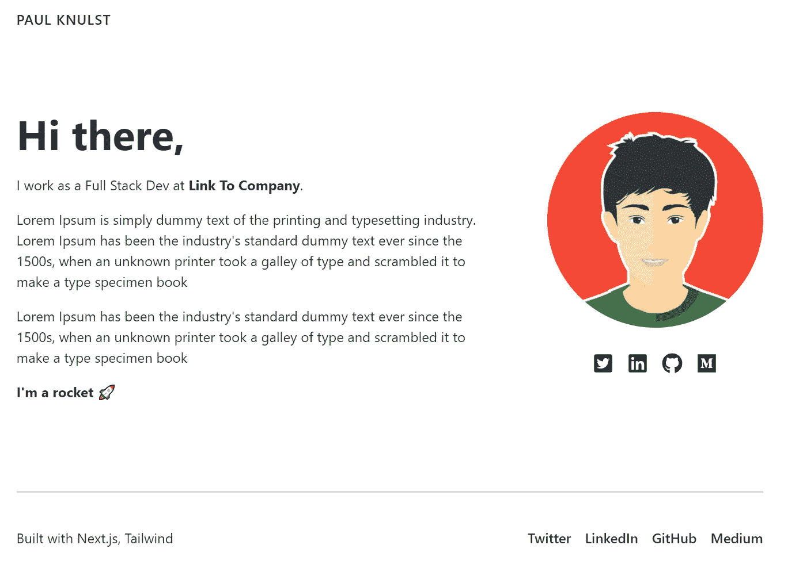
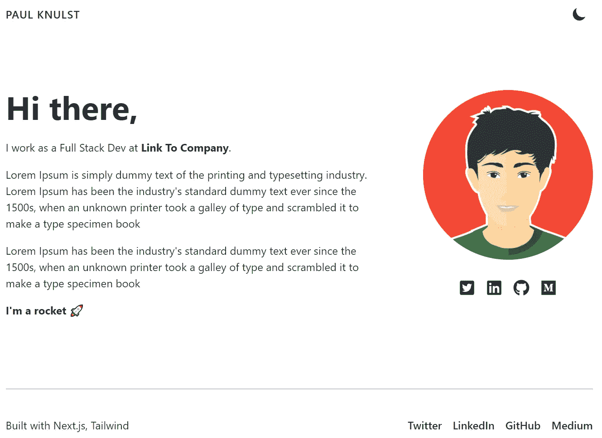
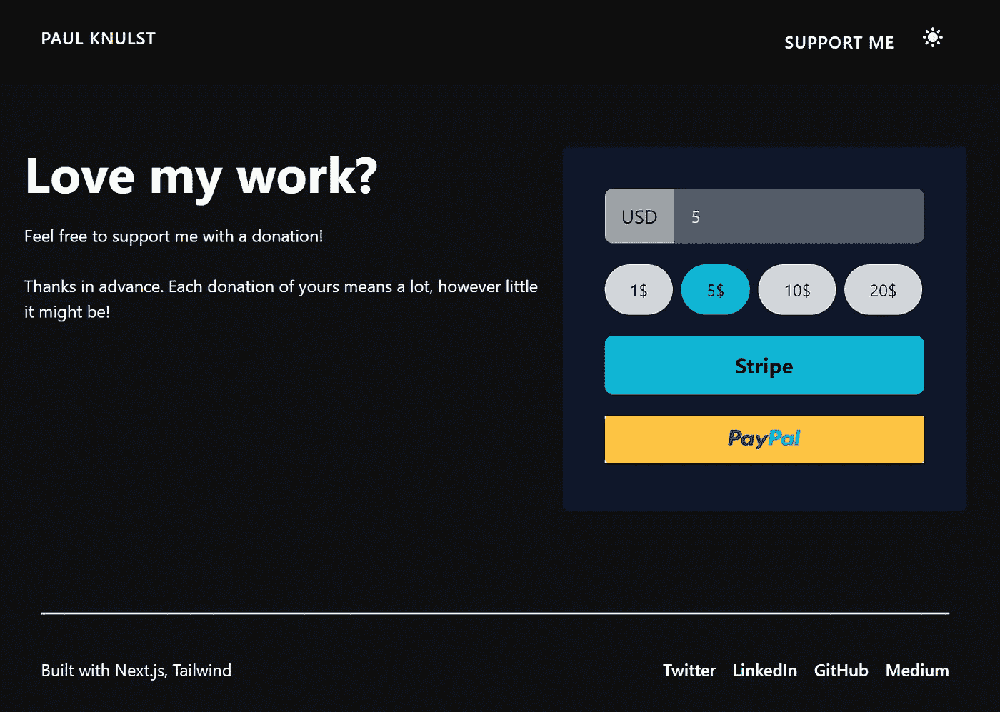

# 使用 Next.js、Tailwind CSS、Stripe 和 PayPal 创建您的投资组合

> 原文：<https://betterprogramming.pub/create-your-portfolio-using-next-js-tailwind-css-stripe-and-paypal-80c723bb3fef>

## 使用 Next.js 和 Tailwind CSS 创建一个投资组合网站，支持黑暗模式，这是一个集成了 PayPal 和 Stripe 的捐赠页面


Clark Tibbs 在 [Unsplash](https://unsplash.com?utm_source=medium&utm_medium=referral) 上拍摄的照片

在本教程中，我将展示如何创建一个作品集网站。我将使用 Next.js 和支持黑暗模式的 Tailwind CSS。此外，我添加了一个简单的“赞助商”/“支持我”页面，这将使任何人都可以使用 Stripe 或 PayPal 向网站作者捐赠一些东西。

**拥有投资组合的好理由:**

*   **展示你的代码:**你可以在这里展示一些你创建的令人敬畏的项目，这些项目应该会给每个访问你的作品集的人留下深刻印象
*   表现自己:通常你的个性不会在你的简历中表现出来，但是你可以通过你的作品集网站来表现出来。
*   改善你的网上足迹:如果你想找工作，你的网上足迹很重要，因为新公司总是会用谷歌搜索你的名字。

**TL；dr:** 转到 GitHub，[克隆这个库](https://github.com/paulknulst/portofolio)，切换到文件夹 v0。添加一个带有缺失环境变量的`.env.local`,并在 Vercel 上部署内容。

# 设置 Next.js 和顺风配置

Next.js 可以用这个命令与预先配置的 Tailwind CSS 一起安装:

之后，切换到您最喜欢的 IDE 并打开项目`your-portfolio`。在项目的根目录下，你应该创建一个`components`文件夹，用于你的 Next.js 应用程序中的每个组件。

此外，您应该将这个文件夹作为`path`添加到`tsconfig.json`中，以便以后更好地导入不同的组件。然后，如果不存在，添加`baseUrl`。

下面的代码片段显示了添加这两个属性后`tsconfig.json`应该是什么样子:

现在，你可以通过编辑`tailwind.config.js`来激活应用程序中的黑暗模式支持。您必须将`darkMode: 'class'`添加到顺风配置中，使其看起来像这样:

这很重要，因为否则，网页可能会使用我的例子中错误的样式。

在继续之前，您应该通过运行项目文件夹中的`npm install`来安装所有的依赖项。

为了观察每个变化，您将在开发时实现，您可以在开发模式下使用`npm run dev`启动项目，这将在 [http://localhost:3000](http://http//localhost:3000?ref=pauls-dev-blog) 上启动您的网页实例。

# 创建导航组件

在项目的 components 文件夹中创建一个名为`**Navigation.tsx**`的新文件。它只包含你的名字作为`/`的链接。

该文件用于您的投资组合的标题部分，将显示在网站的顶部。稍后它将被你的子页面的链接填充，当你想要添加对黑暗模式的支持时，已经有一些黑暗模式特定的 CSS 属性使用了`dark:`。

要查看导航标题，应该将导航组件插入到应用程序中。这是通过编辑`_app.tsx`来完成的，如下所示:

# 创建页脚部分

接下来，您将创建一个页脚，其中包含一些指向您的社交媒体帐户的链接。在 components 文件夹中创建一个名为`Footer.tsx`的新文件，并向其中添加以下代码:

正如你在这里看到的，我添加了 Twitter、LinkedIn、GitHub 和 Medium 作为链接，你应该编辑它们来拥有你自己的社交媒体链接。

之后，您必须将页脚组件添加到`_app.tsx`文件中，以便在您的投资组合页面上启用它:

# 创建主要组件

主要组件将是显示在主页上的组件，并将包含一些关于您的文本。

在这个代码块中，我声明了应该在主页上显示的所有文本。它包含一些用于演示的虚拟文本和一张来自 Pixabay 的图片。另外，我在头像下面添加了社交媒体的链接。

要在您的网站预览中看到这个页面，您应该将主要组件添加到已经在 pages 文件夹中自动创建的`index.tsx`中。

您可以删除文件中的所有内容，并替换为以下内容:

如果你一直遵循每一步，你的网页应该是这样的:



取自作者的已开发网站截图

# 添加黑暗模式切换器

现在，您将添加一个黑暗模式切换器在两个主题之间切换。要启用黑暗模式切换器，您将创建一个`ThemeSwitch`组件，用于在黑暗和光明模式之间切换。

首先，您必须将`next-themes`包添加到 package.json 中，安装方法是:

然后，在 components 文件夹中创建一个新文件`**ThemeSwitch.tsx**`,并用下面的代码填充它:

要在你的网站上使用`ThemeSwitch`组件，你必须把它添加到你的导航组件中，这样它看起来就像下面的文件。

此外，你必须启用你的`_app.tsx`内的主题开关。这是通过从`next-themes`导入`ThemeProvider`并将其添加到`_app.tsx`来完成的:

在`ThemeProvider`中有两个基本属性，用于默认激活黑暗模式(`attribute=class`)和禁用系统偏好(`enableSystem=false`)。

现在你可以使用黑暗模式，你的投资组合将如下所示:



投资组合的轻模式


投资组合的黑暗模式

# 为 SEO 添加元标签

为了优化 SEO 并为每个页面添加不同的 meta 标签，将创建一个新的组件`MetaContainer`，它将是所有组件的父组件，并将提供一种为每个页面添加自定义 Meta 标签的方法。此外，它还包含导航和页脚。

在 components 文件夹中创建一个`MetaContainer.tsx`并添加以下代码:

在这个文件中创建了几个 Meta 标签，设置了一个标题，并添加了 Google robot 信息。

在创建了`MetaContainer`组件之后，您可以将它添加到`_app.tsx`，移除导航和页脚，并将您的页面包装在`MetaContainer`块中:

# 添加捐赠页面

捐赠页面将包含两种不同类型的如何接受捐赠:条纹和贝宝。

**对于 Stripe** ，您必须在这里创建一个账户[，添加一个新账户，并获取您在“Developers”选项卡下找到的 API 密钥。](https://stripe.com)

对于贝宝，你需要一个贝宝账户。然后您可以在这里创建一个新的应用程序[并提取客户端 ID](https://developer.paypal.com/developer/applications/create?env=live)

在使用 Stripe 和 PayPal 之前，您必须在项目中安装所需的软件包:

之后，您可能需要创建一个新的环境文件，因为您不希望在源代码中包含 API 键。创建一个新的`.env.local`文件，并将您的 Stripe 和 PayPal API 密钥添加到其中:

现在创建一个名为`**Sponsor.tsx**`的新组件，并添加以下代码:

要查看您的投资组合中的捐赠页面，您必须在 pages 文件夹中添加一个名为`supportme.tsx` 的新页面，并添加以下代码:

此外，您必须在导航中添加一个到捐赠页面的链接。这是通过编辑`**Navigation.tsx**`组件来完成的，它看起来像下面的代码:

到目前为止，PayPal 集成理论上是可行的，你可以收到付款。要实现条纹支付，您需要在您的投资组合项目中有一个 API 端点。在`/pages/api/`中创建一个新文件`prepare-stripe-payment.ts`，并添加以下代码:

此外，您必须将您的基本 URL 添加到`.env.local`(命名 env `BASE_URL`)。出于测试目的，您可以更改`prepare-stripe-payment.ts`文件并更改 URL:

最后一步是添加一个成功页面，该页面将在收到捐赠后被调用。该文件名为`**payment-successful.tsx**`，应该创建在`/pages/`文件夹中。

作为成功页面的示例，您可以使用我的示例代码:

现在，您可以切换到您的投资组合，您的捐赠页面将如下所示:



# 将您的应用部署到 Vercel

在 Vercel 上，您可以通过赞助商页面按以下步骤部署您的投资组合:

1.  将您的作品集部署到 GitHub
2.  [创建一个 Vercel 账户](https://vercel.com/signup)
3.  连接您的 GitHub 资源库
4.  部署您的仓库
5.  等到项目部署完毕
6.  转到设置中的环境变量，并添加每个变量
7.  重新部署你的应用

现在你的作品集已经准备好了，可以在任何地方分享。

# 结束语

我希望，你可以很容易地遵循指南，本教程可以帮助你创建具有赞助商功能的投资组合网站，就像我在 [www.paulknulst.de](https://www.paulknulst.de/?ref=pauls-dev-blog) 所做的那样。不幸的是，这个投资组合非常简单，我没有优化它。

你可以到 [my GitHub repository](https://github.com/paulknulst/portfolio?ref=pauls-dev-blog) 下载一个包含普通 docker-compose 文件的虚拟文件夹的副本(在文件夹 v0 或我部署的具有附加特性的文件夹 v2 中)。这些文件可用于在单个服务器上或在以 Docker Swarm 模式运行 Docker 的服务器集群中部署 Docker 的投资组合。如果你想了解更多关于用 Docker 部署它的信息，你可以阅读我的“[用 Docker](https://www.paulsblog.dev/deploy-any-ssl-secured-website-with-docker-and-traefik/) 部署任何 SSL 安全的网站”教程和我的“[Docker Swarm in null](https://www.paulsblog.dev/docker-swarm-in-a-nutshell/)”教程，其中详细解释了如何在生产中设置和使用 Docker。

如果你喜欢读这篇文章，考虑在评论区发表你的宝贵意见。我很想听到你对我的教程的反馈。此外，与其他软件开发人员分享这篇文章，帮助他们创建自己的投资组合。

感谢阅读，并**快乐编码**！

```
**Want to Connect?**Say Hello on: [Twitter](https://www.twitter.com/paulknulst), [LinkedIn](https://www.linkedin.com/in/paulknulst/), [GitHub](https://github.com/paulknulst), [Personal Site](https://www.paulsblog.dev)
```

*本文最初发表于我的博客*[*https://www . paulsblog . dev/create-your-portfolio-using-next-js-tailwind-CSS-stripe-and-paypal/*](https://www.paulsblog.dev/create-your-portfolio-using-next-js-tailwind-css-stripe-and-paypal/)