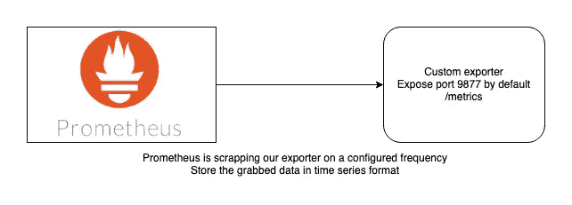
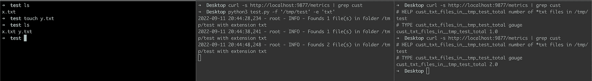

# 创建您的 Python 的自定义普罗米修斯导出器

> 原文：<https://betterprogramming.pub/create-your-pythons-custom-prometheus-exporter-abb156e0d145>

## 构建和设计您的自定义指标导出器


Tobias Tullius 在 [Unsplash](https://unsplash.com?utm_source=medium&utm_medium=referral) 上拍摄的照片

尽管 Prometheus 及其社区可以提供所有的导出器([https://prometheus.io/docs/instrumenting/exporters/](https://prometheus.io/docs/instrumenting/exporters/)),但是在某些特定的用例中，您可能想要设计自己的导出器来运行您的自定义检查。别担心，普罗米修斯会掩护你的！

如果你查看这个 GitHub 库，你会发现一个 Python Prometheus 客户端，你可以利用它来建立你的导出器。

通过本文，我们将构建一个简单的导出器来监控。txt 文件，并通过 classic /metrics 端点返回自定义指标。

在我们讨论代码之前，让我们快速地看一下 Prometheus 是如何工作的，以及如何公开您的度量标准以使它们被该工具废弃。



这里没什么复杂的。我们将公开另一个实例可以访问的端点。

我也强烈建议阅读[这个文档](https://prometheus.io/docs/practices/naming/)，它可以帮助我们为度量标准创建一个合适的命名约定。请注意，这只是一个约定，意味着您可以用您想要的名称创建指标。

说到代码本身，为了保持简单，我将使用很少的模块:

*   日志模块添加一些日志到我们的出口商
*   `argparse`，传递我们的文件夹/扩展名参数
*   `os`、`time` (这两个不需要描述)
*   `prometheus_client`，具体有两种方法:`start_http_server`(启动我们的端点)和`Gauge`。

> 一个*标尺*是一个表示单个数值的度量，可以任意上下移动。

这段代码创建了一个超级简单的类，我们将使用一个字典(`metric_dict`)来存储我们的度量。您可以在 dict 中存储任意多的指标。

我在这里使用字典，因为主程序是一个无限循环。我想保持相同的度量，只使用当前值更新`Gauge`计数器。

该类包含两个参数，要监视的文件夹和要计数的文件扩展名。

> 自定义函数(`*count_file_in_folder*`)负责计算我们的度量值

这个函数非常简单；我们只是在一个文件夹中创建一个匹配文件的列表，并返回它的长度。我们在这里使用列表理解来使它更 pythonic 化一点。

> 出口商指标部分真的很容易通过。

1)如果度量不存在，我们在字典中创建一个新的量规(基本上，循环的第一次运行)

```
def create_gauge_for_metric(self, metric_name):if self.metric_dict.get(metric_name) is None:self.metric_dict[metric_name] = Gauge(metric_name, f"number of *{self.ext} files in {self.folder}")
```

2)我们根据`count_file_in_folder`结果为我们的量表设置一个值。

> 主程序是 web 服务器上的一个无限循环

主函数使用来自 Prometheus 客户端的`start_http_server`方法，该方法以一个端口作为参数来启动。

while True 循环运行我们的两个度量函数(`create_gauge_for_metric`和`set_value`)。对于这个例子，我设置了 10 秒钟的睡眠来更频繁地刷新。该值可以根据您的使用情况进行调整。



正如您在上面的截图中看到的，我们打开了三个不同的终端:

1.在左边，我正在创建一个新文件来增加我们的度量计数器
2。导出器的输出日志在屏幕的中间。请注意，文件的数量从 1 增加到了 2。
3。在右侧，可以通过`port 9877` /metrics 访问指标端点。该值也从 1 增加到 2。

而且，就是这样。正如您已经注意到的，创建一些指标并使用 Prometheus 客户端包公开它们非常容易。

尽管如此，我还是强烈建议您阅读文档，了解可以用来满足您需求的不同度量类型。

在下一篇文章中，我将解释如何让这些导出器运行在 AWS EC2 实例中，并让位于不同帐户的 EKS 集群中运行的 Prometheus 节点自动发现导出器。

剧透，我们会用事件桥和 lambda。

如果您对此解决方案有任何疑问，请告诉我！