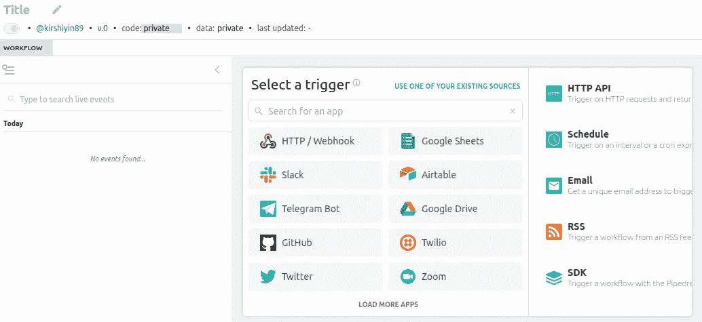
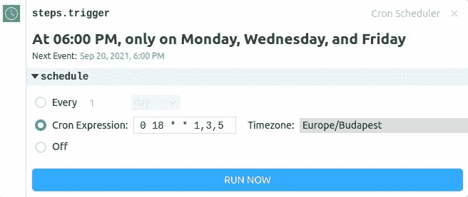
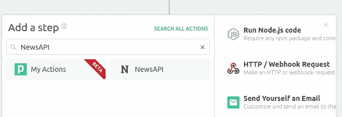
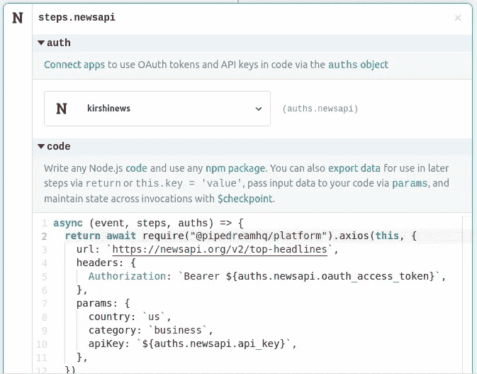
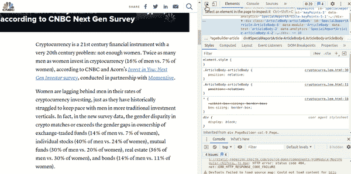
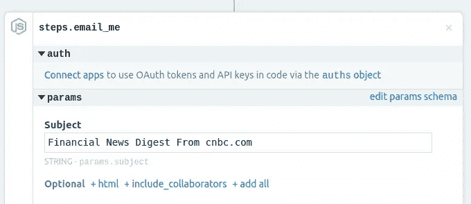
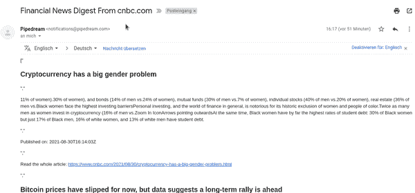

# 使用 Pipedream 创建您独特的时事通讯

> 原文：<https://betterprogramming.pub/create-your-unique-newsletter-with-pipedream-f0bc2de1a067>

## 如何浏览网站并安排一份包含摘要内容的时事通讯

泰勒·尼克斯在 Unsplash[拍摄的照片](https://unsplash.com?utm_source=medium&utm_medium=referral)

在本教程中，我将向你展示如何在 [Pipedream](https://pipedream.com/) 中创建一个管道来撰写并发送一份时事通讯给你自己。

这封邮件有什么独特之处？我们将根据关键字从我们喜欢的网站中提取信息。我们决定我们想要收到多少文章以及多久收到一次。有时，内容可能太长而无法阅读，我们只需要理解要点。为了解决这个问题，我们将用几句话来总结全文。
当您关注特定主题并希望获得快速更新时，例如加密货币、Covid 新闻等，这可能会很有用。

在之前的[帖子](/pipedream-api-integration-made-easy-f098de654cd1?source=your_stories_page-------------------------------------)中，我已经介绍了 Pipedream 的特性。简而言之，它是一个低代码平台，只需点击几下鼠标就可以集成各种 API。

您将在以下步骤中获得经验:

*   Pipedream 支持原生 NodeJS 代码的执行。我们将使用 [cheerio](https://www.npmjs.com/package/cheerio) npm 包从各种文章中收集信息。
*   新闻 API 将帮助我们从新闻来源和博客中找到文章。
*   为了节省阅读长篇文章的时间，我们将使用 [node-summarizer](https://www.npmjs.com/package/@trashhalo/node-summarizer) 库对提取的文本进行总结。
*   Pipedream 有一个内置的日程安排功能，允许我们在指定的时间定期给自己发送电子邮件。

让我们开始吧！

# 准备工作流程

1.  创建一个 Pipedream 账户，并转到**工作流程**选项卡。
2.  点击**新建+** 按钮创建一个新的工作流程，并选择**计划**触发器:

使用计划触发器创建新的工作流

下面是一个在周一、周三和周五欧洲中部时间下午 18:00 发送简讯的示例表达式:

要立即测试工作流程，单击**立即运行**按钮。但是由于我们还没有创建任何步骤，我们稍后将测试它。

# 准备新闻来源

NewsAPI 是一个免费的网络新闻搜索 API。要将它与 Pipedream 集成，必须先注册。

1.  添加一个新步骤来连接 NewsAPI:

添加 NewsAPI 步骤

2.连接您刚刚创建的 NewsAPI 帐户。命名步骤`steps.newsapi`:

NewsAPI 步骤

如您所见，代码是自动生成的。现在，我们只需要调整它来满足我们的需求。检查[文件](https://newsapi.org/docs)中的端点和参数。在这个例子中，我使用带有以下参数的`/everything`端点:

NewsAPI 步骤

*   `qInTitle`只搜索标题中的关键词或短语。话题可以涉及政治、金融新闻、健康等。
*   `domains`包含一个逗号分隔的列表，列出了您想要抓取的网站域名。注意，有些网站会屏蔽抓取。在这个例子中，*cnbc.com*是一个不错的选择，因为它允许你提取信息。
*   我使用`language`参数将结果限制在英文网站。
*   `pageSize`定义了我们想要返回的物品的最大数量。
*   我使用了`sortBy: `relevancy``参数来接收与我的查询更接近的文章。

查看文档以了解更多选项。

# 创建时事通讯

1.  为 NodeJS 代码添加一个新步骤，并将其命名为`step.scrape_summarize`。
2.  插入以下代码:

刮和总结步骤

*   我们使用`[axios](https://www.npmjs.com/package/axios)`库通过浏览器发出一个 HTTP 请求。
*   `cheerio`库将抓取网站的内容。
*   创建文本摘要需要`node-summarizer`库。
*   `fetchHTML()`函数加载页面的 HTML 以便我们可以搜索元素。
*   我们通过调用`steps.newsapi.$return_value.articles`遍历上一步返回的文章。
*   `div.ArticleBody-articleBody`包含我们将用于摘要的文章正文。如何找出这些信息？打开文章的 URL 并启用开发者工具。单击 inspect element 并开始搜索包含文章正文的元素。在本例中，您应该会看到类似这样的内容:

查找文章正文的 div 标签

当然，每个网站都有自己的结构，所以网页抓取是一项非常具有挑战性的任务。我注意到大多数关于 cnbc.com 的文章都使用了这种结构。但是请确保根据您的需要更改该值。

如果您想从更多的页面中提取数据，可以向 NewsAPI 步骤添加一个新的域。然后，您可以添加条件来检查域名，并相应地搜索不同的 HTML 元素。

*   `summary`将包含 8 个句子。随意修改文章长度。
*   `contents`对象包含标题、摘要、URL 和发布日期。我们将很快使用它来撰写电子邮件。

# 创建电子邮件

1.  添加新步骤**给自己发邮件**:

2.粘贴以下代码:

*   我们循环浏览`scrape_summarize`步骤中的每一篇文章，将必要的数据添加到电子邮件中。
*   不幸的是，有些文章可能没有正文，例如，如果 scraper 找不到必要的标签。这就是为什么我们通过勾选`body.length`将他们排除在邮件之外。
*   Pipedream 允许我们对消息使用 HTML 格式，因此我们使用它来使内容更具可读性。

# 测试管道

最后，我们完成了 API 的粘合。正如我前面提到的，您可以通过在`trigger`步骤中按下 **Run Now** 来立即运行代码。

**系统会向您注册时使用的地址发送电子邮件。**

现在导航到您的电子邮件。您应该会看到这样的消息正文:

来自 Pipedream 的电子邮件

太好了！现在，我们已经根据自己的兴趣撰写了一份独特的时事通讯。

# 最后的想法

在本文中，您了解了如何在 Pipedream 中使用 npm 库抓取网页和总结文本。

请记住，对于金融文章，文本摘要结果可能不那么准确。有时候，总结者在解释数字上有问题。目前，Pipedream 支持 NodeJS 本地代码，但 Python 支持正在进行中。以我的经验，它有更强大的文本分析库，所以我很期待。

获得更好汇总结果的另一种方法是用 Python 编写这部分代码。您可以将代码托管在您的服务器或云中。Pipedream 允许您对 URL 执行 HTTP 请求，因此您可以调用您的端点并将文章的正文作为参数传递。

如果你想了解更多关于 Pipedream 的知识，可以看看我的另一篇相关文章:

 [## Pipedream: API 集成变得简单

### 了解如何使用 Pipedream 通过几次点击来连接 API

better 编程. pub](/pipedream-api-integration-made-easy-f098de654cd1) 

感谢您的阅读。还有快乐编码！