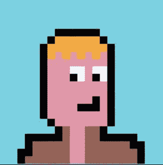

# 用 Python 创建你独特的“像素艺术头像”

> 原文：<https://betterprogramming.pub/create-your-unique-pixel-art-avatar-in-python-c176d9596bda>

## 这是你开始构建数字艺术和酷酷的 Twitter 头像所需要的

丁满·克劳斯在 [Unsplash](https://unsplash.com?utm_source=medium&utm_medium=referral) 上的照片

如果你一直活跃在 Twitter 上，你肯定见过其中一个人的个人资料照片是这样的(那就是我):

最初可能会很奇怪，但现在随着围绕加密货币和 NFT 的大肆宣传，这种“数字艺术”已经开始在网络上外包，甚至在加密社区之外。

我敢肯定，你们中的大多数人至少想象过这样的照片在他们的 Twitter、Instagram 等网站上会是什么样子。也许甚至尝试过创建一个，但放弃了使用 Pixilart(顺便说一下，这是一个很棒的应用程序)这样的工具。

*为什么没有一个脚本可以在给定一些参数(可能还有一些定制)的情况下创建我的像素化头像，而不需要用鼠标画点什么？*

这正是我们将在这篇文章中经历的，这是一个很好的方法来练习你处理图像的技能(即使我们将谈论一些非常入门级的东西)，你也可以创建你的下一个个人资料图片！

没有进一步的介绍，让我们看看我们的脚本将如何工作。

# 构建脚本

该脚本的主要流程是创建一个变量(颜色)列表，并按照像素对它们进行排序，然后将它们转换为一个数组，并从该像素数组构建一个图像(使用 PIL)。

最痛苦的部分可能是像素的排序，但是我为您提供了一个预样本和一些技巧来使这个过程更加顺利。

我们将从导入所需的模块和创建我们的 RGB 颜色开始，如下所示:

你可能想知道为什么我为我们的变量使用可怕的名字，事实是，当创建像素列表时，最好让变量具有相同的名称长度，因为这样看起来更紧凑，并且更容易创建和更新列表。如果你还不清楚，不要担心，它会在下一段。

现在，我们需要建立我们的列表。这并不困难，但手动完成可能需要一些时间，你最好的办法是参考我在这里做的:

一旦你在编辑器中得到这个，你就可以很容易的修改头发的形状，眼睛看的地方，等等。

列表中的每个变量代表一种颜色，你可以按照你希望的最终图像中的像素顺序来排列它们。如果你要修改像素列表，记住高度和宽度应该总是相等是非常重要的，如果你期待的是一个正方形的图像，因为如果宽度和高度不同，最后的调整大小过程可能会缩小你的图像。

最后，我们将列表转换成一个数组(注意，我们使用`uint`作为[数据类型](https://numpy.org/doc/stable/user/basics.types.html)，并用它来构建使用 PIL 的`.png`图像(重采样设置为最近，我们不希望头像看起来模糊)。代码如下:

好了，现在你可以打开你的终端(如果你的依赖项中还没有安装 PIL:`pip install Pillow`，安装它)，运行脚本，在同一个目录中你会看到你的像素化头像存储在`avatar.png`图像中。

下面是完整的代码:

# 结论

我希望你在愉快地绘制你的数字像素化头像的同时，学到了一些新的东西或者刷新了你的记忆。数字艺术是程序设计中一个非常有趣的分支；你甚至可以更进一步，开始在网上市场销售 NFT，谁知道呢。

从这篇文章开始，您可以更进一步，开始实现更多的中间概念，比如随机化自动字符生成，等等。

你也可以给头像添加更多的东西，例如，一顶帽子或者一个钱包。到目前为止，您应该已经熟悉如何做到这一点。如果没有，我给你一个提示:创建新的变量，并将其插入像素列表)

一如既往的感谢阅读！

在 [Twitter](https://twitter.com/heytdep) 上和我聊天。