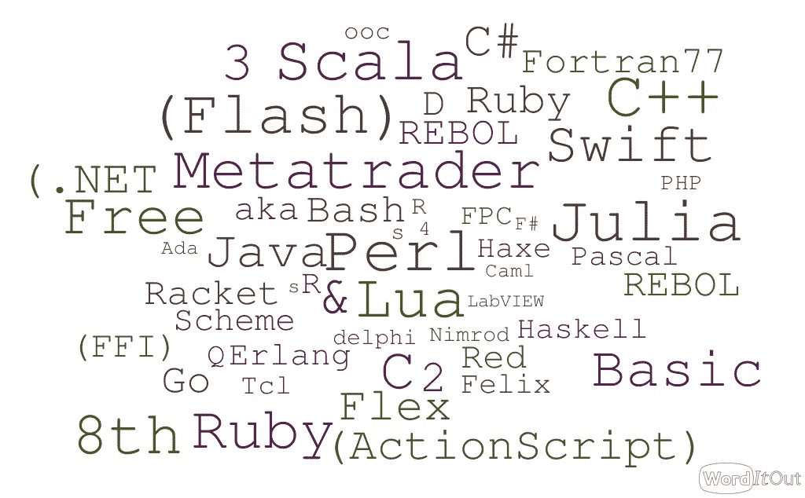
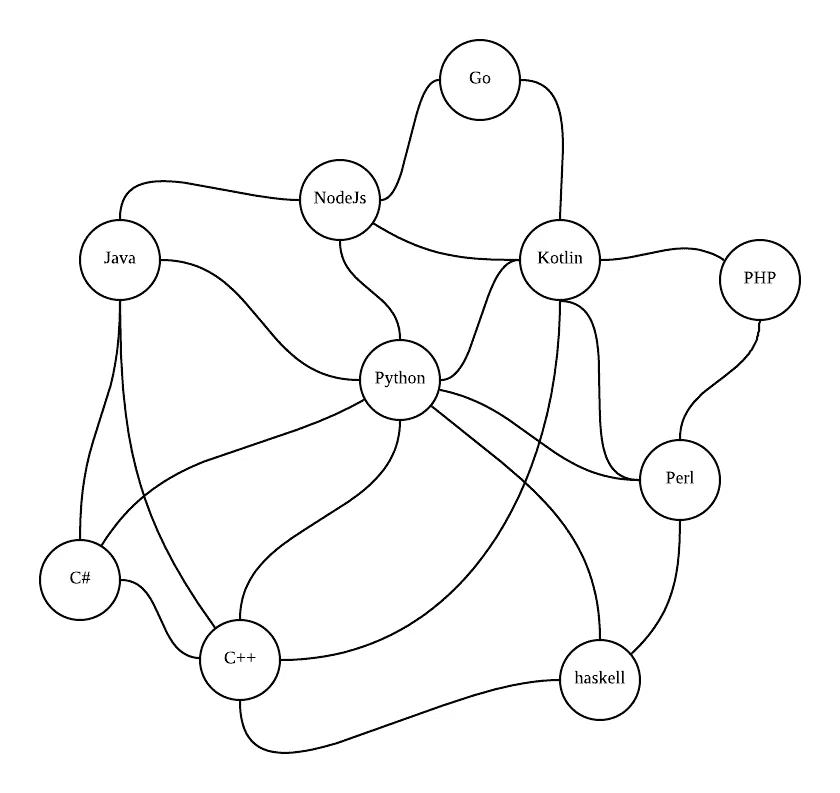
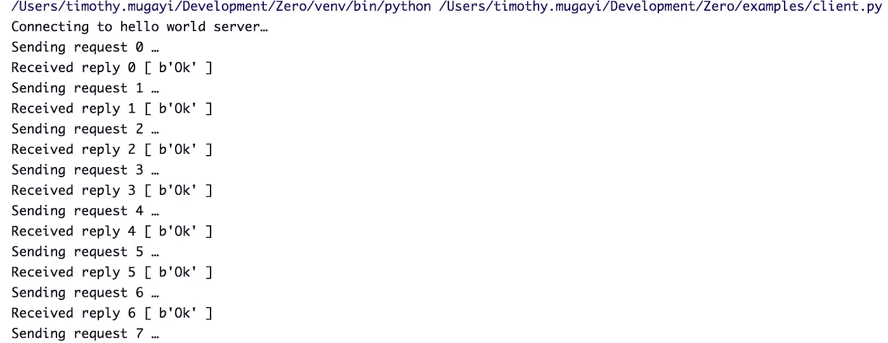
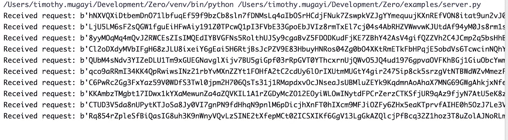
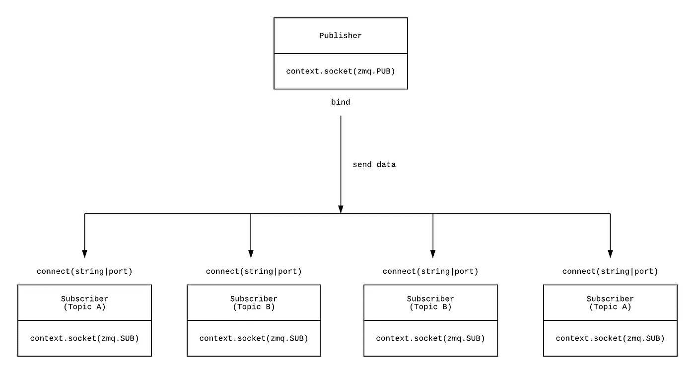
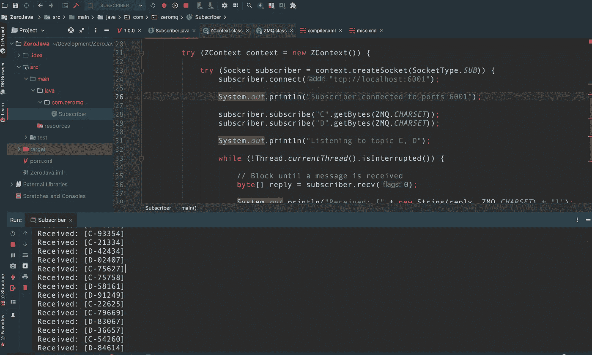

# 使用 Python 和 ZeroMQ 创建零点故障分布式任务

> 原文：<https://betterprogramming.pub/create-zero-point-failure-distributed-tasks-with-python-and-zeromq-e2a20941d85b>

## 关于如何在没有代理的情况下构建分布式发布-订阅架构的指南


安娜斯塔西娅·杜尔吉尔在 [Unsplash](https://unsplash.com/s/photos/connected?utm_source=unsplash&utm_medium=referral&utm_content=creditCopyText) 上的照片

促进不同应用程序服务之间通信的常见解决方案是使用消息队列。大多数传统的消息队列充当集线器，以便于分布式软件组件之间通过网络交换消息。这通常是通过应用程序经由使用 API 的集中队列来完成的。

最近，我开始探索一个 [ZeroMQ](https://zeromq.org/) (又名 MQ、0MQ 或 zmq)这是一个固执己见的轻量级库，自称是一个高性能的异步消息库，没有中间件代理，旨在用于分布式或并发应用程序。

当您想到微服务或服务之间的通信时，对于我们中的一些人来说，首先想到的是带有服务发现或消息代理的 REST API，它有助于服务之间的相互通信。MQ 采取了不同的方法，追溯到网络的根源。

在这篇文章中，我们将会看到

*   什么是 MQ
*   探索 ZeroMQ 设计模式
*   MQ 在构建分布式应用程序时出现的问题
*   如何分配您的 Python 任务，并一窥其可能性

# 用 ZeroMQ 来包装你的脑袋

套用一下[MQ 文档](http://wiki.zeromq.org/docs:welcome-from-amqp)在描述这个库时所说的话

> MQ 是基于统一性、可扩展性和插入性的特定设计原则，并受互联网协议(IP)的启发，对消息传递进行的全新重新设计

ZeroMQ 是一个允许您执行低级消息传递的库，但是与面向消息的中间件不同，MQ 系统可以在没有专用消息代理的情况下运行。为了理解 MQ，您需要从跨各种传输方式传送原子消息的网络套接字的角度来考虑。您可以使用扇出、发布-订阅、任务分布和双向请求-应答(即客户端-服务器)等模式连接网络套接字。



MQ 语言绑定(图片来源:作者)

MQ 有 30+ [语言绑定](https://en.wikipedia.org/wiki/Language_binding)可用于支持在底层 C 编程套接字库之上编写您的系统。

这意味着您可以用不同的语言构建一个分布式多线程服务或微服务网络，它们都能够通过一个公共库进行通信。您可以在文档中看到更全面的受支持的绑定/语言列表。本质上，我们可以在没有传统的服务发现和中间件代理模型的情况下构建类似下图的东西。



P2P 风格的沟通可能性是无限的(图片来源:作者)

MQ 是自然分布的。消息不必经过任何单点故障，可以以对等的方式直接从源传送到目的地。

它们与成熟的中间件解决方案(如 Rabbit 和 MQ)有很多不同之处。例如，MQ 的极简特性、缺少仪表板、极简路由模式(如果需要，您可以扩展这些模式来构建自己的附加模式)以及对通过 TCP、inproc、IPC 和多播进行消息交换的支持。

# ZeroMQ 与其他开源中间件产品的比较

考虑到成本和时间，当你只想完成任务时，使用 ZeroMQ 是有意义的。

如果您试图最大限度地减少应用中的活动部件数量，MQ 更有意义。由于任务之间的通信可以通过 MQ 的 IPC 传输在本地通过进程进行，或者通过 TCP 任务分发在远程进行，因此可以实现容器化，而不必担心有托管的 rabbitMQ 或类似的中介服务。您需要担心的唯一成本因素是带宽和运行应用程序的服务器。

MQ 还可用于设计允许设备加入对等网络的服务，从而构建更多基于利基的服务。您可以将 MQ 视为可以构建其他中间件代理解决方案的底层服务。

# 探索 ZeroMQ 设计模式

开箱即用，我们可以通过套接字消息传递使用一些模式，如客户端/服务器通信模式或发布/订阅，这对于事件发布、实时服务注册/发现和批量处理等非常有用。下面我们将介绍主要的核心模式，这样你就可以了解这个库是如何工作的。

## ZeroMQ 5 模式

*   同步请求/响应
*   异步请求/响应
*   发布/订阅
*   推/拉
*   互斥对

## 同步请求-响应

让我们来看看下面的一些 Python 例子。确保您安装了 Python 3.4 或更高版本。我个人用 Python 3.7 运行了下面所有的例子。我建议在一个新的虚拟环境中运行程序，以确保没有包冲突。

```
$ python3 -m venv env$ source env/bin/activate
```

如果您在 conda 上运行，您可以运行下面的命令来设置 conda 环境。

```
$ conda create -n env python**=**3.5 pyzmq && source activate env
```

要获得更全面的 Python 示例列表，您可以在这里查看[pyzmq git repo](https://github.com/zeromq/pyzmq/tree/master/examples)。

继续创建一个`client.py`脚本并添加下面的代码。客户端将负责将数据发送到节点进行处理。

Python ZeroMQ 基本客户端. py

关于代码最重要的一点是上下文创建部分。MQ 下的底层技术是由套接字驱动的，因此上下文有助于管理创建的任何套接字以及 MQ 在幕后使用的线程数量。上下文是初始化流程时应该创建的第一件事，在流程终止时应该销毁。上下文可以在线程之间共享。



让我们创建一个`server.py`文件并添加下面的代码。然后，我们创建一个响应套接字，并使用连接字符串绑定它，后跟一个请求套接字并连接它。与常规 TCP 套接字非常相似，一端必须绑定，另一端必须连接。

ZeroMQ server.py，它充当传入套接字消息的接收者



ZeroMQ 接收器输出随机二进制字符串

记下连接字符串。一旦创建了套接字，就需要绑定或连接它。为此，以“transport:endpoint”的形式传入一个字符串。传输可以是以下任何值:

*   **inproc** 单个进程内的线程到线程
*   ipc 进程间通信(仅适用于 Linux，尚未在任何本地端口中提供)
*   **当 ipc 不可用时，tcp** 盒对盒通信和进程间通信
*   **epgm，pgm** 组播协议

与常规 TCP 套接字非常相似，一端必须绑定，另一端必须连接。

一旦我们的套接字被配置好，我们就发送一个响应，读取并打印它。因为请求和响应套接字是同步的，所以它们的发送和接收调用必须按照特定的顺序进行。请求套接字必须先发送，然后接收，响应套接字则相反。如果您以错误的顺序尝试这些操作，或者重复其中一个操作，就会引发异常。

我们可能会有数千个并发客户端。服务器应用程序不会直接看到它们。MQ socket 的作用就像一个小型多线程服务器，它促进后台通信、管理状态、确保连接是私有的和不可见的，并以网络能够处理的最快速度静默接受客户端请求。

## 发布-订阅

如果您想发布一个数据流并允许任意数量的客户机使用该数据流，MQ 有一个使用发布和订阅套接字的模式。MQ 中的 Pub-sub 通过在发送端和接收端本地对消息进行排队来工作，因此，如果接收方暂时停机并再次返回，不会丢失任何消息，而对于大多数关键任务系统，消息可以写入磁盘。

在本例中，我们将把客户机和服务器分成可以跨越多个物理节点的独立进程。



发布者订阅者设计模式在 ZeroMQ 中的应用

让我们创建一个基本的`publisher.py`和一个基本的`subscriber.py`来说明上图。

publisher.py

创建`subscriber.py` 文件并添加以下代码片段:

subscriber.py

执行`publisher.py`

```
$ python publisher.py
```

和`subscriber.py`在两个不同的码头。

```
$ python subscriber.py
```

订户绑定到默认端口 5556。因为这是一个单向通信通道，所以不需要显式发送确认。

## 动态发现问题

如果您已经注意到，在我们的示例中，我们定义了承载处理请求的接收器侦听器的端口。当我们有许多节点需要添加到集群中时，会发生什么情况？由于添加新的消费者和生产者变得难以维护，我们需要一种方法来拥有一个用于消费消息的静态端口。

这就是 MQ 代理发挥作用的地方。在下面的例子中，我们有一个由 MQ 监控的队列处理的发布-订阅代理。它就像一个代理，允许消息在具有 invite 能力的套接字之间传递。zhelpers Python 脚本可以在这里找到。

代理绑定到端口 6001 上的所有发布者和端口 6000 上的所有订阅者。

`XPUB` =【多家发行商】`PUB` =【单家发行商】

`XSUB` =【多用户】`SUB` =【单用户】

如果您想将许多订阅者连接到许多发布者，同时仍然拥有动态发现的好处，那么您需要一个中间代理。`PUB`套接字向代理发送消息；`XSUB`将消息转发给`XPUB`，然后`XPUB`将这些消息分发给所有的`SUB`听众。

发布者是用 ZMQ 创建的。酒吧插座类型。数据与主题一起发布。订阅者通常对这些主题设置过滤器，并订阅他们感兴趣的主题。

如果发布者没有连接的订阅者，那么它将简单地丢弃所有消息。如果您使用的是 TCP，并且订阅者很慢，消息将在发布者上排队。在 MQ 的当前版本中，过滤发生在订阅者端，而不是发布者端。这是你需要注意的*。*让我们创建一个名为`multi-publisher_sub.py`的新文件，并附上以下代码:

发布 Scriber ZeroMQ 代理

执行上述代码可以在一个终端中完成，因为我们使用 Python 线程来模拟多个订阅者和发布者。

# 作为订阅者的 Java 绑定

我们可以进一步扩展我们的代理示例，用完全不同的编程语言(比如 Java)创建另一个订阅者，它订阅并监听我们的网络。下面的订阅者只从我们硬编码的主题 C 和 D 中提取消息。

要测试下面的示例，您需要在您的 IDE 中运行下面的 Java 示例的同时，运行 Python 中的初始发布-订阅代理示例。如果您在本地局域网上有一台额外的计算机，您也可以测试这个设置，确保您的路由器不会阻塞端口 6001。这个例子假设你使用 Java 8 并拥有。

Java MQ 订户绑定

如果您使用 Maven 运行项目，那么您可以将下面的 MQ Maven 依赖项添加到您的`pom.xml`中，或者显式下载这个包并将其添加到您的类路径中。

```
<dependencies>
    <dependency>
        <groupId>org.zeromq</groupId>
        <artifactId>jeromq</artifactId>
        <version>0.5.2</version>
    </dependency>
</dependencies>
```

下面是我们同时运行 Python publisher 和 Java subscriber 时生成的输出。



# ZeroMQ 可以用于视频流吗？

这是我开始探索 ZeroMQ 时首先想到的事情之一。毕竟，它确实使用了套接字，所以从逻辑上来说，这意味着可以从它那里传输内容。

在下面的示例中，我们创建了一个客户端和服务器模型，允许我们使用 OpenCV 图像处理库直接从网络摄像头实时传输视频内容。性能和质量完全取决于您的堆栈和网络速度。要运行下面的示例，请确保您已经安装了 OpenCV 和 pyzmq。

如果您在 pip 上运行:

```
$ pip install pyzmq opencv-python
```

如果你在康达:

```
$ conda install -n env -c https://conda.anaconda.org/menpo opencv3
```

这两个包都应该安装在客户机和服务器上。创建一个名为`video_server.py` 的 Python 文件，并添加以下代码:

视频 _ 服务器. py

然后创建`video_receiver.py`并添加如下代码:

视频 _ 接收器. py

在两个独立的终端窗口中执行客户机和服务器，或者，如果您有本地局域网，通过两台机器。服务器将初始化您的网络摄像头，并将网络摄像头馈送流传输到收听接收器。以上绝不是一个健壮的架构，但它足以说明一个简单的客户端-服务器视频流模型。

# 使用 ZeroMQ 的怪癖和问题

*   对于 MQ，很容易陷入异常。如果您碰巧没有在接收端进行任何验证，您的应用程序将会陷入沉默。
*   MQ 不提供标准的持久性机制。例如，当您发送一个大的对象或数据集时，在您处理它之前，您可能需要首先获取它。因此，如果您有这样的用例，这个 [Python 包](https://pypi.org/project/persizmq/)可能会有用。
*   透明重新连接是 ZeroMQ 提供的现成功能。在这些情况下，应用程序需要快速检测有多少节点连接到网络，或者某个节点是否已经离开网络。如果这是您的一个典型用例，那么您将不得不花一些时间来设计您自己的发现中介器。
*   没有保证交货。由于ZeroMQ 不使用代理，如果不存储状态，就没有办法再处理。你需要评估你需要多少这种状态，以及它是否保证了一个实际经纪人的需要。

消息传递和可靠性受局域网和网络的限制。因此，延迟是你必须解决的问题。其中一些怪癖是可以解决的。在 [ZeroMQ 指南](http://zguide.zeromq.org/page:chapter4)中可以找到更好的可靠性模式的更多细节。

# 最后的想法

分布式消息传递长期以来一直由消息传递中间件代理解决方案主导，这通常会成为您的堆栈中维护成本较高的软件之一。

由于 MQ 最初的简单性，它使快速启动和运行成为可能，并且它提供了一个平台来构建一些有趣的分布式项目。不过，我确实觉得，一旦你开始从简单的用例中分支出来，就需要花相当多的时间来理解如何构建更复杂的用例。

归根结底，使用工具没有对错之分。退一步，客观地看待事物总是很重要的。中间件解决方案有它们的位置，像 MQ 这样的轻量级库也有它们的位置。

MQ 不是万能的，但它确实解决了一些有趣的分布式问题，作为一种轻量级的方式来执行分布式，而不会给代码库增加额外的复杂性，它绝对值得投入时间。

希望你喜欢阅读。如果您有任何意见或经验，甚至是使用 MQ 的基准，请在下面分享您的见解。

编码快乐！