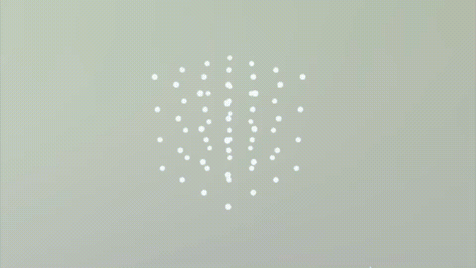

# 在 SwiftUI 下的 SceneKit 中创建 3D 井字游戏

> 原文：<https://betterprogramming.pub/creating-a-3d-tic-tac-toe-in-scenekit-under-swiftui-19d08bf752bd>

## 尝试创造经典的量子游戏


确认 qubic 板上的中奖线

井字游戏可以追溯到很久以前，维基百科告诉我们棋盘出现在古埃及等地。这是一个名为[帕克兄弟](https://en.wikipedia.org/wiki/Parker_Brothers)的公司在 1964 年更新的一个名为 Qubic 的 3D 版本的游戏。

在他们的游戏中，你有一个 4x4x4 的方块，你必须做和井字游戏一样的事情；也就是说，把你的零或者十字连成一条线。

当然，有了 3D 版本，它会更有挑战性，因为你会有更多可能的玩法。和我一起看看在 SwiftUI 实现中的 SceneKit 框架下实现它。一个小项目，具有挑战性，但很有趣。

# 编码

邦。我想从一个`UIViewRepresentable`视图开始，SwiftUI 和 UIKit 之间的媒介。基本代码模板如下所示。我没有选择 SwiftUI 下可用的 SceneView，因为它不直接支持点击手势。

在 UIKit 环境中创建一个场景的视图，我可以像这样传递回一些 SwiftUI 代码。

```
**struct** ContentView: **View** {
  **var** scene = **SCNScene**(named: "**SceneKitScene.scn**")
  **var body: some View** {
  **SceneView**(
    **scene**: scene!,
    **options**: []
  )
  }
}
```

这里命名的`**SceneKitScene**`无非就是一个基本的*。我在 Xcode 中创建的 scn 文件，并添加到项目中。

在现有的`sceneView`代码中，我添加了一个代表游戏棋盘的网格和一个手势识别器，它会在每个玩家轮流游戏时将棋子放到我的棋盘上。

像这样的网格。


4x4x4 的网格。请注意，我没有做 3x3x3 的 3D 网格，因为在 3D 版本中这样做会导致第一个玩家总是获胜。理论上，你当然可以创建一个更大的电路板。有了更大的格子，你可以邀请更多的玩家，都是值得思考的；未来版本。

## 游戏部分

代码中的`tapGesture`是指一个方法`**handleTap**` **。**该方法的基本代码如下:

这段代码直接来自苹果，它查看我点击了 64 个节点中的哪一个，并在相同的位置添加了一个立方体或一个球体，在两者之间交替。



在我的在线量子游戏中选择不同的节点

请注意，我没有使用十字或圆形，因为立方体和球体在 3D 世界中工作得更好——仅用 100 行代码就取得了令人印象深刻的结果。

# 下一步

当你尝试玩的时候，游戏需要检查格子是否空闲，事实上，理想情况下，如果两个玩家中的一个得到了一条线，游戏也会停止游戏并宣布赢家，但这两个玩家都没有得到。

我曾想用网格坐标来映射一个数据结构，但我不能，因为它们不是小数。为了尽量简单，我扩展了`SCNNode`，这样就可以添加索引值。

现在，我可以针对我的节点向每个节点添加一个整数索引，以便在每次播放之后查找序列或获胜节点。接下来，我用这个 one-liner 创建了一个新结构的数组。

```
var board: [[[NewNode?]]] = .init(repeating: .init(repeating: .init(repeating: nil, count: 4), count: 4), count: 4)
```

代码添加到`tapGesture`方法中。

最后，我添加了一些获胜行的签名和一些代码，以根据所制作的剧本来测试所述签名。

这一切看起来都很好；在稍作思考之前，我又添加了 24 个签名。

# 签名

当我翻阅这些签名时，我逐渐意识到，在大多数情况下，它们之间的区别在于代表坐标的三个数字元组中只有一个数字。

我想，只要多做一点工程，我就可以只用几个模板来构建这些签名。
我使用了本文描述的联合框架订阅模式来设置一种改变节点颜色的方法，以测试我的新方法。你可以在这里看到它的行动。


在量子位中测试获胜行的签名

随着我继续深入研究，我发现成功的案例比我最初认为的要多得多。我查看了维基百科上关于这个主题的页面，发现应该有 76 行——当晚我就开始把它们全部删掉。

# 待续……

在此之前，我清理了代码，并开始研究构建一个能够在游戏中与你对抗的 AI 的可能性。

我相信，一个主题本身也将是一篇文章——因此，我将在这里结束这篇论文。