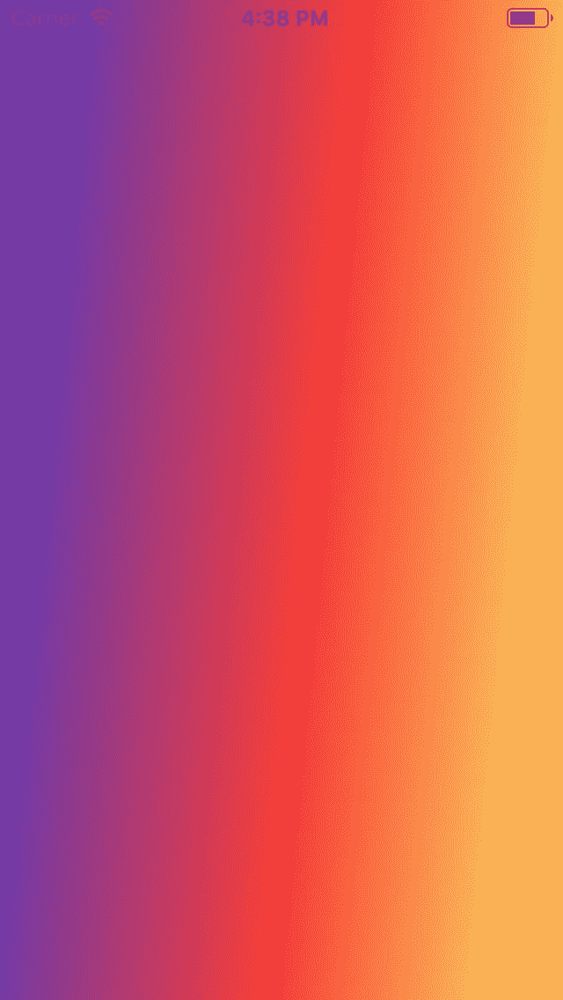
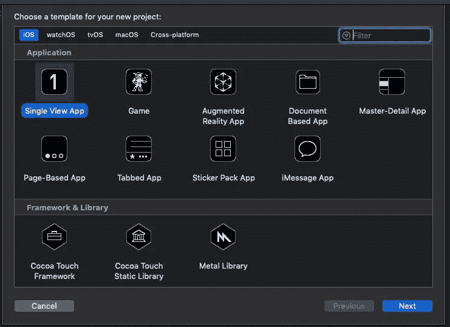
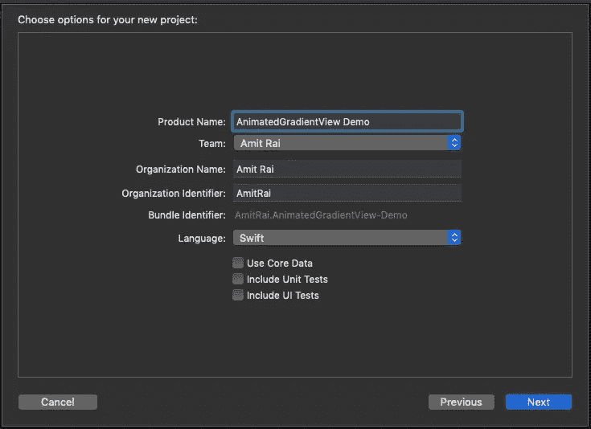
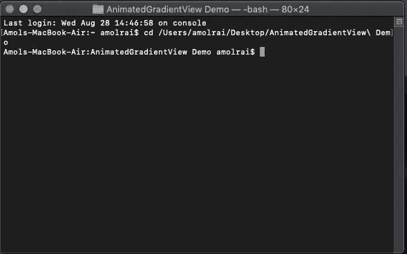
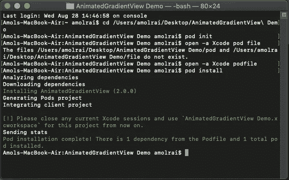

# 在 Swift 中创建动画梯度视图

> 原文：<https://betterprogramming.pub/creating-a-animatedgradientview-in-swift-c544abd6f8bd>

## 给你的应用一些活力和色彩


照片由[丹·阿拉贡](https://unsplash.com/@danaragonmx?utm_source=unsplash&utm_medium=referral&utm_content=creditCopyText)在 [Unsplash](https://unsplash.com/search/photos/gradient?utm_source=unsplash&utm_medium=referral&utm_content=creditCopyText) 拍摄

> ***如果你正在准备你的技术编码面试，或者你想学习递归来提高你的解决问题的技能，那么你应该查看这个 udemy 课程*** [**递归大师班，从 C++**](https://www.udemy.com/course/master-the-recursion-from-beginner-to-advance-level/?referralCode=75F57675BDABF6D104C0) ***的初级到高级水平，或者你可以在***[***Skillshare***](https://skl.sh/3PTOCns)***上查看这个递归课程。***
> 
> **如果你想从初学者到专家水平学习 ARKit 3，然后点击** [**这里**](https://www.udemy.com/course/ios-13-swift-5-the-complete-arkit-3-course/?couponCode=FORCREATOR) **获得课程，你还将获得 97%的折扣。**
> 
> **如果你对学习 iOS 移动开发充满热情，并希望将你的 iOS 开发技能提升到一个新的水平，那么使用 CloudKit framework 的核心数据应该是你的首选。点击** [**此处**](https://www.udemy.com/course/mastering-coredata-with-cloudkit-in-swift-5-for-ios/?couponCode=FORDEVS) **获取课程，还可享受 97 折优惠。**
> 
> **从头开始学习 SwiftUI 点击** [**此处**](https://www.udemy.com/course/swiftui-the-complete-course-building-real-world-apps/?couponCode=FORCODERS) **获取课程，因为在本课程中，我们将使用 SwiftUI 构建许多应用，如脸书克隆、新闻应用、笔记应用等等。**

在本教程中，我们将创建一个`AnimatedGradientView`。

`AnimatedGradientView`是一个`UIView`子类，可以很容易地将动画渐变添加到你的 iOS 应用程序中。



动画梯度视图

# 入门指南

打开 Xcode[并创建一个新的 Xcode 项目。](https://developer.apple.com/xcode/)

在 *iOS 模板*下选择*单视图 App* ，点击*下一步*。



输入您的*产品名称，*点击*下一步，*并在您的桌面上创建它。



现在，关闭 Xcode 项目并打开终端。我们必须安装[椰子脚架](https://cocoapods.org/)。如果您不知道如何安装 CocoaPods，请完成以下步骤，如果您已经知道如何安装，请跳过这些步骤。

打开您的终端并编写以下命令:

```
sudo gem install cocoapods
```

现在，你的终端会询问你的 MacBook 密码。输入密码，点击*回车*安装 CocoaPods。等待几分钟；安装 CocoaPods 的时间取决于你的网速。

安装完 CocoaPods 之后，使用这个命令进入你的项目目录:`cd your project name` ，点击*进入*。



终端看起来像这样

在终端中写入`pod init`。这个命令将在你的 Xcode 项目中创建一个`podfile`。

在您最喜欢的文本编辑器中打开`podfile`,将下面一行粘贴到您的`podfile`中:

```
pod 'AnimatedGradientView'
```

点击`podfile`中的 Command+S 进行保存。

关闭文本编辑器并将以下命令粘贴到终端中，以便在 Xcode 项目中安装 pod:

```
pod install
```



终端看起来像这样

关闭终端，打开`xcworkspace` Xcode 项目。

按 Command+B 构建项目。直接进入`ViewController.swift` 文件，使用`import AnimatedGradientView`导入框架。

首先，我们将创建一个`AnimatedGradientView`的实例。我们将使用框架初始化器，然后根据您的颜色选择给出渐变动画值，给出渐变类型和方向，并添加到父视图中。

# **代码**

```
let animatedGradient = AnimatedGradientView(frame: view.bounds)animatedGradient.direction = .upanimatedGradient.animationValues = [(colors: ["#2BC0E4", "#EAECC6"], .up, .conic),(colors: ["#833ab4", "#fd1d1d", "#fcb045"], .right, .conic),(colors: ["#003973", "#E5E5BE"], .down, .conic),(colors: ["#1E9600", "#FFF200", "#FF0000"], .left, .conic)]view.addSubview(animatedGradient)
```

> ***如果你正在准备你的技术编码面试，或者你想学习递归来提高你解决问题的技能，那么你应该查看这个 udemy 课程*** [**递归大师班，从 C++**](https://www.udemy.com/course/master-the-recursion-from-beginner-to-advance-level/?referralCode=75F57675BDABF6D104C0) ***的初级到高级水平，或者你可以在***[***skill share***](https://skl.sh/3PTOCns)***上查看这个递归课程。***

# 额外资源

> **如果你想从初学者到专家水平学习 ARKit 3，然后点击** [**这里**](https://www.udemy.com/course/ios-13-swift-5-the-complete-arkit-3-course/?couponCode=FORCREATOR) **获得课程，你还将获得 97%的折扣。**
> 
> **如果你对学习 iOS 移动开发充满热情，并希望将你的 iOS 开发技能提升到一个新的水平，那么使用 CloudKit framework 的核心数据应该是你的首选。点击** [**此处**](https://www.udemy.com/course/mastering-coredata-with-cloudkit-in-swift-5-for-ios/?couponCode=FORDEVS) **获取课程，还可享受 97 折优惠。**
> 
> **从头开始学习 SwiftUI 点击** [**此处**](https://www.udemy.com/course/swiftui-the-complete-course-building-real-world-apps/?couponCode=FORCODERS) **获取课程，因为在本课程中，我们将使用 SwiftUI 构建许多应用，如脸书克隆、新闻应用、笔记应用等等。**