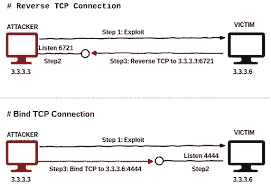
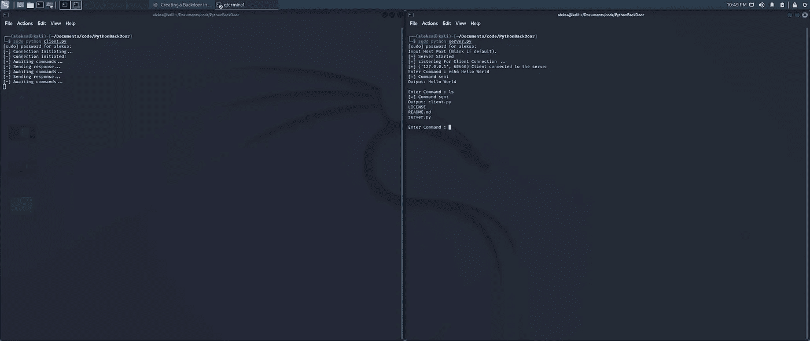

# 在 Python 中创建后门

> 原文：<https://betterprogramming.pub/creating-a-backdoor-in-python-558fd4ca2a1b>

## 另一个很酷的网络安全教程


由[马頔·佩丘林](https://unsplash.com/es/@pechka?utm_source=medium&utm_medium=referral)在 [Unsplash](https://unsplash.com?utm_source=medium&utm_medium=referral) 拍摄的照片

简单来说，后门程序是一种让用户远程访问目标机器的程序。

后门的主要目的是向目标机器发送和接收命令(和数据),以获取有价值的数据或增加目标机器和网络上的权限。

为了促进这种交互，黑客在目标机器上安装恶意代码，创建连接并允许黑客发送信息。

外壳是软件的一个重要部分，有道德的黑客可以用它在合同期间进行渗透测试。在这篇文章中，我们将教有抱负的道德黑客如何制作他们的第一个外壳。



来源:[https://www . ivoid warranties . tech/posts/pentesting-tuts/metasploit/simple-attack/](https://www.ivoidwarranties.tech/posts/pentesting-tuts/metasploit/simple-attack/)

在信息安全领域，存在两种类型的有效载荷:外壳和反向外壳。

Shells 直接在黑客可以连接的目标机器上创建服务器。

反向外壳有一个客户端组件和一个服务器组件。运行在目标机器上的客户端已经拥有攻击者的 IP 地址。

因为初始连接的方向是“反向的”(从受害者到攻击者)，所以外壳被称为反向外壳。向前发展，我们将编码一个反向外壳。目标将被称为受害者，而黑客的机器将被称为攻击者。

首先，我们必须创建将在攻击者身上运行的服务器。有如下四个步骤:

1.  获取我们的本地 IP 和指定端口。
2.  绑定 IP 和端口以创建套接字。
3.  启动监听器。
4.  在无限循环中发送和接收命令。

接下来，我们将基于硬编码的 IP 和端口连接到攻击者，因为它无法动态检索这些 IP 和端口。

因为我们在本地机器上运行这个反向 shell，所以套接字看起来像这样:

```
REMOTE_HOST = '127.0.0.1'REMOTE_PORT = 8081 # 2222client = socket.socket()
```

此外，我们必须接收命令并使用库`subproccess`来打开终端并并行运行命令。这就是它的样子:

```
command = client.recv(1024)command = command.decode()op = subprocess.Popen(command, shell=True, stderr=subprocess.PIPE, stdout=subprocess.PIPE)
```

服务器的完整代码如下:

下面是一个反向外壳的例子:



左边是客户端，右边是服务器。

首先运行服务器，然后运行客户机，这将允许用户像承诺的那样使用服务器发送和接收数据。请检查一下，并让我知道你的想法。

完整代码见我的 GitHub 简介。

[](https://github.com/AleksaZatezalo/PythonBackDoor) [## GitHub-AleksaZatezalo/python backdoor

### 此时您不能执行该操作。您已使用另一个标签页或窗口登录。您已在另一个选项卡中注销，或者…

github.com](https://github.com/AleksaZatezalo/PythonBackDoor)