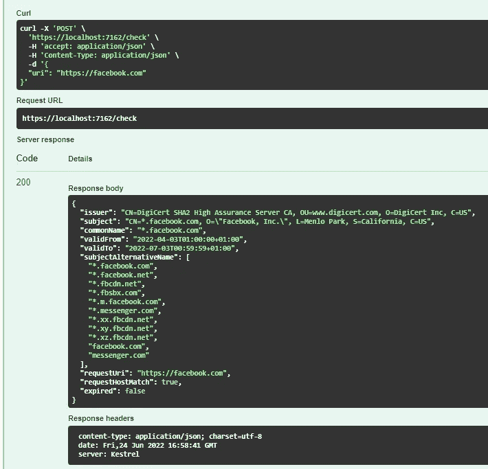

# 使用创建证书检查器。网

> 原文：<https://betterprogramming.pub/creating-a-certificate-checker-with-net-3317b53f91da>

## 使用 ASP.NET 最小 API 的 SSL 证书检查器

信用:unsplash.com

我经常需要快速检索关于监控和自动化场景的 SSL 证书的详细信息，所以我想我应该尝试编写一个简单的 API 来提供帮助。

API 可用于以编程方式访问有关证书的详细信息，如通用名称或 San，还可以与应用程序健康检查集成，以便在到期日期临近时提供警报。

# 正在检索证书

在。NET 世界中，普遍接受的检索 TLS 证书的方式是使用带有自定义`HttpClientHandler`的`HttpClient`。请求启动处理程序的最快捷、最可靠的方式是向使用证书托管的网站发送`HEAD`请求:

这段代码存在一些问题，不适合大规模使用。

## 创建大量的 HttpClients 不是一个好主意

即使您正在处理代码中的`HttpClient`对象，线程池也会保持连接打开，以防处理后有任何数据包返回。如果你在大范围内这样做，那么你会很快耗尽可用的 WebSockets。这个问题[在这里](https://www.aspnetmonsters.com/2016/08/2016-08-27-httpclientwrong/)有更好的解释。

为了解决这个问题，引入了`HttpClientFactory`来管理 HttpClient 实例的生命周期。

## 线程安全

如果我们通过使用一个共享的`HttpClient`实例来修复上面的代码，那么我们将会遇到线程安全的问题，因为同一个`HttpClientHandler`实例将会被用来检查不同请求的证书。

如果同时检查两个不同的域，我们就不能确定每个证书的到期日期。

## 性能和节流

通常，证书不会经常更改，因此我们不需要在短时间内处理同一主机的请求。如果我们执行太多的请求，我们也可能被下游服务器限制或阻塞。

在下一节中，我将解释如何使用缓存来解决最后两个问题。

# 解决方案

在自定义证书提取处理程序检索到证书后，将创建一个证书存储来缓存证书。证书提取处理程序扩展了`HttpClientHandler`并通过一个`HttpClient`进行配置，它向被检查的主机发送`HEAD`请求。

`HEAD`请求通过证书检查器服务发送，该服务将首先检查证书存储，查看是否已经有可用的证书，如果没有，则调用下游服务器。

## 证书存储

我想解决的第一个问题是如何在提取之后存储证书，以及在执行检查之前/之后检索证书。一个简单的`MemoryCache`是保持证书的快速线程安全的方法。

主机从`requestUri`中提取出来，这样，如果不同的路径先前已经用于相同的主机，则可以重复使用证书检查。

## 证书提取处理程序

创建一个定制的`HttpClientHandler`实现来封装在请求后提取 X509Certificate，并将其保存在证书存储中。

## TLS 证书

我想从 X509Certificate 中提取一些我感兴趣的细节。我决定创建一个`TlsCertificate`类来提取以下内容:

*   发行人
*   科目
*   常用名(这可以从主题中提取)
*   使用者替代名称/SANs(可以从证书扩展中提取)

提取这些细节的代码可以在[这里](https://github.com/matt-bentley/Certificate.Checker/blob/main/Certificate.Checker/Models/TlsCertificate.cs)找到。

## 证书检查服务

难题的最后一部分是一个服务，用于编排从证书存储中检索提取的证书，并将 HTTP `HEAD`请求发送到被检查的主机。

该服务检查最近是否已经为被检查的主机提取了证书。如果还没有可用的证书，则服务向主机发送一个`HEAD`请求，并检索提取的证书。

# 把所有的放在一起

既然已经创建了检查证书的组件，那么是时候创建一些 API 端点了。

## POST:/检查端点

这个端点将总是返回一个`200`响应，即使证书无效或者已经过期。

## GET: /validate 端点

此端点使用查询字符串，因此可以使用 GET 请求来调用它。如果证书无效或过期，端点将返回 502 错误网关。由于端点使用一个简单的 GET 请求，因此它可以很容易地连接到健康检查中来监控证书。

因为我使用了最小的 API，所以必须创建一个自定义的`IResult`来处理返回的错误网关结果。我创建了一个简单的`Check Result`类，它处理结果的序列化，并根据证书的有效性设置 HTTP 状态代码。

# 最后的话

最终结果是一个 REST API，它提取证书信息并验证有效期和域名。

希望你觉得这个小应用有用。如果你想查看完整的代码，可以在这里找到。