# 为 Flutter 创建完整的 GitHub 工作流

> 原文：<https://betterprogramming.pub/creating-a-complete-github-workflow-for-flutter-529f6bd7bb10>

## 构建和测试你的 Flutter 应用的最快最简单的方法


照片由 [Sebastian Voortman](https://www.pexels.com/photo/woman-jumping-wearing-green-backpack-214574/) 在 [Pexels](https://www.pexels.com/) 拍摄

在本文中，我将展示如何设置一个简单易用的 Flutter 工作流，它将:

*   构建您的源代码
*   运行单元测试
*   上传代码覆盖率
*   运行集成测试
*   生成并上传 APK 文件
*   拍摄集成测试截图并上传文件

## 创建我们的 Flutter 示例应用程序

在创建我们的工作流程之前，我们需要一个应用程序，现在，默认模板就足够了

创建一个新的 Flutter 应用程序，并在 android 模拟器或物理设备上运行它。

我将我的项目命名为`flutter_workflow_example`

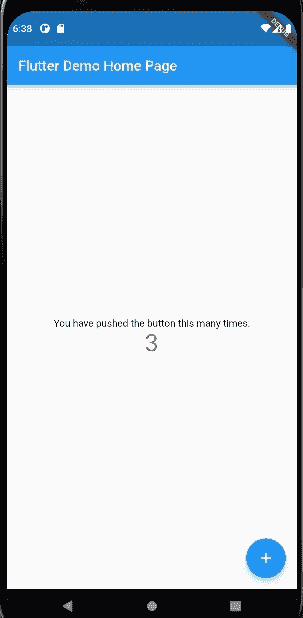

颤振默认应用程序

接下来，创建一个新的 GitHub 存储库，并将所有代码推送到其中。

## Git Hub 操作

一个 [GitHub Action](https://docs.github.com/pt/actions) 是一个免费的 CI/CD 平台，允许为构建、测试、发布和许多其他完全与 GitHub 集成的可能性创建工作流。

用户可以在平台上协作地创建和共享新的动作，这是一种促进协作和代码重用的聪明而有效的方式。

为你的 Flutter 应用程序创建一个 GitHub 动作是简单明了的，它可以在几秒钟内完成，所以让我们创建我们的工作流程，然后我将一步一步地解释它是如何工作的:

首先，创建`.github/workflows/main.yml`文件，并将下面的代码粘贴到上面:

```
name: Flutter Workflow

on: [push, workflow_dispatch]
jobs:
  build:
    runs-on: macos-latest
    steps:
      - name: Checkout code
        uses: actions/checkout@v3

      - name: Install Flutter
        uses: subosito/flutter-action@v2
        with:
          flutter-version: '2.10.0'
          channel: 'stable'

      - name: Install dependencies
        run: flutter pub get
```

将它推送到您的存储库，它就完成了，您已经有了一个工作流。

下面我们可以看到推送后运行的工作流。

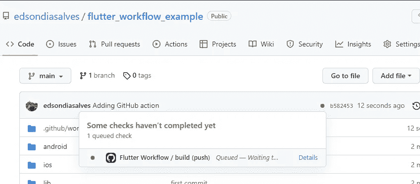

回购主页中的 Flutter 工作流选项

它成功地完成了，干得好。

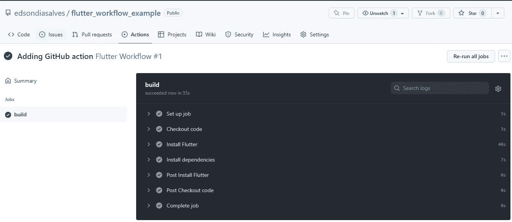

工作流已执行并返回成功

这就足够了，你的第一个行动是构建和测试你的代码，这就是所有的人，感谢您的阅读，并有一个伟大的一周，再见，下次见。

Ops，开个玩笑，要做的事情还有很多，那么，我们来一步一步的检查一下刚才做了什么。

```
name: Flutter Workflow
```

第一行非常简单，`name`属性将定义工作流标题，在有多个工作流的情况下，提供一个好的名称来很好地举例说明它应该做什么。

```
on: [push, workflow_dispatch]
```

`on`属性将定义何时启动工作流，有多个选项可供选择，`push`选项将使工作流在每次执行新的推送时运行，`workflow_dispatch`选项允许直接从 GitHub 界面启动新的工作流。

```
jobs:
  build:
```

`jobs`部分定义了将在工作流程中执行的作业，在这种情况下，第一个作业名为`build`

```
runs-on: macos-latest
```

下一节将定义工作流中使用的机器类型，在我们的例子中，我使用的是安装了最新 macOS 的机器

```
steps:
```

这里我们将定义工作流的所有步骤，我们通常提供一个`-name`和一个`uses`或`run`选项

```
- name: Checkout code
  uses: actions/checkout@v3
```

在第一步中，我们执行[动作/检出](https://github.com/actions/checkout)，这是一个负责检出工作流存储库代码的动作

在`-name`选项中定义的文本将在工作流执行中显示。

```
- name: Install Flutter
  uses: subosito/flutter-action@v2
  with:
    flutter-version: '2.10.0'
    channel: 'stable'

- name: Install dependencies
  run: flutter pub get
```

下一个动作是[subosito/flutter-action](https://github.com/subosito/flutter-action)，它负责在我们的工作流中设置 Flutter 环境，注意我们可以定制 Flutter 版本并执行 Flutter 命令

我们将在下一节中使用其他操作，请随意访问他们的存储库并检查所有可用的选项

## 运行单元测试

Flutter 项目的默认模板包含带有非常简单的单元测试的`test/test_widget.dart`文件，但是足以在我们的工作流中运行。

将这一行添加到您的`main.yml`中，并将其推送到存储库:

```
- name: Run unit tests
  run: flutter test --coverage
```

命令`flutter test`将运行单元测试，而`--coverage`选项对于生成。lcov 文件，我们将在后面的代码覆盖率报告中使用

将这个变更推送到存储库之后，工作流将再次执行，但是这一次它将运行新的单元测试步骤:

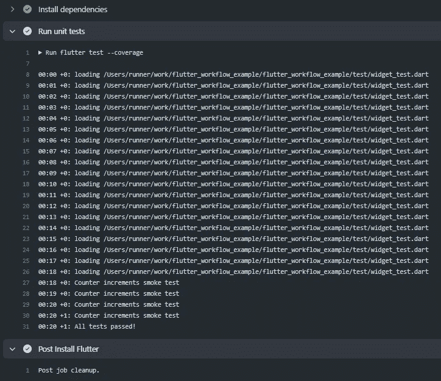

工作流中的单元测试步骤执行

## 创建代码覆盖率报告

创建代码覆盖报告有很多方法，我将使用 [Codecov](https://about.codecov.io/) 这是一个非常简单和完整的工具来处理代码覆盖信息。

使用您的 GitHub 凭证登录到 [Codecov](https://app.codecov.io/gh) 并允许访问以搜索您的存储库。

单击`Not yet setup`选项查看您最近创建的项目，然后单击`setup repo`选项。

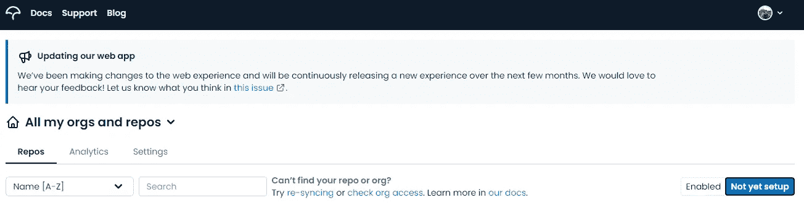

尚未设置选项

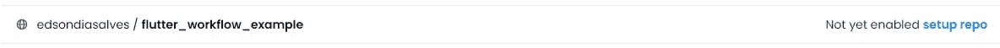

我最近创建的项目

第二步，我们将找到如下图所示的 Codecov 标记:

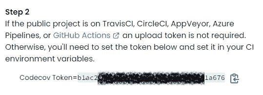

Codecov 令牌

在 GitHub 资源库页面，点击`Settings`->-`Secrets`->-`Actions`，点击`New repository secret`按钮

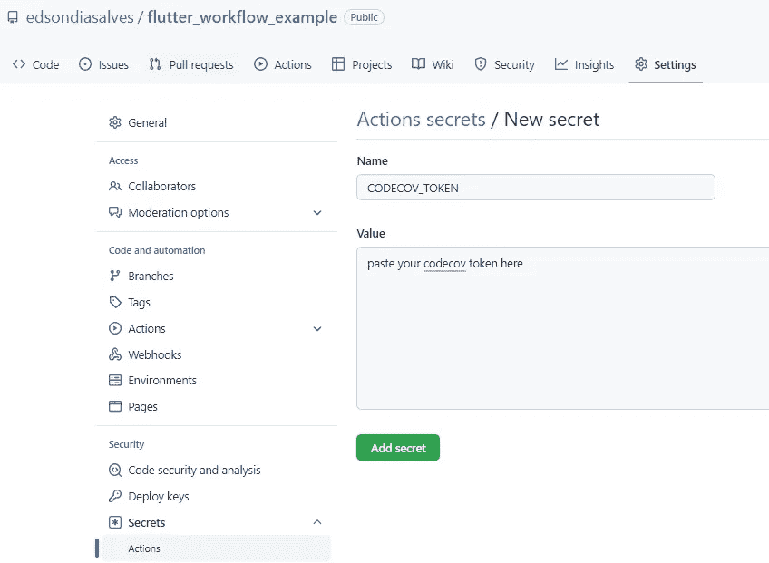

GitHub 的新秘密选项

然后，将 [codecov/action](https://github.com/codecov/codecov-action) 添加到您的`main.yml`文件中:

```
- name: Upload to code coverage
  uses: codecov/codecov-action@v1.2.2
  with:
    token: ${{secrets.CODECOV_TOKEN}}
    file: coverage/lcov.info
```

推送之后，管道将再次执行，但是这一次在运行您的单元测试之后，它将把覆盖信息上传到 Codecov，并且它将生成一个新的覆盖报告。

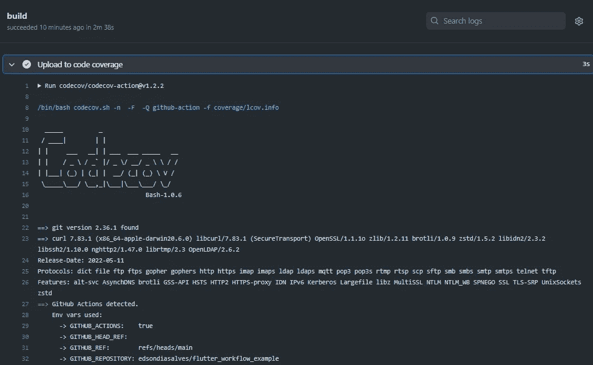

Codecov 上载操作正在执行

刷新 Codecov 门户，您将能够看到关于您的项目代码覆盖率的新报告和统计数据

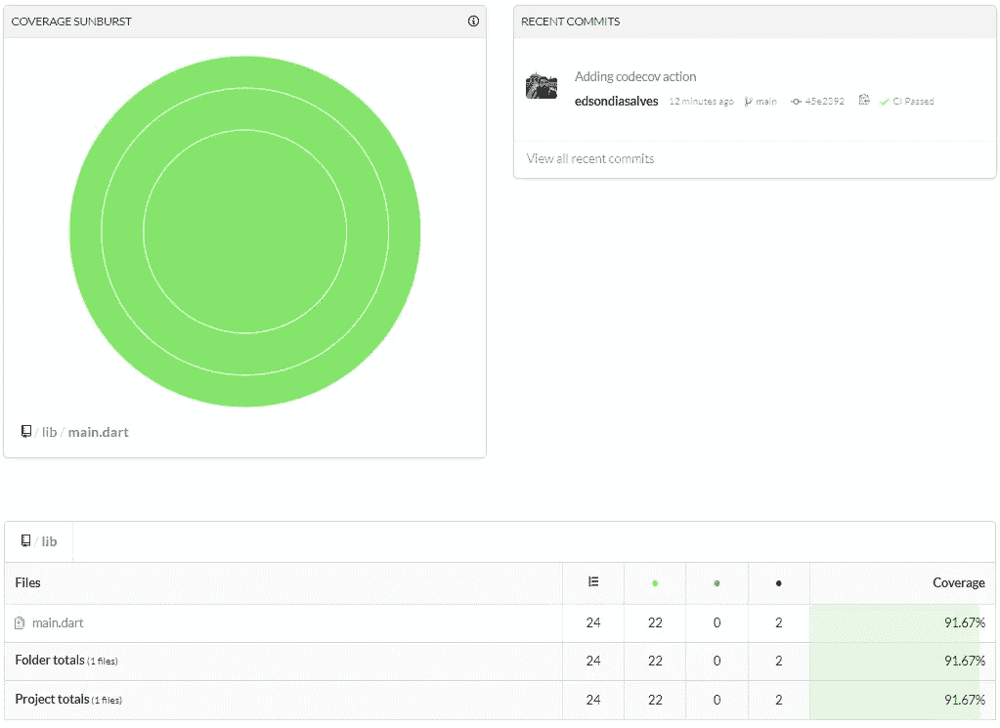

代码覆盖率报告和统计数据

在 Codecov 项目的 settings 部分中，您将找到要添加到项目 readme.md 文件中的覆盖率徽章

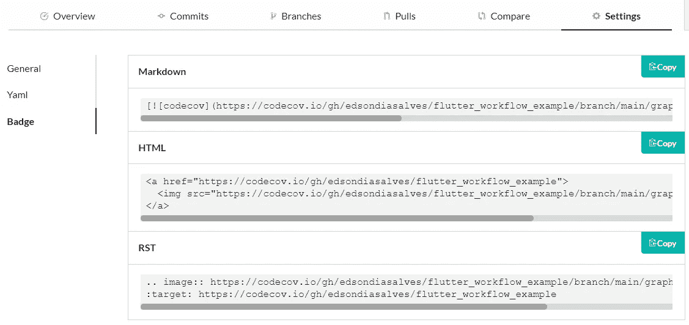

Codecov 徽章设置

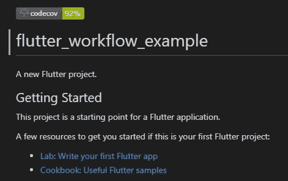

readme.md 文件中的代码覆盖率徽章

## 运行集成测试

与单元测试不同，集成测试不会测试一段简单的代码，相反，他们会执行整个应用程序，并像测试用户一样进行测试，在我们的情况下，集成测试必须打开应用程序，点击加号按钮，并检查屏幕上的数字是否增加。

因此，让我们创建我们的集成测试:

在`pubspec.yaml`中添加`integration_test`依赖关系

```
dev_dependencies:
  integration_test:
    sdk: flutter
  flutter_test:
    sdk: flutter
```

然后，向文件`integration_test/app_test.dart`添加一个新的测试

```
import 'package:flutter_test/flutter_test.dart';
import 'package:integration_test/integration_test.dart';

import '../lib/main.dart' as app;

void main() {
  IntegrationTestWidgetsFlutterBinding.*ensureInitialized*();
  group('end-to-end test', () {
    testWidgets('tap on the floating action button, verify counter', (tester) async {
      app.main();
      await tester.pumpAndSettle();

      // Verify the counter starts at 0.
      expect(find.text('0'), findsOneWidget);

      // Finds the floating action button to tap on.
      final Finder fab = find.byTooltip('Increment');

      // Emulate a tap on the floating action button.
      await tester.tap(fab);

      // Trigger a frame.
      await tester.pumpAndSettle();

      // Verify the counter increments by 1.
      expect(find.text('1'), findsOneWidget);
    });
  });
}
```

Flutter 提供了一种非常简单的方式来使用 [ChromeDriver](https://chromedriver.chromium.org/home) 运行集成测试，我们可以按照 [Flutter cookbook 集成测试介绍](https://docs.flutter.dev/cookbook/testing/integration/introduction)(我在上面的测试中得到的)使用它，但是在我们的例子中，我们将使用不同的东西，而不是使用假设备，我们将在我们的工作流中启动一个 android 仿真器，然后执行我们的测试。

为此，我们将使用[react ive circus/Android-emulator-runner](https://github.com/ReactiveCircus/android-emulator-runner)动作，提供我们项目的 api 级别，以及模拟器可用时要执行的集成测试脚本。

```
- name: Run integration tests
  uses: reactivecircus/android-emulator-runner@v1
  with:
    api-level: 29
    script: flutter test integration_test
```

按下它后，我们可以在日志中看到仿真器的引导和测试的执行:

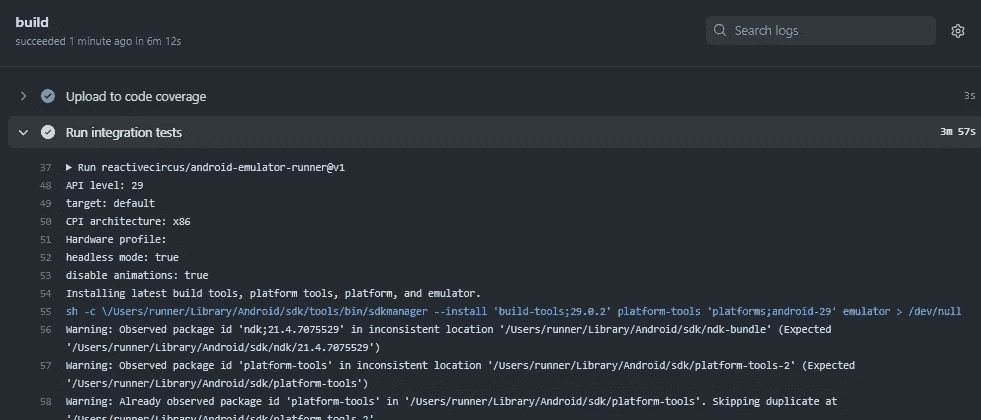

集成测试开始

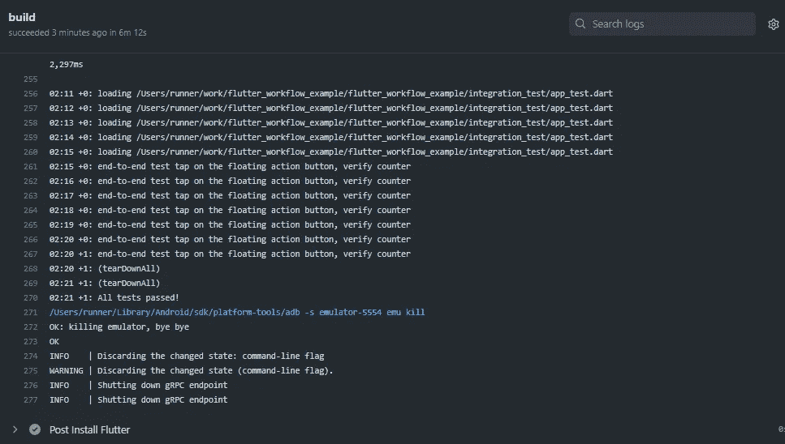

集成测试成功执行

## 构建和上传 APK

对于每个构建，都会生成一个 Flutter APK 文件，如果您想下载并安装在任何 Android 设备或仿真器上，您可以利用工作流并在构建中上传这个 APK。

为此，我们首先需要对已经定义的 suposito flutter 动作运行`flutter build apk`命令

```
- name: Install Flutter
  uses: subosito/flutter-action@v2
  with:
    flutter-version: '2.10.0'
    channel: 'stable'
- run: flutter build apk
```

然后，添加[上传工件](https://github.com/actions/upload-artifact)动作，并提供 APK 物理路径

```
- name: Upload APK
  uses: actions/upload-artifact@v3
  with:
    name: release-apk
    path: build/app/outputs/apk/release/app-release.apk
```

在工作流执行日志中，我们可以看到上传操作的详细信息:

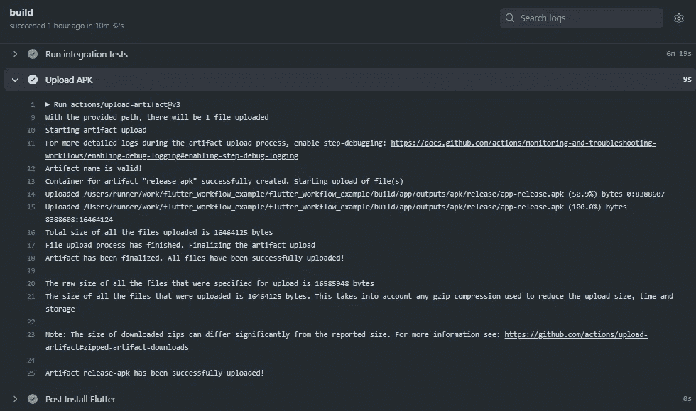

我们可以在作业执行的工件部分找到 APK 文件:

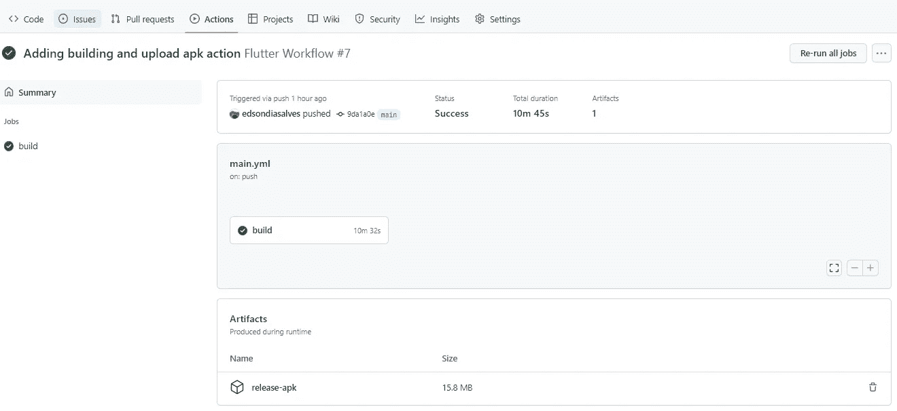

作业摘要和上传的工件

## 参加测试截图

为了在我们的集成测试中截屏，我们需要一个测试驱动程序，因此，将文件`test_driver/main_test.dart`添加到您的项目中，并粘贴以下代码:

```
import 'dart:io';

import 'package:integration_test/integration_test_driver_extended.dart';

Future<void> main() async {
  try {
    await integrationDriver(
      onScreenshot: (String screenshotName, List<int> screenshotBytes) async {
        final File image = await File('screenshots/$screenshotName.png').create(recursive: true);

        image.writeAsBytesSync(screenshotBytes);
        return true;
      },
    );
  } catch (e) {
    print('onScreenshot - error - $e');
  }
}
```

现在，让我们调整集成测试，以便在执行测试时获取屏幕截图:

首先，将这条语句添加到`main`方法的第一行

```
final binding = IntegrationTestWidgetsFlutterBinding();
```

将下面的`takeScreenshot`方法添加到测试文件中

```
takeScreenshot(tester, binding, name) async {
  if (Platform.*isAndroid*) {
    try {
      await binding.convertFlutterSurfaceToImage();
    } catch (e) {
      print("TakeScreenshot exception $e");
    }
    await tester.pumpAndSettle();
  }

  await binding.takeScreenshot(name);
}
```

你还需要导入`dart.io`包

```
import 'dart:io';
```

现在我们可以随时调用方法`takeScreenshot`，我在下面的现有测试中添加了两次:

```
testWidgets('tap on the floating action button, verify counter', (tester) async {
  app.main();
  await tester.pumpAndSettle();

  // Verify the counter starts at 0.
  expect(find.text('0'), findsOneWidget);
  await takeScreenshot(tester, binding, 'shot-1');

  // Finds the floating action button to tap on.
  final Finder fab = find.byTooltip('Increment');

  // Emulate a tap on the floating action button.
  await tester.tap(fab);

  // Trigger a frame.
  await tester.pumpAndSettle();
  await takeScreenshot(tester, binding, 'shot-2');

  // Verify the counter increments by 1.
  expect(find.text('1'), findsOneWidget);
});
```

接下来，在操作脚本参数中，将其更改为执行以下新脚本:

```
- name: Run integration tests
  uses: reactivecircus/android-emulator-runner@v1
  with:
    api-level: 29
    script: flutter drive --driver=test_driver/main_test.dart --target integration_test/app_test.dart
```

执行集成测试，因此，启动仿真器或在本地连接一个物理设备，并执行上面的脚本来测试是否会生成屏幕截图。

最后，但同样重要的是，添加代码将截图上传到工件部分

```
- name: Upload Screenshoots
  uses: actions/upload-artifact@v3
  with:
    name: Test result screenshots
    path: screenshots/*.png
```

在将它推送到存储库之后，我们可以检查工件部分，并查看截图 zip 文件，其中包含集成测试期间生成的所有截图。

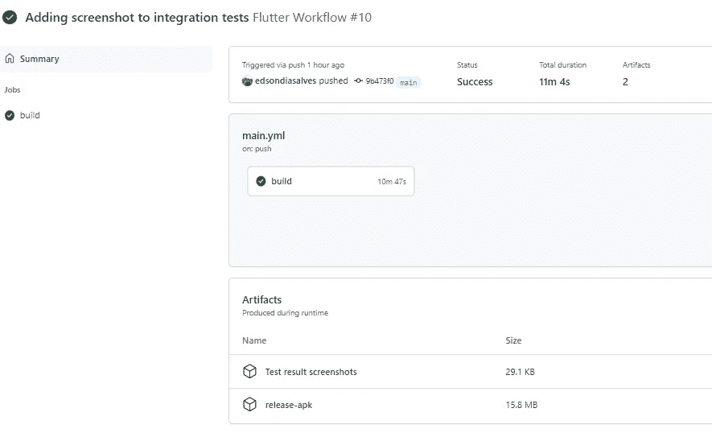

带有测试结果截图的工件部分

下载文件，解压并检查结果:

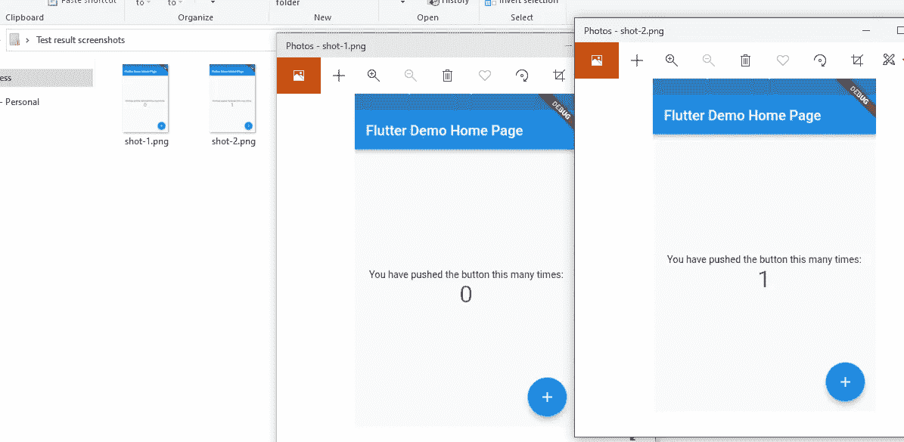

生成的 screnshot 文件

最终，我们完整的`main.yml`文件必须如下所示:

完整的 main.yml 文件

## 现在…就这样

如果你想检查我创建的项目，请随意将它[复制到我的 GitHub 页面](https://github.com/edsondiasalves/flutter_workflow_example)。

有许多其他方法可以为 Flutter 设置工作流或管道，但是使用 GitHub 动作是免费的、简单的和快速的——我强烈推荐它。

我真的希望它能对你的项目有所帮助，感谢你的阅读，下次再见。