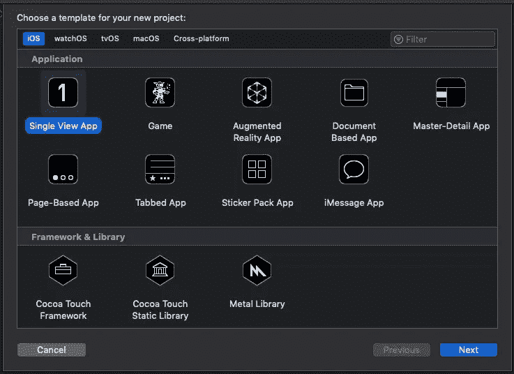
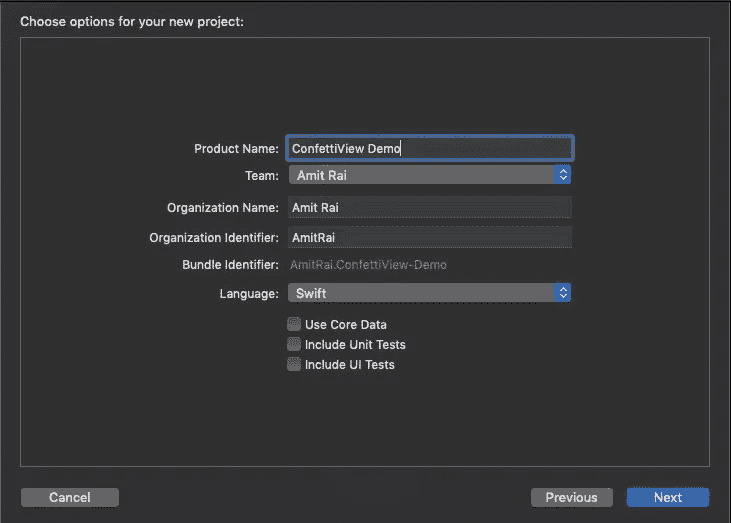
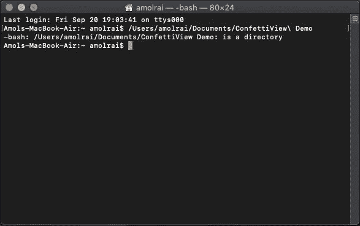
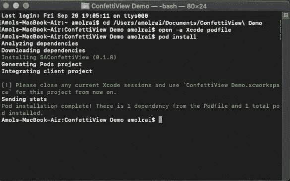
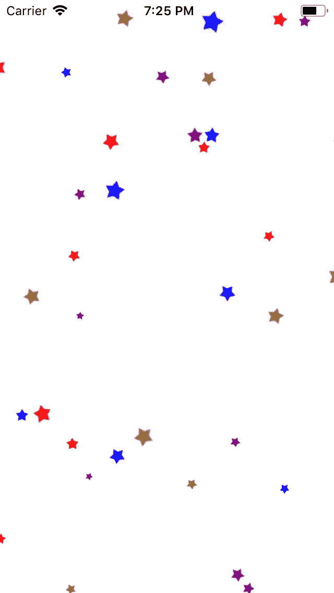

# 在 Swift 中创建 ConfettiView

> 原文：<https://betterprogramming.pub/creating-a-confettiview-in-swift-6f128331fef5>


埃里克·布洛林在 Unsplash[上的照片](https://unsplash.com/s/photos/confetti?utm_source=unsplash&utm_medium=referral&utm_content=creditCopyText)

# **confetti view 简介**

`SAConfettiView`是 UIView 的一个高度可定制的子类。从各种类型和颜色的纸屑到不同程度的强度，你可以随心所欲地制作纸屑。


下雨纸屑

> ***如果你正在准备你的技术编码面试，或者你想学习递归来提高你的解决问题的技能，那么你应该查看这个 udemy 课程*** [**递归大师班，从 C++**](https://www.udemy.com/course/master-the-recursion-from-beginner-to-advance-level/?referralCode=75F57675BDABF6D104C0) ***的初级到高级水平，或者你可以在***[***Skillshare***](https://skl.sh/3PTOCns)***上查看这个递归课程。***
> 
> **如果你想从初学者到专家水平学习 ARKit 3，然后点击** [**这里**](https://www.udemy.com/course/ios-13-swift-5-the-complete-arkit-3-course/?couponCode=FORCREATOR) **获得课程，你还将获得 97%的折扣。**
> 
> **如果你对学习 iOS 移动开发充满热情，并希望将你的 iOS 开发技能提升到一个新的水平，那么使用 CloudKit framework 的核心数据应该是你的首选。点击** [**此处**](https://www.udemy.com/course/mastering-coredata-with-cloudkit-in-swift-5-for-ios/?couponCode=FORDEVS) **获取课程，还可享受 97 折优惠。**
> 
> **从头开始学习 SwiftUI 点击** [**此处**](https://www.udemy.com/course/swiftui-the-complete-course-building-real-world-apps/?couponCode=FORCODERS) **获取课程，因为在本课程中，我们将使用 SwiftUI 构建许多应用，如脸书克隆、新闻应用、笔记应用等等。**

# 入门指南

打开 [Xcode](https://developer.apple.com/xcode/) ，新建一个 Xcode 项目。

在 iOS 模板部分选择“单视图应用”，然后点击“下一步”



输入您的产品名称，单击“下一步”，然后在桌面上创建它。



现在，关闭 Xcode 项目并打开终端。我们需要安装 [CocoaPods](https://cocoapods.org/) 。如果您已经知道如何安装 CocoaPods，请跳过下一部分。

打开您的终端并编写以下命令:

```
sudo gem install cocoapods
```

现在，你的终端会询问你的 MacBook 密码。输入密码，点击“Enter”安装 CocoaPods。等待几分钟—安装需要多长时间取决于您的网速。

安装 CocoaPods 之后，使用下面的命令转到您的项目目录:`cd your project name.`单击“enter”



终端应该是这样的

在终端中写入`pod init`。这个命令将在你的 Xcode 项目中创建一个`podfile`。

在您喜欢的文本编辑器中打开`podfile`,将下面一行粘贴到您的`podfile`中:

```
pod 'SAConfettiView'
```


Podfile 应该如下所示

点击`podfile`中的 Command+S 进行保存。

关闭文本编辑器并将以下命令粘贴到终端中，以便在 Xcode 项目中安装 pod:

```
pod install
```



关闭终端，打开`xcworkspace` Xcode 项目。

按 Command+B 构建项目。直接进入`ViewController.swift` 文件，使用`import SAConfettiView`导入框架。

首先，我们将创建一个`SAConfettiView`的实例。我们使用帧初始化器，然后指定五彩纸屑视图的类型、颜色和强度。然后我们开始写`confetti.startConfetti().`，最后我们在父视图中添加。如果你想停止纸屑，写`confetti.stopConfetti()`

# 整个代码和结果

```
let confetti = SAConfettiView(frame: view.bounds)confetti.type = .Starconfetti.colors = [UIColor.red, UIColor.blue, UIColor.purple, UIColor.brown]confetti.intensity = 0.85confetti.startConfetti()view.addSubview(confetti)
```



感谢阅读！

> ***如果你正在准备你的技术编码面试，或者你想学习递归来提高你解决问题的技能，那么你应该查看这个 udemy 课程*** [**递归大师班，从 C++**](https://www.udemy.com/course/master-the-recursion-from-beginner-to-advance-level/?referralCode=75F57675BDABF6D104C0) ***的初级到高级水平，或者你可以在***[***skill share***](https://skl.sh/3PTOCns)***上查看这个递归课程。***

# 额外资源

> **如果你想从初学者到专家水平学习 ARKit 3，然后点击** [**这里**](https://www.udemy.com/course/ios-13-swift-5-the-complete-arkit-3-course/?couponCode=FORCREATOR) **获得课程，你还将获得 97%的折扣。**
> 
> **如果你对学习 iOS 移动开发充满热情，并希望将你的 iOS 开发技能提升到一个新的水平，那么使用 CloudKit framework 的核心数据应该是你的首选。点击** [**此处**](https://www.udemy.com/course/mastering-coredata-with-cloudkit-in-swift-5-for-ios/?couponCode=FORDEVS) **获取课程，还可享受 97 折优惠。**
> 
> **从头开始学习 SwiftUI 点击** [**此处**](https://www.udemy.com/course/swiftui-the-complete-course-building-real-world-apps/?couponCode=FORCODERS) **获取课程，因为在本课程中，我们将使用 SwiftUI 构建许多应用，如脸书克隆、新闻应用、笔记应用等等。**