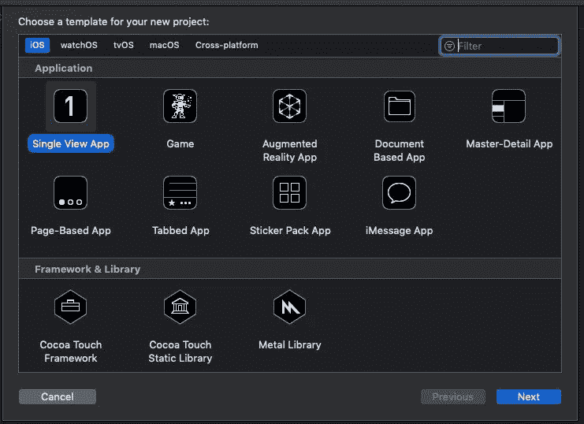
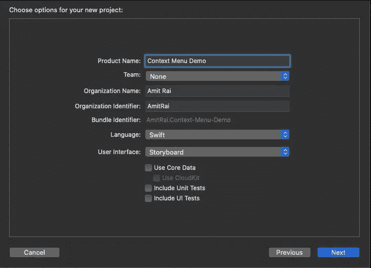
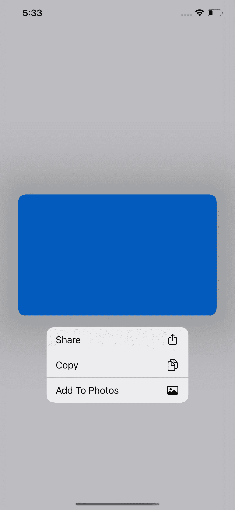

# 在 Swift 中创建上下文菜单和 SF 符号

> 原文：<https://betterprogramming.pub/creating-a-context-menu-and-sf-symbol-in-swift-e45459f5f704>

## 用上下文菜单替换 3D 触摸


# 介绍

在 iOS 13 中引入了上下文菜单 peek 和 pop，并取代了 3D Touch。它可以在包括 iPad 在内的所有设备上运行，并具有强大的功能来构建菜单和定制预览。

> ***如果你正在准备你的技术编码面试，或者你想学习递归来提高你解决问题的技能，那么你应该查看这个 udemy 课程*** [**递归大师班，从 C++**](https://www.udemy.com/course/master-the-recursion-from-beginner-to-advance-level/?referralCode=75F57675BDABF6D104C0) ***的初级到高级水平，或者你可以在***[***skill share***](https://skl.sh/3PTOCns)***上查看这个递归课程。***
> 
> **如果你想从初学者到专家水平学习 ARKit 3，然后点击** [**这里**](https://www.udemy.com/course/ios-13-swift-5-the-complete-arkit-3-course/?couponCode=FORCREATOR) **获得课程，你还将获得 97%的折扣。**
> 
> **如果你对学习 iOS 移动开发充满热情，并希望将你的 iOS 开发技能提升到一个新的水平，那么使用 CloudKit framework 的核心数据应该是你的首选。点击** [**此处**](https://www.udemy.com/course/mastering-coredata-with-cloudkit-in-swift-5-for-ios/?couponCode=FORDEVS) **获取课程，还可享受 97 折优惠。**
> 
> **从头开始学习 SwiftUI 点击** [**此处**](https://www.udemy.com/course/swiftui-the-complete-course-building-real-world-apps/?couponCode=FORCODERS) **获取课程，因为在本课程中，我们将使用 SwiftUI 构建许多应用，如脸书克隆、新闻应用、笔记应用等等。**

# 行动（或活动、袭击）计划

*   我们将使用图像视图实现一个上下文菜单。
*   我们将使用 [SF 符号](https://developer.apple.com/design/human-interface-guidelines/sf-symbols/overview/)来定制上下文菜单按钮。

# 入门指南

打开 Xcode[并创建一个新的 Xcode 项目。](https://developer.apple.com/xcode/)

选择 *iOS 模板*下的*单视图 App* ，点击 n *ext* 。



输入您的*产品名称，点击 n *ext，*并在您的桌面上创建它。*



首先，转到`Main.storyboard`并从你的对象库中拖动一个`UIImageView`，将其放置在画布上，并对其进行约束。然后打开助理编辑器，创建一个`UIImageView.`的`IBOutlet`跳转到`ViewController.swift`文件，继承`UIContextMenuInteractionDelegate`协议。

1.  创建一个`UIContextMenuInteraction`实例并赋予代理自我。
2.  在`UIImageView.`中添加交互
3.  将`UIImageView` `isUserInteractionEnabled`属性设置为 true。

整个代码如下所示:

```
**let** interaction = UIContextMenuInteraction(delegate: **self**)
imageView.addInteraction(interaction)
imageView.isUserInteractionEnabled = **true**
```

接下来，创建一个方法，返回类型应该是`UIMenu`。声明一个`UIAction`类型的属性，给`title`参数`Share`，而`image`参数应该是`UIImage`。在这个`UIImage`中，我们使用 [SF 符号](https://developer.apple.com/design/human-interface-guidelines/sf-symbols/overview/)。给它一个系统名`square.and.arrow.up`，在处理程序中它将打印“一些文本消息”。您可以根据需要执行任何操作。

整个方法看起来像这样:

```
**func** createContextMenu() -> UIMenu {**let** shareAction = UIAction(title: "Share", image: UIImage(systemName: "square.and.arrow.up")) { **_** **in**print("Share")}**let** copy = UIAction(title: "Copy", image: UIImage(systemName: "doc.on.doc")) { **_** **in**print("Copy")}**let** saveToPhotos = UIAction(title: "Add To Photos", image: UIImage(systemName: "photo")) { **_** **in**print("Save to Photos")}**return** UIMenu(title: "", children: [shareAction, copy, saveToPhotos])}
```

## 导入委托方法

```
**func** contextMenuInteraction(**_** interaction: UIContextMenuInteraction, configurationForMenuAtLocation location: CGPoint) -> UIContextMenuConfiguration? {**return** UIContextMenuConfiguration(identifier: **nil**, previewProvider: **nil**) { **_** -> UIMenu? **in****return** **self**.createContextMenu() }}
```

在上面的方法中，我们返回了`UIContextMenuConfiguration`，在 handler 中，我们返回了我们的方法。

现在运行代码并长按`UIImage`。结果应该是这样的:



# 完整代码

你可以在 [Github](https://github.com/Amitrai011/Context-Menu-Demo) 上找到完整的项目。

> ***如果你正在准备你的技术编码面试，或者你想学习递归来提高你解决问题的技能，那么你应该查看这个 udemy 课程*** [**递归大师班，从 C++**](https://www.udemy.com/course/master-the-recursion-from-beginner-to-advance-level/?referralCode=75F57675BDABF6D104C0) ***的初级到高级水平，或者你可以在***[***skill share***](https://skl.sh/3PTOCns)***上查看这个递归课程。***

# 额外资源

> **如果你想从初学者到专家水平学习 ARKit 3，然后点击** [**这里**](https://www.udemy.com/course/ios-13-swift-5-the-complete-arkit-3-course/?couponCode=FORCREATOR) **获得课程，你还将获得 97%的折扣。**
> 
> **如果你对学习 iOS 移动开发充满热情，并希望将你的 iOS 开发技能提升到一个新的水平，那么使用 CloudKit framework 的核心数据应该是你的首选。点击** [**此处**](https://www.udemy.com/course/mastering-coredata-with-cloudkit-in-swift-5-for-ios/?couponCode=FORDEVS) **获取课程，还可享受 97 折优惠。**
> 
> **从头开始学习 SwiftUI 点击** [**此处**](https://www.udemy.com/course/swiftui-the-complete-course-building-real-world-apps/?couponCode=FORCODERS) **获取课程，因为在本课程中，我们将使用 SwiftUI 构建许多应用，如脸书克隆、新闻应用、笔记应用等等。**