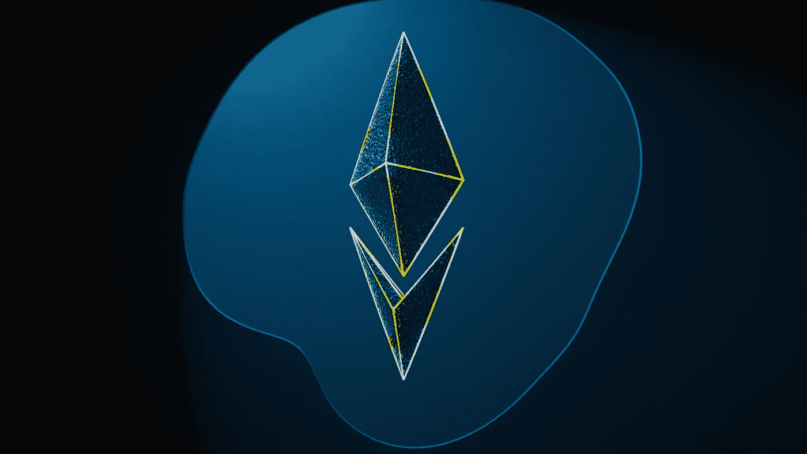
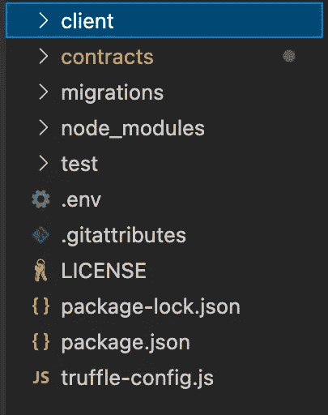

# 使用 Truffle 为 ERC-20 标准令牌创建一个众筹，并使用 Infura 进行部署

> 原文：<https://betterprogramming.pub/creating-a-crowdsale-for-an-erc-20-standard-token-using-truffle-and-deploying-with-infura-8d3b73eabb7>

## 实际操作的 web3 开发教程



由 [Unsplash](https://unsplash.com/@theshubhamdhage?utm_source=unsplash&utm_medium=referral&utm_content=creditCopyText) 上的 [Shubham Dhage](https://unsplash.com/@theshubhamdhage?utm_source=unsplash&utm_medium=referral&utm_content=creditCopyText) 拍摄的照片

元宇宙是最近一段时间的热门词汇。不难想象，它最受欢迎的时候恰逢脸书更名，以及该公司公开表示要在这个领域大展拳脚。

不甘落后于他们的科技巨头伙伴，微软也公开表示希望在元宇宙迅速取得进展。从我们所看到的一切来看，很明显，我们正处于大型科技公司之间数十亿美元竞赛的早期阶段，以在下一个重大事件中获得强大的立足点。

除了元宇宙，NFT 是另一个吸引了大多数人好奇心的热门话题。一些名人在他们的社交媒体个人资料中拿出自己的个人照片，并用猿的照片取而代之，这种现象是“不可替代的象征”的缩写，这种现象引起了人们的广泛关注。

当人们发现拥有这些类人猿的照片要花多少钱时，已经激起的兴趣只会进一步升级。围绕 NFTs 的讨论引发了一场非常有趣的讨论，但忠于本文的标题，目前我将带我们经历一次 ERC-20 标准令牌的大规模销售。

# 什么是大众销售？

大众销售是一种相对较新的加密货币或数字资产的公开发行和销售。

因此，我们可以将其重新表述为向公众提供早期产品，承诺让他们成为加密货币或资产的最初所有者。

ERC-20 标准令牌是使用 ERC-20 智能合约构建的可替换令牌。他们占据了现存的大部分代用币。就像我前面提到的，它们是可替换的令牌，与嗡嗡作响的非功能性令牌形成对比，后者以不可替换而闻名。

除了使用两种不同的 ERC 标准之外，两者之间的主要区别在于，可替换的令牌可以互换，与不可替换的令牌不同。

我开始这个项目的第一步是使用 NPM 命令在我的系统上全局安装 truffle。

我需要一个预先存在前端的松露盒，所以我决定用松露反应盒。这个选择受到我过去用 JavaScript 框架创建客户端代码的经验的影响。

Web2 上的 ReactJs 和 Web3 上的 ReactJs 有些不同，但其结构和基础仍然是相同的。使 ReactJs 编写的 Web3 版本与众不同的一个特性是需要能够调用智能契约及其内置函数。

```
npm install truffle -gnpx truffle unbox react
```

一个正确的 unboxed Truffle React 框应该自动设置如下所示的目录



`truffle-config.js`是一个重要的文件，它包含支持智能合约编译和部署的必要配置。

我们指定了将在我们的智能合同的编译中使用的确切的 solidity 版本，以及我们试图连接的以太坊网络的细节。

众所周知，部署智能合约需要真金白银，因此在以太坊测试网或私有以太坊节点上进行测试非常重要。

因此，我们可以确保在部署到 mainnet 之前，我们已经做了所有必要的调整，mainnet 需要真正的资金来支付煤气费。下面是我们的 truffle-config.js 的样本:

正如我前面提到的，我们将为我们的大众销售项目创建 ERC-20 代币。ERC 是`ETHEREUM REQUESTING FOR COMMENTS`的缩写。

从零开始创造 ERC-20 代币可能是一项令人疲惫和复杂的任务，我们应该感谢 Openzeppelin 的优秀人员，他们为我们提供了 ERC 标准智能合同，因为他们使我们的工作变得更加容易。

这些智能合同会定期更新和改进，以确保其功能是最新的。我们所要做的就是将我们想要的 ERC 合同导入到我们的项目目录中，然后我们就可以开始创建我们的 ERC-20 令牌了。

```
npm install @openzeppelin/contracts
```

旧版本的 Openzeppelin 智能合约具有群体销售智能合约，但随着时间的推移，这个 solidity 文件已被淘汰。使用这种合约给了我们更多关注大众销售背后的一些额外逻辑的奢侈，因为我们完全知道大众销售智能合约已经覆盖了我们。

因此，为了利用现有众筹智能合约的可用性，我们将不得不使用旧版本的 Openzeppelin 合约。

要安装特定版本的 npm 软件包，我们只需在 install 命令的末尾添加版本。

```
npm install @openzeppelin/contracts@2.5.0
```

unboxed truffle react box 在契约和测试文件夹中带有预先存在的文件。

这些文件与我们的项目无关，建议删除。

我们将需要创建我们的令牌契约，它将与已经导入的 Openzeppelin 契约进行交互，以创建我们的 ERC-20 令牌。

上面是来自 Openzeppelin 的一个模板，用于创建我们的令牌契约，它与已经导入的 ERC20 标准契约进行交互并继承它们。

在 solidity 中，我们可以使用继承来访问外部契约的功能。我们使用“is”关键字来做到这一点。因此，我们可以修改上面的契约来创建我们的令牌。我们可以添加我们首选的令牌名称、它的符号以及它开始时可用的令牌总数。

我的最终 token 契约代码和 Openzeppelin 提供的原始模板之间的一个显著区别是我使用的 solidity 版本。

这是必要的，因为获得众筹合同意味着我必须使用旧版本的 Openzeppelin。需要确保所有的文件都运行在同一个版本的 solidity 上。

正如我前面提到的，我们在`truffle-config.js`文件中指定了 solidity 的一个版本，因此我们项目中的每个 solidity 文件都运行在同一个版本上是至关重要的。这是很多人在构建他们的分散项目时遇到的一个错误。

光靠`Crowdsale.sol`文件并不能满足代币销售的所有要求，因此要完成这项工作，我们需要创建另一个文件来定义逻辑，并强制执行更多关于购买代币的条件。

智能合约的美妙之处在于，它为开发者和创造者提供了一条制定和执行不可篡改的规则的途径。我在这个项目中强制执行的一个很好的例子是要求每一个购买 ERC-20 代币的人都必须通过某种验证程序。

为了做到这一点，我写了一个 KYC 智能合同，确保只有通过验证过程的地址才能参与我的令牌的众包销售。

在`KycContract`中，我们继承自己拥有的契约。Ownable 契约由 Openzeppelin 提供，它包含的函数确保只有契约的所有者才能调用所需的契约。这些函数被称为修饰符，它们的职责是确保在执行某些函数之前满足某些条件。当我们完成了`KycContract`之后，我们可以将它导入到我们的`TokenSale`合同中，以确保在执行代币购买之前满足 KYC 条件。

此时，我们已经完成了智能合同，我们必须转移到下一个节点，确保我们的迁移文件设置完善。

通过观察，您会发现一个`Migrations`子文件夹，其中包含两个文件:`1_initial_migration.js`和`2_deploy_contracts.js`。我们不能对第一个进行更改，因为它是自动设置的，但我们必须对后者进行更改，以适应我们的 solidity 文件，并确保合同以正确的方式部署。

完成迁移文件后，我们的下一站是非常重要的一站。Web3 交易收取真金白银的概念并不新鲜，因此在我们将代码发布到 mainnet 之前，对其进行仔细的验证和检查是非常重要的。

为了确保我们的智能合约的效率和准确性，我们编写单元测试来确保它们在特定条件下正常工作。使用一些流行的测试库，如 Chai、Mocha，也可以对可靠性进行测试。

```
npm install chai chai-as-promised chai-bn
```

我们必须为我们的 ERC-20 令牌智能合约和令牌销售合约编写测试。这是为了确保在我们部署到以太网之前，它们都以预期的方式工作。然后我们在候机厅进行松露测试。

我们的测试成功运行，因此是时候跨越并对我们前端的 React 代码进行必要的调整了。

Truffle React 盒子附带了预先存在的 React 代码，我们必须修改这些代码才能与我们的智能合约连接，以便拥有一个功能性的分散应用程序。

在我继续之前，我必须强调，在我们的智能契约被成功编译和迁移之后，它们将作为工件存储在我们项目的客户端。

因此，我们没有将合同直接导入 ReactJs 文件，而是导入工件。这些工件包含契约 ABI，它使我们能够访问 React 文件中的契约函数。ABI 是应用程序二进制接口的缩写。

我们准备将我们的分散式应用程序部署到以太坊主网上，就像整个区块链生态系统一样，这本身也有一些障碍。

然而，该生态系统的一个突出特点是我们可以使用大量的应用程序或软件，旨在使每一步都相对容易。部署的主题就是 Infura 的用武之地。

什么是 Infura？引用创建者的话，“ *Infura 提供了工具和基础设施，使开发人员能够轻松地将他们的区块链应用从测试阶段扩展到大规模部署阶段——简单、可靠地访问以太坊和 IPFS。*

要开始使用 Infura，我们需要创建一个帐户。注册完成后，我们会被重定向到仪表板，在那里我们可以创建一个新项目。


以太坊被选为我们的产品类型，因为我们正在创建一个以太坊产品。ETH2 是下拉列表中的另一个选项，但目前仍处于早期阶段。

ETH2 是以太坊区块链当前版本的升级版，旨在解决困扰该平台的最大问题，即疯狂的天然气费用。这也将标志着从工作证明(POW)到利益证明(POS)共识机制的过渡。

在我们创建了一个新项目之后，我们将获得一个惟一的项目 ID 和项目密钥，这是连接到 Infura 端点所必需的。Infura 为我们提供了选择端点的选项，它可以是 mainnet 或 testnets。

最著名的试验网是 Ropsten、Goerli、Kovan 和 Rinkeby。正如我已经多次提到的，部署到 mainnet 需要真正的现金，所以在部署到 mainnet 之前，部署到 Testnet 以确保我们的项目顺利运行是没有坏处的。

为了在 testnet 上部署，我们将需要 testnet 令牌而不是 ether，我们可以很容易地从水龙头网站免费获得这些令牌。以下是测试网的网站。

```
Ropsten: [https://faucet.ropsten.be/](https://faucet.ropsten.be/)
Goerli: [https://goerli-faucet.slock.it/](https://goerli-faucet.slock.it/)
Rinkeby: [https://faucet.rinkeby.io/](https://faucet.rinkeby.io/)
```

使用 Infura 提供的项目 ID 和键，我们返回到 truffle-config.js 文件，在这里我们可以做一些修改，使项目能够连接到我们首选的 Infura 端点。

就是这样！！

至此，我们已经完成了将项目部署到区块链以太坊的所有必要工作。

这是一种令人满足的感觉，开始部署一份合同，并与区块链互动，知道你很早就接触到一项将改变整个世界的技术。

关于区块链/网络，我们仅仅触及了表面，已经取得的成就令人惊讶。大多数代币，无论是可替代的还是不可替代的，都是使用我们已经经历过的相同标准和步骤创建的，当我们考虑到它们已经产生的影响时，我们就可以意识到我们已经获得的机会，只需几行代码就可以对世界产生影响。

```
For a look at the complete codebase for my project, here is the link to its [Github repository](https://github.com/SwizzSamuel/GFD-Token).
```