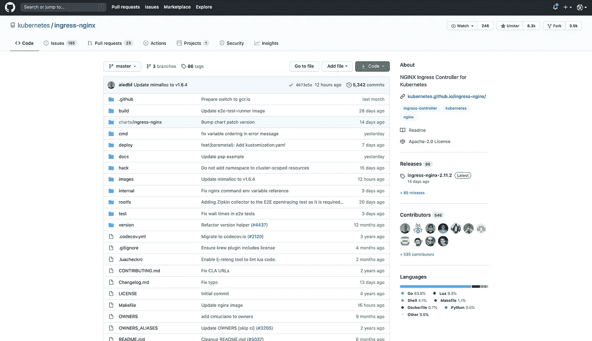
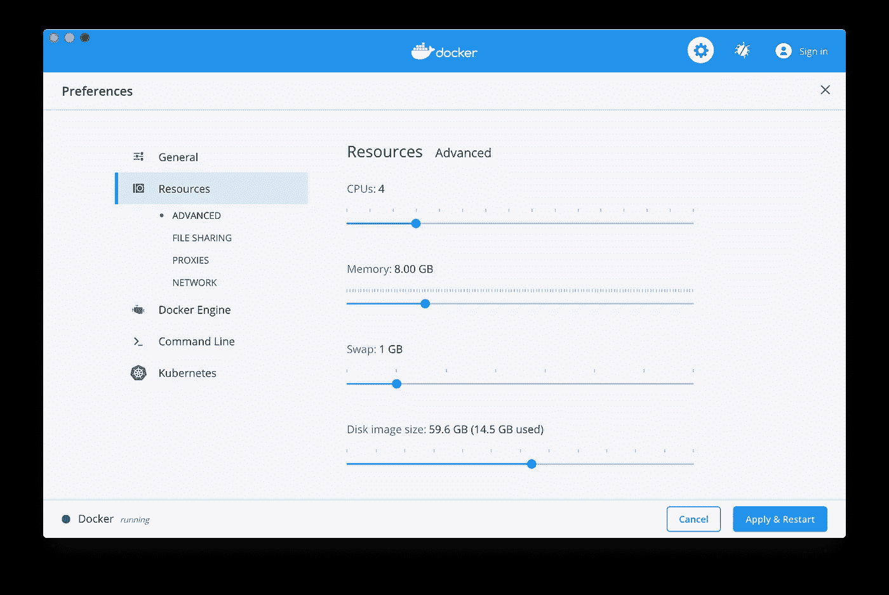

# 为 Kubernetes ingress-nginx 控制器创建自定义注释

> 原文：<https://betterprogramming.pub/creating-a-custom-annotation-for-the-kubernetes-ingress-nginx-controller-444e9d486192>

## 更好的 nginx 搭配 Kubernetes


伊恩·杜利在 [Unsplash](https://unsplash.com?utm_source=medium&utm_medium=referral) 上的照片

有很多关于使用 [ingress-nginx](https://github.com/kubernetes/ingress-nginx) 的博客和文章，但我注意到没有多少关于实际开发 Kubernetes ingress 控制器的功能。

早在 2018 年，我就是 KubeCon Europe 的一名演讲者，并就这个主题进行了介绍，我希望让任何人都可以轻松开始。

展示了如何为 ingress-nginx 创建注释和配置映射更改

本指南将为您提供创建 [ingress-nginx](https://github.com/kubernetes/ingress-nginx) 注释的深入解释，以及如何将其反馈给 Kubernetes 社区的技巧。

# 先决条件

*   [GoLang](https://golang.org/) 知识
*   GoLang 模板知识
*   Kubernetes inginx 的知识
*   [Docker 桌面](https://www.docker.com/products/docker-desktop)

本指南假设您知道如何使用 ingress-nginx，并且了解基本的 Kubernetes 对象(如服务和部署)是如何工作的。

# 了解 ingress-nginx Repo

为了开始为 ingress-nginx 创建注释，首先需要了解项目的结构。



kubernetes/ingress-nginx Github Repo

我将介绍几个对开发注释很重要的项目文件夹:

*   `build`:包含 MakeFile 需要的脚本
*   `docs`:包含使用的相关文件
*   `deploy`:包含部署所需的 YAML 文件
*   `internal`:包含大部分入口控制器逻辑
*   `rootfs`:包含配置和模板文件

为了开始创建我们的注释，我们将使用这些目录。

# 创建注释

可以在位置、服务器和全局级别应用注释。该注释将根据注释中提供的值为服务器分配一个昵称。我已经创建了一个[提交](https://github.com/diazjf/ingress/commit/2e6ac94dd79e80e1b2d788115647f44a526afcfd) 你可以跟随。


由 [Link Hoang](https://unsplash.com/@linkhoang?utm_source=medium&utm_medium=referral) 在 [Unsplash](https://unsplash.com?utm_source=medium&utm_medium=referral) 上拍照

创建注释所需的步骤如下:

1.  您必须在[注释](https://github.com/kubernetes/ingress-nginx/tree/master/internal/ingress/annotations)中用特征名创建一个新文件夹，并添加一个`main.go`。`main.go`将包含注释逻辑。
2.  然后，您必须将注释变量添加到`[annotations.go](https://github.com/kubernetes/ingress-nginx/blob/master/internal/ingress/annotations/annotations.go)`中，以便可以访问它。
3.  然后在`[types.go](https://github.com/kubernetes/ingress-nginx/blob/master/internal/ingress/types.go)`中，添加将在服务器结构中使用的昵称变量。这样，您可以在下一步中设置它。
4.  之后，在`[controller.go](https://github.com/kubernetes/ingress-nginx/blob/master/internal/ingress/controller/controller.go)`中，您必须确保用注释中的值填充服务器。该文件包含处理入口对象并将其转换为可加载到 nginx 配置中的对象的逻辑。
5.  最后，您必须编辑`[nginx.tmpl](https://github.com/kubernetes/ingress-nginx/blob/master/rootfs/etc/nginx/template/nginx.tmpl)`，以便我们从服务器结构中获取注释生成的变量。

查看[提交](https://github.com/diazjf/ingress/commit/2e6ac94dd79e80e1b2d788115647f44a526afcfd) 以更好地了解所有这些是如何联系在一起的，并随时发布任何问题。

# 测试注释

为了测试注释，我们可以执行以下操作:

1.首先，让我们给 Docker 桌面添加内存。虽然可以用更少的内存运行，但是推荐 8GB。



2.现在，我们可以安装所有必需的应用程序来创建开发环境。

*   [种类](https://kind.sigs.k8s.io/docs/user/quick-start/)
*   [库贝克特尔](https://kubernetes.io/docs/tasks/tools/install-kubectl/)
*   [掌舵](https://helm.sh/docs/intro/install/)

我用的是 OSX，所以我会用[家酿](https://brew.sh/)安装，但是这些工具可以通过其他方式安装在其他操作系统上。单击每个链接获取安装指南。

3.创建一个运行您的 ingress-nginx 控制器版本的开发集群。这是通过几个简单的命令完成的。

```
$ cd ingress-nginx$ make clean$ make build
go: downloading k8s.io/klog v1.0.0
go: downloading k8s.io/apimachinery v0.18.5
...$ make dev-env
[dev-env] building image
...
Kubernetes cluster ready and ingress-nginx listening in localhost using ports 80 and 443
...$ kubectl get pods -n ingress-nginx
NAME                                      READY   STATUS      
ingress-nginx-admission-create-mjqhb      0/1     Completed
ingress-nginx-admission-patch-krjg8       0/1     Completed
ingress-nginx-controller-6fcd5657-vql5g   1/1     Running
```

4.创建部署、服务和入口。这一步是必需的，这样我们就可以测试新的入口规则。

## 部署

这里我们部署的`gcr.io/kubernetes-e2e-test-images/echoserver:2.1` 只是用关于请求的信息来响应。该应用程序在端口 8080 上运行。

```
$ echo "
apiVersion: apps/v1
kind: Deployment
metadata:
  name: meow
spec:
  replicas: 2
  selector:
    matchLabels:
      app: meow
  template:
    metadata:
      labels:
        app: meow
    spec:
      containers:
      - name: meow
        image: gcr.io/kubernetes-e2e-test-images/echoserver:2.1
        ports:
        - containerPort: 8080
" | kubectl apply -f -# wait a min for the deployment to be created
$ kubectl get deploy
NAME       DESIRED   CURRENT   UP-TO-DATE   AVAILABLE
meow       2         2         2            2# you should have 2 pods running
$ kubectl get pods
NAME                       READY     STATUS
meow-5557bc7c54-cw2ck     1/1       Running
meow-5557bc7c54-kfzm5     1/1       Running
```

## 服务

该服务允许其他 pod 通过分配的集群 IP 访问上面的应用程序。

```
$ echo "
apiVersion: v1
kind: Service
metadata:
  name: meow-svc
spec:
  ports:
  - port: 80
    targetPort: 8080
    protocol: TCP
    name: http
  selector:
    app: meow
" | kubectl apply -f -# wait a min for the service to be created
$ kubectl get svc
NAME           TYPE        CLUSTER-IP      EXTERNAL-IP   PORT(S)
meow-svc       ClusterIP   10.107.78.24    <none>        80/TCP
```

## 进入

这个入口允许我们通过/meow 路径访问服务 meow-svc。因为我们没有指定主机，所以我们可以从集群中访问它。我们将发送一个请求，只是为了确保它得到适当的响应。

```
$ echo "
apiVersion: extensions/v1beta1
kind: Ingress
metadata:
  name: meow-ingress
  annotations:
    nginx.ingress.kubernetes.io/nickname: \"crazzzzy-server\"
spec:
  rules:
  - http:
      paths:
      - path: /meow
        backend:
          serviceName: meow-svc
          servicePort: 80
" | kubectl apply -f -$ kubectl get ing
NAME           CLASS    HOSTS   ADDRESS   PORTS   AGE
meow-ingress   <none>   *                 80      5s$ kubectl get pod -n ingress-nginx
NAME                                      READY   STATUS
ingress-nginx-admission-create-mjqhb      0/1     Completed
ingress-nginx-admission-patch-krjg8       0/1     Completed
ingress-nginx-controller-6fcd5657-vql5g   1/1     Running# Since we haven't exposed the ingress-controller, let's see if the routing is working from the pod
$ kubectl exec -it ingress-nginx-controller-6fcd5657-vql5g -n ingress-nginx -- curl 127.0.0.1/meowHostname: meow-85d75dbf8d-lczd2
Pod Information: 
  -no pod information available-
Server values:
  server_version=nginx: 1.12.2 - lua: 10010
Request Information:
  client_address=10.244.0.6
  method=GET
  real path=/meow
  query=
  request_version=1.1
  request_scheme=http
  request_uri=http://127.0.0.1:8080/meowRequest Headers:
  accept=*/*
  host=127.0.0.1
  user-agent=curl/7.67.0
  x-forwarded-for=127.0.0.1
  x-forwarded-host=127.0.0.1 
  x-forwarded-port=80
  x-forwarded-proto=http
  x-real-ip=127.0.0.1
  x-request-id=c183a12ae4aec14ea023b7e23d1e5246
  x-scheme=httpRequest Body:
  -no body in request-
```

5.现在让我们看看我们的变化是否传播了。我们可以通过检查 ingress-nginx 配置文件的变化来做到这一点。

```
$ kubectl exec -it ingress-nginx-controller-6fcd5657-vql5g  -n ingress-nginx -- cat /etc/nginx/nginx.conf | grep crazzzzy-server -a5 -b5
7411- proxy_cache_path /tmp/nginx-cache-auth levels=1:2 keys_zone=auth_cache:10m max_size=128m inactive=30m use_temp_path=off;
7534-
7537- # Global filters
7556-
7559- ## start server _
7579: # crazzzzy-server
7599- server {
7610-  server_name _ ;
7629-
7633-  listen 80 default_server reuseport backlog=511 ;
7685-  listen [::]:80 default_server reuseport backlog=511 ;
```

现在你有了，一个工作注释！现在您可以开始为 nginx 可用的所有特性创建注释了。

你可以从检查你想处理的问题开始，或者看看 nginx [指令](http://nginx.org/en/docs/dirindex.html)还没有实现。

# 回馈社会

如果你有一个想要贡献给社区的功能，有很多方法可以开始:

1.  看看是否有你想解决的问题，联系创造者，让他们知道你会解决它。
2.  如果没有问题，请随意创建一个。与社区互动，看看开发这个特性是否有意义。
3.  开始制作你的特写。一定要添加单元测试和功能测试。
4.  提交一份 PR。

如果你需要任何帮助，从 Kubernetes Slack[中的#ingress-nginx 通道开始。Kube 社区很棒，有很多人愿意帮忙。](https://slack.k8s.io/)

感谢您的阅读，我希望本指南能让您对 ingress-nginx 控制器有所贡献。