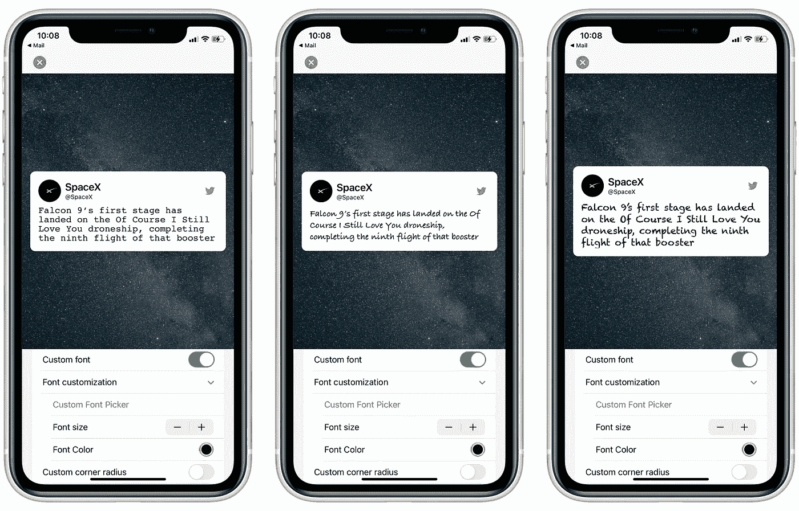
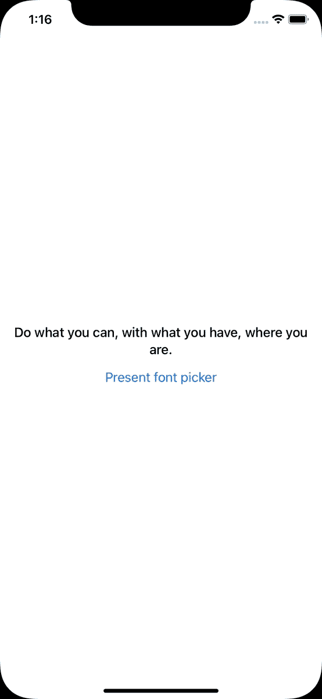

# 在 SwiftUI 中为 swift ui 创建自定义字体选择器

> 原文：<https://betterprogramming.pub/creating-a-custom-font-picker-in-and-for-swiftui-f4722a5ed99e>

## 在 SwiftUI 应用程序中利用 UIViewControllerRepresentable



SwiftUI 应用程序中的自定义字体。作者照片。

在过去的一年里，SwiftUI 变得比几年前更加健壮和成熟。然而，SwiftUI 中仍然缺少相当多的 UIKit 元素——其中之一就是`UIFontPickerViewController`。这个 UIKit 类是`UIViewController`的子类，用于允许用户选择预先安装在设备上的字体。这提供了一个全新的可定制性维度，这也是我在更新[贴纸卡](https://apps.apple.com/us/app/id1522226018)时正在做的事情。

在本教程中，我们将构建一个简单的桥，将这一强大的特性引入 SwiftUI。激动吗？让我们开始吧。

# 配置内容视图

在我们的示例应用程序的`ContentView`，这是应用程序的根视图，我们将创建一个`Text`视图和一个`Button`视图。`Text`视图将显示一个样本文本，我们将在其上应用用户从`UIFontPickerViewController`中选择的自定义字体。`Button`将用于呈现这个字体选择器控制器。`ContentView`应该是这样的:

这个视图除了显示我们上面讨论过的两个视图之外什么也不做。在我们向`ContentView`添加任何功能之前，让我们创建一个将`UIFontPickerViewController`引入 SwiftUI 的桥梁。

# CustomFontPicker

创建一个新的 Swift 文件并将其命名为`CustomFontPicker`。这个文件将包含我们的桥梁。首先导入`UIKit`和`SwiftUI`框架。我们现在将创建一个新的可表示的视图控制器结构，名为`CustomFontPicker`。我们将使这个结构符合`UIViewControllerRepresentable`协议。您的`CustomFontPicker`结构现在应该是这样的:

```
**struct** CustomFontPicker: UIViewControllerRepresentable {
}
```

一旦你添加了协议一致性，Xcode 不会对你满意的，除非你添加了协议存根。所以让我们现在就开始吧。将这两个方法添加到`CustomFontPicker`结构中:

在继续之前，让我们创建一个动作处理程序，当用户从字体列表中选择一个新的字体时，这个动作处理程序将被触发。我们还将添加一个`Environment`属性包装器，一旦字体被成功选取，该包装器将用于关闭该视图。现在将这两个属性添加到`CustomFontPicker`结构中:

```
@Environment(\.presentationMode) **var** presentationMode
**private** **let** onFontPick: (UIFontDescriptor) -> Void
```

`onFontPick`是一个简单的动作处理程序，一旦被触发就会提供一个`UIFontDescriptor`回调。现在让我们在结构体的初始化器中使用一个转义闭包来初始化它。将此代码添加到`CustomFontPicker`:

```
**init**(onFontPick: @escaping (UIFontDescriptor) -> Void) {
        **self**.onFontPick = onFontPick
}
```

现在是时候创建`Coordinator`类了——你猜对了——它将协调整个操作。这个类将包含对`UIFontPickerViewController`的委托的委托回调。在`CustomFontPicker`结构内部，创建一个名为`Coordinator`的嵌套类。使`Coordinator`符合`NSObject`和`UIFontPickerViewControllerDelegate`。`Coordinator`类现在应该看起来像这样:

```
**class** Coordinator: NSObject, UIFontPickerViewControllerDelegate {
}
```

在这个类中，创建两个属性:`parent`和`onFontPick`。我们需要访问协调器的父级(在本例中，就是`CustomFontPicker`结构),以便能够在用户选择新字体时关闭控制器。我们还将引用`onFontPick`动作处理程序，因为我们将连接这个类中的代理。将这两个属性添加到您的`Coordinator`类中:

```
**var** parent: SUIFontPicker
**private** **let** onFontPick: (UIFontDescriptor) -> Void
```

让我们首先初始化这两个属性。将此添加到`Coordinator`类:

```
**init**(**_** parent: SUIFontPicker, onFontPick: @escaping (UIFontDescriptor) -> Void) {
    **self**.parent = parent
    **self**.onFontPick = onFontPick
}
```

`UIFontPickerViewControllerDelegate`由这两个可选协议存根定义:

在本教程中，我们将使用`fontPickerViewControllerDidPickFont`方法。首先将这个方法添加到您的`Coordinator`类中:

```
**func** **fontPickerViewControllerDidPickFont**(**_** viewController: UIFontPickerViewController) {
}
```

这个方法将为我们提供一个类型为`UIFontPickerViewController`的视图控制器。这个视图控制器有一个名为`descriptor`的属性。我们将用这个描述符构造一个`UIFont`,然后将它传递给我们的动作处理程序。将这两行添加到`fontPickerViewControllerDidPickFont`方法中:

```
**guard** **let** descriptor = viewController.selectedFontDescriptor **else** { **return** }
onFontPick(descriptor)
```

由于用户现在已经选择了字体，并且我们已经将它传递给了我们的操作处理程序，我们可以简单地使用:

```
parent.presentationMode.wrappedValue.dismiss()
```

因此，在所有这些之后，`fontPickerViewControllerDidPickFont`方法应该是这样的:

现在让我们回到`parent`结构并配置视图控制器。在`makeUIViewController`方法中，添加以下几行:

创建一个`makeCoordinator`方法来创建我们刚刚创建的`Coordinator`类的一个实例:

```
**func** **makeCoordinator**() -> CustomFontPicker.Coordinator {
    **return** Coordinator(**self**, onFontPick: **self**.onFontPick)
}
```

就是这样！我们已经成功地配置了我们的桥。剩下要做的就是在我们的应用程序中测试它。

# 返回内容视图

我们将首先创建一个新的`@State`属性作为我们的字体。这将是类型`UIFont`，我们将在`Text`的修饰符内把它转换成`Font`。将该属性添加到`ContentView`:

```
@State **private** **var** customFont: UIFont = UIFont.preferredFont(forTextStyle: .body)
```

现在，将这个修饰符添加到`Text`视图中，它将把我们的自定义字体应用到文本中:

```
.font(Font(customFont))
```

我们把`customFont`转换成了`Font`，所以我们让 SwiftUI 很开心！现在剩下要做的就是给`VStack`添加一个 sheet 修饰符来呈现`CustomFontPicker`视图。我们还需要向`ContentView`添加一个`@State`属性，这样我们就可以跟踪工作表的显示状态。将该附加属性添加到`ContentView`:

```
@State **private** **var** isShowingFontPicker = **false**
```

给你的`VStack`添加一个表单修改器。使用动作处理程序的闭包从`CustomFontPicker`获取描述符，并将其分配给`ContentView`的`customFont`状态属性，如下所示:

```
.sheet(isPresented: $isShowingFontPicker) {
    CustomFontPicker { descriptor **in**
        customFont = UIFont(descriptor: descriptor, size: **18**)
     }
}
```

现在，我们将使用`Button`来切换`isShowingFontPicker`的状态。将这行代码添加到`Button`的动作处理程序中:

```
isShowingFontPicker.toggle()
```

我们都做完了。现在运行应用程序，你应该可以点击按钮来显示`CustomFontPicker`，让你选择一个自定义字体。一旦选中，该自定义字体将被设置为您的`Text`视图的字体样式。难以置信的东西。下面这张 GIF 图展示了这款应用的运行情况:



应用程序在运行

我已经把这座桥打包成了一个快捷的包裹。可以在 GitHub 上查看[。](https://github.com/SwapnanilDhol/SUIFontPicker)

感谢您通读这整个教程。如果你有任何问题，请在评论区留言。