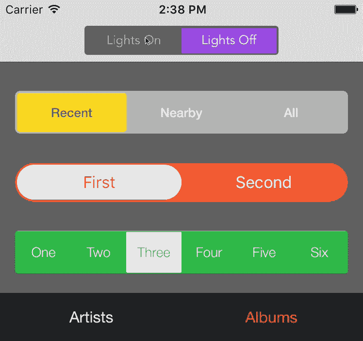
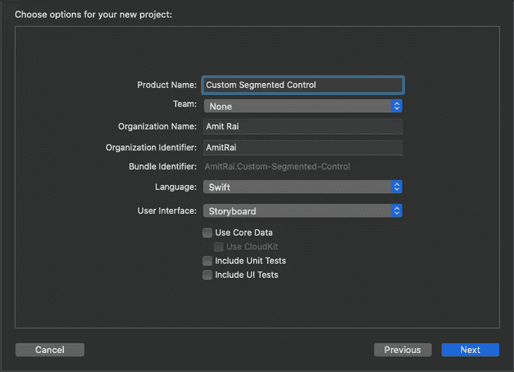
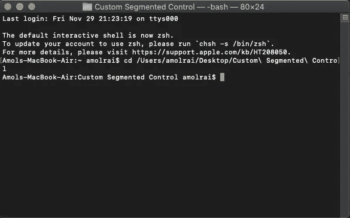
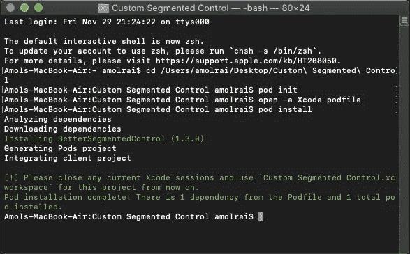

# 在 Swift 中创建自定义细分市场

> 原文：<https://betterprogramming.pub/creating-a-custom-segment-in-swift-b1f11d17d369>

## 如何用 Xcode 和 CocoaPods 设置自定义段



这篇文章的目的是用我们的示例 iOS 应用程序实现定制的分段控制。

> ***如果你正在准备你的技术编码面试，或者你想学习递归来提高你解决问题的技能，那么你应该查看这个 udemy 课程*** [**递归大师班，从 C++**](https://www.udemy.com/course/master-the-recursion-from-beginner-to-advance-level/?referralCode=75F57675BDABF6D104C0) ***的初级到高级水平，或者你可以在***[***skill share***](https://skl.sh/3PTOCns)***上查看这个递归课程。***
> 
> **如果你想从初学者到专家水平学习 ARKit 3，然后点击** [**这里**](https://www.udemy.com/course/ios-13-swift-5-the-complete-arkit-3-course/?couponCode=FORCREATOR) **获得课程，你还将获得 97%的折扣。**
> 
> **如果你对学习 iOS 移动开发充满热情，并希望将你的 iOS 开发技能提升到一个新的水平，那么使用 CloudKit framework 的核心数据应该是你的首选。点击** [**此处**](https://www.udemy.com/course/mastering-coredata-with-cloudkit-in-swift-5-for-ios/?couponCode=FORDEVS) **获取课程，还可享受 97 折优惠。**
> 
> **从头开始学习 SwiftUI 点击** [**此处**](https://www.udemy.com/course/swiftui-the-complete-course-building-real-world-apps/?couponCode=FORCODERS) **获取课程，因为在本课程中，我们将使用 SwiftUI 构建许多应用，如脸书克隆、新闻应用、笔记应用等等。**

# 特征

*   可用作分段控制或开关。
*   过多的可定制选项，从颜色到插入，半径，动画。
*   使用文本或图标作为段，或者添加您自己的自定义段。
*   界面生成器中的可设计直线。
*   可定制的行为。

# 示例 iOS 应用程序入门

打开 Xcode[并创建一个新的 Xcode 项目。](https://developer.apple.com/xcode/)

在 iOS 模板部分选择*单视图应用*，点击*下一个*。


输入您的产品名称，单击下一步，然后在桌面上创建它。



现在，关闭 Xcode 项目，打开终端。我们必须安装[椰子脚架](https://cocoapods.org/)。

如果你不知道如何安装 CocoaPods，请完成以下步骤。如果你已经知道如何安装它，或者你已经在你的 Mac 上安装了 [CocoaPods](https://cocoapods.org/) ，跳过这一部分。

打开您的终端，粘贴以下命令:

```
sudo gem install cocoapods
```

现在，你的终端会询问你的 MacBook 密码。输入密码，点击*回车*安装 CocoaPods。等待几分钟，这可能需要一些时间，这取决于你的网速。

安装 CocoaPods 之后，使用这个命令进入您的项目目录:`cd your project name`并点击*进入*。



终端应该是这样的

在您的终端中写入`pod init`。这个命令将在你的 Xcode 项目中创建一个`podfile`。

在你喜欢的文本编辑器中打开`podfile`，将下面一行粘贴到你的`podfile`中。

```
# Swift 5.1
pod 'BetterSegmentedControl', '~> 1.3'

# Swift 4
pod 'BetterSegmentedControl', '1.0'

# Swift 3 / Objective-C
pod 'BetterSegmentedControl', '0.8'
```

点击`Command+S`保存`podfile`。

现在关闭文本编辑器，将以下命令粘贴到您的终端中，以便在 Xcode 项目中安装`pod`:

```
pod install
```



终端应该是这样的

关闭终端，打开`xcworkspace` Xcode 项目。

按`Command+B`构建项目。直接去`Main.storyboard`，从对象库中取一个`UIView`。

将其拖到画布上，并对其进行约束。单击`UIView`，转到身份检查器，并为您的`UIView`将自定义类命名为`BetterSegmentedControl`。

Xcode 将构建您的项目，因此等到构建完成，您的`UIView`上将有一个自定义片段。故事板会自动刷新以显示可检查的属性。

现在去属性检查器，给分段`Corner Radius`、`Indicator View Background Color`、`Indicator View Inset`、`Indicator View Border Width`、`Indicator View Border Color`、`Animation Spring Damping`等等。

您可以选择任意多段并对其进行自定义。

# 结论

这件作品到此为止。我们已经创建了自定义分段控件。在您的 iOS 应用程序中实现这种分段控制，为用户提供丰富的用户体验。

> ***如果你正在准备你的技术编码面试，或者你想学习递归来提高你解决问题的技能，那么你应该查看这个 udemy 课程*** [**递归大师班，从 C++**](https://www.udemy.com/course/master-the-recursion-from-beginner-to-advance-level/?referralCode=75F57675BDABF6D104C0) ***的初级到高级水平，或者你可以在***[***skill share***](https://skl.sh/3PTOCns)***上查看这个递归课程。***

# 额外资源

> **如果你想从初学者到专家水平学习 ARKit 3，然后点击** [**这里**](https://www.udemy.com/course/ios-13-swift-5-the-complete-arkit-3-course/?couponCode=FORCREATOR) **获得课程，你还将获得 97%的折扣。**
> 
> **如果你对学习 iOS 移动开发充满热情，并希望将你的 iOS 开发技能提升到一个新的水平，那么使用 CloudKit framework 的核心数据应该是你的首选。点击** [**此处**](https://www.udemy.com/course/mastering-coredata-with-cloudkit-in-swift-5-for-ios/?couponCode=FORDEVS) **获取课程，还可享受 97 折优惠。**
> 
> **从头开始学习 SwiftUI 点击** [**此处**](https://www.udemy.com/course/swiftui-the-complete-course-building-real-world-apps/?couponCode=FORCODERS) **获取课程，因为在本课程中，我们将使用 SwiftUI 构建许多应用，如脸书克隆、新闻应用、笔记应用等等。**