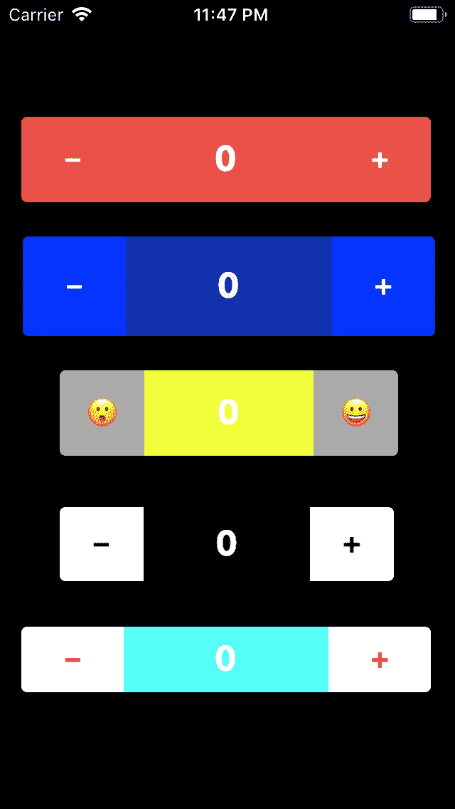
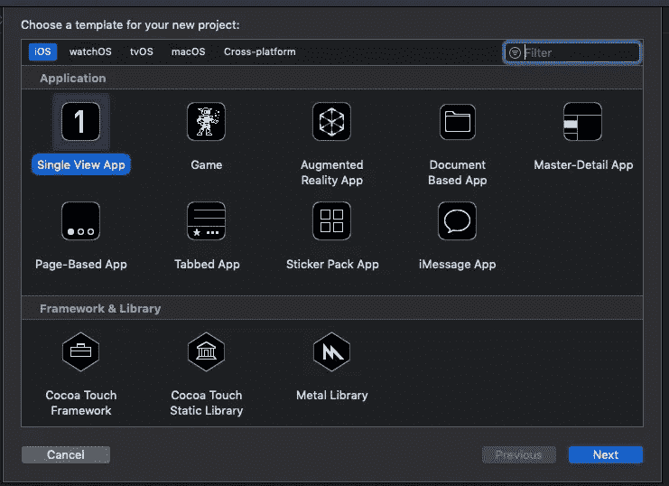
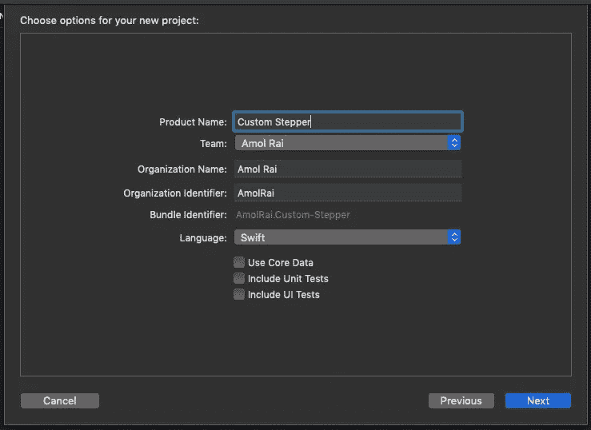
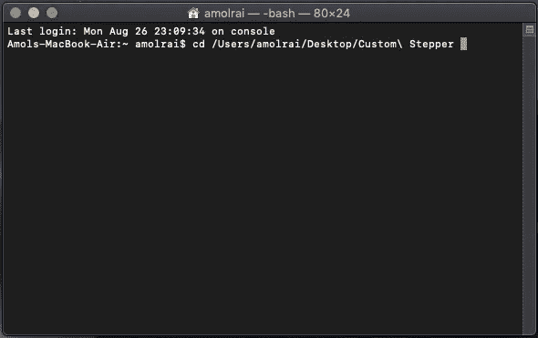
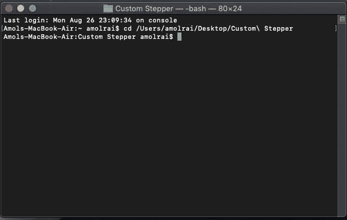
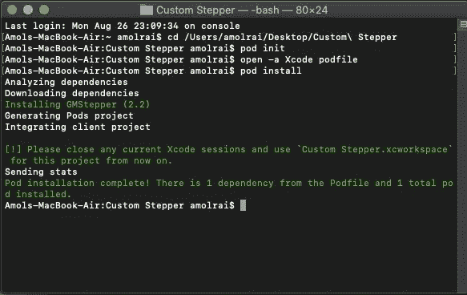

# 在 Swift 中创建自定义步进器

> 原文：<https://betterprogramming.pub/creating-a-custom-stepper-in-swift-875f0ab8c5c5>

## 如何用 Xcode 和 CocoaPods 设置步进器

# 我们要做什么

我们将创建一个自定义步进器，无需编写一行代码。当您轻按步进器的加号按钮时，值将增加，当您轻按减号按钮时，值将减少。

> ***如果你正在准备你的技术编码面试或者你想学习递归来提高你解决问题的技能，那么你一定要查看这个*免费的 *udemy 课程*** [***掌握从初级到高级的递归***](https://www.udemy.com/course/master-the-recursion-from-beginner-to-advance-level/?referralCode=75F57675BDABF6D104C0)
> 
> **如果您想从初学者到专家级别学习 ARKit 3，请点击** [**此处**](https://www.udemy.com/course/ios-13-swift-5-the-complete-arkit-3-course/) **获取课程，您还将获得 97%的折扣。**
> 
> **如果你对学习 iOS 移动开发充满热情，并希望将你的 iOS 开发技能提升到一个新的水平，那么使用 CloudKit 框架的核心数据应该是你的首选。点击** [**此处**](https://www.udemy.com/course/mastering-coredata-with-cloudkit-in-swift-5-for-ios/?couponCode=FORDEVS) **获取课程，还可享受 97 折优惠。**
> 
> **从头开始学习 SwiftUI 点击** [**此处**](https://www.udemy.com/course/swiftui-the-complete-course-building-real-world-apps/?couponCode=FORCODERS) **获取课程，因为在本课程中，我们将使用 SwiftUI 构建许多应用，如脸书克隆、新闻应用、笔记应用等等。**

# 入门指南

打开 [Xcode](https://developer.apple.com/xcode/) ，新建一个 Xcode 项目。选择 iOS 模板下的“单视图应用程序”，然后单击“下一步”

输入您喜欢的“产品名称”，然后单击“下一步”并在桌面上创建。

# 使用 CocoaPods 添加 GMStepper 库

如果您没有安装 [CocoaPods](https://cocoapods.org/) ，请在您的终端中执行以下命令来安装它。

`sudo gem install cocoapods`

终端会询问你的 Macbook 密码，所以输入密码，点击 enter 键安装 CocoaPods。

等待几分钟来安装 CocoaPods。这要看你的网速了，耐心点。

安装 CocoaPods 后，使用命令`cd`后跟项目名，进入终端中的项目目录，然后按 enter 键。

终端将如下所示:

现在，您位于项目目录中。

写`pod init`。这个命令会在你的 Xcode 项目中创建一个 podfile，然后在你喜欢的文本编辑器中打开这个 podfile。将下面一行粘贴到 podfile 中:

`pod 'GMStepper'`

点击“命令 S”保存你的 podfile，然后关闭 podfile 并打开终端。写`pod install`。此命令将在 Xcode 项目中安装 pod。

终端将如下所示:

现在打开您的 xcworkspace Xcode 项目，然后按“Command B”来构建项目。然后直接进入`Main.storyboard`，从对象库中取出一个 UIView，拖到画布上，点击 UIView，进入身份检查器，将 UIView 的自定义类命名为“GMStepper”Xcode 会构建您的项目，所以请等待构建完成。然后，您将在 UIView 上拥有一个自定义步进器。

现在转到属性检查器，给按钮一个背景颜色，标签文本颜色，标签背景颜色，以及属性检查器中可用的其他东西。您可以选择任意数量的踏步机并进行定制。

> ***如果你正在准备你的技术编码面试，或者你想学习递归来提高你解决问题的技能，那么你一定要查看这个*免费的 *udemy 课程*** [***从初级到高级掌握递归***](https://www.udemy.com/course/master-the-recursion-from-beginner-to-advance-level/?referralCode=75F57675BDABF6D104C0)

# 额外资源

如果你想从初学者到专家水平学习 ARKit 3，然后点击[这里](https://www.udemy.com/course/ios-13-swift-5-the-complete-arkit-3-course/?couponCode=FORCREATOR)获得课程，你也将获得 97%的折扣。

如果你对学习 iOS 移动开发充满热情，并希望将你的 iOS 开发技能提升到一个新的水平，那么 CloudKit framework 的核心数据应该是你的首选。点击[此处](https://www.udemy.com/course/mastering-coredata-with-cloudkit-in-swift-5-for-ios/?couponCode=FORDEVS)获取课程，您还将获得 97%的折扣。

从头开始学习 SwiftUI 点击[此处](https://www.udemy.com/course/swiftui-the-complete-course-building-real-world-apps/?couponCode=FORCODERS)获取课程，因为在本课程中，我们将使用 SwiftUI 构建许多应用，如脸书克隆、新闻应用、笔记应用等等。