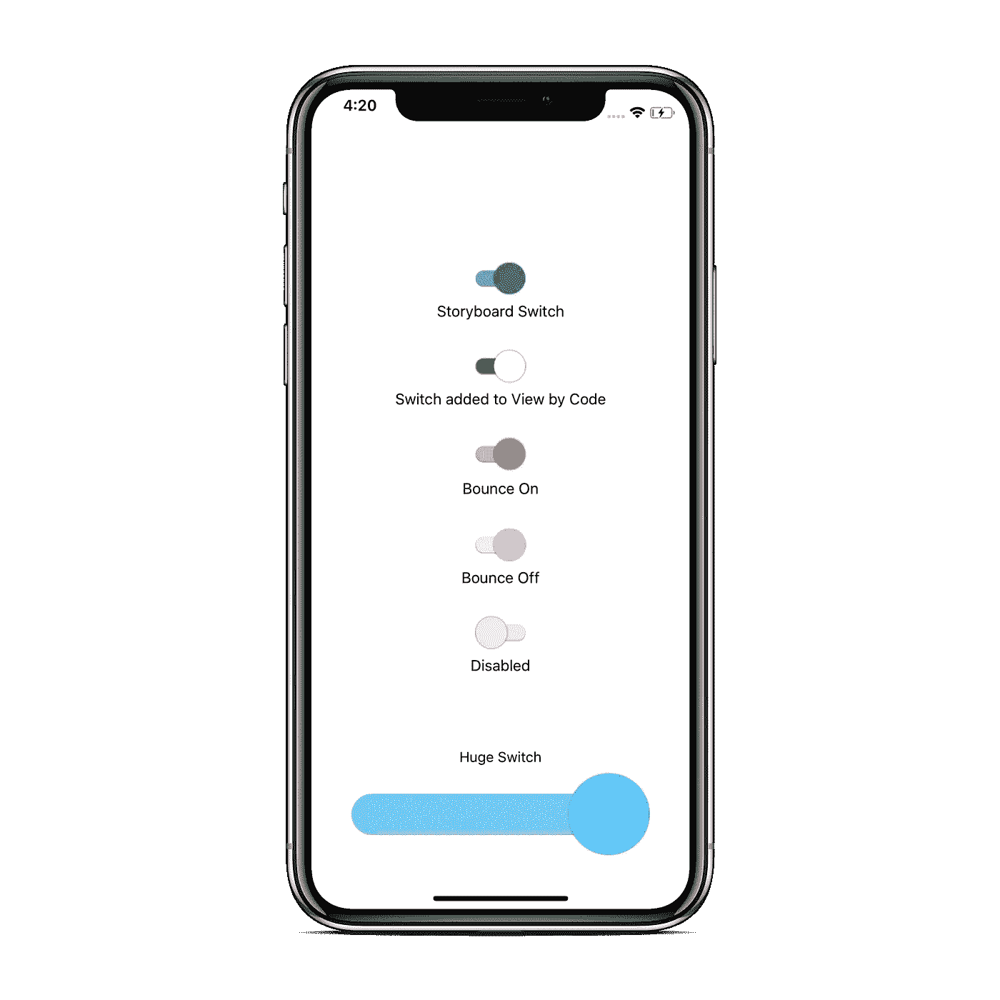
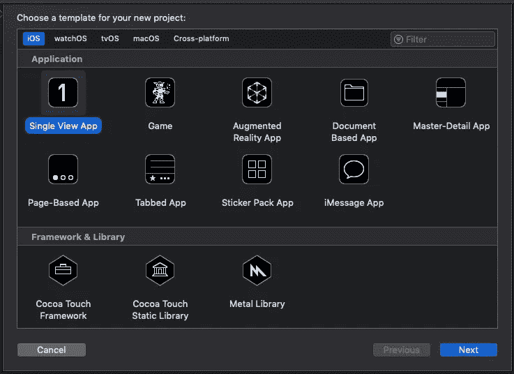
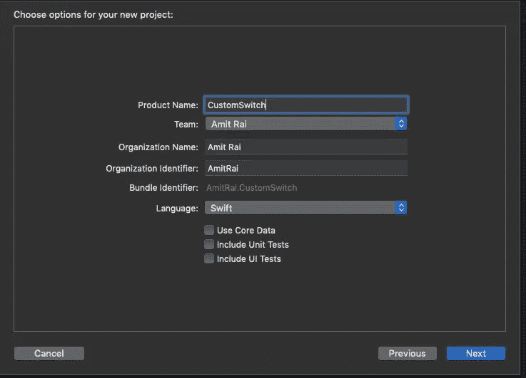
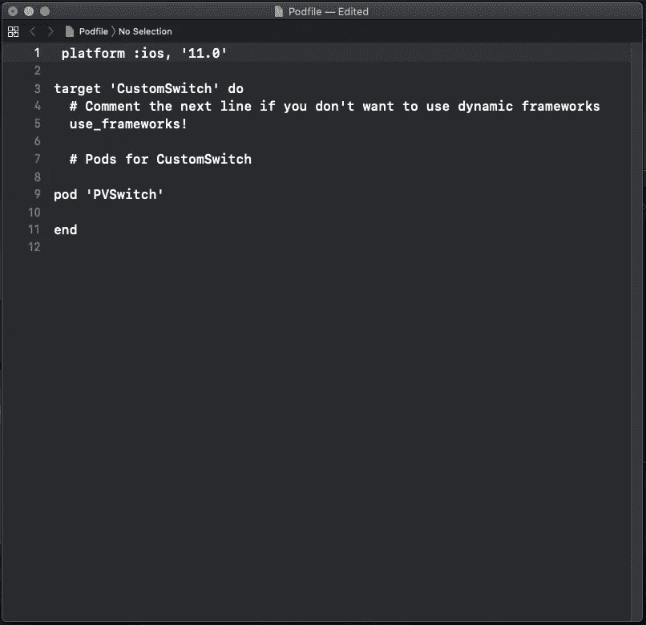
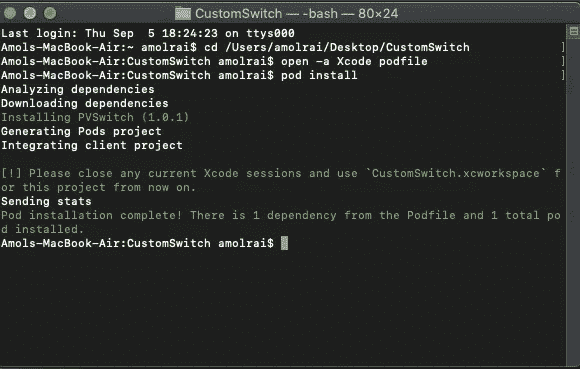

# 在 Swift 中创建定制交换机

> 原文：<https://betterprogramming.pub/creating-a-custom-switch-in-swift-9c4ce3bb445a>



> ***如果你正在准备你的技术编码面试，或者你想学习递归来提高你解决问题的技能，那么你应该查看这个 udemy 课程*** [**递归大师班，从 C++**](https://www.udemy.com/course/master-the-recursion-from-beginner-to-advance-level/?referralCode=75F57675BDABF6D104C0) ***的初级到高级水平，或者你可以在***[***skill share***](https://skl.sh/3PTOCns)***上查看这个递归课程。***
> 
> **如果你想从初学者到专家水平学习 ARKit 3，然后点击** [**这里**](https://www.udemy.com/course/ios-13-swift-5-the-complete-arkit-3-course/?couponCode=FORCREATOR) **获得课程，你还将获得 97%的折扣。**
> 
> **如果你对学习 iOS 移动开发充满热情，并希望将你的 iOS 开发技能提升到一个新的水平，那么使用 CloudKit framework 的核心数据应该是你的首选。点击** [**此处**](https://www.udemy.com/course/mastering-coredata-with-cloudkit-in-swift-5-for-ios/?couponCode=FORDEVS) **获取课程，还可享受 97 折优惠。**
> 
> **从头开始学习 SwiftUI 点击** [**此处**](https://www.udemy.com/course/swiftui-the-complete-course-building-real-world-apps/?couponCode=FORCODERS) **获取课程，因为在本课程中，我们将使用 SwiftUI 构建许多应用，如脸书克隆、新闻应用、笔记应用等等。**

# 入门指南

打开 [Xcode](https://developer.apple.com/xcode/) ，新建一个 Xcode 项目。

在 iOS 模板部分选择“单视图 App”，点击“下一步”



输入您的产品名称，单击“下一步”，然后在桌面上创建它。



现在，关闭 Xcode 项目，打开终端。我们必须安装 [CocoaPods](https://cocoapods.org/) 。如果您不知道如何安装 CocoaPods，请完成以下步骤，或者如果您已经知道如何安装，请跳过这一部分。

打开您的终端，并编写以下命令:

```
sudo gem install cocoapods
```

现在，你的终端会询问你的 MacBook 密码。输入密码，点击“Enter”安装 CocoaPods。等待几分钟；安装 CocoaPods 的时间取决于你的网速。

安装 CocoaPods 之后，使用下面的命令转到您的项目目录:`cd your project name.`单击“enter”


终端看起来像这样

在终端中写入`pod init`。这个命令将在你的 Xcode 项目中创建一个`podfile`。

在你喜欢的文本编辑器中打开`podfile`，在你的`podfile`中粘贴下面一行:

```
pod 'PVSwitch'
```

换平台到 iOS 11 或更高版本。



Podfile 看起来像这样

点击`podfile`中的 Command+S 进行保存。

关闭文本编辑器，在终端中粘贴以下命令，以便在 Xcode 项目中安装 pod:

```
pod install
```



终端看起来像这样

关闭终端，打开`xcworkspace` Xcode 项目。

按 Command+B 构建项目。直接进入`Main.storyboard`，从对象库中取出一个 UIView。在画布上拖动它。单击 UIView，转到 identity inspector，并将 UIView 的自定义类命名为`PVSSwitch`。

Xcode 会构建您的项目，所以请等待构建完成。当您在 UIView 上有一个定制的开关时，故事板会自动刷新以显示可检查的属性。

现在转到属性检查器，给开关`thumbOnTintColor`、`trackOnTintColor`、`thumbOffTintColor`、`trackOffTintColor`等等。

> ***如果你正在准备你的技术编码面试，或者你想学习递归来提高你解决问题的技能，那么你应该查看这个 udemy 课程*** [**递归大师班，从 C++**](https://www.udemy.com/course/master-the-recursion-from-beginner-to-advance-level/?referralCode=75F57675BDABF6D104C0) ***的初级到高级水平，或者你可以在***[***Skillshare***](https://skl.sh/3PTOCns)***上查看这个递归课程。***

# 额外资源

> **如果您想从初学者到专家级别学习 ARKit 3，请点击** [**此处**](https://www.udemy.com/course/ios-13-swift-5-the-complete-arkit-3-course/?couponCode=FORCREATOR) **获取课程，您还将获得 97%的折扣。**
> 
> **如果您热衷于学习 iOS 移动开发，并希望将您的 iOS 开发技能提升到一个新的水平，那么使用 CloudKit framework 的核心数据应该是您的首选。点击** [**此处**](https://www.udemy.com/course/mastering-coredata-with-cloudkit-in-swift-5-for-ios/?couponCode=FORDEVS) **获取课程，还可享受 97 折优惠。**
> 
> **从头开始学习 SwiftUI 点击** [**此处**](https://www.udemy.com/course/swiftui-the-complete-course-building-real-world-apps/?couponCode=FORCODERS) **获取课程，因为在本课程中，我们将使用 SwiftUI 构建许多应用，如脸书克隆、新闻应用、笔记应用等等。**