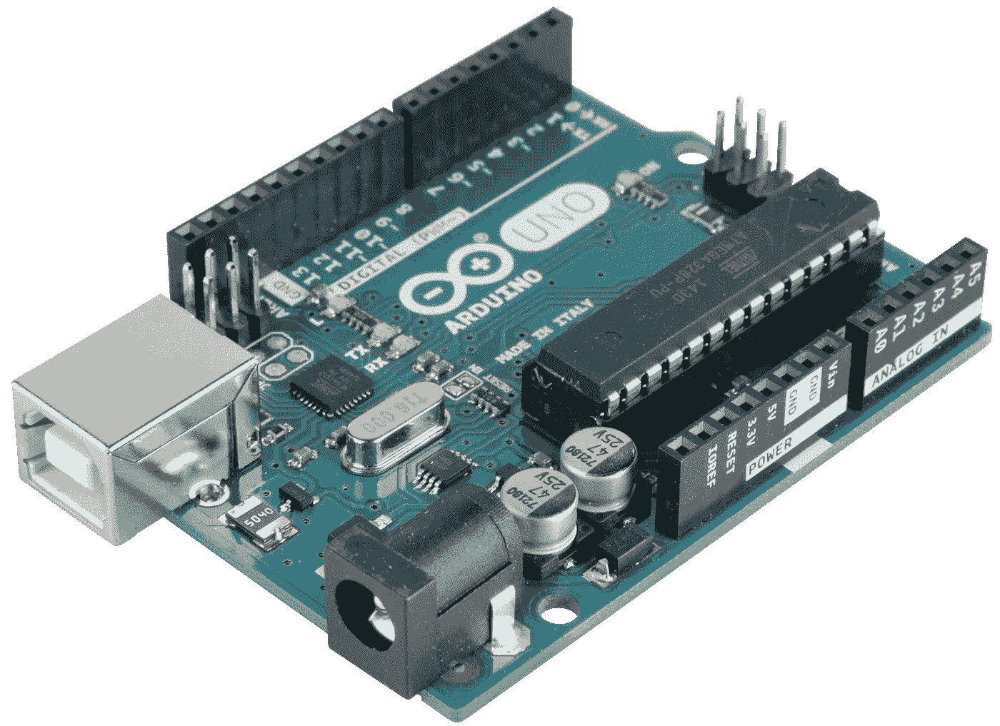
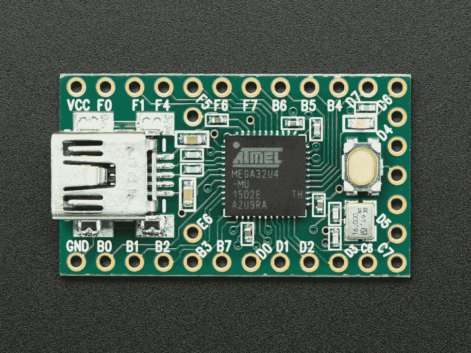
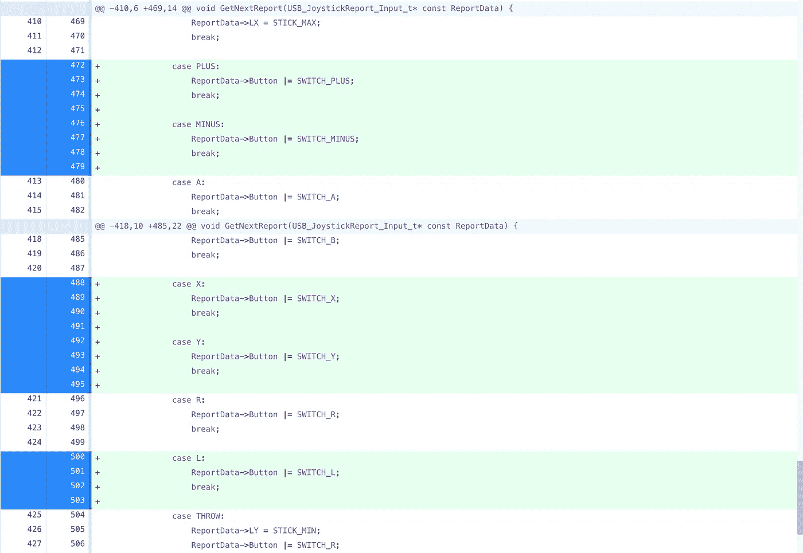
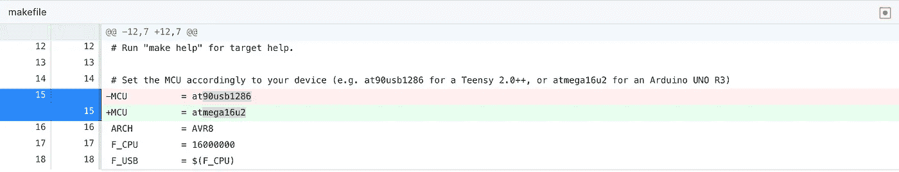
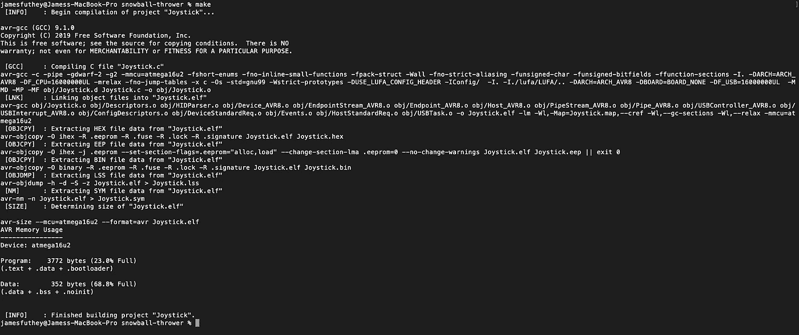
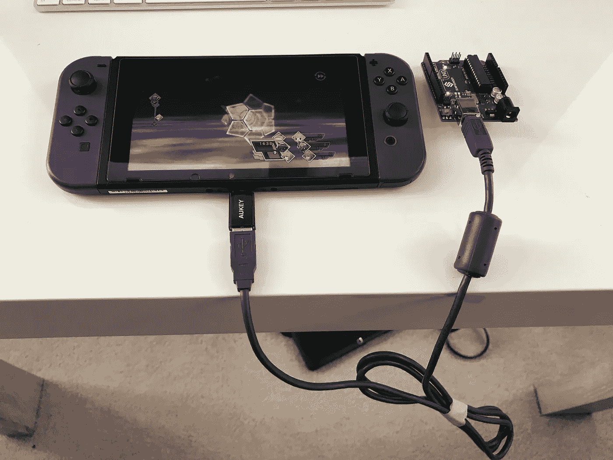
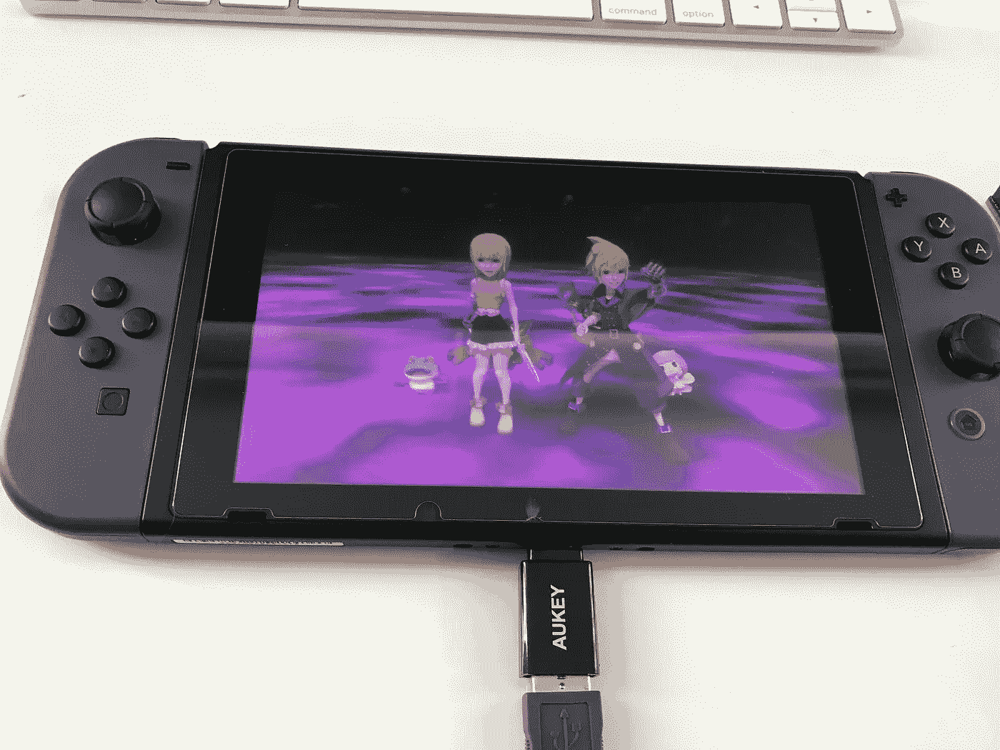
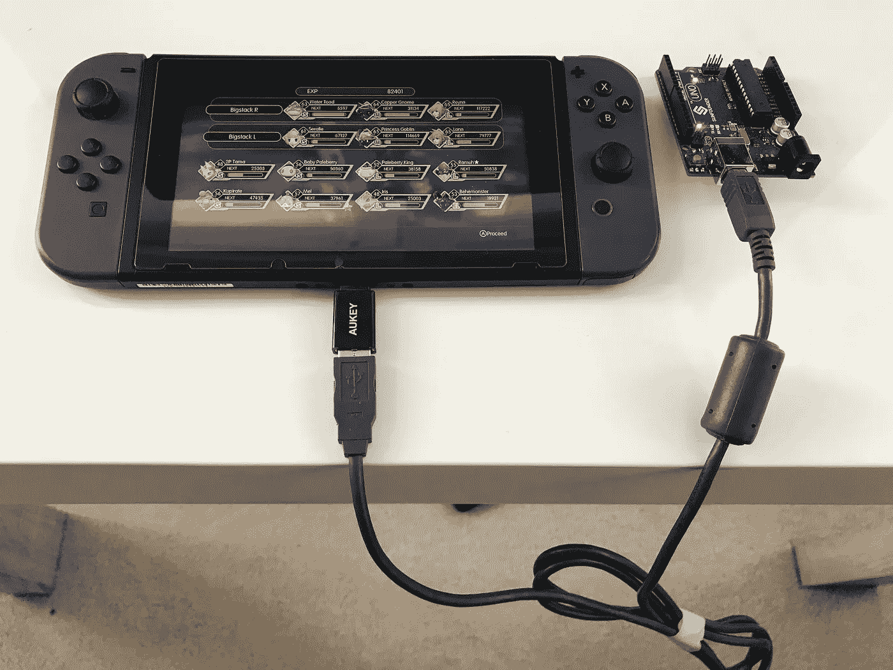
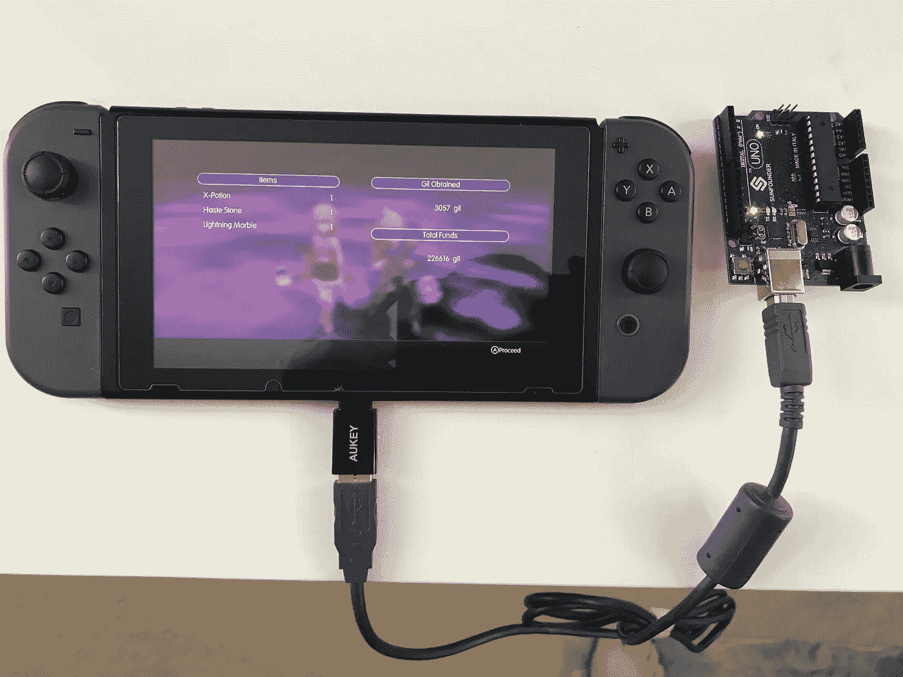

# 创造一个假的任天堂 Switch 控制器来提升我在最终幻想世界中的角色

> 原文：<https://betterprogramming.pub/creating-a-fake-nintendo-switch-controller-to-level-up-my-character-in-world-of-final-fantasy-b50adc269a1e>

## 使用一个 Arduino 板插入到开关 USB-C 端口来研磨和提升我的角色从 60 级到 90 级

最终幻想千里马的世界——任天堂 Switch

在过去的几周里，我一直在玩《最终幻想世界》,玩得非常开心！三天前我赢了比赛。现在，我正试图得到一个好的结局，这似乎需要一点点的打磨。

我找到了一个指南，它建议重复一场特定的战斗，以有效地从一场简单而短暂的战斗中获得经验。但是看起来我可能要花几天时间才能完成！我想我需要磨出 20-30 级来最大化我在几场难以置信的困难战斗中的属性。

它包括找到忘记名字的女孩并完成调查花园的任务。我手动完成大概需要三到四分钟，还有一大堆烦人的按键序列，比如选择正确的法术完成战斗，跳过动画场景，保存，等待等等。

很快就变得很烦人。比我想象的要烦人得多，而且我在其他游戏中也不陌生。加号按钮和场景跳转并不是 Switch Pro 控制器上常见的按键序列。

所以，我开始四处调查。我发现一些项目涉及拆除一个工作的专业控制器，但让我们尽量避免焊接一点。最后，我找到了一个用 C 写的例子，最初是用来创建 Splatoon 2 banners 的。是的，那些令人难以置信的花哨横幅是用软件创作的，而不是煞费苦心的艺术品。

这是一个 Arduino Teensy 的例子。我不得不做更多的研究，但幸运的是，设置工具链来编译一个普通的 Arduino Uno 不成问题——这是我已经有的东西。

Arduino Uno Genuino (R3)

 [## shinyquagsire 23/Switch-fight stick

### 任天堂 Switch 的概念验证 LUFA 项目。假装是一个只打印 Splatoon 2 的 HORI Pokken 垫…

github.com](https://github.com/shinyquagsire23/Switch-Fightstick) 

我又找了一会儿，找到了另一把叉子来对比:

 [## 自动化塞尔达

### 《塞尔达传说:荒野之息》是一款我真的很不擅长的惊艳游戏。我读到过平均数量的…

medium.com](https://medium.com/@bertrandom/automating-zelda-3b37127e24c8)  [## 伯特伦多姆/扔雪球者

### 《塞尔达传说:野性的呼吸》中保证打击的自动化雪球投掷…

github.com](https://github.com/bertrandom/snowball-thrower) 

这个版本已经成功修改为在《塞尔达:野性的呼吸》中扔雪球。看起来很有希望！

我也喜欢上面作者对原剧本的一些改进。首先，Teensy 的使用很好，所以我订购了一个。我认为这将是很好的创造一个可重用的版本，看起来更像一个拇指驱动器，而不是一堆乱七八糟的电线。

第二，作者稍微清理了一下代码，使得创建一个无限循环中的程序性按键序列变得更加容易(为了编写一个像这样的小东西)。以前的版本针对做其他事情进行了优化。

Teensy 是 Uno 的缩小版，所以我可以创建一个看起来更像 u 盘的东西。

## 把所有的放在一起

我要做的第一件事是在我的 Uno 上运行概念验证。这需要刷新 Arduino 引导加载程序，并使用 DFU 程序员来加载编译后的程序(相对于一个草图文件)。

 [## Arduino — DFUProgramming8U2

### Arduino 板上的 ATmega16U2 芯片在计算机的 USB 端口和主处理器的…

www.arduino.cc](https://www.arduino.cc/en/Hacking/DFUProgramming8U2) 

此外，在 OSX 卡塔利娜(Mac)，32 位可执行文件正在被否决。这意味着也要更新我的 AVR 工具链:

 [## osx-cross/homebrew-avr

### 自制 AVR 工具链。在 GitHub 上创建一个帐户，为 osx-cross/homebrew-avr 开发做贡献。

github.com](https://github.com/osx-cross/homebrew-avr) 

幸运的是，自从上个月 Catalina 开发者发布以来，围绕这些项目的社区已经做出了这些调整。

## 添加更多按钮

接下来，我发现有几个按钮没有被之前的项目使用。于是，我在`Joystick.c`中增加了对*加*、*减*、 *L* 、 *R* 、 *X* 和 *Y* 按钮的支持。

## 为 Atmega32 修改(Arduino Uno R3)

接下来，我为我的 Arduino 修改了`Makefile` ，运行`make`，交叉手指，闪烁 Arduino，并为我的第一次测试插上电源。

## 初次成功！

控制器被识别为输入设备，角色开始疯狂地移动。此时，我还没有尝试修改前面的脚本操作。

## 创建脚本

现在，对于花了几个小时调整的部分。

真的没有任何有用的方法来捕捉输入序列和时间，所以我开始添加按钮按下序列。通过反复试验和极大的耐心，我最终完成了一个脚本的工作版本，几乎无限地循环了整个事件序列。

以下系列视频可以帮助解释这一过程。

战斗的时间安排变得复杂了。事实证明，有几种策略并不是 100%的时候都有效。

最明显的一个就是使用物理攻击。然而，这只导致了大约 50%的胜率。

最快的情况是对所有目标施放雷霆咒，直到他们晕倒。

然而，这里有一个小问题:哪个角色最终会被首先选择似乎是随机的，并且他们的能力处于不同的顺序。因此，根据哪个角色先被激活，最终会使用不同的咒语序列。

所以，我最终决定为每个角色选择第一个咒语。对于 Lann 来说，这是一个非常强的雷咒。但对雷恩来说，这是一个火咒语。最强的敌人实际上很难抵抗，但它仍然能在 45 秒的战斗后很快击倒所有三个敌人(使用 R 触发器启用快进)。

## 决赛成绩

现在是压轴戏！下面是最终的循环脚本:

正在运行的最终循环脚本。

完成一场战斗大约需要三分钟，结果是 82，401 经验值，一些物品和 3057 吉尔。

如果你想知道为什么每次战斗后你都会看到一个暂停，这是有原因的。

在一个特定的场景中，所有的敌人都对雷恩进行了猛烈的攻击，雷恩没能保护她，导致她很快倒下，战斗拖长了一点，以一种近乎失败的状态。我用秒表记录了几场战斗的时间，并调整了时间，给了我们一个安全的窗口，总是能取得胜利，即使只是勉强获胜。这应该随着我等级的提高而提高。

## 源代码(GitHub)

 [## 小鬼哥斯拉/扔雪球者

### 在 GitHub 上创建一个帐户，为 kid Godzilla/雪球投掷器的开发做出贡献。

github.com](https://github.com/kidGodzilla/snowball-thrower) 

大概就是这样。感谢阅读！

[Meetingroom365.com](https://www.meetingroom365.com/)|[@ kidgdzilla](https://twitter.com/kidgdzilla)(推特)|[@ futhey](https://indiehackers.com/futhey)(indie hackers)|[@ kidgozilla](https://github.com/kidgodzilla)(GitHub)