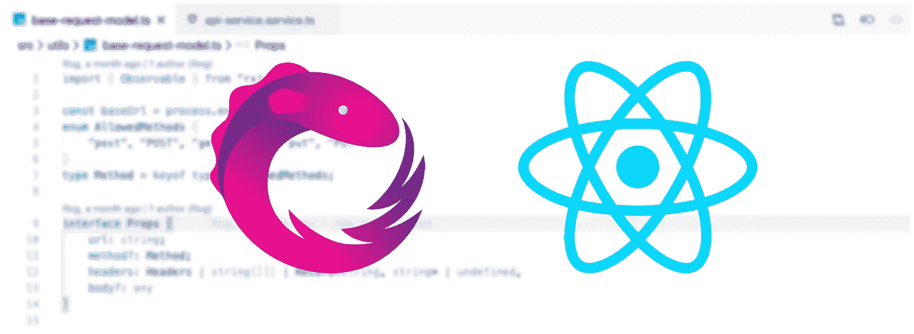
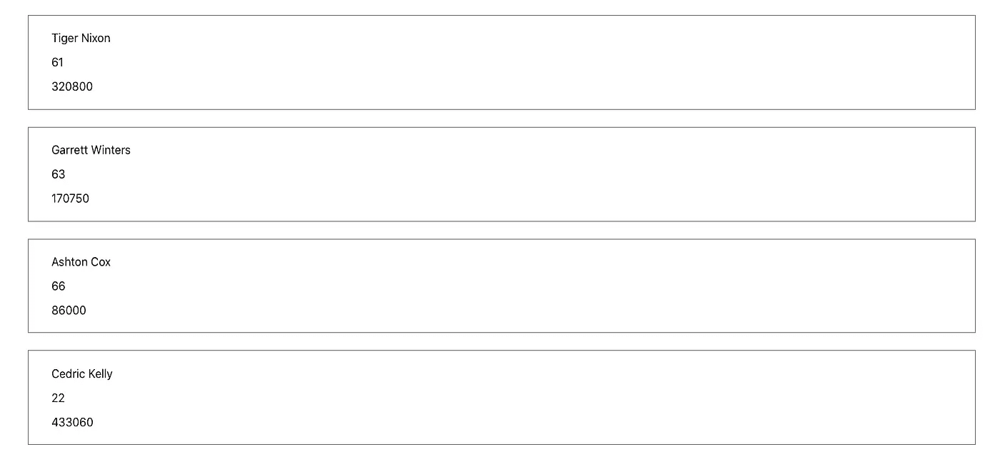
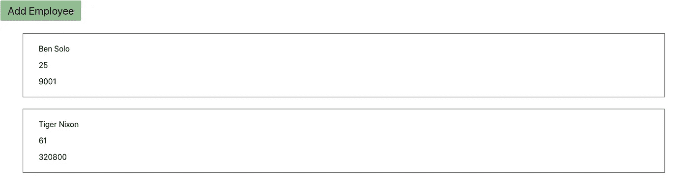

# 如何使用 RxJs、TypeScript 和 Fetch 在 React 中创建自定义请求模型

> 原文：<https://betterprogramming.pub/creating-a-fetch-model-for-react-using-rxjs-typescript-e2aecf113023>

## 让您的 API 请求更容易



图片来源:作者

从角度到反应的转变并不容易。这不是因为框架之间的难度不同，而是因为我知道我会多么想念无缝的 TypeScript 集成，以及服务和管道，但最重要的是可能不得不放弃 RxJs。也就是说，直到我做了一些研究，并意识到我不必这样做。因此，在本文中，我们将研究如何实现一个基本模型来使用 JavaScript 已经提供的 Fetch API，以及 TypeScript 和 RxJs。

首先，让我们使用以下命令创建一个全新的 React 项目，该项目立即支持 TypeScript:

```
npx create-react-app rxjs-react --template typescript
```

如果你想给当前的 React 项目添加类型脚本支持，请参考这个链接:[https://create-react-app.dev/docs/adding-typescript/](https://create-react-app.dev/docs/adding-typescript/)

设置好之后，切换到项目的根目录，运行以下命令来安装 RxJs:

```
npm i rxjs
```

安装完成后，我们就可以开始工作了。现在，您可以在首选的代码编辑器中打开项目并开始编码。下面是我们将在项目中遵循的文件结构。请注意，这些必须放在我们的`src`文件夹下。

```
-services
|-api.service.ts
|-index.ts-utils
|-types.ts
|-base-request-model.ts
```

我们将从创建我们的`types.ts`开始。在这里，我们将声明在执行我们的`fetch`请求时将使用的允许类型。

接下来，我们将创建我们的`base-request-model.ts`。这是我们将用来从我们的应用程序发出任何请求的模型。然后我们将这些类型导入到我们的`BaseRequestModel`中，如下所示:

```
import { Method, _Headers, Body } from "./types";
```

对于这个例子，我们将使用[http://dummy.restapiexample.com/api/v1](http://dummy.restapiexample.com/api/v1)作为我们的`baseUrl` ，并在我们的构造函数中将我们的默认方法设置为`GET` 。我们还将为属性实现我们自己的接口。该模型将包含以下内容:

```
const baseUrl = 'http://dummy.restapiexample.com/api/v1';interface Props {
  url: string;
  method?: Method;
  headers: _Headers,
  body?: Body
}
```

如果我们发出一个`get`请求，而我们没有提供一个主体，我们就让主体可选。然后，我们通过使用关键字“implements”**来实现接口，在我们的类名之后是接口名。然后，我们创建一个返回 observable 的方法，但在此之前，我们必须将 observable 接口导入到我们的文件中，以便使用它。**

```
import {Observable} from 'rxjs'
```

**然后我们在`BaseModel`构造器中初始化我们的属性。一个*构造函数*基本上是一个特殊的方法，用于初始化对象，当一个类的对象被实例化时被调用。**

**然后我们实现请求方法。在这个方法中，我们将使用内置的 Fetch API:**

**[https://developer.mozilla.org/en-US/docs/Web/API/Fetch_API](https://developer.mozilla.org/en-US/docs/Web/API/Fetch_API)**

**我们将返回包装在一个新的可观察对象中的已解决的承诺，其中我们使用可观察对象提供的`next()` 方法传递我们的值，并使用`complete()`关闭流。我们也可以使用`error()` 方法抛出错误，类似于承诺如何使用`resolve()` 和`reject()`。**

**`BaseRequestModel`到此为止。下面是完整的实现。**

**接下来，我们将创建我们的`api.service.ts`。这里我们将声明我们自己的`fetch`方法并返回一个 observable，以及创建我们可能需要传递的任何自定义头。现在，我们将只关注`post` 和`get` **，**但是如果需要的话，可以随意添加您自己的方法并进一步开发。**

**首先，我们将导入之前创建的`BaseRequestModel`和在`types.ts`中声明的`Body`接口。**

```
import BaseRequestModel from '../utils/base-request-model';
import { Body } from '../utils/types';
```

**然后我们实现包装在对象中的`get`方法，这样我们就可以轻松地访问它们，就像这样:**

```
const ApiService = {
  get: (route: string): Observable<any> => {
  const headers = {
    'Access-Control-Allow-Origin': '*'
  };
  const newBase = new BaseRequestModel(route, 'GET', headers);
  return newBase.request();
  },
}
```

**我们在这里所做的基本上是创建我们的`BaseRequestModel`的一个新实例。我们传递由构造函数定义的路由、方法和头，然后返回`request()` 方法属性，这是一个可观察的流，我们可以在以后订阅它来访问我们发出的请求的值。**

**我们对 post 方法重复这个步骤，除了一个表单参数，它的类型是从我们的头中的类型和内容类型导入的。然后，我们将表单传递给新的`BaseRequestModel`(这就是为什么我们将 body 设置为可选的)。**

**为了结束这一部分，我们将使用我们的`index.ts` **，**导出这些方法，我们将在我们的服务文件夹的根目录下创建这些方法。我们只需要将 export 关键字添加到我们的`ApiService` 变量中。下面是完整的实现。**

**最后，我们可以通过简单地将`ApiService`从我们的服务导入到任何我们想从中获取方法的组件中来测试这一点。**

```
import { ApiService } from "./services";
```

**现在，我们将在我们的`App.tsx` **中使用它。**我们首先为我们的员工创建一个界面。**

```
interface Employee {                         
   id: string;                         
   employee_name: string;                         
   employee_salary: string;                         
   employee_age: string;                        
   profile_image?: string;                       
}
```

**猫王接线员"？"表明`profile_image` 属性将是可选的，我们不必给它赋值。我们将从`get`请求开始。您可以将它放在一个函数中，并在需要时调用它，但是现在，我们将在我们的`useEffect()`中使用它。**

**请注意，在挂载时，我们将我们的订阅赋值，这样当组件卸载时，我们就可以很容易地取消订阅我们的可观察的 on cleanup。我们还使用从`‘rxjs/operators’` 导入的`take()` 操作符，并传递`(1)` 以便我们只获得流的第一个结果，以及`map()` 操作符，以便在将接收到的任何数据赋给组件内的任何值之前对其进行操作。在这种情况下，我只想从响应中返回`res.data` 。**

**然后，我们将结果映射到模板上，并为每个 div 注释添加一些样式，以声明组件范围之外的样式对象。**

**这将是结果:**

****

**然后，我们包含一个按钮来测试雇员的添加，以及在组件范围之外声明的适当样式。**

****

**然后我们定义我们的`addEmployee`函数。**

**我们将从 ApiService 向 post 方法传递一个包含 id、年龄、工资和雇员姓名的对象，然后在订阅成功或 post 请求成功时将该对象推到雇员数组的前面。保存，然后单击 Add Employee 按钮，查看添加到员工列表中的新员工。**

****

**本·索洛加入了这个名单**

**下面是完整的实现。**

**总之，RxJs 集成是可能的，并且做了很多非常棒的事情。它允许您创建定制的事件流，您甚至可以添加多个侦听器。Observables 转换也可以像我们使用`map()`那样被链接起来，这对于帮助保持我们的代码在一起非常有用。**

**感谢阅读！**