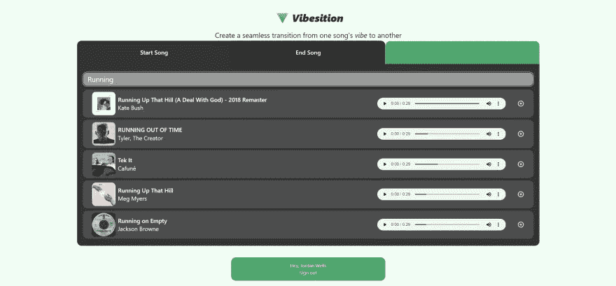
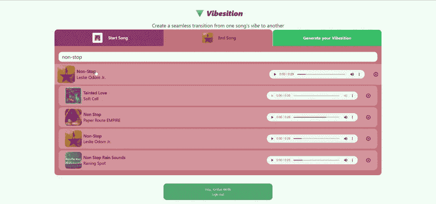
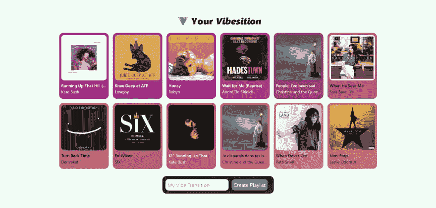

# 创建一个成熟的 Spotify 播放列表生成器

> 原文：<https://betterprogramming.pub/creating-a-full-fledged-spotify-playlist-generator-in-a-weekend-498bb488c275>

## 从一首歌的氛围无缝过渡到另一首


亚历山大·沙托夫在 [Unsplash](https://unsplash.com?utm_source=medium&utm_medium=referral) 上拍摄的照片

最近，我想更好地理解[API](https://aws.amazon.com/what-is/api/)是如何工作的。我用了一些简单的，会[为你产生随机颜色](https://www.colr.org/api.html)，或者给你一个[随机狗事实](https://kinduff.github.io/dog-api/)(你知道竖起耳朵的狗比耷拉耳朵的狗听声音更好吗？).API 是为你的 web 应用获取数据的一个很好的工具，但是几乎所有更复杂的 API 都需要[认证和授权](https://auth0.com/docs/get-started/identity-fundamentals/authentication-and-authorization)。

为此，我决定使用 [Spotify 的 Web API](https://developer.spotify.com) 。它提供了大量的文档，允许你做用户在平台上能做的几乎任何事情；搜索歌曲，创建播放列表，获取推荐，等等。

我做的应用程序叫做 Vibesition，它允许用户制作一个播放列表，从一首歌的氛围无缝过渡到另一首歌的氛围。这是我做过的最喜欢的网站开发项目。

在[vibesition.jordantwells.com](https://vibesition.jordantwells.com)亲自尝试一下吧！它的所有源代码都可以在我的 GitHub 上找到。

# 使用 NextAuth.js 进行身份验证



搜索一首有节奏的歌曲

NextAuth 是 Next.js 的一个工具，它使得与 GitHub、脸书、Discord 和[更多](https://next-auth.js.org/configuration/providers/oauth)等流行的登录服务的集成变得尽可能简单。我强烈推荐使用 [create-t3-app](https://create.t3.gg) 来初始化您的项目，因为它可以为您设置 NextAuth 的大部分样板文件。

您需要做的唯一更改是对[…nextauth]。ts
文件，使用 [SpotifyProvider](https://next-auth.js.org/providers/spotify) ，给你的 app 适当的[授权范围](https://developer.spotify.com/documentation/general/guides/authorization/scopes/)。客户端 ID 和客户端密码都来自于向 [Spotify 开发者仪表板](https://developer.spotify.com/dashboard/)注册应用程序。当您在这里时，请确保在您的重定向 URIs 中添加类似于"[http://localhost:3000/API/auth/callback/Spotify](http://localhost:3000/api/auth/callback/spotify)"的内容，以确保您可以正确登录。

设置 NextAuth

在我的例子中，我选择了一个允许我查看用户的电子邮件地址并修改他们的公共播放列表的范围，就像我需要的[VI position](https://vibesition.jordantwells.com)一样。

为了实际使用这个 API，需要将授权代码换成一个访问令牌，这个令牌将是您在定义的范围内使用任何端点的入场券。

关于这个过程的更多细节可以在 Spotify 的文档中找到。请注意，这个刷新令牌来自 NextAuth 生成的令牌:

使用 Spotify API

注意，`refreshToken`参数来自 NextAuth，在我的设置中可以通过。

获取 accessToken

# 构建应用程序



选择带有振动位置的歌曲

现在我有了 Spotify API 的强大支持(在我定义的小范围内)，我终于可以开始构建我的 web 应用程序了。

我希望用户能够搜索歌曲作为播放列表的起点和终点。为此，我使用[搜索端点](https://developer.spotify.com/documentation/web-api/reference/#/operations/search)从 Spotify 搜索中获取前 5 个响应。一旦用户选择了一首歌曲，如上所示，它会在 React 状态下保存 Spotify ID。这个 ID 被用作许多其他端点的查询，所以保存它是一件好事。

一旦用户选择了一首歌曲，它就会使用[Spotify Audio Features](https://developer.spotify.com/documentation/web-api/reference/#/operations/get-audio-features)endpoint 根据歌曲的~vibe~自动生成一种颜色。具体来说，我使用歌曲的可跳性、能量和效价(我也不知道它是什么意思)的组合来确定 RGB 值。

为了确定哪些歌曲将出现在播放列表中，我使用了[获取推荐](https://developer.spotify.com/documentation/web-api/reference/#/operations/get-recommendations)端点。这允许你根据目标特征来查找歌曲，例如可跳舞性、速度、音调、持续时间等等。在这种情况下，我使用了一个[类 sigmoid 插值](https://en.wikipedia.org/wiki/Sigmoid_function)在两首歌曲的音频特征值之间进行插值，并在曲线上获得 10 首歌曲的目标值。

最后，为了创建播放列表，我使用了[创建播放列表](https://developer.spotify.com/documentation/web-api/reference/#/operations/create-playlist)和[添加项目到播放列表](https://developer.spotify.com/documentation/web-api/reference/#/operations/add-tracks-to-playlist)的端点。



Vibesition 的结果页面

这个项目还添加了一大堆其他的好东西。我使用[帧运动](https://www.framer.com/motion/)给整个项目一些急需的生命。我使用了 [HTML 音频标签](https://www.w3schools.com/html/html5_audio.asp)来允许用户播放歌曲，如果他们有来自 Spotify 的预览 URL。当然，我使用了 [Tailwind CSS](https://tailwindcss.com) 来使 UI 成为这个过程中最简单的部分。

# 结论

总的来说，这是一个学习使用高效 API 的令人难以置信的项目。我希望在未来使用更多，并将它们整合到我的项目中，使获取有趣的数据变得容易。

感谢阅读！

```
If you’re interested in more of my projects or me, check out my personal website, [jordantwells.com](https://jordantwells.com).
```