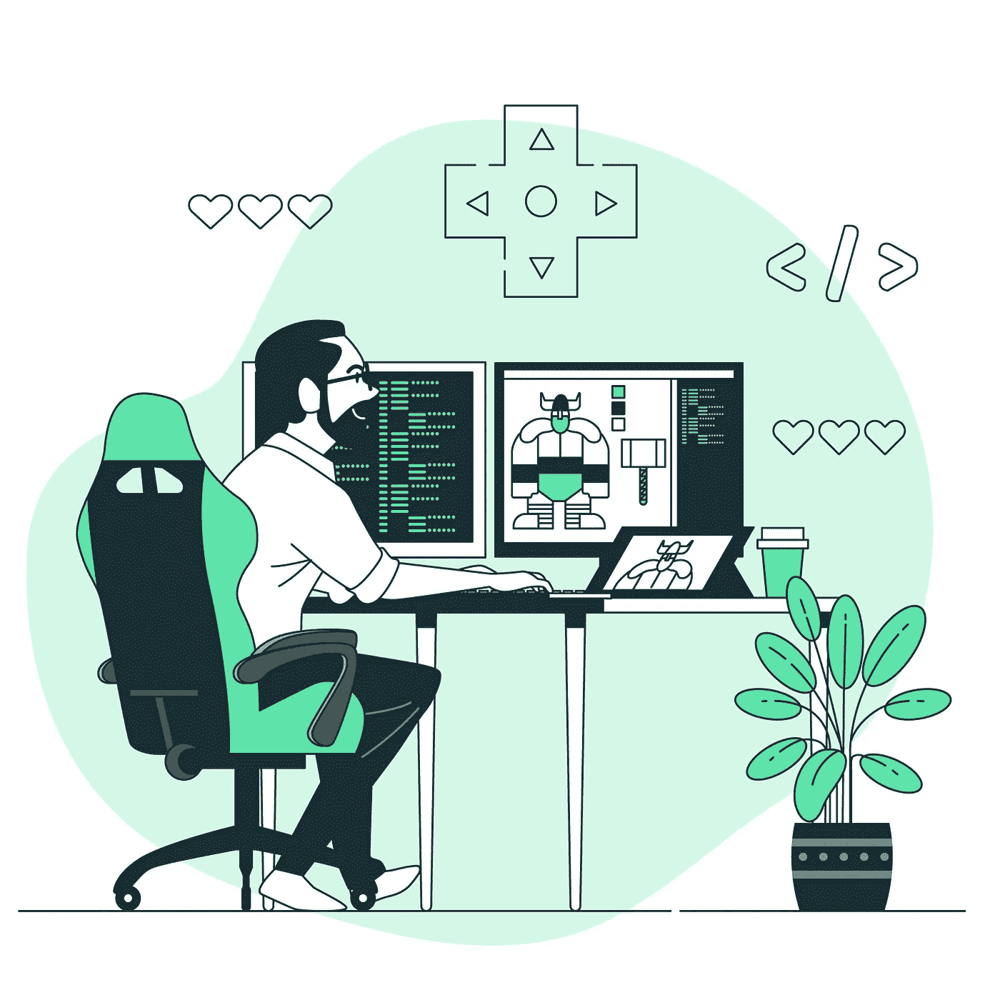

# 用 JavaScript 创建游戏循环

> 原文：<https://betterprogramming.pub/creating-a-game-loop-in-javascript-4b4d51c18f67>

## 让我们用一个循环的过程来平滑玩家的移动。



图片来自 [freepik](https://freepik.com) 上的[故事集](https://www.freepik.com/author/stories)

在过去的几个月里，我一直在开发一个 JavaScript 游戏，玩家可以在程序生成的洞穴中漫游。


一个游戏关卡的截图，玩家是中间的蓝色方块。敌人是红色的。

这个游戏使用带有两个`<canvas>`元素的 HTML Canvas API:一个用于蓝色玩家，一个用于洞穴、敌人和物品。在我的早期版本中，玩家会从一个方块移动到另一个方块，没有动画过渡。

瓦片间的移动。

为了让游戏更加流畅，我最近改用了动画的逐像素移动。它不会让玩家立即移动到相邻的瓷砖，而是一次移动一个像素，而不是总是与当前瓷砖对齐，玩家可以坐在两个或更多瓷砖之间。

基于像素的平滑移动

我很快意识到，加入这种流畅的玩家动作需要我重新思考我的游戏逻辑。以下是方法。

# 跟踪关键状态

在早期的平铺移动中，玩家在屏幕上的位置变化是由用户输入直接触发的。一个监听器等待一个光标键的按下，如果一个光标键被按下，相关的处理函数将移动播放器。

然而，一旦我开始制作逐像素运动的动画，断断续续的玩家运动的出现让我意识到浏览器并不总是准备好改变屏幕的外观。如果一个按键立即触发了对`<canvas>`元素的更改，游戏可能会在浏览器忙于做其他事情的时候重新绘制。

为了引入更多的灵活性，我将用户输入从动画中分离出来。因此，按键处理程序不会直接触发玩家在屏幕上位置的改变——它们只是改变当前按下的光标键的内部映射。这是我的`player`类中的关键状态图。

```
this.keyDown = {
   left: false,
   up: false,
   down: false,
   right: false
};
```

在按键或按键释放的情况下，这一行代码启动。

```
player.keyDown[direction] = val;
```

如果一个键被释放，`val`为假；如果是追问，`val`是真的。

有一个按键监听器，可以将地图中的一个键设置为`true`。

```
document.addEventListener('keydown', handleKeyPress);
```

还有一个按键释放监听器，可以将地图中的一个按键设置回`false`。

```
document.addEventListener('keyup', removeDirection);
```

移动设备上的滑动也模拟按键并改变按键状态的地图。例如，如果用户向上滑动，它被解释为按下“向上”光标键。

那么如果按下一个键只是更新了键的状态，而不再触发玩家位置的变化，那么玩家是如何移动的呢？为此，我们引入了一个*游戏循环*——一个周期性运行的功能，检查按键状态并相应地移动玩家。让我们来看看这是如何工作的。

# 游戏循环

游戏循环是通过递归调用自身的`main`函数实现的。这是一个没有碰撞检测的游戏循环的简单版本。我正在分享这一个，因为它捕捉了发生的全部故事。

一个简单的游戏循环

让我们来分析一下发生了什么。在函数的开始，我们首先调用`scanKeyMap`，如果一个键的状态改变了，它会调整玩家的速度。`scanKeyMap`会是什么样子？水平移动的一个简单实现如下。

```
if (keyDown.left) {
    player.velocity.x = -1;
}
else if (keyDown.right) {
    player.velocity.x = 1;
}
else {
    player.velocity.x = 0;
}
```

然后，我们调用`movePlayer`，根据它的速度改变玩家的坐标。下面是一个多么简单的`movePlayer`的实现，它调用`clearRect`方法来清除玩家在其`<canvas>`元素上的位置，并通过调用`drawPlayer`来重绘。

移动播放器的简单功能。

然后`drawPlayer`函数在其`<canvas>`元素的新位置重新绘制播放器。

drawPlayer 函数。

因此，每次主函数运行时，它都会检查键的状态，根据哪个键被按下来调整速度，并通过重画其`<canvas>`元素来移动播放器。

# 请求动画帧

玩家移动后，我们递归调用`main`函数，如下所示。

```
const delay = 20;

window.requestAnimationFrame(function() {                                        
      main();                               
}); 
```

请注意，游戏循环并没有立即调用自己——它使用了一个名为`requestAnimationFrame`的方法，该方法将`main()`函数作为回调函数。

## 将运动同步到浏览器重画

动画帧请求是游戏循环的关键部分——让我解释一下为什么。

当浏览器每次稍微改变`<canvas>`元素的外观时，就会出现动画。这种外观上的变化被称为*浏览器重绘。*因为重画使用了宝贵的能量和资源，浏览器由于它所负责的其他任务而不总是准备好重画。有时它准备好了，有时没有。

因此，我们要求代码在下一次重画时执行，而不是强制立即执行`main()`函数。通过这种方式，游戏流程与用户的浏览器和硬件准备保持同步。

让我们再来看看游戏循环的这一部分。

```
window.requestAnimationFrame(function() {                                        
       main();                               
});
```

当我调用`requestAnimationFrame`时，它在浏览器准备好更新`<canvas>`元素时调用`main()`。结果，玩家的位置在下一次重画之前被更新。

## 延误和取消

在更高级的版本中，我调用`setTimeout`来延迟帧请求，因为我不需要在每个动画帧中移动播放器。

当一切顺利运行时，每秒钟可以有多达 60 个动画帧。如果你不需要经常更新，一个小的延迟可以节省浏览器资源，同时保持流畅。

在更高级的版本中，我捕获了`requestAnimationFrame`的返回值，这是框架的 ID。然后我将 ID 存储在我的`game`对象中，这样我就可以停止游戏。

```
game.stopMain = window.requestAnimationFrame(function() {
      main(num);
});
```

在`game`对象的`reset`函数中，我调用了一个叫做`cancelAnimationFrame`的方法来停止游戏运行。要取消帧请求，我需要传入我捕获的最新帧 ID。

```
window.cancelAnimationFrame(this.stopMain);
```

这有助于阻止`main()`功能继续运行。

一个更复杂的游戏循环可能不仅仅是移动玩家——例如，它可以检查碰撞，移动敌人，并更新统计显示。请随意尝试这个[完整游戏](https://roguelike-smooth.netlify.app/demo-9-game/index.html)，它实现了带有敌人、物品和碰撞检测的游戏循环。

# 概述

*   平滑的动画运动最好通过将动画从用户输入中分离出来来处理。
*   游戏循环由一个递归调用自身的`main()`函数组成。
*   通过使用`requestAnimationFrame`，只有当浏览器准备好重画时，才会调用`main()`函数。
*   您可以使用`setTimeout`来控制调用`main()`函数的频率。
*   `cancelAnimationFrame`方法可以用来停止游戏循环。

无论你是用 JavaScript、Python、C#、Swift 还是其他语言来构建游戏，游戏循环都是一个很棒的概念，值得实现。

考虑一下你最喜欢的视频游戏如何使用游戏循环，或者你如何在下一个游戏中使用游戏循环。

[](https://javascript.plainenglish.io/how-to-add-swipe-control-to-a-javascript-roguelike-e8ef327e9930) [## 如何在 JavaScript 游戏中添加滑动控件

### 让我们通过增加对触摸的反应将这个游戏带入现代。

javascript.plainenglish.io](https://javascript.plainenglish.io/how-to-add-swipe-control-to-a-javascript-roguelike-e8ef327e9930) 

要想无限制地访问我和其他优秀作家的文章，可以考虑 [***加入媒体***](https://medium.com/@nevkatz/membership) ***。***