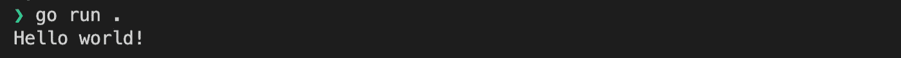
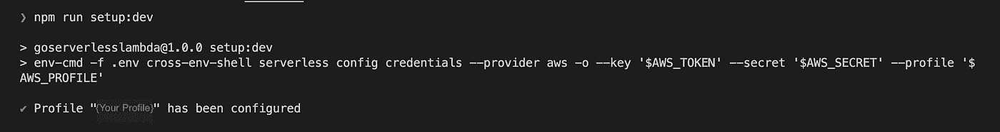
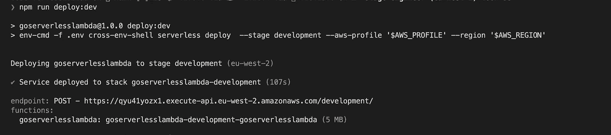
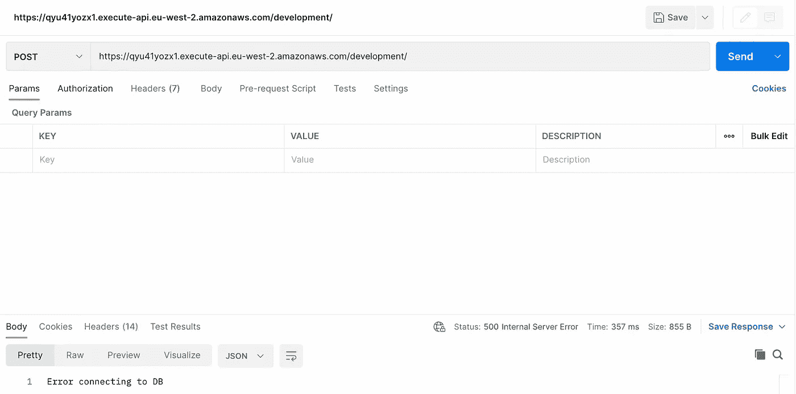

# 使用无服务器框架创建 Golang Lambda

> 原文：<https://betterprogramming.pub/creating-a-golang-lambda-with-serverless-framework-2b94c157b4b1>

## 开发者分步指南


[来源](https://unsplash.com/photos/TkEPQPWr2sY)

如果你像我一样是 Golang 的粉丝，并且想要创建你的第一个 Golang[Lambda](https://aws.amazon.com/lambda/)，你可能会发现获得一步一步的指导是很有挑战性的。本文将展示这有多简单，尤其是在使用极其方便的[无服务器框架](https://github.com/serverless/serverless)时。本文将假设您有一个 AWS 帐户，并且对设置一个带有访问令牌的 IAM 用户有基本的了解。

# 步骤 1:让我们从创建目录和设置 Go 开始

在保存所有代码的目录中打开一个终端。我的简单叫代码。在终端中，运行:

```
mkdir GoServerlessLambda
```

**注意:** `GoServerlessLambda`是我将称之为我的目录的东西，请随意以你的项目命名它。

```
cd GoServerlessLambda
```

现在是时候建立 Go 项目了。

```
go mod init github.com/<username>/go-serverless-lambda
```

最后，我们用 VS 代码打开这个。

```
code .
```

最后，创建您的`main.go`文件并添加以下内容:

```
package mainimport "fmt"func main() {
  fmt.Println("Hello world!")
}
```

在终端中，运行

```
go run .
```

我们应该在您的终端中看到以下内容



# 步骤 2:安装和设置无服务器框架

首先，我们必须设置我们的项目来安装所需的节点模块。

```
npm init
```

按照步骤进行。这将在以后需要。现在全局安装无服务器框架:

```
npm install -g serverless
```

最后，让我们得到我们的无服务器设置。创建一个名为`serverless.yml`的新文件，并添加以下内容:

我喜欢用。env 来管理我的环境变量，所以让我们把它设置好，这样我们就可以在我们的项目中利用它了。

接下来，让我们添加构建和部署 Lambda 的命令。在`package.json`中，添加:

```
npm i cross-env env-cmd serverless-dotenv-plugin -D
```

现在将以下内容添加到 serverless.yml 中。这将使 Lambda 中可以使用您环境中的变量。我们稍后将利用这一点。

```
...plugins:
  - serverless-dotenv-pluginuseDotenv: true...
```

现在创建您的。env 文件并添加以下值，以便在 AWS 中从 IAM 用户处获取令牌。

```
AWS_TOKEN={YOUR_AWS_TOKEN}
AWS_SECRET={YOUR_AWS_SECRET}
AWS_PROFILE={THE AWS PROFILE YOU WISH TO USE}
AWS_REGION={YOUR TARGET AWS REGION}
```

让我们添加一些方便的脚本来管理我们的构建和部署:

```
"scripts": {
    "setup:dev": "env-cmd -f .env cross-env-shell serverless config credentials --provider aws -o --key '$AWS_TOKEN' --secret '$AWS_SECRET' --profile '$AWS_PROFILE'",
    "build": "env GOOS=linux GOARCH=amd64  go build  -o bin/goserverlesslambda .",
    "deploy:dev": "env-cmd -f .env cross-env-shell serverless deploy  --stage development --aws-profile '$AWS_PROFILE' --region '$AWS_REGION'",
  },
```

要分解上述脚本:

*   `setup:dev`使用您的环境变量，用您的 AWS 凭证配置无服务器框架
*   `build`将 Go 应用程序编译成二进制文件，在 Lambda 环境中运行
*   使用您的环境变量将 Lambda 部署到开发阶段

让我们用这个命令来设置我们的项目凭证:

```
npm run setup:dev
```

这将输出以下内容:



完美。是时候让我们准备好 Go 应用程序了。

# 步骤 3:创建我们的 Go Lambda

首先，我们需要安装所需的软件包:

```
go get github.com/aws/aws-lambda-go
```

然后在`main.go`中，我们更新文件以匹配以下内容:

是时候构建并部署我们的 Go 二进制文件了。运行以下命令:

```
npm run build
npm run deploy:dev
```

这就是结果:



在 Postman 中打开终端输出中提供的端点，并发送 POST 请求:


太好了，我们现在有一个 Lambda 函数可以部署到 AWS 并从 Postman 成功触发。

# 步骤 4:添加 SQL 数据库连接(可选)

创建一个名为. env.development 的新文件，并添加环境变量`databaseConnection`:

```
databaseConnection={USERNAME}:{PASSWORD}@tcp({HOST})/{DATABASE}
```

创建一个名为`config`的新目录，并创建一个名为`setup.go`的文件。安装 go-sql-driver 软件包:

```
go get github.com/go-sql-driver/mysql
```

并将以下内容添加到文件中:

在您的`main.go`文件中，在 imports 下添加以下内容:

```
...var SetupError errorvar dbCon stringfunc init() {
 dbCon = os.Getenv("dbCon")
 SetupError = config.ConnectToDb(dbCon)
}...
```

我们必须在处理程序之外创建数据库连接，这就是为什么我们在一个`init`函数中做这件事。这意味着，如果 Lambda 在其实例关闭之前被重新触发，连接将被重用，同时也确保我们不会为每次调用创建数百个不必要的连接。

更新`HandleRequest`功能以匹配以下内容:

再次构建和部署您的 Lambda:

```
npm run build
npm run deploy:dev
```

如果一切都按预期运行，我们应该再次得到以下内容:


如果数据库连接失败，您将得到以下响应:



# 启用 Cors

如果您希望从任何地方调用 Lambda，我们将需要如下更新`GenerateResponse`函数:

# 生产构建

如果您想使用这个设置来部署一个生产 Lambda，那么我建议将以下内容添加到 package.json 中:

```
"deploy:prod": "env-cmd -f .env cross-env-shell serverless deploy --stage production  --aws-profile '$AWS_PROFILE' --region '$AWS_REGION'"
```

为您的`databaseConnection`添加一个`.env.production`文件(这将自动与生产标志一起使用)

## 自定义域

如果你想要一个自定义域，那么使用[无服务器域管理器](https://github.com/amplify-education/serverless-domain-manager)插件是非常容易的。一个示例`serverless.yml`配置是:

```
${self:custom.enabled.${opt:stage}, self:custom.enabled.other} — As conditionals are not yet possible this will allow us to use the custom domain only on the Production stage built
```

# 结论

希望你觉得这很有见地，也很容易理解。祝你在创建自己的 Golang Lambdas 的旅途中好运。

感谢您花时间阅读我的文章。我希望你已经发现它的知识性和趣味性。我将围绕 Typescript、Node、React、Vue、GraphQL、Performance、Go 等写更多文章。

# GitHub 知识库

[](https://github.com/nic-jennings/go-serverless-lambda) [## GitHub—NIC-Jennings/go-server less-lambda:Golang+server less Framework—教程/入门…

### 此时您不能执行该操作。您已使用另一个标签页或窗口登录。您已在另一个选项卡中注销，或者…

github。](https://github.com/nic-jennings/go-serverless-lambda)