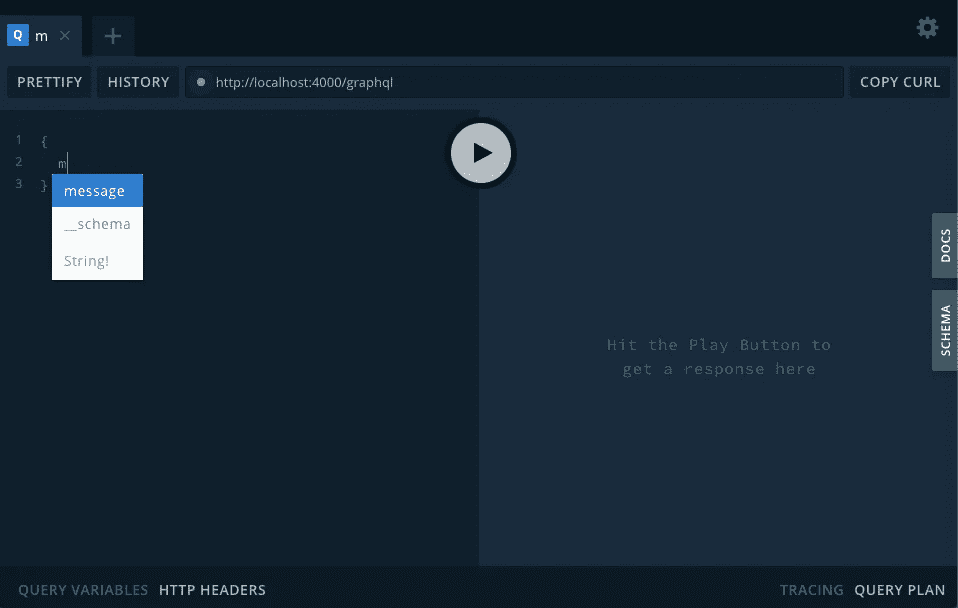
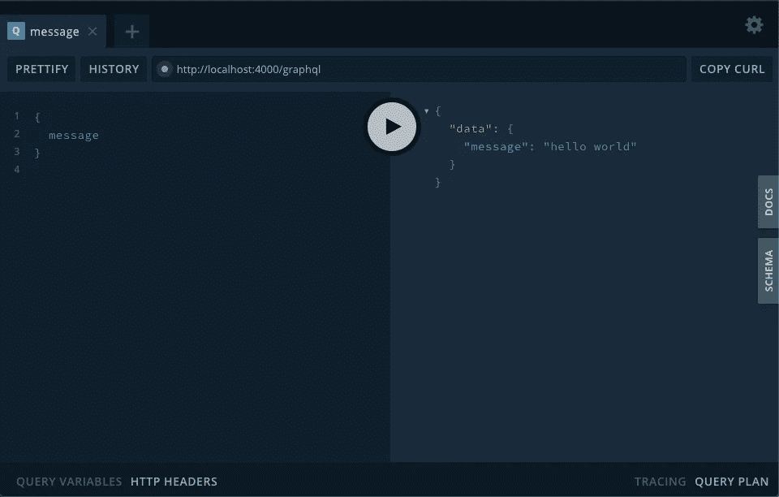
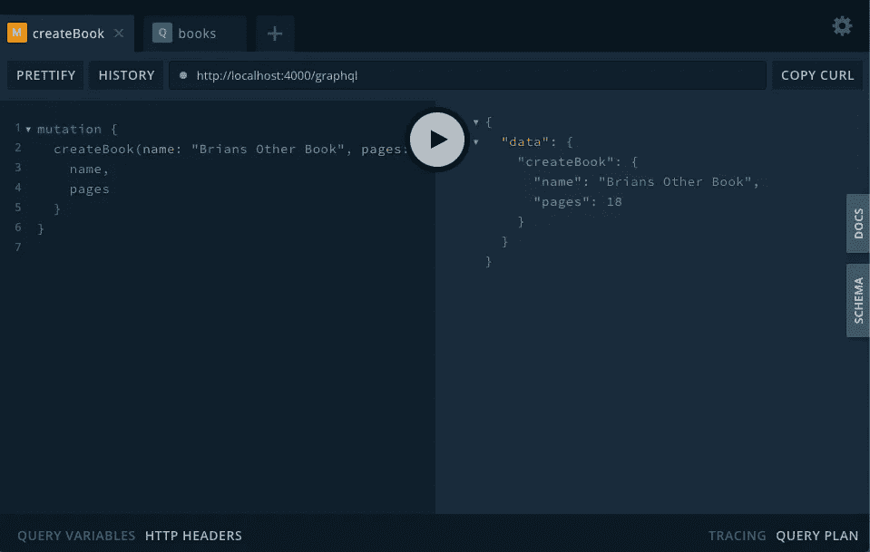
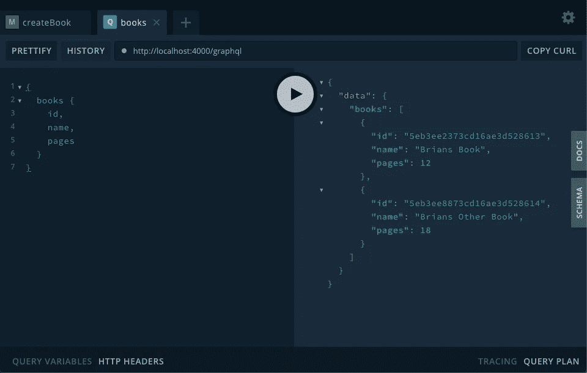

# 如何设置一个基本的 GraphQL 服务器

> 原文：<https://betterprogramming.pub/creating-a-graphql-server-basic-setup-73710ddf657e>

## 开始使用 Apollo、Express 和 MongoDB


[Unsplash](https://unsplash.com/collections/430471/ux-and-storytelling?utm_source=unsplash&utm_medium=referral&utm_content=creditCopyText) 上[穆罕默德·拉乌凡·尤苏普](https://unsplash.com/@muhraufan?utm_source=unsplash&utm_medium=referral&utm_content=creditCopyText)的照片

在本文中，我们将使用 Express 设置 Apollo GraphQL 服务器，并使用 MongoDB 持久化数据。

# **创建 MongoDB 实例**

我们的第一个任务是获得到 MongoDB 实例的连接。如果尚未准备好使用 MongoDB，则可以通过以下三种方法之一创建实例。

*   [在电脑上安装 MongoDB](https://docs.mongodb.com/manual/administration/install-community/)
*   使用[码头工人](https://hub.docker.com/_/mongo/)
*   使用[图册](https://docs.atlas.mongodb.com/getting-started/)

设置好之后，一定要记录连接字符串——我们稍后将使用它。

# **项目初始化**

我们需要一个开发服务器的环境。我假设您使用的是 Node.js 版本 12 或更高版本。我们将使用 Babel 对代码进行跨编译。旧版本可能会起作用，但我还没有测试它们。

为项目创建新目录。进入目录，并初始化新的应用程序。

```
$ mkdir ~/graphql-server
$ cd ~/graphql-server
$ npm init -y
```

现在我们需要安装我们的依赖项。

```
$ npm i -D nodemon @babel/cli @babel/core @babel/node @babel/preset-env
$ npm i apollo-server-express express mongoose
```

# **创建一些基本模型和模式**

我们将使用 Mongoose 为我们的数据建模，并与 MongoDB 交互。现在，我们将创建两个模型:一个用于`Author`，另一个用于`Book`。

## *。/models/Author.js*

```
import mongoose from ‘mongoose’export const Author = mongoose.model(‘Author’, {
 name: String
})
```

## *。/model/book . js*

```
import mongoose from 'mongoose'export const Book = mongoose.model('Book', {
  name: String,
  pages: Number
})
```

我们需要一个 Apollo 模式来指定可供客户端执行的查询。

这个模式在下面的文件中被描述为`typeDefs`，定义了类型及其关系的集合；以及`resolvers`，在处理客户端查询时连接到与模式的类型相对应的数据(`typeDefs`)。目前，虽然我们只是试图让事情运行，但我们将定义一个返回静态消息的查询。我们稍后将讨论模型。

## *。/schema/index.js*

```
import { gql } from 'apollo-server-express'const typeDefs = gql`
  type Query {
    message: String!
  }
`const resolvers = {
  Query: {
    message: () => 'hello world',
  },
}export {
  typeDefs,
  resolvers
}
```

# **创建并启动服务器**

Express 服务器是相当标准的。这里唯一需要注意的是，我们要确保在接受任何连接之前都已经建立了 Mongoose 连接。

我在一个异步函数中包装了一个 await 表达式来完成这个任务。用您之前保存的 MongoDB 连接字符串替换`mongodb://localhost:27017/test`。

## *。/index.js*

```
import { ApolloServer } from 'apollo-server-express'
import express from 'express'
import mongoose from 'mongoose'
import { typeDefs, resolvers } from './schema'const start= async () => {
  const app = express() const server = new ApolloServer({ typeDefs, resolvers }) server.applyMiddleware({ app }) await mongoose.connect('mongodb://localhost:27017/test', {
    useNewUrlParser: true
  }) app.listen({ port: 4000 }, () =>
    console.log(
      `listening: [http://localhost:4000${server.graphqlPath}`](http://localhost:4000${server.graphqlPath}`)
    )
  )
}start()
```

我们将在`package.json`文件中添加一个启动脚本。

```
..."scripts": {
    "start": "nodemon --exec babel-node index.js"
},...
```

为了运行服务器，我们还需要一个`.babelrc`文件，否则它会抱怨我们导入模块。

## *。/.babelrc*

```
{
  "presets": ["[@babel/preset-env](http://twitter.com/babel/preset-env)"]
}
```

现在我们准备启动服务器。

```
$ npm start
```

# **测试终点**

只要环境变量`NODE_ENV`没有被设置为 production，您就可以让 GraphQL Playground(一个图形化、交互式、浏览器内 GraphQL IDE)自动为 web 浏览器提供 GUI。

打开浏览器进入`[http://localhost:4000/graphql](http://localhost:4000/graphql)`。



开始键入“邮件”，然后按 tab 或单击该项目以自动完成

您可以在左侧面板上键入查询(自动完成)。单击 play 按钮，输出将显示在右侧面板上。



“你好，世界”

# **添加突变**

我们现在将解析器连接到底层模型，允许通过服务器访问它们。我们使用`Query`类型来实现`read`操作。

为了实现写操作，我们需要使用`Mutation`类型。`Mutation`函数的第一个参数是父函数，在本例中没有使用。

## *。/schema/index.js(已更新)*

```
import { gql } from 'apollo-server-express'
import { Author } from '../models/Author'
import { Book } from '../models/Book'const typeDefs = gql`
  type Query {
    message: String!
    authors: [Author!]!
    books: [Book!]!
  }
  type Author {
    id: ID!
    name: String!
  }
  type Book {
    id: ID!
    name: String!
    pages: Int
  }
  type Mutation {
    createAuthor(name: String!): Author!
    createBook(name: String!, pages: Int): Book!
  }
`const resolvers = {
  Query: {
    message: () => 'hello world',
    authors: () => Author.find(),
    books: () => Book.find()
  },
  Mutation: {
    createAuthor: async (_, { name }) => {
      const author = new Author({ name });
      await author.save();
      return author;
    },
    createBook: async (_, { name, pages }) => {
      const book = new Book({ name, pages });
      await book.save();
      return book;
    }
  }
}export {
  typeDefs,
  resolvers
}
```

一旦保存了文件，服务器就会自动重启(多亏了 nodemon)，并且可以在浏览器中观察到更改(自动完成需要刷新)。



创建“图书”记录



“图书”记录列表

这是一个基本的 GraphQL 服务器设置，可以进行实验和进一步开发。我在下面放了一个所有代码的链接。

我将在其他文章中讨论这个例子

*   添加关系
*   认证、授权和保护

# **完整代码和参考文献**

*   [这个例子的所有代码](https://github.com/bjdixon/graphql-server/tree/setup)
*   我们使用的库的文档:[mongose](https://mongoosejs.com/)， [GraphQL](https://www.apollographql.com/docs/apollo-server/) ， [Express](https://expressjs.com/)