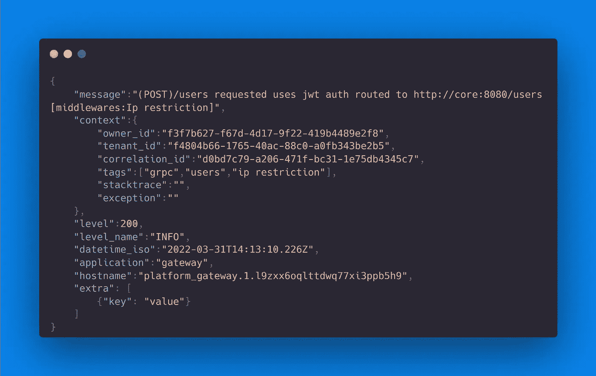

# 伐木的艺术

> 原文：<https://betterprogramming.pub/creating-a-human-and-machine-freindly-logging-format-bb6d4bb01dca>

## 创建人机友好的日志记录格式


维克多·塔拉舒克在 [Unsplash](https://unsplash.com/s/photos/documents?utm_source=unsplash&utm_medium=referral&utm_content=creditCopyText) 上拍摄的照片

历史上，日志对于排除应用程序和基础架构性能故障至关重要。现在，它被用于业务仪表板可视化和性能分析。

在这些日志文件中组织数据的重要性正在迅速上升，以便能够高效地提取、操作和分析数据，并且能够被人类理解。(微)服务的兴起也带来了另一个挑战:跟踪请求在整个系统中的传播。

在本文中，我们将确定组织日志的最佳格式，这种格式易于人类和机器解析和理解。接下来，除了数据结构的建议之外，我们还将突出显示要记录的关键信息。最后，我们将尝试为您自己的项目提供一些需要记住的重要注意事项。

# 为什么日志应该是人类可读的？

尽管日志原本是要由机器来解析、处理和存储的，但它们正在被人类主动读取、理解和诊断。日志是我们调查由我们的死敌臭虫造成的谋杀现场的最好的指示器！🐛


在 [Unsplash](https://unsplash.com/s/photos/bug-computer?utm_source=unsplash&utm_medium=referral&utm_content=creditCopyText) 上 [Elisa Ventur](https://unsplash.com/@elisa_ventur?utm_source=unsplash&utm_medium=referral&utm_content=creditCopyText) 拍摄的照片

没有什么比试图在一条长长的、无组织的对数线中抓住丢失的信息更令人沮丧和耗时的了。当务之急是要有一个有意义的日志，一个人可以很容易地理解和深入挖掘，如果内容是相关的。

```
66.249.65.159 - - [06/Nov/2014:19:10:38 +0000] "GET /news/53f8d72920ba2744fe873ebc.html HTTP/1.1" 404 177 "-" "Debian APT-HTTP/1.3 (0.8.16~exp12ubuntu10.16)"
```

虽然我们已经习惯了默认的 Nginx 格式，但是上面的例子仍然很难阅读和处理。例如，当它是为了重现生产中的一个 bug 而提取的一个巨大日志文件的一部分时，就更难了。

JSON 相对于 XML 等其他数据交换格式的优势变得非常明显，因为它对于我们人类来说读、写和理解都很简单。怎么会？它的结构是一个简单的键-值对语法，在数组中排序和嵌套。

那么，用 JSON 编写的日志消息是什么样子的呢？下面是以前用 JSON 格式化的 Nginx web 服务器的例子:

```
{
"time": "06/May/2022:19:10:38 +0100",
"remote_ip": "66.249.65.159",
"remote_user": "-",
"request": "GET /news/53f8d72920ba2744fe873ebc.html HTTP/1.1",
"response": 404,
"bytes": 177,
"referrer": "-",
"agent": "Debian APT-HTTP/1.3 (0.8.16~exp12ubuntu10.16)"
}
```

# 为什么日志应该是机器友好的？

让我们再次考虑上面的日志行示例:

```
66.249.65.159 - - [06/Nov/2014:19:10:38 +0000] "GET /news/53f8d72920ba2744fe873ebc.html HTTP/1.1" 404 177 "-" "Debian APT-HTTP/1.3 (0.8.16~exp12ubuntu10.16)"
```

为了理解它，我们需要:

*   破译语法
*   编写逻辑来解析消息并提取我们需要的数据

不幸的是，这种逻辑是脆弱的。如果日志格式发生了变化(比如开发人员添加了一个新字段或者改变了条目的顺序)，那么解析器就会崩溃。我相信任何人都可以面对或联想到类似的情况。

这就是像 JSON 这样的结构化格式可以发挥作用的地方。键-值对使得在数据集内提取特定值、过滤和搜索变得容易。如果添加了新的键-值对，解析日志消息的软件将忽略那些它不期望的键，而不是完全失败。


[亚历山大·奈特](https://unsplash.com/@agk42?utm_source=unsplash&utm_medium=referral&utm_content=creditCopyText)在 [Unsplash](https://unsplash.com/s/photos/machine-friendly?utm_source=unsplash&utm_medium=referral&utm_content=creditCopyText) 上拍照

为机器登录 JSON 的好处是:

*   它有一个结构化的格式，因此便于分析应用程序日志和查询每个字段。
*   每种编程语言都可以解析它。

通常，我们可以在一个日志解析系统(ELK、newRelic、Datadog 等)中聚合我们的 JSON 数据。)这为我们提供了强大的报告、搜索和对数据的洞察。这些工具使得索引某些字段变得更加容易，从而解决了通过(微)服务环境跟踪请求的问题。

# 包括哪些信息？

以下是我们应该在任何适当的日志消息中包含的信息列表。一些元素可以是可选的。字段名旁边的(o)表示可选字段。

*   `message <string>`:这是一条人类可读的消息，用于描述情况→在筛选时易于阅读，以便对内容有一个总体了解。
*   `level <integer>`:这是优先级的数字表示(更多细节见下一节)。非常有助于将消息分类到不同的优先级，或者生成一个带有系统概览的仪表板。
*   `level_name <string>`:这是一个优先级的“字符串”表示(更多细节见下一节)
*   `datetime_iso <DateTime>`:这是一个 [iso8601 格式](https://en.wikipedia.org/wiki/ISO_8601)。这是一个必填字段，因为我们需要它与其他事件相关联。尽管我们可以使用服务器的日期-时间，但这可能会产生误导，因为这些服务器将使用它们的服务器日志获取时间，这些时间可能相差几秒钟，甚至处于不同的时区。
*   对于微服务环境来说，这是一个重要的领域。我们将使用解析后的消息/请求的关联 id 来跟踪服务间整个旅程中的请求。
*   (o) `hostname <string>`:用于识别哪个机器生成了这个日志。我们建议在微服务环境中使用。当服务器日志已经从 docker 的服务名映射了原始主机时，这可能是多余的。
*   (o) `build_id <string>`:这是记录信息的软件版本。它可以帮助跟踪不兼容问题，尤其是那些在服务器端软件部署期间发生的问题。
*   (o) `application<string>`:用于识别哪个设备或应用程序生成了该日志。
*   (o) `owner_id <string(uuidv4)/null>`:这将报告用户 id 或 API 密钥 id(如果有的话)。我们可以追踪用户做了哪些步骤来重现他的动作。
*   (o) `tenant_id <string(uuidv4)/null>`:这将报告租户 id(如果有的话)。对多租户系统非常有帮助
*   (o) `tags <string[]>`:可能是一个元素数组。该元素包含关于请求的元信息，如类型、使用的协议等。
*   (o) `stacktrace: <string/null>`:这用于以字符串化的在线格式显示堆栈跟踪(如果存在的话)
*   (o) `exception: <string/null>`:用于显示异常信息(如果存在)

# 日志级别和相关日志代码

# 拟议的格式

那么用 JSON 编写的日志消息是什么样子的呢？

以下是通过示例日志提出的日志概念格式:



使用[碳](https://carbon.now.sh/)生成的示例信息

## 观察

*   在日志服务器中，我们应该索引以下元素以便更快地搜索:`owner_id`、`tenant_id`、`correlation_id`、`level`、`level_name`和`application`。
*   可选字段应在可用时添加到日志中。我们只能在没有的时候省略。当调试我们的系统时，它们的值将是可见的。
*   上下文元素可以包含其他有用的字段(比如传入请求的转储)。
*   出于安全或合规性原因(个人信息保护)，日志应该对请求中可能出现的关键字段(密码)进行过滤。我们应该在输出内容之前对其进行匿名处理。
*   每个服务都应该转发它正在接收的`correlation_id`。如果这个值不存在，它应该生成一个新值，并将其传递给下一个服务。API 网关(如果存在的话)应该总是关注这个字段的存在和生成。

# 最佳实践

*   花时间设计你的日志结构。这种格式符合我们的需求，并且很容易复制。然而，一些团队可能需要不同的。还要考虑适合您需求的粒度级别。通常，公司内部的一篇“日志概念”文章可以召集所有团队遵循一个模式。在让新开发人员加入您的系统时，花时间是值得的。
*   尽可能多地记录。在出现致命异常时拥有模块和行号，或者在遇到安全漏洞时拥有 IP/用户名，对于更快、更准确地解决问题是非常宝贵的。如果您想要避免一些不想要的噪音，您仍然可以调低详细程度。使用体验回归的方法来获得最适合你的水平！
*   保持一致性是每个人的首要任务。JSON 消息中正确的键和准确的值使得调试更加容易和有效。相关 Id 和日志级别是证明这一点的明显组件。
*   编码时记录。像编写单元测试一样，试着保持相同的原则，并记录你的系统交互。为了避免丢失函数的上下文和边界情况，在现场做比以后添加更容易。

# 最终注释

*   这个故事不是推动一个标准，而是试图创建一个逻辑组织的日志格式，为日志解析系统如 newRelic 或 ELK 等进行优化。它将帮助您生成有用的仪表板、指标和事件通知(例如，如果错误百分比超过 5%，则触发警报)。
*   在您的应用程序中实现标准化的日志系统会耗费您的时间和金钱。调试也会让你付出代价，尤其是在信息很关键的边缘情况下。你的决定应该考虑等式的两边。
*   日志是一个非常固执己见，有时会引起分歧的话题。但是，无论您将使用哪种格式，总比没有日志好。
*   我建议使用异步日志来避免性能问题。

# 承认

我想对 EQS 集团(T2)的技术团队大声欢呼，因为他们创造了如此伟大的概念，与世界分享。

更多来自类似话题？查看以下出版物:

[](https://medium.com/eqs-tech-blog) [## EQS 科技博客

### EQS 集团是欧洲领先的企业合规和投资者关系解决方案技术提供商之一。在…

medium.com](https://medium.com/eqs-tech-blog)