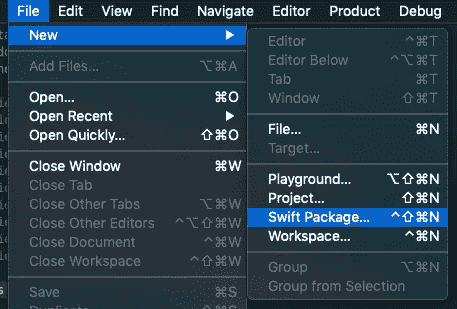
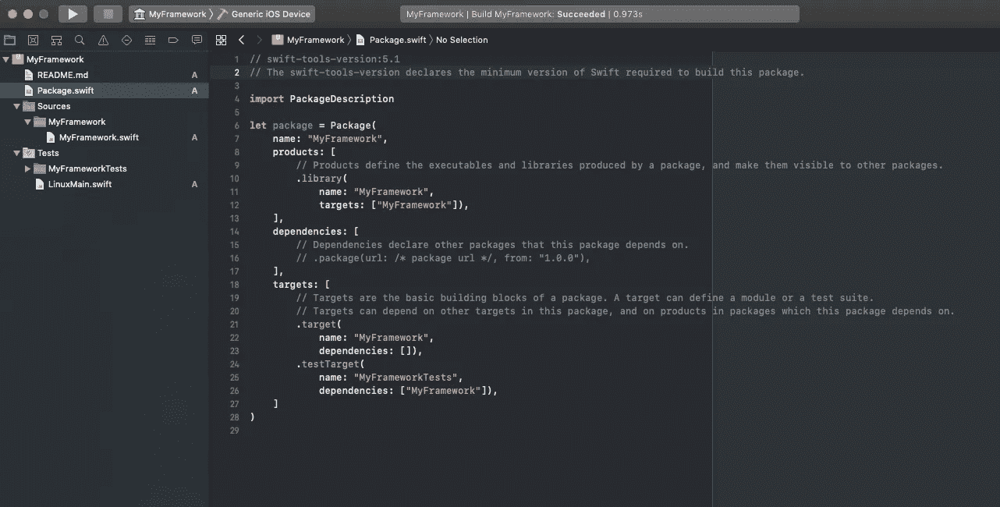

# 使用 Swift 软件包管理器为您的 iOS 应用程序创建库

> 原文：<https://betterprogramming.pub/creating-a-library-for-your-ios-app-using-spm-swift-package-manager-60db6880748c>

## 针对 Xcode 11 和 iOS 13 进行了更新

Xcode 11 内置 Swift Package Manager (SPM)。要创建新的 Swift 包，您首先需要下载 Xcode 11。

下载完成后，打开它并创建一个新的 **Swift 包**:

选择一个名称，您就拥有了一个全新的 **Swift 框架**，它可以在 Swift 支持的所有平台上运行。

即使在 iOS 中也能工作的多平台 swift 框架。

框架的主要部分是 **Package.swift** 文件和 **Sources** 文件夹。Tests 文件夹也很重要，因为它存储了你的测试，但是我不认为有必要告诉你测试有多重要。

# Package.swift 文件

这是您的库的清单，就像带有 Cocoapods 的 Podspec 文件或带有 npm 的 Package.json。

# 我应该把我的代码放在哪里？

您的框架逻辑应该存储在***Sources>your framework name***文件夹中。

你完了！只需提交并将修改推送到您的 git 存储库。现在，您可以在任何 Swift 项目中使用您的框架。