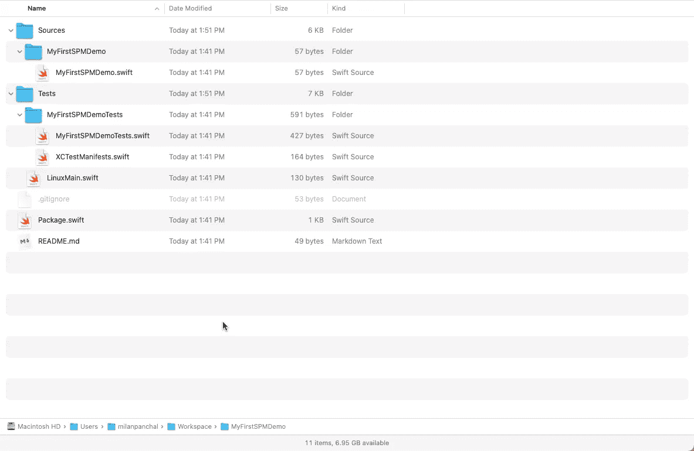
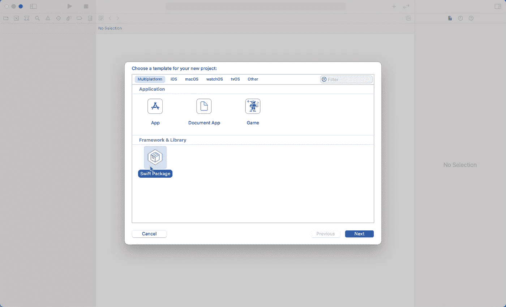

# 在 Xcode 中使用 Swift Package Manager 创建一个库

> 原文：<https://betterprogramming.pub/creating-a-library-using-swift-package-manager-in-xcode-701d5586e953>

## 轻松将您的代码转换成 Swift 包


Emile Guillemot 在 [Unsplash](https://unsplash.com/s/photos/future?utm_source=unsplash&utm_medium=referral&utm_content=creditCopyText) 上的照片

# 什么是 Swift Package Manager(又名 SwiftPM 或 SPM)？

*   `SwiftPM`是一个管理 Swift 代码分发的工具，就像`CocoaPods`和`Carthage`一样。
*   它与 Swift 构建系统相集成，可自动完成下载、编译和链接依赖关系的过程。
*   `SwiftPM`包含在`Swift 3.0`中，以上版本使我们能够管理 Swift 依赖性。
*   随着 Swift 5 和 Xcode 11 的发布，SwiftPM 支持被添加到 Xcode 本身中。

以下是在 Xcode 中创建您的第一个 swift 包的分步指南。


图片来源:作者

# 创建您自己的 Swift 包

创建您自己的 swift 包有两种方式。根据您的喜好，您可以使用`Terminal`应用程序或`Xcode (Version 11+)`应用程序。

## 选项 1:使用终端

要创建新的 Swift 包，请打开`Terminal`应用程序(`Applications > Utilities > Terminal.app`，并创建一个名为`MyFirstSPMDemo/>`的文件夹:

```
$ mkdir MyFirstSPMDemo
$ cd MyFirstSPMDemo
```

或者使用单行命令:

```
$ mkdir MyFirstSPMDemo && cd $_
```

现在，通过在您的终端中运行以下命令来初始化 Swift 包，以创建 Swift 包目录结构:

```
$ swift package init
```

还可以通过提供子命令来指定要创建的包的类型:

```
$ swift package init --type library
```

默认情况下，`init`会创建一个库包。要检查其他选项，请使用以下命令:

```
**$ swift package init --help**OVERVIEW: Initialize a new packageOPTIONS:--name   Provide custom package name
--type   empty|library|executable|system-module|manifest
```



Swift 包装结构

***注意:*** *要在 Xcode 应用程序中打开您的库/swift 包，双击* `*Package.swift*` *文件。*

## 选项 2:使用 Xcode(版本 11 以上)

使用 Xcode 创建新的 Swift 包是一个简单的过程:

*   打开 Xcode 应用程序，选择`File > New > Swift Package...`选项或使用`**⌃⇧⌘** N`快捷键。
*   或者，转到`File > New > Project...`并选择`Multiplatform`选项下的`Swift Package`模板。
*   键入您的包名，选择您的位置，然后点击`Create`按钮
*   搞定了。



使用 Xcode 的 Swift 包(版本 12.2)

# Swift 套餐概述

*   包由 Swift 源文件和清单文件组成。名为`Package.swift`的清单文件使用`PackageDescription`模块定义了包名及其内容。
*   一个包有一个或多个目标。每个目标指定一个产品，并且可以声明一个或多个依赖项。

以下是完整的清单文件供参考(Swift 工具版本将取决于我们用来创建 Swift 包的 Xcode 版本):

# 在包中编写源代码

我们已经为我们的 Swift 产品包创建了一个基本结构。现在是时候在我们的 Swift 包中编写/添加源代码了。

*   将所有源文件复制到`Sources\MyFirstSPMDemo`文件夹中。如果你愿意，你可以删除现有的`Sources\MyFirstSPMDemo.swift`模板文件。
*   如果您有单元测试文件，将它们全部复制到`Tests\MyFirstSPMDemoTests`文件夹中。

还建议定期用有意义的内容更新你的`README.md`文件。这有助于其他开发者了解如何使用您的 Swift 软件包。

# 更新默认清单(Package.swift)文件

对于一个简单的包，您可能不需要更改默认的清单文件内容。

## 1.定义平台和版本

为您的 swift 产品包指定 iOS 的最低部署版本:

```
platforms: [
  // Only add support for iOS 13 and up.
  .iOS(.v13)
],
```

## 2.导入其他包依赖项

如果您的 Swift 包有其他依赖项，您可以在`dependencies`标签下定义它们。在目标中添加所有的依赖项。

每个依赖项指定一个源 URL 和版本要求。

*   源 URL 是当前用户可访问的 URL，它解析为 Git 存储库。
*   版本需求遵循[语义版本化(SemVer)](http://semver.org/) 约定，用于确定检查哪个 Git 标签并使用它来构建依赖关系。

**具有最低 iOS 版本和依赖关系的清单文件**

在这个例子中，我们添加了`Swifty-Extensions`框架，并告诉包管理器自动获取从`1.0.1`开始的版本。这允许我们获取像`1.0.2`或`1.1.0`这样的版本，但不能获取`2.0.0`，因为那是下一个可能包含重大变化的主要版本。

## **其他选项**

还有其他选项可以为您的依赖项添加特定的需求，比如使用确切的版本或版本范围。

要获得准确的版本(不推荐):

```
.package(
url: "[https://github.com/milanpanchal/Swifty-Extensions](https://github.com/milanpanchal/Swifty-Extensions)", 
.exact("1.0.1")
)
```

要获得下一个主要/次要版本:

```
.package(
url: "[https://github.com/milanpanchal/Swifty-Extensions](https://github.com/milanpanchal/Swifty-Extensions)", 
.upToNextMajor(from: "2.0.0")
).package(
url: "[https://github.com/milanpanchal/Swifty-Extensions](https://github.com/milanpanchal/Swifty-Extensions)", 
.upToNextMinor(from: "1.2.0")
)
```

要获得一系列版本:

```
.package(
url: "[https://github.com/milanpanchal/Swifty-Extensions](https://github.com/milanpanchal/Swifty-Extensions)", 
"1.0.1"..<"1.1.0")
```

使用特定分支或版本:

```
.package(
url: "[https://github.com/milanpanchal/Swifty-Extensions](https://github.com/milanpanchal/Swifty-Extensions)",
.branch("development")).package(
url: "[https://github.com/milanpanchal/Swifty-Extensions](https://github.com/milanpanchal/Swifty-Extensions)", .revision("51cc4b03d7a855633626f016f05706a4ae527d89"))
```

# 构建和测试包

*   要构建您的 Swift 包，请在终端中运行`swift build`命令。包管理器下载所有的依赖项(在`Package.swift`中声明)，编译它们，然后将它们链接到包模块。
*   下载的源代码可以在项目根目录下的`.build/checkouts`目录中找到，中间编译产品可以在项目根目录下的`.build`目录中找到。
*   要运行您的 Swift 软件包的测试，请使用:`swift test`。

```
$ swift build
$ swift test
```

# 发布您的 Swift 包裹

要发布您的 Swift 包，只需创建一个新的版本标签，并将其推送到您的 Git 存储库。您可以使用`Xcode`或`Terminal`应用程序来发布您的包。

```
**$ git add -A
$ git commit -m "My First Swift Package Demo"***// git tagging*
**$ git tag 1.0.0** *// To push the specific tag* **$ git push origin 1.0.0***// To push all the tags at once*
**$ git push origin --tags**
```

# 构建可执行文件

*   如果一个目标包含一个名为`main.swift`的文件，则该目标被视为可执行文件。软件包管理器会将该文件编译成二进制可执行文件。
*   创建可执行文件的过程与我们创建库包的过程几乎相同。

首先，创建并输入一个名为`MyFirstSPMDemo`的目录:

```
$ mkdir MyFirstSPMDemo && cd $_
```

现在运行 swift 包的`init`命令，可执行类型为:

```
$ swift package init --type executable
```

使用`swift build`和`swift run`命令构建并运行可执行文件:

```
$ swift build
$ swift run
```

# 参考

*   [https://developer.apple.com/videos/play/wwdc2019/410/](https://developer.apple.com/videos/play/wwdc2019/410/)
*   [https://github.com/apple/swift-package-manager](https://github.com/apple/swift-package-manager)
*   [https://swift . org/getting-started/# using-the-package-manager](https://swift.org/getting-started/#using-the-package-manager)
*   [https://swift.org/package-manager/](https://swift.org/package-manager/)

# 有问题吗？

如果你有任何问题，请在下面随意评论。

感谢阅读！