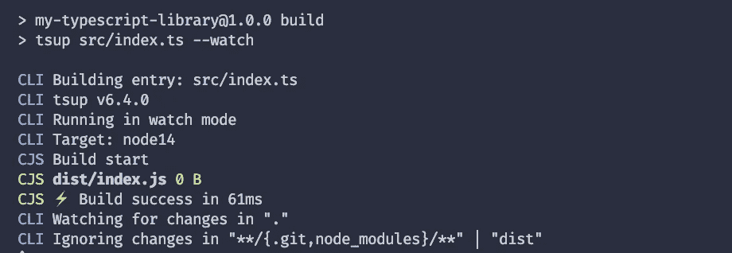
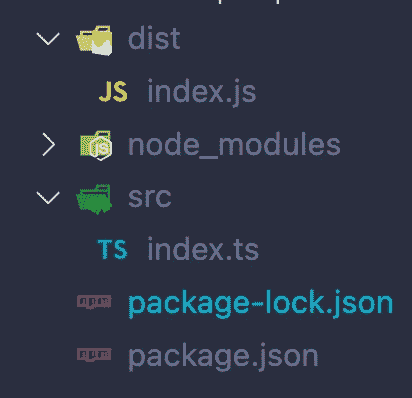
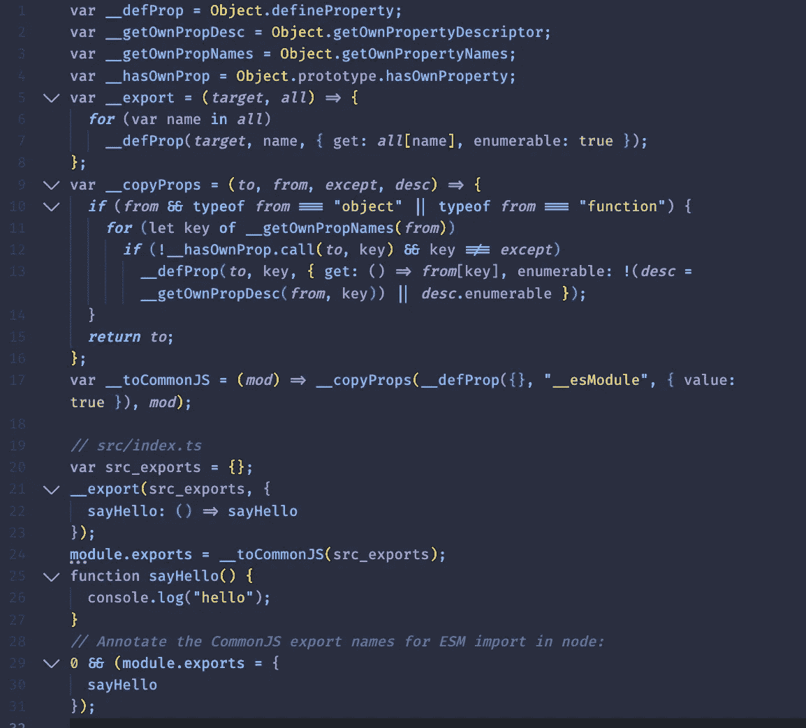
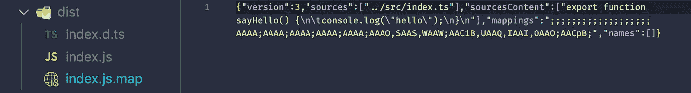
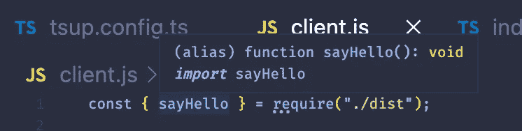
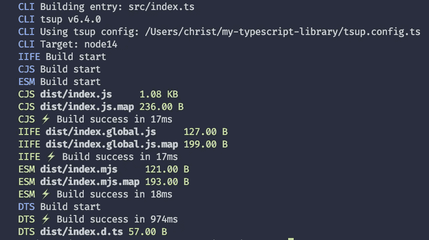
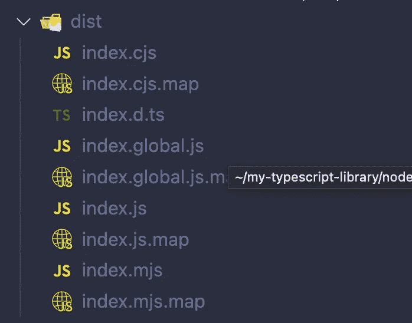
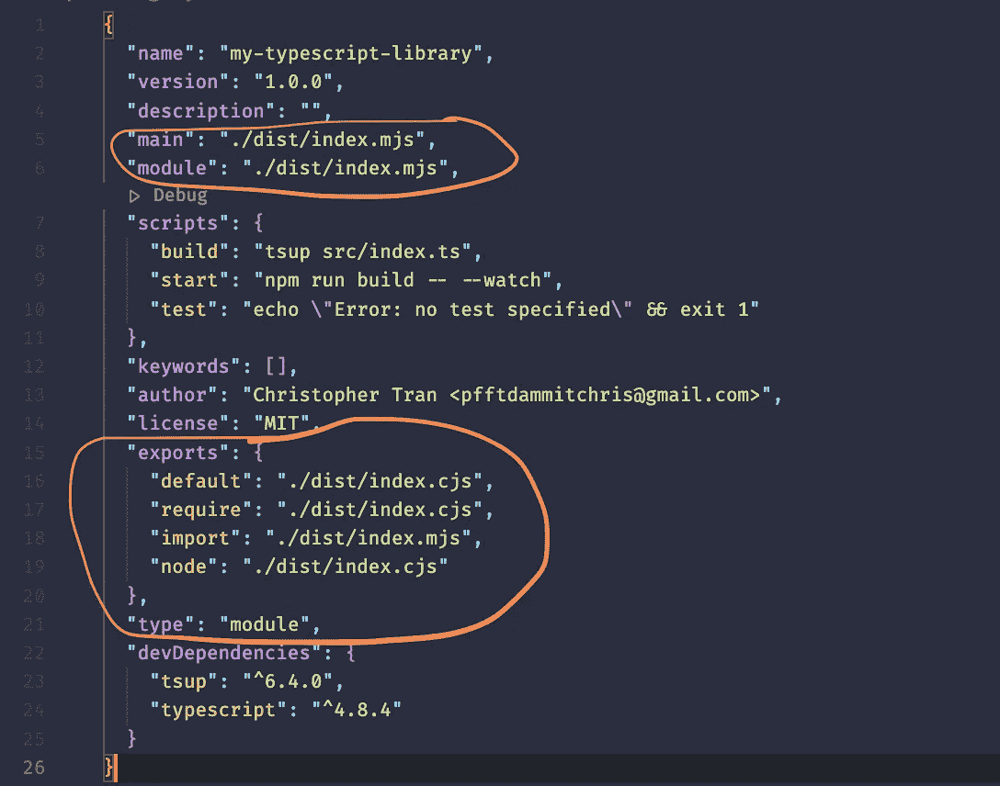
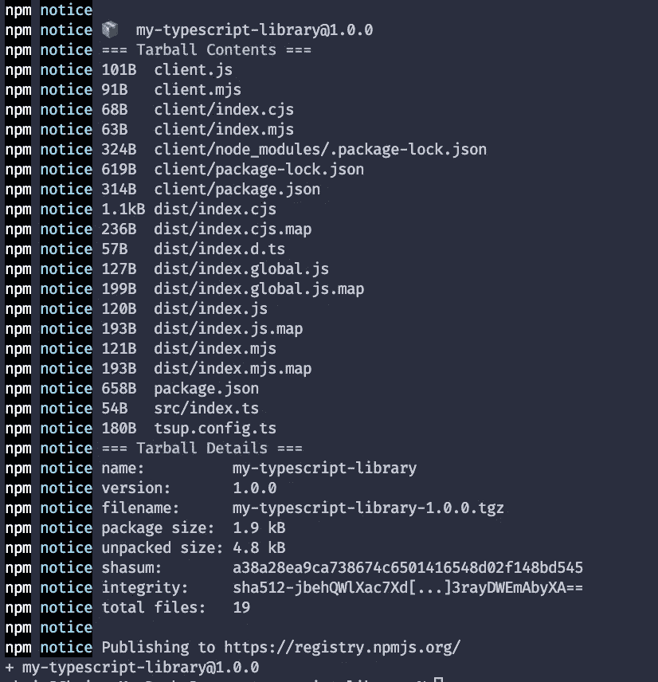

# 用 tsup 创建一个现代的类型脚本/JavaScript 库

> 原文：<https://betterprogramming.pub/creating-a-modern-typescript-javascript-library-with-tsup-ae55cbcae58b>

## tsup 由 esbuild 提供支持

照片由[罗德里戈·桑多斯](https://www.pexels.com/de-de/@rsantos1232?utm_content=attributionCopyText&utm_medium=referral&utm_source=pexels)从[佩克斯](https://www.pexels.com/de-de/foto/arbeitsplatz-mit-modernem-laptop-mit-programmcode-auf-dem-bildschirm-3888151/?utm_content=attributionCopyText&utm_medium=referral&utm_source=pexels)拍摄

现在是开发人员的大好时机，尤其是对于 JavaScript。JavaScript 生态系统既庞大又令人兴奋，开源项目也随着一个接一个的创新工具不断发展。我们有像 [react](https://reactjs.org/) 这样的库用于开发复杂的用户界面，有像 [next](https://nextjs.org/) 这样的框架用于构建服务器端渲染应用，有 [gatsby](https://gatsbyjs.com/) 用于静态 web 应用，有 [lerna](https://lerna.js.org/) 以及[turborrepo](https://turbo.build/repo)用于 [monorepos](https://en.wikipedia.org/wiki/Monorepo) 等。

提交 bug 修复请求或提出新想法通常是开发人员对令人兴奋的开源项目做出贡献的第一直觉。我们也可以选择开始我们自己的开源项目。如果你打算开始你自己的开源 JavaScript 库，那么这篇文章就是为你准备的。

对于那些好奇但没有听说过 [tsup](https://github.com/egoist/tsup) 的人来说，我们将浏览这个现代的、健壮的 JavaScript 工具(一个更新的捆绑工具，是流行的 [rollup](https://rollupjs.org/guide/en/) 的替代工具)来自己创建一个 JavaScript 库，然后提交给 npm registry 让其他人`npm install`进入他们自己的项目。我们的代码示例将关注于[类型脚本](https://www.typescriptlang.org/)，它是 JavaScript 的超集。

tsup 由 [esbuild](https://esbuild.github.io/api/#pure) 提供支持，这是一个速度极快的现代 JavaScript 捆绑器，速度极快，不需要缓存。这是一个捆绑你的类型脚本库的工具，不需要任何配置。它可以捆绑 node.js 平台内部支持的任何文件，包括`.js`、`.json`、`.mjs`、`.ts`、`.tsx`，在撰写本文时对`.css`提供了实验性支持。

首先，启动一个终端并创建一个新目录(可以随意命名)。之后，通过在终端中输入`cd`在终端中输入目录。对于本文，我们称之为`my-typescript-library`:

我们将需要一个`package.json`,因此请在终端中输入`npm init -y`:

这将立即用默认设置创建一个`package.json`文件。

直接创建一个名为`src`的，然后在该目录下创建一个名为`index.ts`的新文件。这个文件是我们图书馆的入口点。

由于我们将使用`tsup`，我们需要将其作为开发依赖项安装:

由于我们在`src/index.ts`创建的文件将是我们库的入口点，我们需要指示`tsup`消费这些文件，并将它们输出到某个地方(我们将输出目录设置为`./dist`)。

继续修改`package.json`并在`scripts`属性下添加`build`和`start`行:

现在，当我们运行`npm run build`时，tsup 编译器将消耗`src/index.ts`并将文件自动编译到`./dist`目录:

默认情况下，`tsup`向`./dist`发送输出文件，但是我们可以用一个配置文件来配置它，我们很快就会看到这个文件。

如果我们在`./dist/index.js`查看生成的文件，我们将会看到空的内容。那是因为我们还没有为我们的库编写任何代码。

让我们继续输入一些基本代码，以便我们可以更详细地分析输出:

> `*src/index.ts*`

再次运行`npm run build`，注意`tsup`是如何将我们的代码传输到 ES5 的:

让我们用下面的代码创建一个名为`client.js`的文件来测试我们的库:

在终端输入`node client.js`运行文件。您应该看到这个:

太好了！我们的图书馆运转完美。

我们可以用`tsup`做更多的事情，这一切都始于一个配置文件，在运行时`tsup`会自动使用这个文件。用以下内容创建一个`tsup.config.ts`文件:

有了这个配置文件，我们可以指示`tsup`编译器做不同的事情。

例如，我们可以通过将`dts`设置为`true`来指示它生成 TypeScript 声明文件:

对于这个设置，我们需要将`typescript`安装到我们的项目中，否则我们会收到一个错误:

当我们再次运行`npm run build`时，它将生成一个附加文件，该文件包含声明类型:

我们还可以生成源映射，以帮助在调试中生成更准确的堆栈跟踪:

客户端代码现在将能够通过在其 IDE 中获得 TypeScript 提示(如 VS 代码)而从我们的库中受益更多:

库作者遇到的一个问题是能够支持不同的格式供客户使用。有几种常见的格式:

| Format | Description | |—|—| —————————————| life |立即调用函数表达式(针对浏览器)| | cjs | CommonJS | | esm | ECMAScript 模块|

我们可以轻松地配置`tsup`来生成所有这三种格式，只需对配置进行简单的一行更新:

在我们的`client.js`文件中，我们可以毫无问题地使用我们的库。然而，为了让用户导入与其项目使用的格式相对应的文件，我们需要编辑我们的`package.json`以指向特定格式的正确文件:

要阅读更多关于`exports`如何工作的内容，你可以[点击这里](https://nodejs.org/dist/latest-v18.x/docs/api/packages.html#package-entry-points)进入官方的 nodejs 文档，因为这超出了本文的范围。

我们现在已经介绍了创建一个最小的现代 JavaScript/TypeScript 库的建议要求！接下来我们需要做的唯一一件事就是将我们的包发布到 npm 注册中心，这样用户就可以`npm install`我们的包了。

为此，给`package.json`添加一个`publishConfig`键，并在其中设置`access`为`"public"`，如下所示:

在终端中输入`npm publish`，您应该会看到类似这样的内容(用您的包名替换`my-typescript-library`):

就是这样！

要获得这篇文章的源代码，[点击这里](https://github.com/jsmanifest/my-typescript-library)

# 结论

我希望你发现这是有价值的，并期待在未来更多！