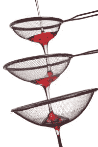
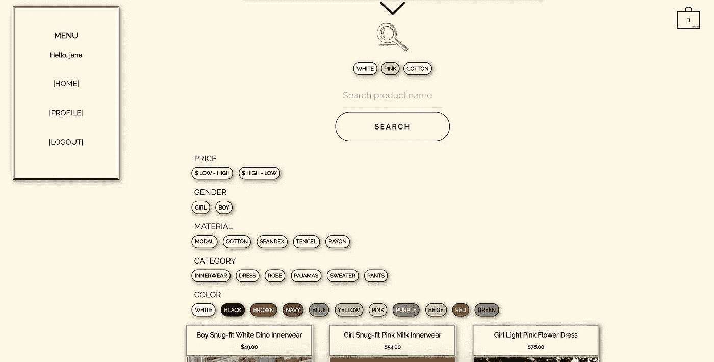
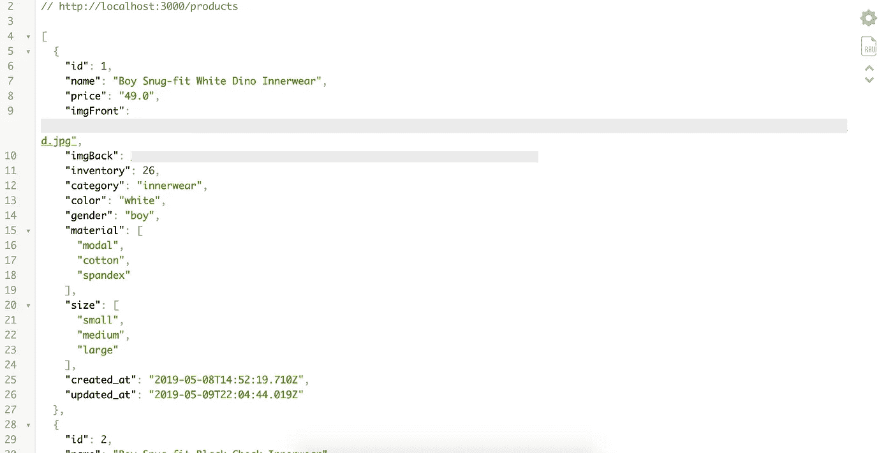
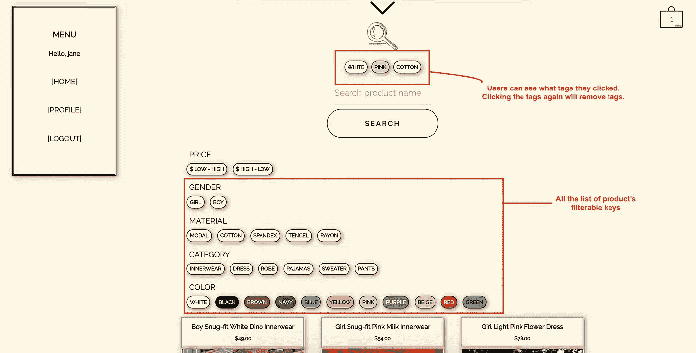
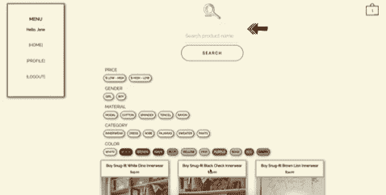
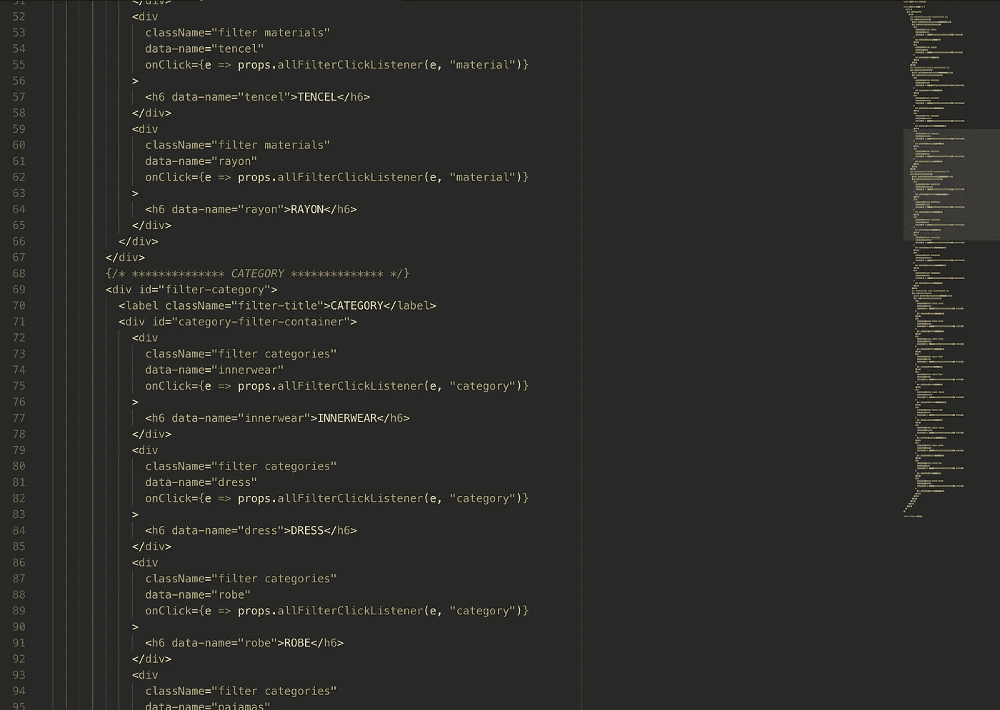

# 使用 Javascript 创建多重过滤函数来过滤多个属性

> 原文：<https://betterprogramming.pub/creating-a-multi-filter-function-to-filter-out-multiple-attributes-javascript-react-rails-5aad8e272142>

## 当一个过滤器不够用时

[http://www . tech talk . gfi . com/WP-content/uploads/2011/07/we B- content-filtering-200 x300 . jpg](http://www.techtalk.gfi.com/wp-content/uploads/2011/07/web-content-filtering-200x300.jpg)

在最近一次训练营的最后一个项目中，我的任务是创建一个电子商务网站，顾客可以在这里购买童装。在建立网站的时候，我最大的挑战是编写一个`.filter`功能，客户可以点击标签来缩小他们的产品列表。

客户可以点击任何标签，我的过滤功能将只呈现满足客户选择的产品。

在这篇文章中，我将介绍我的过程和代码以及最终结果，同时详细说明**如何创建一个多重过滤函数**，该函数比较产品的所有属性和客户选择的标签，以输出一个经过过滤的产品列表。

# 什么是。Javascript 中的 filter()？

> `**filter()**`方法创建一个新的数组，其中所有元素都通过了由提供的函数实现的测试。— [MDN 文档](https://developer.mozilla.org/en-US/docs/Web/JavaScript/Reference/Global_Objects/Array/filter)

接受一个函数作为参数，使用`.filter()`将返回一个新数组，其中包含所有返回`true`的元素。

# 产品表设计

在开始解释之前，让我们回顾一下将要过滤的产品的属性。

以下是每个键的值:

这很有挑战性，不仅因为我想创建一个动态过滤函数，还因为`material`是一个包含多个元素的数组。

# 我的完整代码

该网站的一个特点是，客户可以看到他们在搜索输入上面选择了什么标签。要取消标签，只需点击选择的标签。

为了在放大镜图标和搜索部分之间呈现选择的标签，我必须以特定的方式设计我的 react 的`state`。“标签收集”部分(红色小矩形)将收集客户点击的任何标签，这意味着当其中一个标签被点击时，它将触发一个回调，`callFilterClickListener()`，将布尔状态设置为 true。

出现在标签收集部分的所有标签都在“传递标签”中

因为每个键中的每个元素都有不同的职责，并且因为我要求它们都是客户可以点击的标签，所以我不得不写了一个很长的脚本。

每个键都有自己的“div”标签，但调用相同的函数时使用不同的参数。

因为客户可以点击任何标签来取消它们，包括已经选择的标签，所以我包含了另一个看起来与上面的组件非常相似的组件。

# 。allFilterClickListener()

函数`allFilterClickListener()`动态地将事件和属性名称作为参数(参见我的完整代码下的第一张图片)。

*侧注:React Doc 建议使用* `*.setState()*` *时使用* `*prevState*` *。更多信息可以在* [***这个链接***](https://teamtreehouse.com/community/react-docs-now-recommends-using-function-with-prevstate-inside-of-setstate) *中找到。*

假设客户点击了`white`、`pink`、`cotton`和`girl`。该函数将搜索`state,`找到名为`color`的键，并根据`state`的状态将布尔值更改为真或假。然后重复该过程，用`girl`过滤`material`至`cotton`和`gender`。

# `.filteredCollected()`

该函数通过单独遍历`color, gender, material, and category`并按下值为真的键返回`collectedTrueKeys`。既然我选了`white, pink, cotton, and girl`，`collectedTrueKeys`，就会是这个样子。

# 。multiPropsFilter()

这是我在[***GitHub***](https://gist.github.com/jherax/f11d669ba286f21b7a2dcff69621eb72)上找到的一个功能。该函数比较两个参数 products 和 filters，并返回通过给定筛选器的唯一产品。

然而，仅仅从资源中复制粘贴代码是不够的，因为`material`是一个包含多种材料的数组。因此，除了代码之外，我还在第 182 行到第 186 行添加了代码。如果`product`中的一个键是一个数组，它将再次遍历该数组并返回任何为真的值。

# 。搜索产品()

因为顾客可以通过输入来搜索产品，`.searchProducts()`同时处理过滤和搜索。

然后，子组件`ProductContainer`将接收已经过滤的产品列表。

# 摘要

1.  客户将触发`.allFilterClickListener(event, <key name>)`当点击任何过滤标签。
2.  `.allFilterClickListener()`接收被点击的标签并改变右边的`state`。
3.  `.filteredCollected()`循环遍历状态并收集任何值为真的键。
4.  `.multiPropsFilter()`取所有产品列表，过滤返回过滤后的产品列表。
5.  因为子组件`ProductContainer`总是调用`.searchProducts()`，所以数字 3 和 4 都将对变化做出响应。

# 结论

使用 Javascript 时，我可以做任何我想做的事情，这真是太神奇了。即使我的`material`嵌套了更多的数组，我仍然能够得到想要的结果。作为一名训练营学生，我上一个项目的挑战帮助了我的思考过程，这是一次伟大而愉快的经历，在我前进的过程中，我将永远记住它。