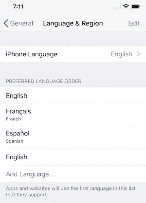

# 在 React Native 中创建多语言应用程序

> 原文：<https://betterprogramming.pub/creating-a-multi-language-app-in-react-native-9828b138c274>

## 使用 react-native-localize 和 i18n 为 React 本地应用程序添加多语言支持


托马斯·凯利在 [Unsplash](https://unsplash.com/?utm_source=unsplash&utm_medium=referral&utm_content=creditCopyText) 上的照片

语言一直是任何业务的重要组成部分。随着业务的增长，他们通常会考虑扩展到不同的国家和地区。为了在这些新地区取得成功，提供本地化服务非常重要。

说到手机 app，条件也没什么不同。随着应用程序的用户群扩展到不同的国家，为用户提供以他们的母语使用应用程序的能力非常重要。

在这一块，我们将通过使用`[react-native-localize](https://github.com/react-native-community/react-native-localize)`包来构建一个支持多种语言的 React 原生应用。

# **先决条件**

本教程需要 React Native 的基础知识。要设置您的开发机器，请遵循官方指南[这里的](https://facebook.github.io/react-native/docs/0.59/getting-started)。

为了确保我们在同一页上，以下是本教程中使用的版本-

*   节点 v10.15.0
*   国家预防机制 6.4.1
*   纱线 1.16.0
*   react-原生 0.59.9
*   反应-原生-本地化 1.1.3
*   i18n-js 3.3.0

# **入门**

我们将建立一个 React 本地应用程序，它将支持**英语**、**法语、**和**阿拉伯语**。

*注:如果你想马上看一下源代码，这里是 GitHub* [*链接*](https://github.com/vikrantnegi/react-native-multi-language-app) *。*

要使用`react-native-cli`创建新项目，请在终端中键入以下内容:

```
$ react-native init multiLanguage
$ cd multiLanguage
```

## **添加所需的库**

通过键入以下命令安装`react-native-localize`:

```
$ yarn add react-native-localize
```

然后使用以下链接它:

```
$ react-native link react-native-localize
```

*注意:如果您在安装过程中遇到任何错误，请在此* *处查看安装说明* [*。*](https://github.com/react-native-community/react-native-localize#setup)

`react-native-localize`库可以让你访问很多与本地化相关的设备常量，但是没有`i18n`库。

我们将使用`[I18n.js](https://github.com/fnando/i18n-js)`为 JavaScript 提供 I18n 翻译。

```
$ yarn add i18n-js
```

由于`i18n-js`似乎没有提供任何缓存/记忆，我们将使用`lodash.memoize`来实现同样的目的:

```
$ yarn add lodash.memoize
```

## **添加翻译**

在`src`中创建一个`translations`目录，然后创建三个 JSON 文件，每种语言一个。

1.`en.json`为英文

2.`fr.json`用于法语

3.`ar.json`为阿拉伯语

这些文件包含带有键和值的 JSON 对象。

每种语言的密钥都是相同的，并将在应用程序中用于显示文本。

该值将是我们希望向用户显示的文本，并且对于每种语言都是不同的。

对于英语:

```
{ "hello": "Hello World!"}
```

对于法语:

```
{ "hello": "Salut le Monde!"}
```

对于阿拉伯语:

```
{ "hello": "أهلاً بالعالم"}
```

同样，您可以为应用程序中使用的每个文本添加更多的键值对。

# **添加主代码**

打开`App.js`文件和以下导入:

之后，我们将添加一些稍后会用到的辅助函数和常量:

现在，我们将创建我们的`App`类组件。

在我们的构造函数方法中，我们调用了`setI18nConfig()`来设置初始配置。

然后在`componentDidMount()`中，我们将添加一个事件监听器，它将监听任何变化，如果发生任何变化，就调用`handleLocalizationChange()`。

`handleLocalizationChange()`方法触发`setI18nConfig()`和`forceUpdate()`。这对于 Android 设备来说是必要的，因为组件需要重新渲染才能看到变化。

我们将删除`componentWillUnmount()`生命周期方法中的监听器。

最后，在`render()`中，我们将使用`translate()`返回`hello`，并将`key`作为参数传递给它。然后，它会自动计算出语言和需要为该语言显示的文本。

# **运行应用程序**

现在是时候看看我们的翻译是否有效了。

通过键入以下命令在模拟器或仿真器中运行您的应用程序:

```
$ react-native run-ios
$ react-native run-android
```

应该是这样的:


默认英语语言

现在，将设备语言设置更改为法语，然后再次打开应用程序。


法语你好

同样的，你可以把你的语言设置改成阿拉伯语，看到阿拉伯语的`hello`。

到目前为止一切顺利。

但是，如果我选择了一些随机的语言，而这些语言的翻译没有包含在应用程序中，会发生什么呢？会回落到什么语言？

事实证明，`findBestLanguage`的目标是返回最佳翻译。因此，它会查看您的语言偏好设置，以确定备用语言。

如果你进入 iOS 模拟器中的**语言&区域**设置，你可以看到语言的优先顺序。



语言首选顺序设置

如果选择的语言不是首选语言，`findBestAvailableLanguage`返回`undefined`，因此保留的值将是您的[后备](https://github.com/vikrantnegi/react-native-multi-language-app/blob/master/App.js#L25)，因为您的翻译中没有用户首选的语言。

## **奖金**

`react-native-localize`具有 API，可以访问与批次本地化相关的设备常量。请务必查看[文档](https://github.com/react-native-community/react-native-localize#api)中提供的完整 API。

## **结论**

添加多语言支持就是这么简单。您现在可以使用`react-native-localize`在您的应用中轻松提供多语言支持，这有助于提高用户的应用使用率。

*在 Github repo 中找到源代码* [*这里*](https://github.com/vikrantnegi/react-native-multi-language-app) *。*