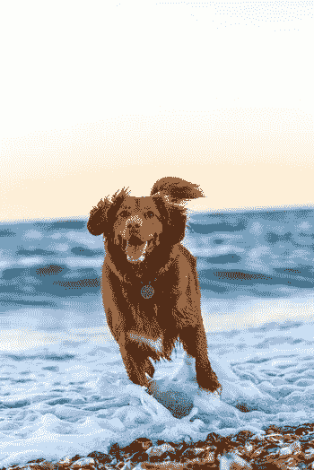
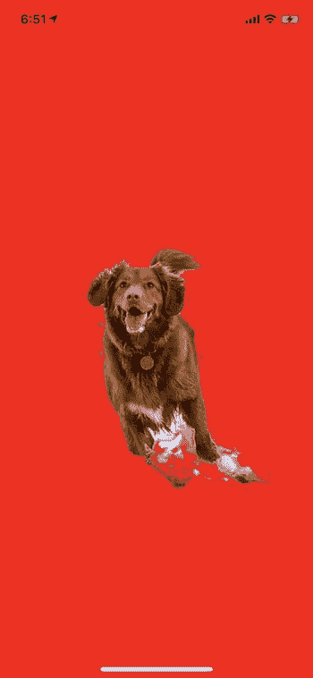
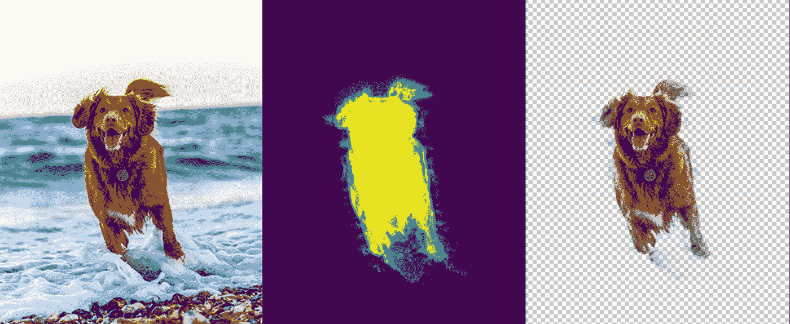

# 使用 Fritz 宠物分割在 iOS 上创建宠物贴纸应用程序

> 原文：<https://betterprogramming.pub/creating-a-pet-sticker-app-on-ios-with-fritz-pet-segmentation-35bce07f344f>

## 将狗和猫变成贴纸，在你最喜欢的信息应用程序中使用


[图像来源](https://unsplash.com/photos/Zqy-x7K5Qcg)

手机摄像头理解得越多，手机应用程序就越强大，越有创意。很少有主题比我们的宠物更需要理解:狗狗、弗卢弗、弗卢弗、云彩、低音喇叭，甚至猫(至少我是这么听说的)。

在这篇文章中，我们将学习如何使用 iOS 和 Android 的移动机器学习平台 [Fritz](https://www.fritz.ai) ，让 iOS 应用程序能够在照片和视频中生成像素完美的宠物分割遮罩。

我们将使用这个面具来创建有趣的贴纸，你可以在 WhatsApp 或 Messenger 等应用程序中分享，但你也可以使用面具来跟踪它们随时间的增长，改变它们皮毛的颜色，或在 AR 应用程序中执行遮挡。

# 定义任务

我们可以教会手机摄像头执行许多任务:识别品种、定位动物的确切位置、检查狗是否坐下等等。在我们的例子中，我们想知道图像中哪些像素属于动物，哪些只是背景。这个任务被称为语义[图像分割](https://www.fritz.ai/features/image-segmentation.html)。

事实证明，深度神经网络非常擅长进行图像分割。在 Fritz，我们投入了大量努力来训练足够小、足够快的神经网络，以便在移动应用程序中分割图像。因为一切都在设备上运行，所以可以在没有互联网连接的情况下实时使用，同时还可以保护用户数据的隐私。

# 用 Fritz 分割宠物

## 开始

下载并打开本教程的资源库。

用 Cocoapods 设置 Fritz 是最简单的。在 starter 项目文件夹中，运行:

```
pod repo update
pod install
```

在 Xcode 中打开 fritzpetstickerdemo . xc workspace。

## 概观

我们将使用 [Fritz iOS 图像分割](https://www.fritz.ai/features/image-segmentation.html)功能为照片中的宠物生成遮罩。Fritz SDK 附带了各种可以直接在手机上运行的[预建特性](https://www.fritz.ai/features/)。

所有 Fritz Vision APIs 都使用一些结构:

*   **FritzVisionImage** :模型运行的图像。它将包装提供的像素缓冲区或您提供的其他图像。
*   **选项**:传递给模型的配置选项，让您调整模型如何运行。
*   **模型:**对输入图像进行预测的实际模型。
*   **结果:**模型的输出。每个预测器都有不同类型的结果。在本教程中，结果是一列`FritzVisionSegmentationResult`对象。

## 设置 Fritz 帐户

建立一个 Fritz 账户很容易。按照[入门](https://docs.fritz.ai/develop/get-started-sdk.html)指示设置您的 Fritz 帐户，并将演示连接到您的帐户。以下是您将经历的步骤:

1.  创建一个帐户。
2.  创建一个 iOS 应用。确保项目的包 ID 与您创建的包 ID 相匹配。
3.  将`Fritz-Info.plist`文件拖到您的项目中。

完成初始化步骤后，构建并运行您的应用程序。当你的应用成功登录 Fritz 后，你会在 web 应用中看到一条成功消息。

## 设置图像拾取器

接下来，我们将把摄像头添加到我们的应用程序中。您可以对来自“相机胶卷”或实时预览的静态图像或视频使用 Pet 分段。在本教程中，我们将从相机胶卷中选择一张好男孩的照片。

此代码片段打开一个图像拾取器，并在背景上替换选定的图像。

# 创建 Pet 预测器



一个好男孩

现在是时候把选中的图片变成贴纸了。

将 pet 分割模型初始化为视图控制器中的变量，并在 createSticker 函数中运行该模型:

让我们一步一步地完成这个过程:

1.  我们首先设置一些用于调整模型输出的参数。
2.  然后我们创建一个`FritzVisionPetSegmentationModel()`,用于从图像中剪切出宠物。
3.  我们更新我们的`imagePickerController`,用用户选择的图像调用`createSticker`函数。
4.  该图像被输入到分割模型中，分割模型返回一个`FritzVisionSegmentationResult`对象。有关不同访问方法的更多详情，请查看[官方文档](https://docs.fritz.ai/develop/vision/image-segmentation/ios.html#mask-a-specific-class)。
5.  分割结果包含关于每个像素属于特定类别(例如背景或 pet)的可能性的信息。我们使用`buildSingleClassMask`方法从模型认为是宠物的像素创建一个 alpha 蒙版。
6.  使用核心图像将该蒙版与原始图像结合，使用`masked` 方法生成一个具有透明背景的贴纸。
7.  该标签被显示给用户。您还可以保存该标签供以后用户使用。



您的消息应用程序的可粘贴标签。

以下是我们所做工作的直观展示:



原图(左)。包含我们宠物的像素的 alpha 蒙版，紫色表示背景，亮黄色表示宠物(中间)。最后的贴纸(右)。

# 调整遮罩灵敏度

最后，我们来看看分段掩码。使用预测结果，您可以制作不同灵敏度的遮罩。两个重要的参数是`clippingScoresAbove`和`zeroingScoresBelow`。模型输出的置信度得分在 0 和 1 之间。所有高于`clippingScoresAbove`的信心分数都将变为 1。所有低于`zeroingScoresBelow`的置信度分数将为零。您可以修改这些参数来创建软边。

查看我们的 [GitHub repo](https://github.com/fritzlabs/fritz-ios-tutorials/tree/master/FritzPetStickerDemo) 以了解完成的实现。

通过宠物细分，开发人员能够在用户和他们的动物之间创建有趣的互动。只需添加几行代码，即可创建极具吸引力的功能，让您的 iOS 应用与众不同。

[创建一个免费的 Fritz 帐户](https://app.fritz.ai/register)开始使用。如需更多资源，[深入阅读文档](https://docs.fritz.ai/develop/vision/image-segmentation/ios.html)或在[开源心跳应用](https://github.com/fritzlabs/heartbeat-ios)中查看完整演示。