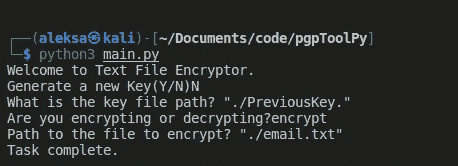

# 用 Python 创建 PGP 加密工具

> 原文：<https://betterprogramming.pub/creating-a-pgp-encryption-tool-with-python-19bae51b7fd>

## 通过代码开始学习网络安全和加密

图片来自 unsplash

# 什么是 PGP

相当好的隐私，通常被称为 PGP，是一个广泛使用的加密程序。PGP 用于创建数字签名，加密和解密大量数据，并增加电子邮件通信的安全 T2。

PGP 加密使用一系列组合的[哈希](https://en.wikipedia.org/wiki/Cryptographic_hash_function)、[数据压缩](https://en.wikipedia.org/wiki/Data_compression)、[对称密钥加密](https://en.wikipedia.org/wiki/Symmetric-key_cryptography)，最后是[公钥加密](https://en.wikipedia.org/wiki/Public-key_cryptography)。每一步都使用几种受支持的[算法](https://en.wikipedia.org/wiki/Algorithm)中的一种。每个公钥都绑定到一个用户名或电子邮件地址。

幸运的是，大多数 PGPs 加密协议都可以通过开源 Python 库 pgpy 供开发人员使用。发现了这个库之后，我又开始了另一个周六下午的开源探索，并创建了另一个小程序——一个使用 PGP 的命令行加密工具。

我的代码的命令行片段

下面，我将带您了解在终端 PGP 加密工具中创建基本小程序的基本步骤。需要对文件流和编程有基本的了解。

## 创建命令行小程序

首先，我们将编写五个基本函数，它们在创建我们的软件时起着关键作用，该软件将提供以下功能:获取和设置密钥，读取和写入特定文件的密钥，以及生成一个密钥。

因为 get、setting、read、write 是基本功能，下面会把它们包含在主旨里，不做解释。`genKey`函数更有趣一点。虽然它是 pgpy“样板”，但它值得探索。

下面要点中的第 42 行使用 RSA 协议生成一对大小为 4096 的公钥和私钥，而第 45 行的后续命令将它绑定到一个虚构的电子邮件——在本例中是 Abe Lincoln 的——如简介中所要求的。

第 50 行允许我们指定用例的整个范围(电子邮件加密、磁盘加密等。)和用于加密文档的预定义哈希、密码和压缩算法。在以下情况下，没有删除任何选项或标志:

我们的下一步包括将 pgpy 的加密命令与 Python 的文件流调用相结合。需要四个函数:`pgp_encrypt`对文本进行加密；`pgp_decrypt`解密(显然)；`encrypt_file`，和`decrypt_file`。关于文件加密和解密的功能将简单地结合使用加密命令和文件流功能。如下图所示:

现在，用一个有趣的主命令把所有的东西串起来，如下图所示，这将给我们一个有效的加密软件。

## 结论

尽管对 PGP 的探索并不十分深入，但对于初学程序员和对网络安全和加密感兴趣的人来说，这是一个有趣的起点。

探索开源软件并使用它来创建有趣的小项目是增强你对某个主题的理解的好方法。我强烈鼓励那些对密码学或网络安全感兴趣的人遵循类似的思路，为自己尝试类似的项目。